# AVC agudo — Turbo TEMI

Edição 1.1, revisada após auditoria independente em 11/09/2026. Adultos. Texto canônico do [módulo interativo](../../../01_Modulos_Clinicos/AVC_Turbo_TEMI/index.html) — 17 fichas farmacológicas, 25 questões, 7 casos, 30 flashcards e 21 figuras ficam na versão publicada.

> ⚠️ **Prévia pública em revisão médica.** Conteúdo educacional e apoio cognitivo; não substitui equipe de AVC, neurocirurgia nem protocolo institucional. Doses exigem dupla checagem local.

## Primeiros minutos

> Versão interativa desta seção: [Primeiros minutos](../../../01_Modulos_Clinicos/AVC_Turbo_TEMI/index.html#inicio)

### O que você vai aprender

Diferenciar isquemia, hemorragia intracerebral e hemorragia subaracnóidea; reconhecer candidatos à avaliação de reperfusão; aplicar NIHSS, Fisher e Hunt–Hess; reconhecer deterioração e organizar o resgate. UTI significa unidade de terapia intensiva. Este módulo é educacional e não substitui equipe de AVC, neurocirurgia nem protocolo validado do hospital.

### Como usar sem sobrecarga

- **Plantão:** comece pelo checklist abaixo. Se houver piora, abra “Complicações maiores”.
- **Estudo de 5 minutos:** escolha um dos três tipos de AVC, leia um bloco e explique uma imagem sem olhar os rótulos.
- **Treino:** faça uma questão e confira todas as alternativas. Retome em D1, D7, D14 e D30, sem acumular dívida de estudo — o “Plano de revisão” do Laboratório TEMI gera essas datas.
- **Busca rápida:** pressione “/” em qualquer tela (ou use a lupa do cabeçalho) para localizar um termo — “protamina”, “Fisher”, “basilar” — e saltar para o trecho.
- **Ferramentas:** relógio do código AVC, NIHSS com exame anterior, ABC/2, ICH Score, Glasgow → WFNS, Fisher original e modificado. Nenhuma delas autoriza tratamento; todas mostram o critério usado.

### Checklist do código AVC

1. **Reconheça o início súbito.** Face, braço, fala, campo visual, equilíbrio e coordenação. Diplopia, disfagia e ataxia podem indicar circulação posterior mesmo com NIHSS baixo.
2. **Acione a equipe e registre dois tempos.** Última vez visto bem é diferente da hora em que os sintomas foram descobertos. No AVC ao despertar, não invente hora de início.
3. **Estabilize.** Via aérea, ventilação, circulação, oximetria e glicemia capilar imediata. Corrija hipoglicemia e reexamine; déficit persistente continua exigindo investigação.
4. **Examine e monitore.** Nível de consciência, pupilas, déficit focal, NIHSS, pressão arterial (PA), frequência cardíaca, temperatura e ritmo. Documente funcionalidade prévia e anticoagulantes/última dose.
5. **Obtenha imagem urgente.** Tomografia computadorizada (TC) sem contraste para sangue; angioTC de crânio/pescoço quando houver suspeita de oclusão e perspectiva de tratamento. TC normal não exclui isquemia precoce.
6. **Colha exames em paralelo.** Hemograma/plaquetas, glicemia, eletrólitos, creatinina e coagulação conforme contexto. Glicemia precisa ser conhecida antes da trombólise; não espere exames rotineiros se não houver suspeita de alteração relevante, conforme protocolo da equipe.
7. **Decida o caminho.** Isquemia → avaliar reperfusão; sangue no parênquima → HIC; sangue em sulcos/cisternas → investigar HSA. Acione transferência regulada quando o recurso definitivo não estiver disponível.
8. **Proteja a deglutição.** Sem comida, líquidos ou comprimidos por via oral até triagem adequada. Reavalie toda piora; o exame inicial é uma referência, não uma garantia.

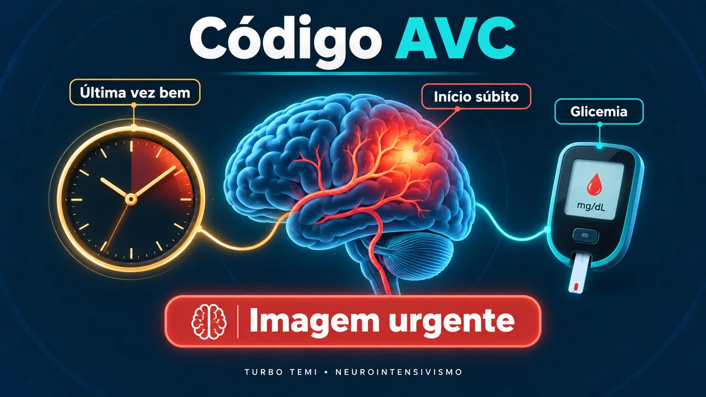

*Figura 01 — Código AVC. Ilustração conceitual gerada por IA; não é exame real.*

> 🧰 **Ferramenta interativa — Relógio do código AVC — janelas a partir da última vez visto bem.** Disponível somente no [módulo publicado](../../../01_Modulos_Clinicos/AVC_Turbo_TEMI/index.html); a versão em texto não substitui o exame item a item nem decide tratamento.

### O que não pode ser confundido

| Situação | Significado | Consequência prática |
|---|---|---|
| AVC isquêmico | Oclusão ou queda crítica da perfusão com lesão tecidual | Reperfusão em paciente elegível |
| Hemorragia intracerebral — HIC | Sangue no parênquima; pode invadir ventrículos | Evitar expansão, reverter anticoagulação e avaliar neurocirurgia |
| Hemorragia subaracnóidea — HSA | Sangue no espaço entre aracnoide e pia-máter | Procurar aneurisma e prevenir ressangramento/lesão secundária |
| Ataque isquêmico transitório — AIT | Disfunção transitória por isquemia sem infarto demonstrado | Investigação urgente; sintomas resolvidos não significam risco resolvido |
| Mimetizador | Hipoglicemia, crise/Todd, enxaqueca, toxicidade, distúrbio funcional, entre outros | Confirmar contexto; não excluir AVC apenas por uma hipótese alternativa |

**Antes de baixar a PA, saiba o que está sangrando — ou não.** O INTERACT4 (2024) reduziu a PA ainda na ambulância, antes da imagem, em AVC indiferenciado: sem benefício global, com sinal de benefício na HIC e de dano no isquêmico. Conclusão prática: a meta de PA depende do compartimento; a TC vem antes do anti-hipertensivo, salvo emergência hipertensiva concomitante. Fonte: [R48].

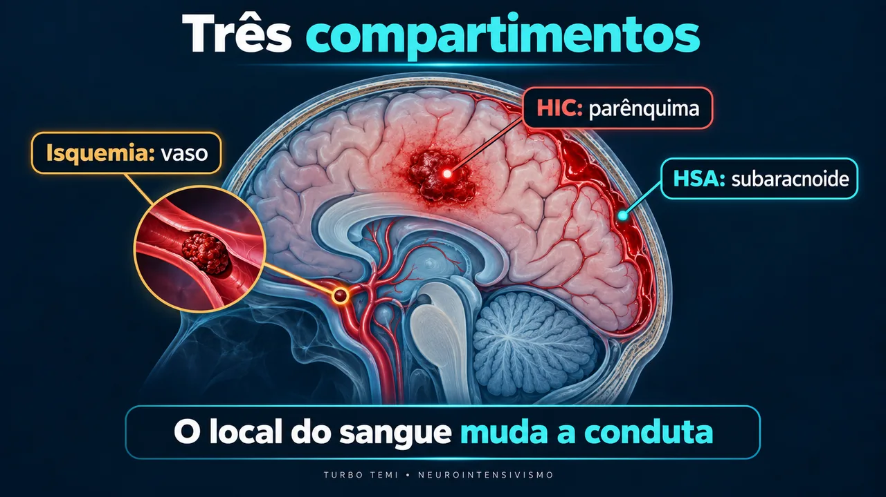

*Figura 03 — Três compartimentos. Ilustração conceitual gerada por IA; não é exame real.*

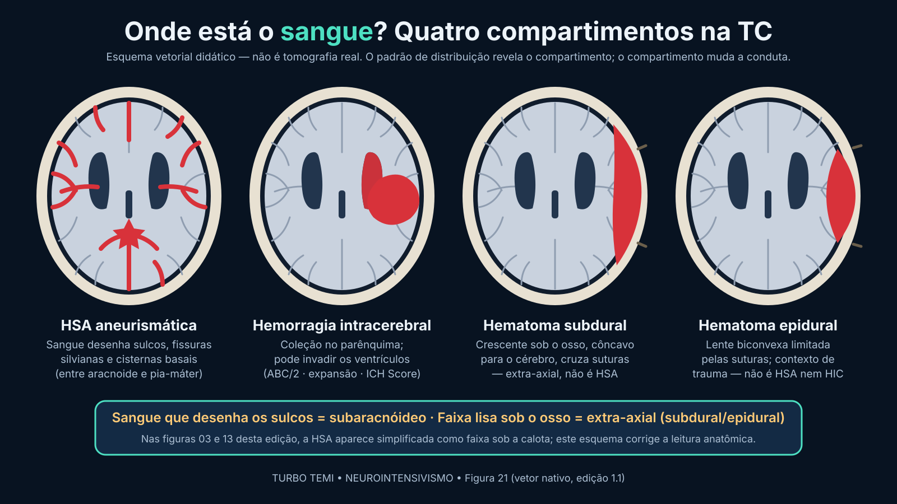

*Figura 21 — Onde está o sangue? Quatro compartimentos na TC (desenho vetorial da auditoria 1.1).*

### Passagem de caso em 30 segundos

Paciente/idade/leito/unidade/hospital: **não informado** até preenchimento no prontuário institucional. Data/hora: **não informado**. Última vez bem e descoberta: **não informado**. Déficit e NIHSS com horário: **não informado**. TC/angioTC: **não informado**. PA/glicemia/anticoagulante: **não informado**. Tratamento e resposta: **não informado**. Recurso necessário, responsável pelo contato e próxima reavaliação: **não informado**.

**Regra de comunicação:** informe a tendência: “estava assim, mudou às X, fiz Y, respondeu Z”. Não envie identificadores pessoais para ferramentas de estudo.

Fontes: [R01], [R06], [R07], [R08], [R09].

## AVC isquêmico

> Versão interativa desta seção: [AVC isquêmico](../../../01_Modulos_Clinicos/AVC_Turbo_TEMI/index.html#isquemico)

### 1. O mecanismo que explica a urgência

A oclusão reduz oxigênio e substratos. Falência energética, despolarização e entrada de água nas células produzem edema citotóxico. O **núcleo infartado** representa tecido já gravemente lesado; a **penumbra** é tecido disfuncional potencialmente recuperável. Circulação colateral modifica a velocidade de progressão: dois pacientes com a mesma duração podem ter volumes diferentes de tecido viável.

**Metáfora didática:** o relógio informa há quanto tempo a estrada fechou; a imagem mostra quanto da cidade ainda recebe abastecimento por desvios. Colaterais não autorizam esperar.

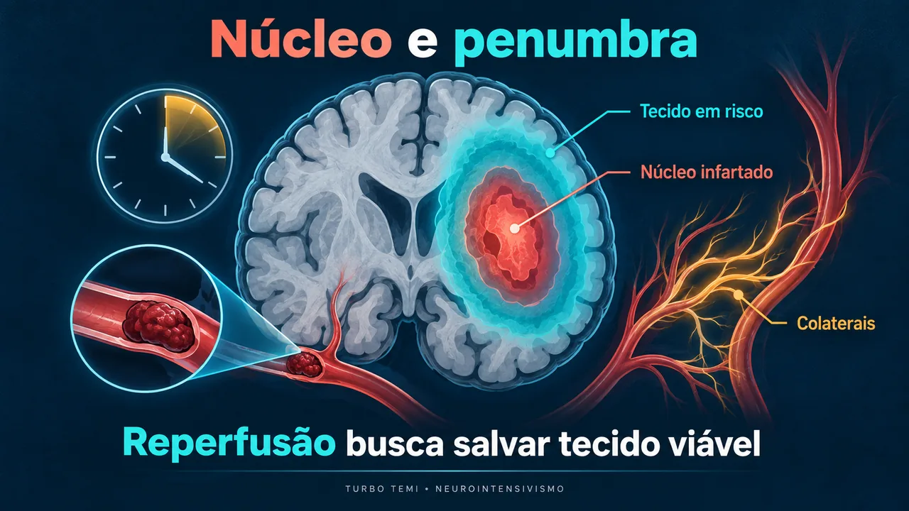

*Figura 02 — Núcleo e penumbra. Ilustração conceitual gerada por IA; não é exame real.*

### 2. Reconhecer e localizar

| Padrão | Hipótese topográfica | Armadilha |
|---|---|---|
| Afasia + fraqueza direita | Hemisfério dominante, frequentemente território da artéria cerebral média (ACM) | Confundir afasia com “confusão” |
| Negligência + fraqueza esquerda | Hemisfério não dominante | Paciente pode negar a própria deficiência |
| Déficit motor/sensitivo puro | Via subcortical; síndrome lacunar é possível | “Lacunar” não dispensa imagem vascular quando indicada |
| Hemianopsia homônima | Via retroquiasmática, frequentemente circulação posterior | Atribuir a problema ocular periférico |
| Diplopia, disartria, ataxia, disfagia, sinais cruzados | Tronco/cerebelo | NIHSS baixo e TC inicial pouco expressiva podem enganar |

No adulto com síndrome vestibular aguda, HINTS exige treinamento e seleção correta do paciente; não é um teste genérico para qualquer tontura. Uma crise no início pode coexistir com AVC. A persistência de um déficit focal merece investigação vascular.

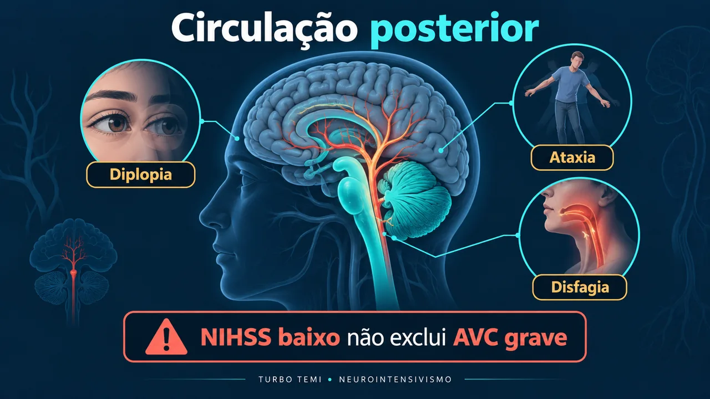

*Figura 06 — Circulação posterior. Ilustração conceitual gerada por IA; não é exame real.*

### 3. O que cada imagem responde

- **TC sem contraste:** há hemorragia, efeito de massa ou extensa alteração isquêmica? Sinais precoces incluem perda da diferenciação cinzenta/branca e apagamento de sulcos. Nenhum desenho deste módulo é TC real.
- **AngioTC:** existe oclusão de grande vaso, estenose ou dissecção? A extensão até vasos cervicais depende do protocolo. Não adie contato com centro de trombectomia aguardando relatório definitivo se a suspeita é forte.
- **Perfusão por TC/RM:** pode apoiar seleção fora da janela convencional; estimativas automatizadas têm artefatos e não substituem análise clínica/radiológica.
- **Ressonância magnética (RM):** difusão pode mostrar lesão precoce. A discrepância entre difusão e FLAIR (sequência sensível a alterações de água) pode selecionar alguns AVCs de início desconhecido. RM muito precoce negativa, especialmente posterior, também requer cautela.
- **ASPECTS:** escore de alterações precoces no território da ACM, de 10 a 0; quanto menor, maior extensão. É dependente do leitor e não constitui, isoladamente, uma proibição universal de trombectomia.

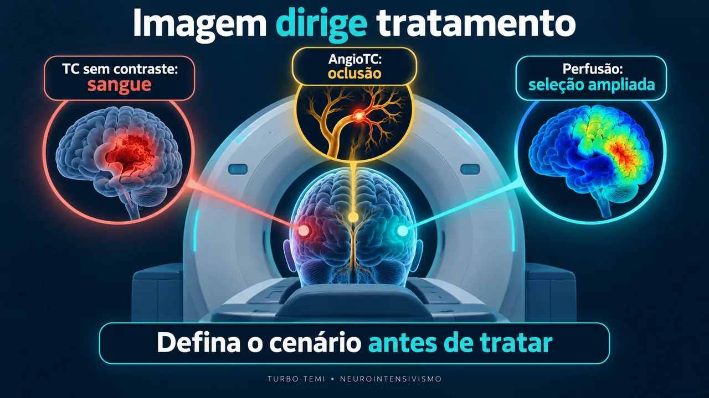

*Figura 04 — Imagem dirige tratamento. Ilustração conceitual gerada por IA; não é exame real.*

### 4. Reperfusão: decisão em paralelo

| Cenário | Caminho |
|---|---|
| Déficit incapacitante, até 4,5 h da última vez bem | Avaliar trombólise intravenosa (IV), com alteplase ou tenecteplase conforme protocolo, imagem e contraindicações |
| Déficit leve, mas incapacitante — por exemplo, afasia relevante | NIHSS baixo não deve encerrar avaliação de trombólise |
| Déficit leve não incapacitante | Trombólise não é rotina; avaliar estratégia antiplaquetária apropriada após excluir sangramento e definir etiologia |
| Início desconhecido ou 4,5–9 h | Alguns pacientes podem receber trombólise selecionada por imagem avançada (discrepância difusão/FLAIR no WAKE-UP; perfusão no EXTEND); decisão especializada |
| Oclusão de grande vaso, até 6 h | Avaliação imediata de trombectomia mecânica |
| Oclusão de grande vaso, 6–24 h | Seleção clínica e por imagem (DAWN: discrepância clínica/infarto; DEFUSE 3: perfusão 6–16 h); alguns grandes núcleos também se beneficiam (SELECT2, ANGEL-ASPECT: ASPECTS 3–5 ou núcleo ≥50 mL, mais hemorragias) |
| Oclusão basilar | Avaliação urgente; diretriz 2026 recomenda trombectomia em pacientes selecionados até 24 h, especialmente NIHSS ≥10 |
| Oclusões médias/distais | Evidência heterogênea: ESCAPE-MeVO e DISTAL (2025) foram negativos; ORIENTAL-MeVO (maio/2026) encontrou benefício em população com déficits moderados/graves, com mais HIC sintomática. Decisão especializada, sem regra universal |

**Atualização posterior à diretriz — três ensaios, três populações:**

| Ensaio | População e janela | Resultado principal | Segurança |
|---|---|---|---|
| ESCAPE-MeVO (2025) | 530 pacientes, até 12 h, imagem basal favorável; 84,7% ramos da ACM | mRS 0–1: 41,6% vs 43,1% (sem benefício) | Mortalidade 13,3% vs 8,4%; HIC sintomática 5,4% vs 2,2% |
| DISTAL (2025) | 543 pacientes, até 24 h, NIHSS mediana 6; M2 não dominante, M3–M4, A1–A3, P1–P3 | Sem diferença na distribuição do mRS (cOR 0,90) | Mortalidade semelhante; HIC sintomática 5,9% vs 2,6% |
| ORIENTAL-MeVO — Hu et al. (maio/2026) | 563 pacientes na China, até 24 h, **NIHSS ≥6** (mediana 10) | mRS 0–2: 58,6% vs 46,6% (aRR 1,24) | HIC sintomática 4,7% vs 2,2%; mortalidade 11,1% vs 10,2% |

Leitura correta: o benefício apareceu quando o déficit era moderado/grave; nos déficits leves com imagem favorável, a trombectomia não ajudou e pode ter aumentado mortalidade. Isso não é indicação automática para qualquer oclusão distal: exige discussão com neurointervenção e conferência do texto integral da diretriz vigente. Fontes: [R38], [R39], [R44].

**Não espere “a trombólise fazer efeito” para iniciar transferência/trombectomia.** Quando ambos os tratamentos são indicados, a organização ocorre em paralelo. A janela é um limite de seleção, não uma meta de demora. Critérios completos e exceções devem ser confrontados com a equipe de AVC.

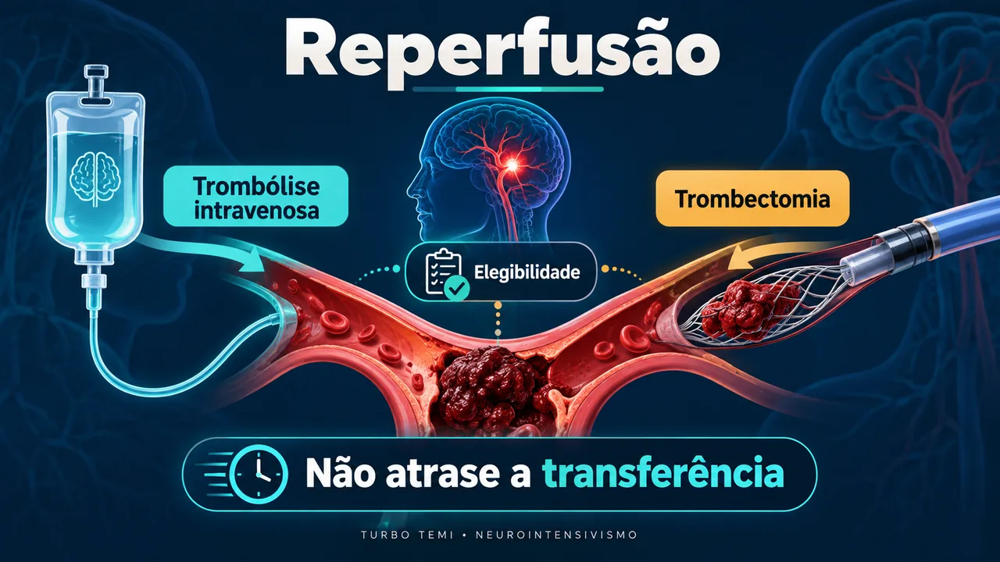

*Figura 05 — Reperfusão. Ilustração conceitual gerada por IA; não é exame real.*

### 5. Barreiras à trombólise e situações de decisão especializada

**Interrompem a via automática de elegibilidade:** hemorragia na imagem; suspeita de HSA; sangramento ativo relevante; PA que não pode ser mantida abaixo do limite de segurança; coagulopatia importante. Entre os exemplos laboratoriais usuais estão plaquetas <100.000/mm³, INR >1,7 em uso de varfarina e efeito relevante de heparina com TTPa elevado. INR significa razão normalizada internacional; TTPa, tempo de tromboplastina parcial ativada.

**Exigem dados adicionais:** anticoagulante oral direto recente, função renal alterada, horário da última dose desconhecido, cirurgia/trauma recente, antecedente de hemorragia intracraniana, lesão intracraniana de risco, gestação/puerpério, suspeita de dissecção de aorta ou endocardite. Não use INR normal para declarar ausência de efeito de apixabana/rivaroxabana. Testes específicos e decisões fora dos critérios usuais pertencem à equipe especializada.

Idade avançada, melhora parcial, crise na apresentação e NIHSS baixo não são, por si sós, exclusões universais. O déficit residual, a causa provável e o risco individual importam. Este bloco é um roteiro para conferência, **não um checklist completo que autoriza trombólise**.

### 6. Pressão arterial por cenário

| Cenário | Referência operacional | Limite |
|---|---|---|
| Antes da trombólise | PA <185/110 mmHg | Se não controlável com segurança, não iniciar IVT |
| Após trombólise | PA <180/105 mmHg durante pelo menos 24 h | Evitar redução intensiva para PAS <140 como rotina |
| Trombectomia sem trombólise | Em geral, ≤185/110 antes do procedimento; definir meta após reperfusão com equipe | Não impor PAS <140 após reperfusão bem-sucedida |
| Sem reperfusão e sem outra emergência hipertensiva | Não reduzir rotineiramente se abaixo de 220/120 mmHg | Se ≥220/120, redução cautelosa, aproximadamente 15% nas primeiras 24 h, individualizada |
| Antes da TC, tipo de AVC ainda indefinido | Não reduzir PA “às cegas”; a meta muda entre isquemia e hemorragia (INTERACT4) | Exceção: emergência hipertensiva com risco imediato a outro órgão |
| Dissecção de aorta, edema agudo de pulmão, síndrome coronariana ou outra emergência | Tratar a comorbidade com equipe, equilibrando perfusão cerebral | Não aplicar permissividade de PA de forma cega |

PAS significa pressão arterial sistólica. Corrija hipotensão e hipovolemia; procure sepse, sangramento, arritmia ou disfunção cardíaca. A melhor PA não é “a menor possível”. Os ensaios OPTIMAL-BP, ENCHANTED2/MT e BEST-II não mostraram benefício — e alguns mostraram dano — com alvos intensivos após trombectomia bem-sucedida; a diretriz 2026 afirma que PAS <140 mmHg não é recomendada mesmo com reperfusão completa.

**Fármacos no Brasil:** labetalol e nicardipina IV, citados nas diretrizes norte-americanas, têm disponibilidade rara ou inexistente na rede brasileira; as fichas de metoprolol, esmolol e nitroprussiato estão em “Fármacos e segurança”, com a ressalva de que a padronização é do serviço.

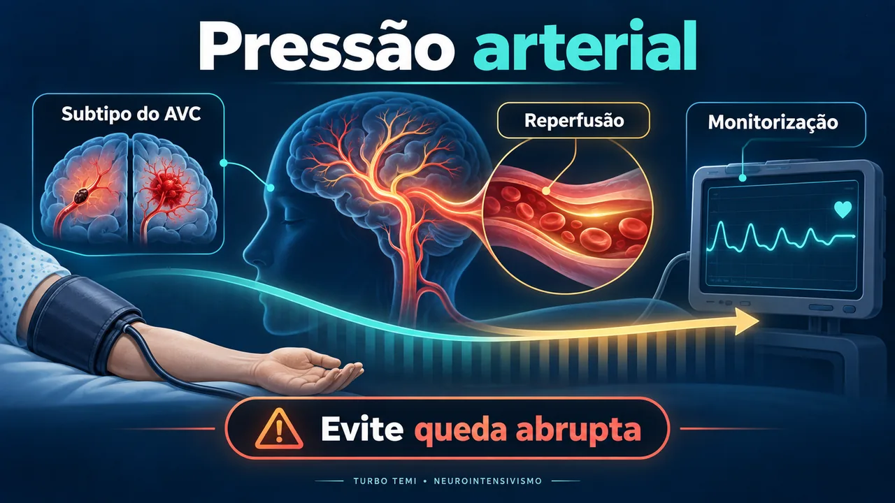

*Figura 08 — Pressão arterial. Ilustração conceitual gerada por IA; não é exame real.*

### 7. Depois da reperfusão

Avalie PA e exame neurológico a cada 15 min nas primeiras 2 h, a cada 30 min nas próximas 6 h e de hora em hora até completar 24 h, conforme fluxo institucional. Piora neurológica, cefaleia intensa, vômitos ou hipertensão aguda exigem reavaliação imediata e TC; interrompa a infusão de alteplase se ainda estiver correndo. Tenecteplase já administrada em bolus não pode ser “desligada”.

Realize imagem de controle em torno de 24 h antes de iniciar antitrombóticos após trombólise. Evite procedimentos invasivos não essenciais nesse intervalo. Não há indicação de heparinização plena rotineira para impedir progressão do AVC.

### 8. Antitrombóticos e prevenção secundária inicial

Após excluir hemorragia, ácido acetilsalicílico (AAS) é iniciado precocemente no AVC isquêmico quando não contraindicado; após IVT, aguarde a avaliação/imagem de 24 h. No AVC menor não cardioembólico ou AIT de alto risco selecionado, dupla antiagregação de curta duração pode reduzir recorrência. **Quem entra:** AVC menor (NIHSS ≤3) ou AIT de alto risco (ABCD² ≥4), sem indicação de anticoagulação, com início idealmente nas primeiras 24 h do evento — a população do CHANCE e do POINT. A combinação AAS + clopidogrel por 21 dias, seguida de monoterapia, é a estratégia com melhor equilíbrio; no POINT, manter a dupla por 90 dias aumentou sangramento maior. A diretriz 2026 prefere a dupla antiagregação nos déficits não incapacitantes. Não a aplique automaticamente a AVC extenso, sangramento, necessidade de anticoagulação ou alto risco hemorrágico.

Identifique etiologia: eletrocardiograma, monitorização de ritmo, vasos cervicais/intracranianos e estudo cardíaco conforme hipótese. Fibrilação atrial pode indicar anticoagulação, mas o início depende do tamanho do infarto, transformação hemorrágica e risco embólico. Não há um único dia seguro para todos. Estatina, PA, tabagismo, diabetes, reabilitação e deglutição integram a prevenção.

**Três coisas para lembrar:** déficit incapacitante pesa mais que um NIHSS baixo; angioTC pode mudar o destino; reavaliar piora é tão urgente quanto reconhecer o primeiro AVC.

Fontes: [R01], [R06], [R08], [R09], [R10], [R11], [R12], [R13], [R14], [R15], [R16], [R17], [R28], [R38], [R39], [R41], [R44], [R45], [R46], [R47], [R48], [R49].

## Hemorragia intracerebral

> Versão interativa desta seção: [Hemorragia intracerebral](../../../01_Modulos_Clinicos/AVC_Turbo_TEMI/index.html#hic)

### 1. Onde sangrou e por quê

HIC espontânea é sangue no parênquima sem trauma. Arteriopatia hipertensiva tende a produzir hemorragias profundas; angiopatia amiloide cerebral favorece lobares em pessoas mais velhas. A localização orienta hipóteses, mas não prova etiologia. Jovens, hemorragia lobar atípica, sangue subaracnóideo associado, vasos anormais ou ausência de história coerente exigem investigação de malformação, aneurisma, trombose venosa, tumor ou outra causa.

O dano combina destruição direta, expansão do hematoma, sangue ventricular, hidrocefalia e edema. Uma imagem pequena com exame que piora é motivo para repetir a avaliação, não para tranquilizar.

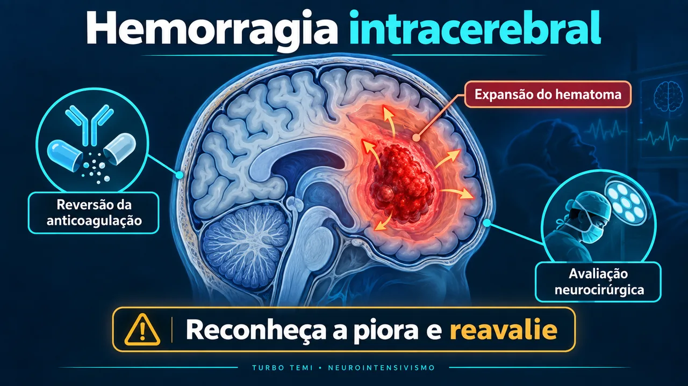

*Figura 09 — Hemorragia intracerebral. Ilustração conceitual gerada por IA; não é exame real.*

### 2. Pacote das primeiras horas

1. Avalie via aérea/ventilação, Glasgow, pupilas e déficit; monitorização contínua e acesso venoso.
2. Confirme TC, localização, volume aproximado, extensão intraventricular, hidrocefalia e efeito de massa.
3. Suspenda anticoagulante e providencie reversão urgente quando indicada; identifique fármaco, última dose, função renal e testes relevantes.
4. Controle PA com fármaco titulável e baixa variabilidade; evite hipotensão.
5. Acione neurocirurgia/neurointensivismo cedo, sobretudo em fossa posterior, hidrocefalia, coma ou deterioração.
6. Repita TC imediatamente se piorar; controle seriado nas primeiras 24 h conforme risco/protocolo. Procure também hipoglicemia, hipoxemia, crise e sedação como explicações adicionais.

### 3. PA: faixa útil, sem extrapolar

Na HIC de gravidade leve a moderada, com PAS inicial de 150–220 mmHg, a AHA/ASA 2022 apoia alvo ao redor de 140, mantendo **130–150 mmHg**, com redução suave. Reduzir para <130 pode ser prejudicial. Em grande hematoma, hipertensão intracraniana, cirurgia iminente ou PAS >220, a evidência é menos direta: individualize monitorização e perfusão. A ESO/EANS 2025 reforça tratamento organizado e reconhece incertezas em vários subgrupos.

O INTERACT3 testou um conjunto de cuidados — PA, glicemia, temperatura e reversão de anticoagulação — e apoia a execução coordenada do pacote. Seu resultado não permite atribuir todo o benefício a um único número de PA. O INTERACT4 (2024), com redução pré-hospitalar antes da imagem, não melhorou o desfecho no AVC indiferenciado: o sinal de benefício ficou restrito à hemorragia e houve sinal de dano no isquêmico — argumento para confirmar o compartimento antes de tratar a PA. A ESO/EANS 2025 classifica a evidência da redução aguda de PA como fraca, com menor expansão do hematoma quando iniciada nas primeiras 6 h.

### 4. Reversão: decisão ligada ao agente

| Exposição | Conduta de referência | Armadilha |
|---|---|---|
| Varfarina/antagonista da vitamina K | Concentrado de complexo protrombínico de quatro fatores (CCP4) + vitamina K IV | Vitamina K isolada é lenta; acompanhar INR após reversão |
| Dabigatrana | Idarucizumabe quando indicado; considerar acúmulo renal e rebote | INR não quantifica adequadamente seu efeito |
| Apixabana/rivaroxabana e outros inibidores de Xa | Estratégia institucional com CCP4 quando apropriada; decisão especialista | Diretrizes antigas de andexanet precisam ser confrontadas com alerta regulatório recente |
| Heparina não fracionada | Protamina, calculada pela exposição recente | Reversão depende do tempo e da dose recebida |
| Enoxaparina | Protamina pode reverter parcialmente | Não assume neutralização completa da atividade anti-Xa |
| Antiagregante | Não transfundir plaquetas rotineiramente apenas por AAS em HIC sem cirurgia de emergência | PATCH demonstrou dano; neurocirurgia urgente e trombocitopenia são cenários distintos |

**Atualização regulatória:** a FDA comunicou em dezembro de 2025 que os riscos de Andexxa superavam os benefícios: no ANNEXA-I, trombose em 14,6% vs 6,9% e mortes relacionadas a trombose em 2,5% vs 0,9% no 30º dia, sem diferença funcional. O fabricante retirou a licença; as vendas nos EUA cessaram em 22/12/2025 e a retirada da aprovação acelerada está registrada em 23/12/2025. Isso altera a leitura de recomendações anteriores. Não equivale automaticamente à situação de registro brasileiro; confirme Anvisa, farmácia e protocolo local. Este módulo não oferece prescrição automática de andexanet.

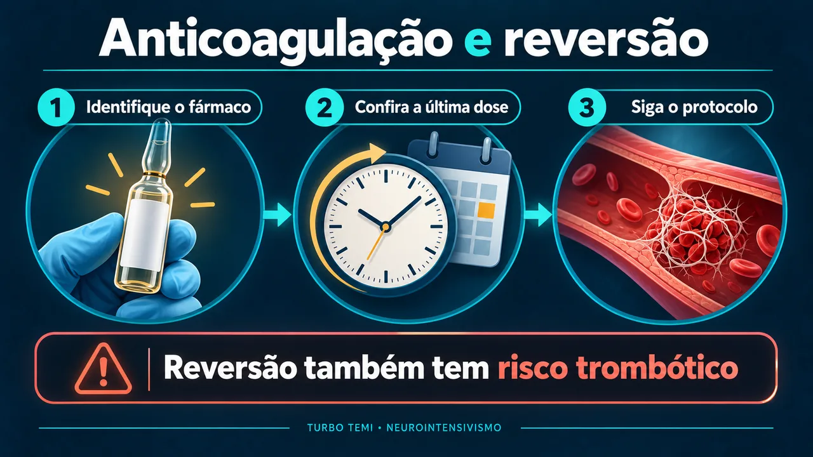

*Figura 10 — Anticoagulação e reversão. Ilustração conceitual gerada por IA; não é exame real.*

### 5. Neurocirurgia: reconhecer quem não pode esperar

- **HIC cerebelar:** deterioração, compressão de tronco, hidrocefalia obstrutiva ou volume >15 mL justificam avaliação para evacuação imediata, com ou sem derivação ventricular externa (DVE). AHA/ASA 2022 e ESO/EANS 2025 usam o mesmo limiar de 15 mL.
- **Hidrocefalia com rebaixamento:** drenagem ventricular pode ser necessária. DVE trata a obstrução do líquor; não substitui necessariamente a evacuação de hematoma da fossa posterior.
- **Supratentorial com coma, desvio importante ou pressão intracraniana refratária:** cirurgia descompressiva pode ser considerada como resgate; benefício funcional permanece incerto em alguns cenários. A ESO/EANS 2025 emite recomendação fraca a favor da descompressão em HIC profunda selecionada e recomenda contra políticas gerais de limitação de tratamento nas primeiras 24 h.
- **Cirurgia minimamente invasiva:** ENRICH 2024 favoreceu pacientes selecionados, com benefício principalmente nas hemorragias lobares. Não extrapole para todo hematoma profundo ou qualquer técnica cirúrgica.

### 6. Volume ABC/2: uma estimativa, não segmentação

A = maior diâmetro do hematoma em cm; B = diâmetro perpendicular no mesmo corte; C = extensão craniocaudal aproximada em cm (número de cortes com sangue × espessura do corte). Volume aproximado = A × B × C ÷ 2, em mL. Exemplo didático: 4 × 3 × 3 ÷ 2 = 18 mL. Hematomas irregulares/multilobulados reduzem a precisão; decisões críticas exigem leitura radiológica adequada. Não confunda espessura do corte em mm com cm. Descrito por Kothari et al. (1996), com excelente concordância entre observadores em hematomas elipsoides.

> 🧰 **Ferramenta interativa — ABC/2 (Kothari 1996) para volume estimado do hematoma.** Disponível somente no [módulo publicado](../../../01_Modulos_Clinicos/AVC_Turbo_TEMI/index.html); a versão em texto não substitui o exame item a item nem decide tratamento.

### 7. Prognóstico sem atalhos

ICH Score (Hemphill, 2001) combina Glasgow (3–4: 2 pontos; 5–12: 1; 13–15: 0), idade ≥80 anos (1), volume ≥30 mL (1), origem infratentorial (1) e sangue ventricular (1); vai de 0 a 6. Ajuda a padronizar gravidade em grupos, mas não determina sozinho futilidade, ordem de não reanimar ou retirada de suporte: a própria coorte original era pequena e a “profecia autorrealizável” de limitar cuidados cedo é um viés conhecido. Considere sedação, hidrocefalia reversível, tempo de observação, preferências e evolução. O mesmo cuidado se aplica a Hunt–Hess elevado.

> 🧰 **Ferramenta interativa — ICH Score (Hemphill 2001), com aviso contra uso prognóstico individual.** Disponível somente no [módulo publicado](../../../01_Modulos_Clinicos/AVC_Turbo_TEMI/index.html); a versão em texto não substitui o exame item a item nem decide tratamento.

**Três coisas para lembrar:** a expansão precoce do hematoma é comum; reversão deve ser rápida; fossa posterior e hidrocefalia merecem contato neurocirúrgico imediato.

Fontes: [R02], [R03], [R18], [R19], [R20], [R21], [R22], [R23], [R40], [R48], [R51], [R52].

## Hemorragia subaracnóidea

> Versão interativa desta seção: [Hemorragia subaracnóidea](../../../01_Modulos_Clinicos/AVC_Turbo_TEMI/index.html#hsa)

### 1. Reconhecer a trovoada

Cefaleia súbita que atinge intensidade máxima rapidamente, eventualmente com vômitos, síncope, rigidez de nuca, fotofobia, crise ou déficit focal, exige investigar HSA. O exame pode ser inicialmente normal. Ausência de rigidez de nuca não exclui o diagnóstico. Diferenciais incluem vasoconstrição cerebral reversível, dissecção, trombose venosa cerebral, apoplexia hipofisária e meningite.

HSA aneurismática, perimesencefálica não aneurismática, convexital e traumática têm causas e riscos diferentes. As recomendações centrais deste percurso são para **HSA espontânea aneurismática**; não extrapole automaticamente.

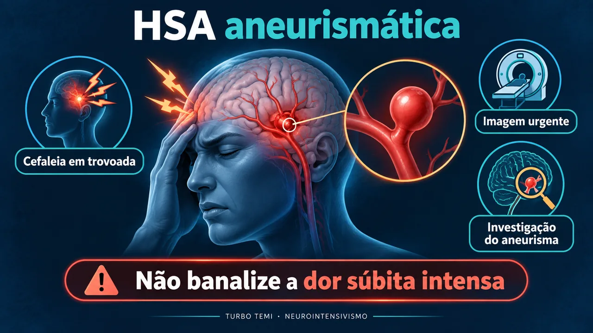

*Figura 11 — HSA aneurismática. Ilustração conceitual gerada por IA; não é exame real.*

### 2. TC negativa: o tempo e o exame importam

- **Menos de 6 h, sem novo déficit:** TC de alta qualidade com interpretação adequada pode excluir HSA em pacientes selecionados. Qualidade técnica, experiência do leitor e contexto clínico são fundamentais.
- **Mais de 6 h ou novo déficit:** se TC não confirmar HSA, a diretriz AHA/ASA recomenda punção lombar para diagnóstico/exclusão, após avaliar contraindicações, efeito de massa e coagulação.
- **HSA confirmada:** angioTC procura o aneurisma. Se negativa/inconclusiva e houver suspeita de causa aneurismática, angiografia digital é indicada.
- **Não troque exames sem considerar a pergunta:** angioTC procura aneurisma; um aneurisma incidental não prova que houve sangramento. Investigação adicional é individualizada.

**Punção lombar:** examine hemácias e xantocromia conforme método e tempo, com equipe/laboratório. “Clarear entre tubos” isoladamente não é regra segura de exclusão. Não retarde investigação de uma cefaleia suspeita aguardando completar um tempo arbitrário.

### 3. Antes de proteger o aneurisma

Internação/transferência para centro com experiência em neurovascular e neurointensivismo. Controle dor, vômitos e agitação; suspenda/reverta anticoagulação quando indicada. Monitorize PA e minimize variação, hipertensão extrema e hipotensão. **A diretriz 2023 não estabelece uma única meta universal de PAS antes da oclusão do aneurisma.** Uma meta local precisa ponderar ressangramento e perfusão, especialmente na hipertensão intracraniana.

Trate o aneurisma roto o mais cedo possível, preferencialmente em até 24 h, por clipagem ou abordagem endovascular escolhida pela equipe (AHA/ASA 2023: classe 1). Anatomia, idade, condição clínica e experiência orientam a técnica. Antifibrinolítico rotineiro recebeu na diretriz 2023 a classificação “classe 3: sem benefício” (nível A, ensaio ULTRA: bom desfecho em 60% vs 64%) e não substitui proteção do aneurisma. A diretriz também não recomenda estatina nem magnésio IV de rotina para prevenir isquemia tardia.

### 4. Depois de proteger: o risco continua

**Nimodipino enteral precoce** melhora desfechos e reduz isquemia cerebral tardia. Manter euvolemia; não induzir hipervolemia profilática. Hidrocefalia, ressangramento, crises, distúrbios de sódio, disfunção cardíaca, edema pulmonar e infecção exigem vigilância. A janela de isquemia tardia é tipicamente do 3º ao 14º dia, com variações; deterioração em qualquer dia merece investigação.

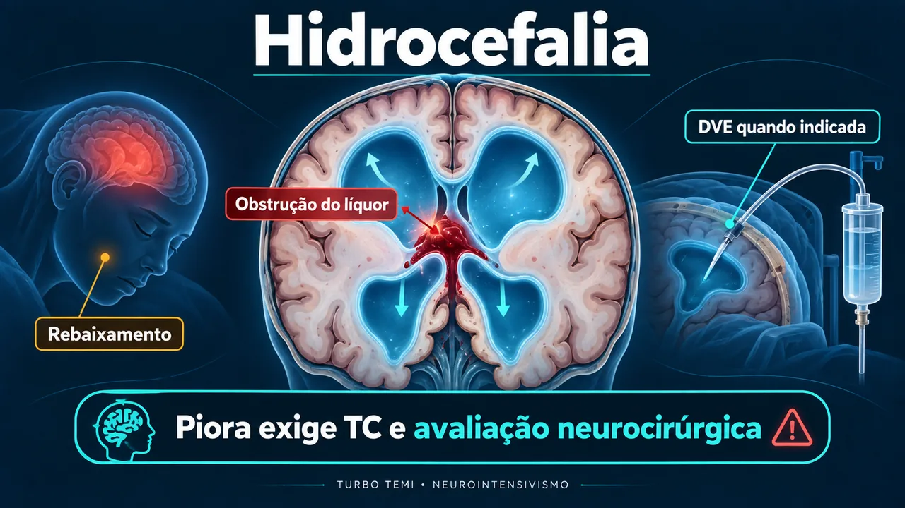

*Figura 15 — Hidrocefalia. Ilustração conceitual gerada por IA; não é exame real.*

### 5. Isquemia cerebral tardia não é sinônimo de vasoespasmo

**Vasoespasmo** é estreitamento arterial demonstrável. **Isquemia cerebral tardia (ICT)** é deterioração clínica atribuível à isquemia após excluir outras causas, podendo ocorrer com mecanismos além da vasoconstrição macroscópica. Microcirculação, autorregulação e despolarizações corticais também participam.

Na suspeita: reexamine, revise sedativos, glicose, oxigenação, sódio, crises, hidrocefalia, infecção e sangramento; obtenha imagem conforme urgência. Doppler transcraniano, angioTC e perfusão apoiam a avaliação; nenhum número isolado substitui o exame. Em ICT sintomática, elevação individualizada de PA e manutenção de euvolemia podem ajudar, sob monitorização e com avaliação cardíaca. Casos refratários podem exigir vasodilatador intra-arterial ou angioplastia em centro especializado.

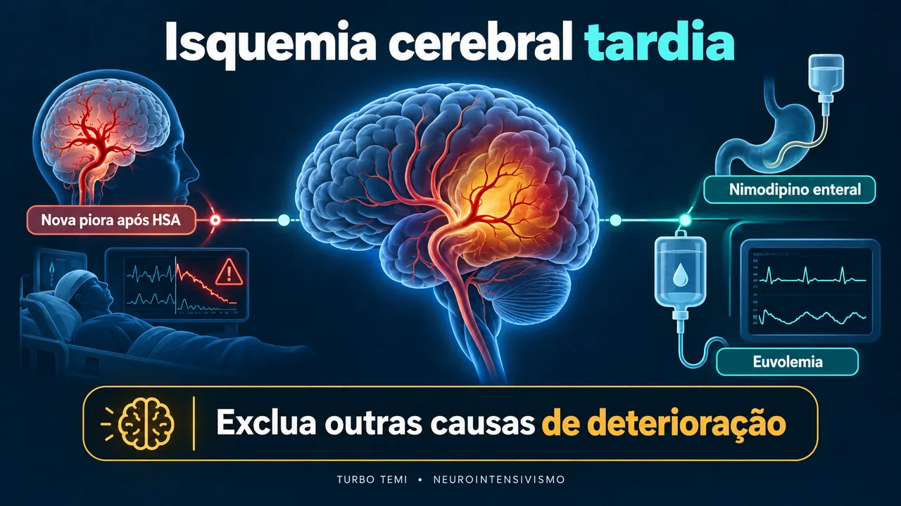

*Figura 16 — Isquemia cerebral tardia. Ilustração conceitual gerada por IA; não é exame real.*

### 6. Sódio, volume e coração

Hiponatremia pode envolver secreção inadequada de hormônio antidiurético, perda renal de sal, fármacos e reposições. O volume circulante, balanço, diurese e osmolaridades importam. Não prescreva restrição hídrica automática em HSA: hipovolemia pode prejudicar perfusão. Sintomas graves requerem correção monitorizada; evite excesso de correção e considere risco de desmielinização osmótica. Mineralocorticoide pode ser usado em natriurese selecionada, com vigilância de potássio e congestão.

Elevação de troponina, alterações eletrocardiográficas, arritmia e cardiomiopatia por estresse podem acompanhar HSA. Investigue também síndrome coronariana real. Ecocardiografia, perfusão periférica e sinais de congestão orientam suporte. “Mais volume para o cérebro” pode piorar o pulmão e o coração.

### 7. Crises e alta

Trate crises documentadas: para crise de início novo após HSA, a diretriz 2023 recomenda anticonvulsivante por 7 dias. Profilaxia anticonvulsivante não é universal; pode ser considerada em alto risco — sangue intraparenquimatoso, HSA grave, hidrocefalia, infarto cortical ou aneurisma de ACM. Evite fenitoína, associada a mais morbidade. EEG contínuo pode detectar crises não convulsivas em coma/flutuação. Duração além dos 7 dias depende de crise tardia, epilepsia prévia e lesão; não perpetue automaticamente o fármaco após a alta.

Planeje controle por imagem do aneurisma e avaliação de cognição, humor, fadiga, deglutição e autonomia. Bom resultado motor não exclui dificuldades executivas relevantes.

Fontes: [R04], [R05], [R24], [R25], [R26], [R27], [R42].

## Calculadora NIHSS

> Versão interativa desta seção: [Calculadora NIHSS](../../../01_Modulos_Clinicos/AVC_Turbo_TEMI/index.html#nihss)

### Exame observado, pontuação explícita

NIHSS significa **National Institutes of Health Stroke Scale**. São 11 categorias, desdobradas em **15 itens**, com soma possível de 0–42 quando todos são pontuáveis. A calculadora abaixo contém descrições em português para apoio educacional; não é instrumento de certificação nem tradução formalmente validada por este projeto.

Examine na ordem, pontue o desempenho observado e evite treinamento repetitivo do paciente. Use estímulos padronizados no serviço para linguagem e disartria; os manuais oficiais estão nas referências. As 20 ilustrações Turbo TEMI não substituem os cartões oficiais de teste.

**Sem falso zero:** campos vazios mantêm resultado incompleto. “Não testável” (UN) só aparece onde previsto: barreiras físicas específicas nos itens motores/ataxia/disartria. O programa exibe subtotal e impede chamar esse subtotal de NIHSS completo. Afasia e coma não equivalem automaticamente a UN.

> 🧰 **Ferramenta interativa — Calculadora NIHSS (item a item, UN, subtotal explícito, comparação com exame anterior).** Disponível somente no [módulo publicado](../../../01_Modulos_Clinicos/AVC_Turbo_TEMI/index.html); a versão em texto não substitui o exame item a item nem decide tratamento.

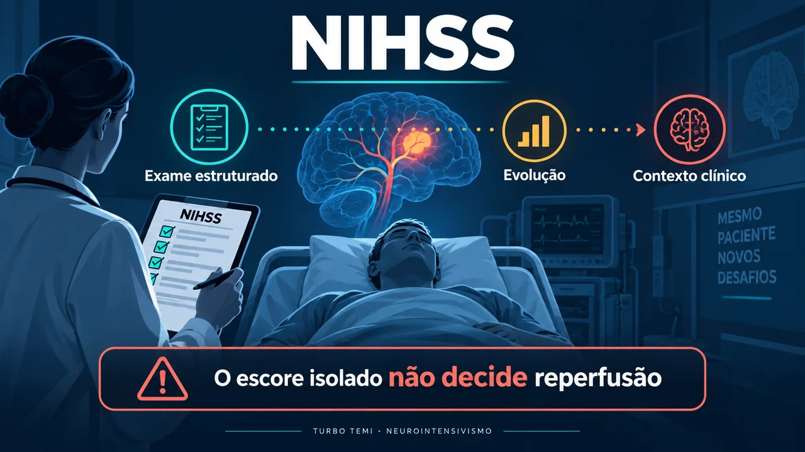

*Figura 07 — NIHSS. Ilustração conceitual gerada por IA; não é exame real.*

### Limites que mudam decisões

- Escore zero não exclui AVC; NIHSS mede domínios selecionados e pode subestimar circulação posterior.
- Um ponto por afasia, mão dominante ou campo visual pode representar grande incapacidade no contexto individual.
- Sedação, intubação, déficits prévios e barreira linguística precisam ser documentados.
- A evolução por item pode ser mais informativa que a soma. Qualquer piora relevante exige avaliação; não espere cruzar um limiar numérico arbitrário.
- Não use NIHSS, sozinho, para indicar trombólise/trombectomia, alta ou limitação de suporte.

Fontes: [R01], [R07].

## Fisher e Hunt–Hess

> Versão interativa desta seção: [Fisher e Hunt–Hess](../../../01_Modulos_Clinicos/AVC_Turbo_TEMI/index.html#escalas)

### Qual escala responde a qual pergunta?

| Escala | O que observa | Uso | Não faz |
|---|---|---|---|
| Fisher original | Distribuição/espessura do sangue na TC | Descrever padrão radiológico associado a vasoespasmo | Não é escala linear de pior prognóstico |
| Fisher modificado | Sangue subaracnóideo fino/espesso + sangue ventricular | Estratificar risco de vasoespasmo/ICT em grupos | Não fornece probabilidade individual exata |
| Hunt–Hess | Quadro clínico/consciência e déficit | Descrever gravidade clínica na HSA | Não mede quantidade de sangue nem define futilidade |
| WFNS | Glasgow + presença de déficit motor | Graduar gravidade clínica com base objetiva; recomendada pela AHA/ASA 2023 ao lado de Hunt–Hess | Não substitui a descrição do exame nem decide limitação de suporte |

### Fisher original — I a IV

| Grau | Padrão clássico |
|---|---|
| I | Não se detecta sangue subaracnóideo na TC |
| II | Sangue difuso ou camada fina, sem coágulo localizado, tipicamente <1 mm |
| III | Coágulo localizado e/ou camada espessa, tipicamente ≥1 mm |
| IV | Sangue intraventricular ou intraparenquimatoso com HSA difusa ou ausente |

O grau III apresentou associação forte com vasoespasmo na descrição clássica (coágulos maiores que 5 × 3 mm ou camadas ≥1 mm em fissuras e cisternas verticais: 23 de 24 casos com espasmo grave); **IV não significa simplesmente “mais HSA que III”**. Em padrões mistos espessos com sangue ventricular, registre o padrão descritivo e também Fisher modificado; não force equivalência entre sistemas. Medidas históricas dependiam de técnicas de TC diferentes das atuais.

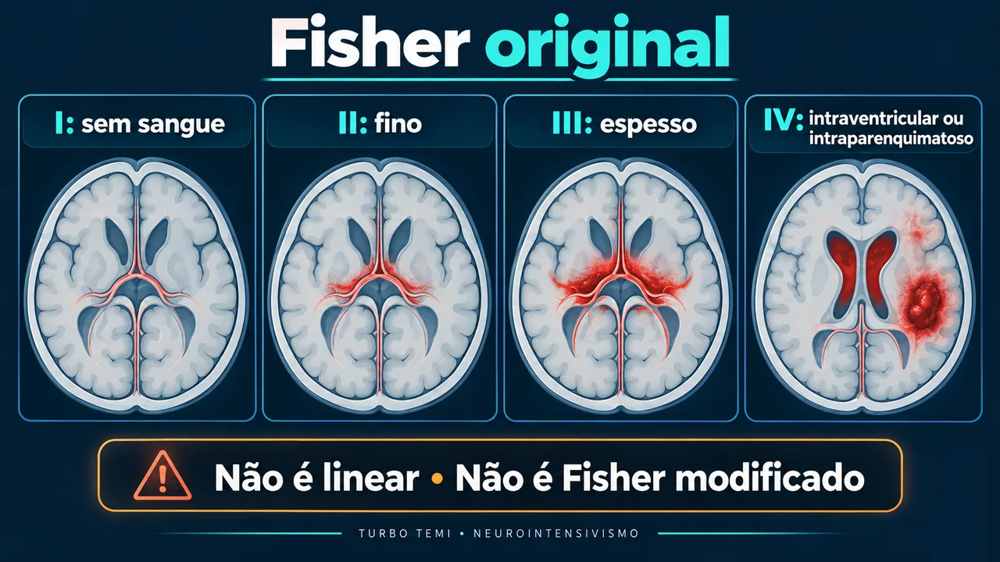

*Figura 12 — Fisher original. Ilustração conceitual gerada por IA; não é exame real.*

### Fisher modificado — 0 a 4

| Grau | Sangue subaracnóideo | Sangue intraventricular |
|---|---|---|
| 0 | Ausente | Ausente |
| 1 | Fino, focal ou difuso | Ausente |
| 2 | Fino, focal ou difuso | Presente |
| 3 | Espesso, focal ou difuso | Ausente |
| 4 | Espesso, focal ou difuso | Presente |

**Fino ou espesso?** Na descrição de Frontera et al. (2006), “espesso” é o sangue que preenche completamente pelo menos uma cisterna ou fissura; qualquer quantidade menor conta como “fino”. Sem essa definição, dois examinadores graduam a mesma TC de forma diferente.

**Sangue ventricular isolado não deve ser classificado por uma simplificação automática desta tabela:** descreva, confirme a definição usada pelo serviço e investigue a causa. “Fisher IV” sem dizer original/modificado é comunicação ambígua.

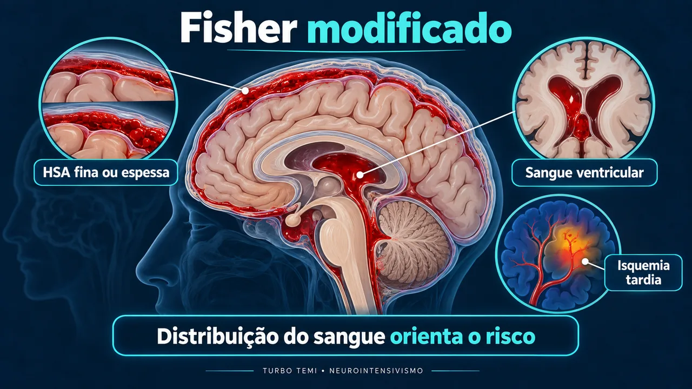

*Figura 13 — Fisher modificado. Ilustração conceitual gerada por IA; não é exame real.*

### Hunt–Hess — I a V

| Grau | Descrição clínica |
|---|---|
| I | Assintomático ou cefaleia discreta com leve rigidez de nuca |
| II | Cefaleia moderada/intensa e rigidez de nuca; sem déficit focal, exceto paralisia de nervo craniano |
| III | Sonolência/confusão ou déficit focal leve |
| IV | Estupor, hemiparesia moderada/grave; pode haver rigidez descerebrada inicial e alterações vegetativas |
| V | Coma profundo, rigidez descerebrada, estado moribundo |

Registre horário, sedação e confundidores. Não transforme estado farmacologicamente sedado em Hunt–Hess V sem avaliação clínica apropriada. Convenções históricas de modificação por comorbidades não são aplicadas automaticamente neste módulo; documente a versão empregada.

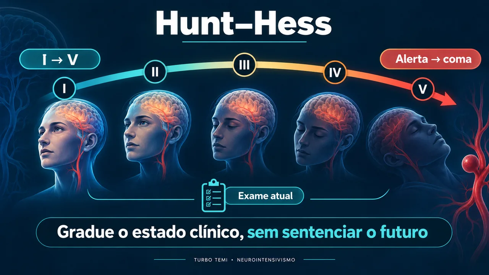

*Figura 14 — Hunt–Hess. Ilustração conceitual gerada por IA; não é exame real.*

### WFNS — I a V

| Grau | Glasgow | Déficit motor |
|---|---|---|
| I | 15 | Ausente |
| II | 13–14 | Ausente |
| III | 13–14 | Presente |
| IV | 7–12 | Presente ou ausente |
| V | 3–6 | Presente ou ausente |

Proposta pelo comitê da World Federation of Neurosurgical Societies (1988) para reduzir a subjetividade das escalas puramente descritivas. “Déficit motor” significa afasia, hemiparesia ou hemiplegia. A AHA/ASA 2023 recomenda o uso de Hunt–Hess ou WFNS para descrever gravidade inicial e apoiar prognóstico em grupo — não para decidir, sozinha, limitação de suporte.

> 🧰 **Ferramenta interativa — Fisher original e modificado, Hunt–Hess e Glasgow → WFNS.** Disponível somente no [módulo publicado](../../../01_Modulos_Clinicos/AVC_Turbo_TEMI/index.html); a versão em texto não substitui o exame item a item nem decide tratamento.

**Exemplo de comunicação:** “HSA aneurismática, Hunt–Hess III às 14h antes de sedação, Fisher modificado 4, hidrocefalia em TC; neurocirurgia acionada”. Isso comunica três dimensões diferentes: exame, sangue e complicação.

Fontes: [R04], [R29], [R30], [R31], [R53], [R54].

## Complicações maiores

> Versão interativa desta seção: [Complicações maiores](../../../01_Modulos_Clinicos/AVC_Turbo_TEMI/index.html#complicacoes)

### O paciente piorou: primeira sequência

Reavalie via aérea/ventilação/circulação, oximetria, glicemia, PA, temperatura, pupilas e exame focal. Anote a hora da mudança e compare com o basal. Confira infusões, sedativos, anticoagulação e eventos recentes. Acione equipe/neurocirurgia conforme contexto. TC urgente é frequente, mas estabilização e tratamento de herniação não esperam o transporte.

Selecione uma complicação para abrir **reconhecimento → agora → investigação → evitar → reavaliar**. Os checklists são apoio de raciocínio e não registram atendimento nem garantem execução.

16 roteiros de deterioração.

### Hemorragia após trombólise (Isquêmico · Minutos a primeiras 24 h)

- **Reconhecer:** Piora focal/consciência, cefaleia nova intensa, vômitos ou hipertensão após IVT. Não exigir um aumento mínimo de NIHSS para agir.
- **Agora:**
  1. Interromper alteplase se ainda em infusão; suspender antitrombóticos.
  2. Estabilizar, acionar AVC/neurocirurgia/hemoterapia e obter TC urgente.
  3. Colher hemograma, coagulação, fibrinogênio e prova pré-transfusional; preparar reversão conforme suspeita/confirmação e protocolo.
- **Investigar:** TC; fibrinogênio e coagulação seriados; verificar outros sítios de sangramento. Ver ficha de crioprecipitado e ácido tranexâmico: repetir crioprecipitado até fibrinogênio >150 mg/dL.
- **Evitar:** Não aguardar rotina de 24 h nem tentar interromper bolus de tenecteplase já administrado.
- **Reavaliar:** Reexaminar continuamente; controlar PA, fibrinogênio e imagem conforme evolução. Registrar horários e resposta.
- **Fontes:** R01 R34

### Angioedema orolingual (Isquêmico · Durante ou após trombólise)

- **Reconhecer:** Edema de língua/lábios, voz alterada, estridor ou dificuldade de deglutição. Uso de inibidor da ECA aumenta a suspeita.
- **Agora:**
  1. Interromper alteplase se em infusão, suspender inibidor da ECA e chamar equipe de via aérea imediatamente.
  2. Preparar intubação precoce se progressivo; não esperar oclusão completa.
  3. Esquema de referência (ENLS/AHA): difenidramina 50 mg IV + famotidina 20 mg IV + metilprednisolona 125 mg IV; adrenalina IM 0,3–0,5 mg se progressão; icatibante 30 mg SC ou C1-inibidor quando disponíveis. Ver ficha específica em “Fármacos”.
- **Investigar:** Avaliação direta da via aérea, oximetria/capnografia e progressão do edema. Considerar terapia dirigida por especialista.
- **Evitar:** Não atrasar proteção de via aérea aguardando efeito farmacológico. Adrenalina é prioritária se houver anafilaxia, mas não corrige de modo confiável angioedema puro por bradicinina.
- **Reavaliar:** Reavaliar em minutos; acompanhar progressão e necessidade de suporte intensivo.
- **Fontes:** R34 R01

### Edema maligno do infarto (Isquêmico · Primeiros dias; frequentemente 2º–5º)

- **Reconhecer:** Grande infarto, queda da consciência, anisocoria ou progressão do efeito de massa.
- **Agora:**
  1. Acionar neurocirurgia cedo e tratar deterioração como emergência.
  2. Cabeceira ~30°, cabeça alinhada; corrigir hipóxia, hipotensão, febre e convulsões.
  3. Osmoterapia se edema sintomático/herniação como ponte; discutir hemicraniectomia com equipe e família.
- **Investigar:** TC urgente, exame seriado e elegibilidade cirúrgica. Idade, funcionalidade prévia, território e tempo influenciam decisão: nos ensaios clássicos de hemicraniectomia, o benefício mais claro de sobrevida com função foi em ≤60 anos operados em até 48 h; acima de 60 anos (DESTINY II) houve mais sobrevida, frequentemente com dependência importante — discutir valores do paciente. Este ponto deve ser conferido no texto integral da diretriz vigente e no protocolo local.
- **Evitar:** Não usar manitol profilático nem esperar pupila fixa para discutir descompressão. Benefício funcional e sobrevivência são desfechos distintos.
- **Reavaliar:** Minutos após resgate; depois monitorização contínua e exame seriado. Repetir imagem se piora.
- **Fontes:** R01 R32 R33

### Expansão do hematoma (HIC · Sobretudo primeiras horas)

- **Reconhecer:** Piora clínica, aumento de hematoma em TC, anticoagulante ou sinais de alto risco radiológico.
- **Agora:**
  1. Controlar PA de forma suave no alvo definido.
  2. Confirmar reversão de anticoagulante e horários administrados.
  3. Acionar neurocirurgia em deterioração/efeito de massa e estabilizar antes do transporte.
- **Investigar:** TC comparativa; hemograma, INR/TTPa conforme agente, fibrinogênio e testes específicos se necessários.
- **Evitar:** Não usar INR normal como prova de ausência de DOAC; não postergar reversão indicada por excesso de exames.
- **Reavaliar:** Exame frequente, PA contínua e testes pós-reversão; TC seriada conforme risco/evolução.
- **Fontes:** R02 R03 R22

### Ressangramento da HSA (HSA · Maior preocupação antes de proteger aneurisma)

- **Reconhecer:** Nova cefaleia abrupta, colapso, perda de consciência ou piora súbita.
- **Agora:**
  1. Acionar equipe neurovascular e estabilizar via aérea/circulação.
  2. TC urgente quando transporte seguro; verificar situação do aneurisma.
  3. Controlar extremos de PA e corrigir coagulopatia; providenciar tratamento definitivo.
- **Investigar:** TC, coagulação, hemoglobina, avaliação do aneurisma/procedimento realizado.
- **Evitar:** Não usar antifibrinolítico como substituto de oclusão precoce. Não concluir que nimodipino previne ressangramento.
- **Reavaliar:** Vigilância contínua; registrar novo evento e encaminhamento definitivo.
- **Fontes:** R04 R05

### Hidrocefalia aguda / DVE (HSA e HIC · Pode ocorrer cedo ou tardiamente)

- **Reconhecer:** Rebaixamento, vômitos e dilatação ventricular; em DVE existente, queda/ausência inesperada de drenagem.
- **Agora:**
  1. Acionar neurocirurgia para drenagem quando indicada.
  2. Se DVE presente, conferir sistema e nivelamento conforme prescrição, sem manipulação não autorizada.
  3. Estabilizar e avaliar herniação associada.
- **Investigar:** TC, estado de consciência, pupilas, curva/pressão e débito da DVE por equipe treinada.
- **Evitar:** Não abrir, irrigar ou alterar altura da DVE por conta própria. Drenagem descontrolada tem riscos; na fossa posterior, DVE isolada pode ser insuficiente.
- **Reavaliar:** Após intervenção e a cada mudança clínica; documentar altura prescrita, débito e resposta.
- **Fontes:** R02 R04 R32

### Isquemia cerebral tardia (HSA · Tipicamente 3º–14º dia)

- **Reconhecer:** Novo déficit ou queda de consciência sem causa imediata clara após HSA.
- **Agora:**
  1. Reexaminar, checar glicose/oxigenação/PA e rever sedação.
  2. Excluir hidrocefalia, crise, distúrbios de sódio, infecção e ressangramento.
  3. Manter nimodipino enteral se tolerado e euvolemia; discutir hipertensão induzida individualizada em ICT sintomática e resgate endovascular.
- **Investigar:** TC/angioTC/perfusão; Doppler transcraniano seriado; EEG se indicado. Avaliar coração antes de aumentar suporte pressórico.
- **Evitar:** Não tratar Doppler isolado como ICT. Não induzir hipervolemia ou hipertensão profilática universal.
- **Reavaliar:** Resposta do exame e perfusão em minutos/horas após intervenção; seguir vigilância diária.
- **Fontes:** R04 R05 R24

### Hipertensão intracraniana / herniação (Todos · Emergência a qualquer momento)

- **Reconhecer:** Queda de consciência + anisocoria, postura anormal ou padrão respiratório alterado. Tríade de Cushing é tardia e pode faltar.
- **Agora:**
  1. Acionar resgate e neurocirurgia; garantir via aérea e circulação.
  2. Cabeceira ≥30° e cabeça alinhada; evitar compressão jugular; tratar dor, febre e agitação.
  3. Osmoterapia conforme protocolo (manitol 0,5–1 g/kg ou salina hipertônica); hiperventilação breve como ponte em herniação ativa, alvo PaCO₂ 32–35 mmHg com capnografia/gasometria.
- **Investigar:** TC quando seguro; pressão intracraniana (PIC) se monitorizada, sódio (manter <160 mEq/L na osmoterapia), função renal e osmolaridade/hiato osmolar. PPC = PAM − PIC, se medidas válidas; ENLS sugere alvo de 60–70 mmHg, individualizado.
- **Evitar:** Não aguardar TC para estabilizar. Não manter hiperventilação profilática prolongada nem dar corticoide para edema de AVC.
- **Reavaliar:** Reavaliar pupilas/exame e resposta imediatamente; organizar drenagem/evacuação/descompressão quando indicada.
- **Fontes:** R32 R33

### Crise epiléptica / estado de mal (Todos · Pode ser inicial ou tardia)

- **Reconhecer:** Crise ≥5 min ou crises sem recuperação; também considerar estado não convulsivo em coma persistente/flutuação.
- **Agora:**
  1. Via aérea, oxigenação, acesso e glicemia; não atrasar benzodiazepínico indicado (no Brasil: diazepam IV ou midazolam IM/IV; lorazepam IV não é comercializado).
  2. Se persistir após 10–20 min, carregar antiepiléptico de segunda linha conforme protocolo (levetiracetam, valproato ou fenitoína/fosfenitoína).
  3. Acionar EEG e tratar causas; se refratário, suporte de via aérea/anestésico em UTI.
- **Investigar:** Glicose, Na/Ca/Mg, TC e eletroencefalograma (EEG), contínuo quando indicado.
- **Evitar:** Não dar dose subterapêutica de benzodiazepínico por medo abstrato de depressão respiratória; preparar suporte. Não chamar ausência de abalos de resolução elétrica.
- **Reavaliar:** Em minutos após cada etapa; recuperação de consciência e EEG definem controle.
- **Fontes:** R26

### Disfagia / broncoaspiração (Todos · Desde a admissão)

- **Reconhecer:** Tosse/voz molhada, dessaturação com ingestão ou infiltrado/febre; aspiração também pode ser silenciosa.
- **Agora:**
  1. Suspender via oral e avaliar via aérea/oxigenação.
  2. Solicitar triagem especializada e plano de nutrição seguro.
  3. Se infecção provável, colher dados e tratar conforme protocolo local.
- **Investigar:** Avaliação fonoaudiológica; imagem torácica e culturas quando indicação. Diferenciar pneumonite química de pneumonia.
- **Evitar:** Não testar deglutição com água sem protocolo; não indicar antibiótico profilático universal.
- **Reavaliar:** Oxigenação nas próximas horas, evolução infecciosa e segurança da rota alimentar.
- **Fontes:** R35

### Hiponatremia / natriurese (HSA e outros · Frequentemente ao longo dos primeiros dias)

- **Reconhecer:** Queda do Na, alteração de consciência, crise, poliúria ou balanço negativo.
- **Agora:**
  1. Conferir Na, sintomas e velocidade de queda.
  2. Avaliar volemia e perdas; evitar hipovolemia na HSA.
  3. Hiponatremia com sintomas graves: correção com solução hipertônica sob protocolo e monitorização próxima.
- **Investigar:** Osmolaridade sérica/urinária, Na urinário, glicemia, função renal, balanço e fármacos; considerar causas endócrinas.
- **Evitar:** Não restringir água automaticamente na HSA; não corrigir rapidamente uma hiponatremia crônica. Meta e teto de correção precisam ser prescritos.
- **Reavaliar:** Na seriado em intervalos curtos durante correção ativa; diurese, exame e volume. Interromper/escalonar se tendência a sobrecorreção.
- **Fontes:** R04 R05 R42

### Edema pulmonar / disfunção cardíaca (HSA e outros · Horas a dias)

- **Reconhecer:** Hipoxemia, congestão, arritmia, hipotensão, troponina/ECG alterados; considerar cardiomiopatia por estresse.
- **Agora:**
  1. Suporte de oxigenação/ventilação com proteção hemodinâmica.
  2. Avaliar perfusão e congestão para guiar fluidos/vasoativos.
  3. Investigar síndrome coronariana real e outras causas em paralelo.
- **Investigar:** ECG, troponina seriada quando indicada, ecocardiograma, imagem pulmonar e gasometria.
- **Evitar:** Não tratar toda troponina como infarto tipo 1 nem toda hipotensão com grande volume. Evitar hipervolemia profilática na HSA.
- **Reavaliar:** Resposta respiratória/hemodinâmica em minutos/horas; reavaliar necessidade de pressor ou diurético.
- **Fontes:** R04 R05

### TEV: trombose / embolia pulmonar (Todos · Durante imobilização)

- **Reconhecer:** Edema assimétrico, dor em membro, hipoxemia súbita, taquicardia ou choque inexplicado.
- **Agora:**
  1. Estabilizar se hipoxemia/choque.
  2. Investigar TEV e discutir risco de anticoagulação com neurologia/neurocirurgia.
  3. Revisar profilaxia mecânica/farmacológica apropriada ao estágio.
- **Investigar:** Ultrassom venoso e angioTC pulmonar conforme probabilidade/estabilidade; eco no choque pode apoiar.
- **Evitar:** Não anticoagular plenamente de forma reflexa em hemorragia intracraniana recente. Filtro de veia cava não é rotina, mas pode ser ponte selecionada quando anticoagulação é impossível.
- **Reavaliar:** Vigilância de sangramento, respiração e perfusão; registrar plano de reavaliação da anticoagulação.
- **Fontes:** R02 R35

### Febre / infecção / delirium (Todos · Qualquer fase)

- **Reconhecer:** Febre, piora de atenção ou consciência, alterações respiratórias/urinárias ou instabilidade.
- **Agora:**
  1. Reavaliar déficit focal, glicose, oxigenação e fármacos.
  2. Investigar foco e tratar febre/dor; manejar infecção quando provável.
  3. Promover sono, orientação, audição/visão e mobilidade segura.
- **Investigar:** Exame, culturas/imagem orientadas por hipótese; TC/EEG se piora neurológica não explicada.
- **Evitar:** Não chamar toda febre de central nem dar antibiótico sem raciocínio. Delirium não exclui complicação estrutural.
- **Reavaliar:** Revisão clínica nas próximas horas; tendência térmica, exame e resposta ao tratamento.
- **Fontes:** R35 R02

### Hipoglicemia / hiperglicemia (Todos · Qualquer fase)

- **Reconhecer:** Sudorese, déficit focal, crise ou coma podem ser hipoglicemia; hiperglicemia acompanha estresse e diabetes.
- **Agora:**
  1. Medir glicemia imediatamente e corrigir hipoglicemia pelo protocolo.
  2. Reexaminar o déficit após correção.
  3. Na hiperglicemia persistente, usar controle institucional seguro, frequentemente 140–180 mg/dL no crítico.
- **Investigar:** Glicemia seriada, insulina/nutrição/renal; investigar cetoacidose ou estado hiperosmolar quando contexto.
- **Evitar:** Não atribuir déficit persistente só à glicose. Não usar alvo intensivo 80–130 mg/dL no AVC esperando benefício funcional.
- **Reavaliar:** Após resgate da hipoglicemia, nova medida em ~15 min conforme protocolo; monitorização mais frequente se insulina IV.
- **Fontes:** R17 R41

### Nova oclusão / progressão / hipotensão (Isquêmico · Primeiras horas ou após melhora)

- **Reconhecer:** Retorno de déficit, nova síndrome focal ou piora associada à queda de PA.
- **Agora:**
  1. Acionar equipe AVC novamente e registrar último exame estável.
  2. Corrigir hipóxia/hipoglicemia/hipotensão e verificar infusões.
  3. Imagem cerebral e vascular urgente para diferenciar hemorragia, reoclusão e progressão.
- **Investigar:** TC + angioTC conforme cenário, ritmo cardíaco e causas sistêmicas. Elegibilidade de novo tratamento depende do que já foi feito.
- **Evitar:** Não repetir trombolítico nem iniciar heparina plena automaticamente.
- **Reavaliar:** Exame após estabilização e decisão especializada; reavaliar continuamente até definir a causa.
- **Fontes:** R01 R08

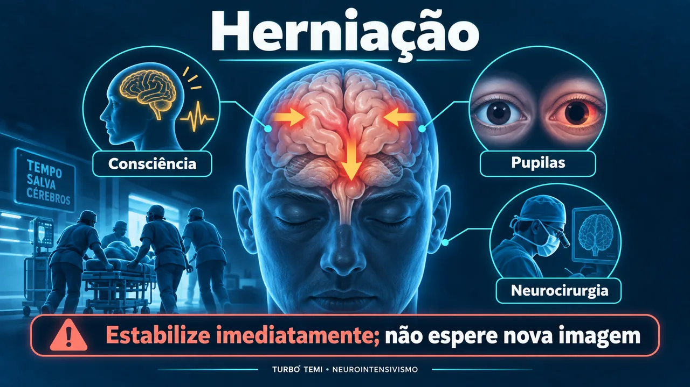

*Figura 17 — Herniação. Ilustração conceitual gerada por IA; não é exame real.*

### Prevenir lesão secundária todos os dias

| Eixo | Verificação prática |
|---|---|
| Oxigenação/ventilação | Tratar hipoxemia; evitar hipercapnia relevante; hiperventilação só como ponte curta em herniação |
| Perfusão | Evitar hipotensão e grandes oscilações; meta depende do subtipo, reperfusão e pressão intracraniana |
| Temperatura/glicose | Investigar febre; corrigir hipoglicemia; evitar controle intensivo de glicose que provoque hipoglicemia |
| Sódio/água | Acompanhar balanço, diurese e sódio; não assumir SIADH sem avaliar volume |
| Deglutição/nutrição | Triagem antes de via oral, higiene oral e rota enteral segura; plano fonoaudiológico |
| Tromboembolismo venoso (TEV) | Compressão pneumática intermitente em pacientes imobilizados; farmacoprofilaxia após avaliação do risco/estabilidade |
| HIC e profilaxia farmacológica | Heparina de baixa dose em 24–48 h pode ser considerada após confirmar estabilidade do sangramento e plano cirúrgico |
| HSA e profilaxia farmacológica | Coordenar após proteção do aneurisma e procedimentos/drenos; não aplicar relógio universal |
| Pele/mobilidade | Mudança de decúbito, prevenção de lesão por pressão e reabilitação quando estável; evitar mobilização intensa muito precoce |
| Exame/delirium | Documentar basal, avaliar dor/sono/sedação e não atribuir nova piora focal simplesmente a delirium |

*Figura 18 — Convulsões. Ilustração conceitual gerada por IA; não é exame real.*

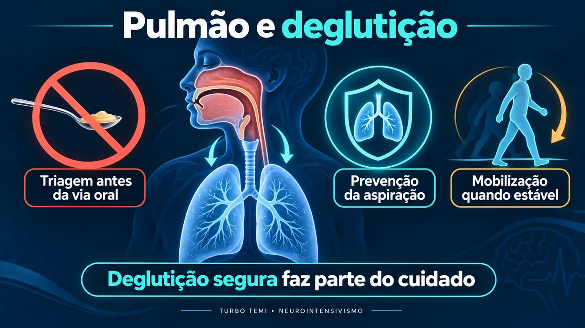

*Figura 19 — Pulmão e deglutição. Ilustração conceitual gerada por IA; não é exame real.*

Fontes: [R02], [R04], [R17], [R23], [R24], [R26], [R32], [R33], [R34], [R35], [R42].

## Fármacos e segurança

> Versão interativa desta seção: [Fármacos e segurança](../../../01_Modulos_Clinicos/AVC_Turbo_TEMI/index.html#farmacos)

### Conferência antes de qualquer dose

Adulto, peso em kg, indicação, imagem, função renal/hepática, anticoagulação, alergias, apresentação e via. **mg não é mL.** Diluição e compatibilidade dependem da apresentação: os exemplos são identificados e não autorizam trocar concentração sem recalcular. Disponibilidade no HRN/Santa Casa não foi verificada. Não há calculadora de prescrição automática.

**Contexto brasileiro:** fármacos citados nas diretrizes norte-americanas — labetalol IV, nicardipina IV, clevidipina, lorazepam IV, andexanet, icatibante — têm registro/disponibilidade rara ou ausente na rede brasileira. As fichas trazem, ao lado, as alternativas usuais no Brasil, sempre como dose de referência a conferir com o protocolo do serviço e a bula da apresentação em uso.

> 💊 17 fichas. Toda dose exige conferência na bula, no protocolo institucional e com a farmácia; as fichas adaptadas ao Brasil aguardam conferência local.

### Alteplase

| Campo | Conteúdo |
|---|---|
| Indicação | AVC isquêmico elegível à trombólise. |
| Dose | 0,9 mg/kg IV, máximo 90 mg: 10% em bolus em 1 min; restante em 60 min. |
| Preparo | Reconstituir com diluente e concentração da bula da apresentação; bomba de infusão dedicada. Conferir peso e cálculo por segunda pessoa. |
| Monitorizar | Exame e PA; sangramento e angioedema. TC urgente se deteriorar. |
| Limites | Não ajustar empiricamente a dose por função renal; avaliar risco hemorrágico/coagulopatia. Insuficiência hepática com coagulopatia exige avaliação. Interações relevantes: antitrombóticos. |
| Fontes | R01 R06 R34 |

### Tenecteplase

| Campo | Conteúdo |
|---|---|
| Indicação | AVC isquêmico elegível, conforme protocolo/apresentação autorizados. |
| Dose | Esquema estudado: 0,25 mg/kg IV, máximo 25 mg, bolus único em 5–10 s. Não usar 0,4 mg/kg nem esquema de infarto do miocárdio. |
| Preparo | Bula/protocolo podem usar faixas de peso e apresentação própria. Não converter mg para mL sem conferir concentração final; não misturar esquemas. |
| Monitorizar | Mesmo cuidado pós-trombólise: PA, exame, hemorragia e angioedema. |
| Limites | Confirme indicação/registro e padronização local. Função renal/hepática influencia segurança, não autoriza redução improvisada da dose. |
| Fontes | R01 R10 |

### Nimodipino enteral

| Campo | Conteúdo |
|---|---|
| Indicação | HSA aneurismática: prevenção de ICT e melhora funcional. |
| Dose | 60 mg por via oral/sonda gástrica a cada 4 h por 21 dias, com início precoce (bula: em até 96 h do sangramento). Na cirrose, bula consultada: 30 mg a cada 4 h. |
| Preparo | Exclusivamente ENTERAL neste esquema. Soluções podem ter concentrações diferentes; a bula de referência é 3 mg/mL (60 mg = 20 mL). Por sonda: administrar e lavar a seringa/sonda com 20 mL de SF 0,9% a cada dose. No Brasil o comprimido de 30 mg é a apresentação habitual: 2 comprimidos a cada 4 h, sem esmagar de forma que altere a dose; confirmar com a farmácia. Nunca em via IV. |
| Monitorizar | PA e frequência cardíaca, tolerância enteral. Se hipotensão, avaliar causas, suporte e ajuste pela equipe para evitar interrupção desnecessária. |
| Limites | Inibidores fortes de CYP3A4 podem elevar exposição; indutores reduzem efeito. Não é prevenção de ressangramento. Nunca injetar formulação oral. |
| Fontes | R24 R25 R04 |

### Nicardipina IV

| Campo | Conteúdo |
|---|---|
| Indicação | Controle titulável de PA quando disponível e indicado. Disponibilidade no Brasil: rara/inexistente — ver ficha “PA no Brasil”. |
| Dose | Iniciar 5 mg/h; aumentar 2,5 mg/h a cada 5–15 min, máximo 15 mg/h; reduzir após atingir alvo. |
| Preparo | Usar apresentação pronta ou diluição da bula/protocolo de farmácia. mL/h = mg/h ÷ concentração em mg/mL. |
| Monitorizar | PA frequente/contínua, frequência cardíaca, perfusão e sítio de infusão. |
| Limites | Hipotensão/taquicardia; cautela na disfunção cardíaca e renal/hepática, com titulação cuidadosa. Não usar alvo genérico para todos os AVCs. |
| Fontes | R34 |

### Labetalol IV

| Campo | Conteúdo |
|---|---|
| Indicação | Redução de PA conforme cenário, quando disponível. Disponibilidade no Brasil: rara/inexistente — ver ficha “PA no Brasil”. |
| Dose | 10–20 mg IV em ~2 min em protocolos de AVC; reavaliar antes de repetir/escalonar. Dose máxima acumulada de protocolos: 300 mg. |
| Preparo | Conferir apresentação; bolus lento. Infusão contínua depende do protocolo local e de resposta aos bolus. |
| Monitorizar | PA e frequência cardíaca; reavaliar em 5–10 min. |
| Limites | Evitar em bradicardia importante, bloqueio AV significativo, choque/descompensação cardíaca e broncoespasmo relevante. Cautela em doença hepática. |
| Fontes | R34 R37 |

### PA no Brasil: metoprolol, esmolol e nitroprussiato

| Campo | Conteúdo |
|---|---|
| Indicação | Controle de PA no AVC agudo quando labetalol/nicardipina IV não estão disponíveis — situação comum na rede brasileira. |
| Dose | Doses de referência usuais em protocolos nacionais, a CONFIRMAR com a bula da apresentação e o protocolo do serviço: metoprolol 5 mg IV lento (≈5 min), repetível a cada 10 min até 20 mg (respeitar frequência cardíaca e bloqueios); esmolol 500 mcg/kg em 1 min seguido de 50–200 mcg/kg/min, titulando; nitroprussiato 0,25–0,5 mcg/kg/min, titulando até 10 mcg/kg/min por curto período, se PA refratária aos betabloqueadores. |
| Preparo | Metoprolol: ampola pronta; esmolol e nitroprussiato: infusão contínua em bomba, com diluição e proteção da luz conforme bula. Nitroprussiato pode elevar pressão intracraniana e causar hipotensão abrupta: usar com PA invasiva ou aferição muito frequente e como última opção. |
| Monitorizar | PA a cada 5–15 min durante a titulação, frequência cardíaca, perfusão, exame neurológico; cianeto/tiocianato se nitroprussiato prolongado ou insuficiência renal. |
| Limites | O texto integral da diretriz brasileira (SBDCV 2012) e o PCDT vigente não foram lidos integralmente nesta auditoria; as doses acima vêm de bulas e de rotinas amplamente adotadas e não substituem a padronização local. Evitar betabloqueador em bradicardia, bloqueio AV avançado, broncoespasmo ativo e choque. Não tratar PA antes de definir o tipo de AVC, salvo emergência hipertensiva. |
| Fontes | R34 R50 R06 |

### CCP4 + vitamina K

| Campo | Conteúdo |
|---|---|
| Indicação | HIC relevante associada a antagonista de vitamina K. |
| Dose | Exemplo de bula KCENTRA: INR 2–<4: 25 UI/kg (máx. 2.500 UI); INR 4–6: 35 UI/kg (máx. 3.500); INR >6: 50 UI/kg (máx. 5.000). Associar vitamina K IV, usualmente 10 mg, por protocolo. |
| Preparo | Dose em UI de fator IX pelo peso, calculado até no máximo 100 kg (acima disso, usar o teto da faixa). Velocidade da bula KCENTRA: 0,12 mL/kg/min (≈3 UI/kg/min), máximo 8,4 mL/min. Reconstituição depende do produto. Vitamina K IV deve ser administrada lentamente conforme apresentação. |
| Monitorizar | INR após reversão e seriado; trombose, hipersensibilidade, volume e eficácia hemostática. |
| Limites | Não extrapolar esta tabela de varfarina para DOAC. Contém heparina: contraindicado em trombocitopenia induzida por heparina (HIT). Advertência de eventos tromboembólicos arteriais e venosos. INR 1,3–1,9 e outros cenários necessitam protocolo especializado. |
| Fontes | R02 R22 |

### Idarucizumabe

| Campo | Conteúdo |
|---|---|
| Indicação | Reversão de dabigatrana em sangramento ameaçador à vida/não controlado. |
| Dose | 5 g IV: dois frascos de 2,5 g/50 mL consecutivos, por infusão ou bolus conforme bula. |
| Preparo | Solução pronta; não misturar com outros medicamentos. Seguir orientação de linha/flush da apresentação. |
| Monitorizar | Hemostasia, coagulação apropriada e recorrência do efeito; função renal e possível rebote. |
| Limites | Não reverte inibidor de Xa. Não exige ajuste renal de dose, mas insuficiência renal favorece persistência/reaparecimento de dabigatrana. |
| Fontes | R36 |

### CCP4 em inibidores de Xa

| Campo | Conteúdo |
|---|---|
| Indicação | HIC associada a DOAC quando estratégia de reversão institucional assim indicar. |
| Dose | Protocolos usam 25–50 UI/kg; alguns adotam 50 UI/kg. Teto e indicação variam conforme produto/serviço; não transferir tabela de INR da varfarina. |
| Preparo | Uso para DOAC pode ser fora de bula. Confirmar agente, última dose e função renal; discussão imediata com especialistas. |
| Monitorizar | Hemostasia e trombose; anti-Xa específico quando útil/disponível, sem atrasar resgate indicado. |
| Limites | Evidência e disponibilidade de reversores evoluem. Alerta FDA/Andexxa de 2025 deve acompanhar leitura de diretrizes antigas. |
| Fontes | R02 R03 R20 R21 |

### Crioprecipitado ± antifibrinolítico

| Campo | Conteúdo |
|---|---|
| Indicação | Hemorragia sintomática associada a trombólise, com equipe/hemoterapia. |
| Dose | ENLS: crioprecipitado 10 unidades IV em 10–30 min; dosar fibrinogênio e repetir ATÉ que ultrapasse 150 mg/dL (alguns protocolos adotam alvo maior). Ácido tranexâmico: 1 g IV em 10 min conforme estratégia local (alternativa ENLS: ácido aminocaproico 4–5 g IV em 1 h, depois 1 g/h até controle). |
| Preparo | Número de bolsas/pools depende da padronização do hemocentro; confirmar conteúdo. Não converter “10 unidades” em “10 pools”. |
| Monitorizar | Fibrinogênio seriado — o resultado decide a próxima dose —, sangramento, TC, PA, reação transfusional e trombose. |
| Limites | Antifibrinolítico não é rotina de HSA aneurismática. Ajuste renal e risco convulsivo do tranexâmico exigem atenção; não duplicar agentes automaticamente. |
| Fontes | R34 |

### Angioedema orolingual pós-trombólise: esquema de resgate

| Campo | Conteúdo |
|---|---|
| Indicação | Angioedema durante/após alteplase ou tenecteplase, sobretudo em uso de inibidor da ECA. Via aérea primeiro. |
| Dose | ENLS/AHA: difenidramina 50 mg IV + famotidina 20 mg IV (ou ranitidina 50 mg IV) + metilprednisolona 125 mg IV; se progressão, adrenalina IM 0,3–0,5 mg (0,5 mg preferido acima de 50 kg); terapia dirigida à bradicinina quando disponível: icatibante 30 mg SC no abdome, repetível em 6 h (máx. 90 mg/24 h) ou concentrado de C1-inibidor; plasma fresco como fonte de C1-inibidor é opção citada. |
| Preparo | Interromper a infusão de alteplase; suspender inibidor da ECA. Preparar intubação precoce (edema pode progredir em minutos); considerar via aérea cirúrgica de resgate. |
| Monitorizar | Inspeção repetida da língua/orofaringe, oximetria/capnografia, estridor e capacidade de deglutir saliva. |
| Limites | Anti-histamínico e corticoide têm efeito limitado no mecanismo por bradicinina; adrenalina não corrige de modo confiável o angioedema puro. Icatibante e C1-inibidor têm disponibilidade restrita no Brasil. Difenidramina IV também é pouco disponível: prometazina IM/IV é o anti-H1 parenteral usual, conforme protocolo. |
| Fontes | R34 R01 |

### Manitol

| Campo | Conteúdo |
|---|---|
| Indicação | Resgate de hipertensão intracraniana/herniação quando indicado. |
| Dose | 0,5–1 g/kg IV em 5–15 min no ENLS; repetir somente após reavaliação. Exemplo: solução 20% contém 0,2 g/mL. |
| Preparo | Conferir concentração, ausência de cristais e sistema/filtro conforme bula. A dose é em gramas, não miligramas. |
| Monitorizar | PA, diurese, volume, creatinina, eletrólitos e hiato osmolar; avaliar resposta clínica/PIC. |
| Limites | Pode causar hipovolemia, hipotensão e lesão renal. Evitar em anúria e usar cautela em congestão. Não há esquema profilático universal. |
| Fontes | R32 R33 |

### Solução salina hipertônica

| Campo | Conteúdo |
|---|---|
| Indicação | Resgate de edema sintomático/herniação ou correção de hiponatremia grave: objetivos e protocolos distintos. |
| Dose | Dose/concentração dependem da situação. Para edema, usar protocolo institucional de bolus e monitorização; não fixar alvo universal de Na nem prescrever por este quadro. |
| Preparo | Preferir solução padronizada de farmácia. Não preparar à beira-leito por mistura improvisada. Concentrações altas e via de acesso requerem política específica. |
| Monitorizar | Na/Cl, função renal, balanço e congestão; ENLS orienta controles frequentes e evitar Na ≥160 mEq/L no manejo de PIC. |
| Limites | Teto de Na não é alvo terapêutico. Na hiponatremia crônica, vigiar sobrecorreção. Não repetir bolus sem resposta e laboratório. |
| Fontes | R32 R33 |

### Benzodiazepínico para estado de mal

| Campo | Conteúdo |
|---|---|
| Indicação | Crise ≥5 min ou recorrente sem recuperação. |
| Dose | ENLS (adulto): lorazepam 0,1 mg/kg IV (máx. 4 mg por dose) em 2 min; OU diazepam 0,15 mg/kg IV (máx. 10 mg por dose); repetir uma vez após 3–5 min se necessário. Sem acesso IV imediato: midazolam 10 mg IM em adulto de porte habitual, conforme protocolo. No Brasil, lorazepam injetável não é comercializado: as opções reais costumam ser diazepam IV e midazolam IM/IV. |
| Preparo | Disponibilidade/formulação variam. Preparar suporte de via aérea e monitorização; não atrasar dose eficaz. |
| Monitorizar | Respiração, PA, oximetria, resposta motora e consciência. |
| Limites | Evitar doses insuficientes repetidas; considerar sedativos prévios. Diazepam não deve ser diluído em grande volume nem administrado IM para estado de mal (absorção errática). Disfunção hepática/renal pode prolongar sedação. Persistência após 10–20 min de benzodiazepínico exige segunda linha. |
| Fontes | R26 |

### Levetiracetam IV

| Campo | Conteúdo |
|---|---|
| Indicação | Segunda linha no estado de mal conforme protocolo; não é profilaxia universal do AVC. |
| Dose | Carga 60 mg/kg IV, máximo 4.500 mg; infusão conforme protocolo de estado de mal/farmácia. Alternativas ENLS de segunda linha: fosfenitoína 20 mg/kg (máx. 1.500 mg; no Brasil, fenitoína IV com monitorização cardíaca e velocidade da bula) ou valproato 40 mg/kg IV em 10 min (máx. 3.000 mg). |
| Preparo | A diluição e velocidade devem seguir apresentação e protocolo para carga; não confundir com dose de manutenção. |
| Monitorizar | Cessação de crises, EEG, consciência e eventos comportamentais. |
| Limites | Manutenção requer ajuste pela função renal. Uso no estado de mal pode ser fora de bula; não reduzir automaticamente a carga de resgate por regra da manutenção. |
| Fontes | R26 |

### AAS e clopidogrel

| Campo | Conteúdo |
|---|---|
| Indicação | AVC menor/AIT de alto risco não cardioembólico selecionado, após excluir sangramento. |
| Dose | Estratégia CHANCE: clopidogrel 300 mg de carga e 75 mg/dia; AAS em associação nos primeiros 21 dias, depois monoterapia. Dose inicial de AAS varia no protocolo, frequentemente 160–325 mg. |
| Preparo | Via enteral somente após deglutição/rota segura. Após IVT, antitrombótico apenas depois de avaliação/imagem de 24 h, salvo exceção especializada. |
| Monitorizar | Sangramento, hemograma, tolerância e indicação/duração. |
| Limites | Não é indicação universal para todo AVC. Evitar em sangramento ativo; doença hepática grave e associações antitrombóticas elevam risco. |
| Fontes | R16 R01 R06 |

### Protamina

| Campo | Conteúdo |
|---|---|
| Indicação | Reversão de heparina não fracionada; neutralização de heparina de baixo peso molecular é incompleta. |
| Dose | Aproximadamente 1 mg neutraliza 100 UI de heparina remanescente. Calcular pela exposição recente, reduzindo conforme tempo decorrido; não administrar mais de 50 mg em 10 min. |
| Preparo | IV muito lentamente; confirmar diluição e compatibilidade da apresentação. Enoxaparina exige cálculo específico pela última dose/tempo, não a mesma tabela de UI da heparina. |
| Monitorizar | PA, frequência cardíaca, oxigenação, hipersensibilidade, coagulação e sangramento. |
| Limites | Risco de hipotensão, anafilaxia e hipertensão pulmonar. Não reverte varfarina/DOAC. Excesso também pode alterar coagulação. |
| Fontes | R43 R02 |

### Regras práticas de segurança

- Não use dose de tenecteplase para infarto do miocárdio no AVC. Alguns protocolos/bulas usam faixas de peso; concilie a apresentação e o protocolo aprovado antes de preparar.
- Nimodipino deste percurso é **enteral**. Nunca injete uma formulação oral por via IV. Concentrações das soluções orais variam: confirme mg/mL.
- Reversão de anticoagulação pode gerar trombose; isso não dispensa reversão indicada em sangramento crítico, mas exige vigilância e plano posterior.
- Não use corticoide para tratar edema de AVC/HIC. Não use manitol profilático programado sem indicação clínica.
- Não combine anticoagulação plena e dupla antiagregação por “cobertura” sem uma indicação explícita.
- Crioprecipitado após trombólise: repita **até** o fibrinogênio ultrapassar 150 mg/dL, não “se” estiver acima. Confira o resultado antes da próxima dose.

Fontes detalhadas e limites estão em cada ficha.

## Laboratório Turbo TEMI

> Versão interativa desta seção: [Laboratório Turbo TEMI](../../../01_Modulos_Clinicos/AVC_Turbo_TEMI/index.html#estudo)

### Mapa de 60 segundos

**Tempo** → última vez bem e descoberta. **Tecido** → exame e imagem vascular/perfusão quando indicada. **Sangue** → localização, expansão e reversão. **Tendência** → o exame está melhor, igual ou pior? Essa sequência é um mnemônico didático, não uma escala validada.

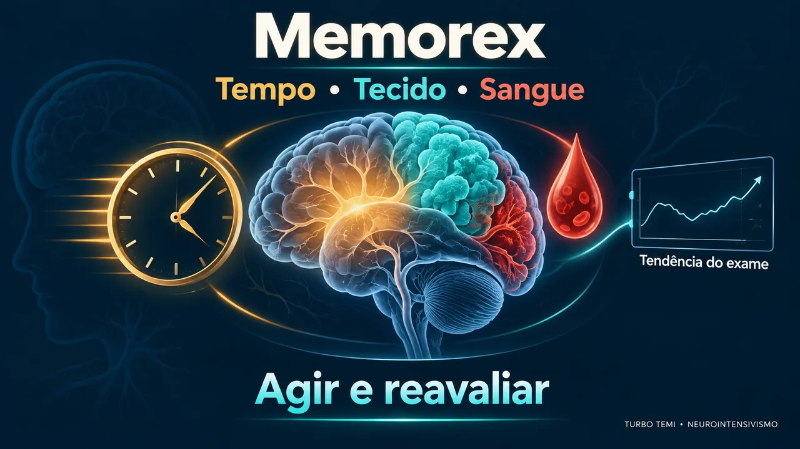

*Figura 20 — Memorex. Ilustração conceitual gerada por IA; não é exame real.*

### Sete casos para reconstruir o raciocínio

7 casos fictícios com progressão.

### Caso 1 · Poucos pontos, grande impacto

Paciente fictício A, 58 anos; leito/unidade/hospital/data não informados. Afasia há 90 min, NIHSS 3, TC sem sangue.

- **O que falta antes de decidir?** Incapacidade funcional, última vez bem, PA, glicemia, anticoagulantes, contraindicações e imagem vascular conforme suspeita.
- **A baixa pontuação encerra a avaliação?** Não. Afasia incapacitante merece avaliação de reperfusão pela equipe.
- **Se houver oclusão proximal?** Organizar avaliação/transferência para trombectomia em paralelo, sem aguardar resposta à IVT.

_Fontes: R01 R09_

### Caso 2 · Fossa posterior sem margem

Paciente fictício B, 70 anos; leito/unidade/hospital/data não informados. HIC cerebelar de 18 mL, Glasgow em queda e hidrocefalia.

- **Primeira decisão?** Acionar neurocirurgia e estabilizar via aérea/perfusão.
- **DVE sozinha resolve todo o problema?** Pode tratar hidrocefalia, mas hematoma/compressão podem exigir evacuação; decisão neurocirúrgica urgente.
- **O que acompanhar?** Pupilas, consciência, PA, sinais de herniação e resposta após intervenção.

_Fontes: R02 R32_

### Caso 3 · Cefaleia de ontem

Paciente fictício C, 45 anos; leito/unidade/hospital/data não informados. Trovoada há 18 h, exame sem déficit e TC negativa.

- **Pode receber alta só pela TC?** Não se a suspeita persistir; o tempo reduz a capacidade de exclusão da TC isolada.
- **Próxima investigação?** Punção lombar se segura, conforme diretriz e contexto; complementar investigação vascular quando indicada.
- **Armadilha?** Achar aneurisma incidental e presumir sangramento sem integrar TC/líquor/clínica.

_Fontes: R04 R27_

### Caso 4 · Nova afasia no 7º dia

Paciente fictício D, 52 anos; leito/unidade/hospital/data não informados. HSA aneurismática tratada, nova afasia no 7º dia.

- **Tudo é vasoespasmo?** Não. Excluir glicose, sedação, crise, hidrocefalia, ressangramento, infecção e distúrbio de sódio.
- **Como investigar ICT?** Exame e imagem vascular/perfusão conforme indicação; Doppler e EEG podem apoiar.
- **O que evitar?** Hipervolemia profilática e escalonamento pressórico sem avaliar coração e segurança.

_Fontes: R04 R05_

### Caso 5 · Um total sedutor, mas inválido

Simulação de exame NIHSS, sem paciente real. Quatorze itens preenchidos; disartria não testável por intubação.

- **Pode somar UN como zero?** Não. Identificar o subtotal dos itens pontuáveis e o motivo.
- **A intubação determina afasia global?** Não. Examinar compreensão e escrita quando possível.
- **Qual é a entrega correta?** Relato por item, limitações e subtotal explicitamente incompleto; não converter em decisão de reperfusão.

_Fontes: R07_

### Caso 6 · Tontura que não era labirintite

Paciente fictício E, 63 anos; leito/unidade/hospital/data não informados. Vertigem, diplopia e disartria há 3 h; NIHSS 5; TC sem sangue; angioTC com oclusão de basilar.

- **O NIHSS 5 tranquiliza?** Não. A escala subestima tronco/cerebelo; diplopia, disfagia e ataxia pesam mais que a soma.
- **Trombólise e trombectomia?** Avaliar IVT pelos critérios habituais e acionar trombectomia em paralelo: a diretriz 2026 recomenda EVT até 24 h em basilar com NIHSS ≥10 e a avaliação especializada decide nos casos abaixo disso.
- **O que vigiar nas próximas horas?** Nível de consciência, padrão respiratório, pupilas e deglutição; deterioração rápida por edema de fossa posterior exige neurocirurgia.

_Fontes: R41 R12 R13_

### Caso 7 · Apixabana às 6 da manhã

Paciente fictício F, 74 anos; leito/unidade/hospital/data não informados. Hemiparesia esquerda há 2 h, NIHSS 12; usa apixabana e tomou a última dose há cerca de 4 h; TC sem sangue; angioTC com oclusão de M1.

- **INR normal libera trombólise?** Não. INR não mede efeito de apixabana; anticoagulante direto nas últimas 48 h exige dados adicionais (horário, função renal, teste específico quando disponível) e decisão especializada.
- **O que não pode atrasar?** A avaliação de trombectomia: a oclusão de M1 tem indicação independente da elegibilidade à trombólise.
- **Se for para trombectomia sem IVT, qual a meta de PA?** ≤185/110 antes do procedimento e meta pós-reperfusão definida com a equipe; PAS <140 não é recomendada mesmo com reperfusão completa.

_Fontes: R01 R41 R28_

### Vinte e cinco questões comentadas

Casos fictícios para aprendizagem. Escolha uma alternativa; o comentário aparece imediatamente e explica todas as opções. Você pode rever respostas sem penalidade. O desempenho fica nesta sessão; se você ativar “Lembrar progresso neste aparelho”, ele fica guardado apenas no seu navegador, sem envio a nenhum servidor, e pode ser apagado com um clique.

> 🧰 **Ferramenta interativa — 25 questões comentadas alternativa por alternativa.** Disponível somente no [módulo publicado](../../../01_Modulos_Clinicos/AVC_Turbo_TEMI/index.html); a versão em texto não substitui o exame item a item nem decide tratamento.

### Trinta flashcards

Responda antes de abrir. Marque apenas a lacuna que merece revisão; não transforme o conjunto em obrigação diária. O modo treino embaralha, mostra um cartão por vez e permite marcar “acertei” ou “rever”; o plano de revisão calcula D1, D7, D14 e D30 a partir de hoje.

> 🧰 **Ferramenta interativa — plano de revisão espaçada D1–D30 gerado no aparelho.** Disponível somente no [módulo publicado](../../../01_Modulos_Clinicos/AVC_Turbo_TEMI/index.html); a versão em texto não substitui o exame item a item nem decide tratamento.

> 🧰 **Ferramenta interativa — 30 flashcards com modo treino.** Disponível somente no [módulo publicado](../../../01_Modulos_Clinicos/AVC_Turbo_TEMI/index.html); a versão em texto não substitui o exame item a item nem decide tratamento.

### Quatro aprofundamentos com ganho prático

1. **Grande núcleo e trombectomia:** compare população/seleção do SELECT2 e do ANGEL-ASPECT com o paciente concreto; “núcleo grande” não é uma categoria uniforme.
4. **Vaso médio:** leia lado a lado os critérios de entrada de ESCAPE-MeVO, DISTAL e ORIENTAL-MeVO e explique por que um NIHSS mediano de 6 e um de 10 podem produzir respostas opostas.
2. **ICT na HSA:** diferencie um vaso estreito de tecido isquêmico e de alteração clínica por outra causa; formule quais dados mudariam sua hipótese.
3. **Desfecho funcional versus marcador:** reduzir expansão do hematoma ou pressão intracraniana não garante melhora de função; leia os desfechos clínicos de ANNEXA-I e dos ensaios de osmoterapia.

### Curiosidades nerd que evitam erros

- Fisher foi elaborado com TC de outra geração; os números não se traduzem em régua perfeita para a imagem moderna.
- Afasia e disartria são domínios distintos: uma altera linguagem; a outra, articulação. A NIHSS examina ambos.
- Fluxo restaurado em um grande vaso não significa microcirculação normal. Por isso, reduzir agressivamente a PA após reperfusão pode ser prejudicial.
- A escala de Fisher nasceu em 1980 com 47 pacientes e o próprio artigo chamou os achados de “preliminares”; a modificada (2006) veio de 1.355 pacientes do braço placebo de ensaios com tirilazad — um fármaco que falhou, mas cujos dados ensinaram a graduar TC.
- O ICH Score foi derivado de 152 pacientes de um único hospital; “todos com escore 5 morreram” eram apenas 6 pessoas. Nenhum escore substitui tempo de observação.
- WFNS quer dizer World Federation of Neurosurgical Societies; a escala foi publicada como carta de uma página em 1988 e continua nas diretrizes de 2023.

### Principais erros e correção

| Erro | Por que acontece | Como prevenir |
|---|---|---|
| “NIHSS baixo, então não é grave” | Confusão entre pontuação e incapacidade | Descrever déficit, circulação posterior e impacto funcional |
| “Fisher IV é sempre pior que III” | Mistura entre escalas e desfechos | Nomear a versão e descrever o padrão de sangue |
| “TC normal excluiu todo AVC/HSA” | Ignora tempo, técnica e hipótese | Reavaliar com imagem/investigação apropriada |
| “PA menor é sempre melhor” | Alvo genérico | Separar isquemia, IVT/EVT, HIC e HSA |
| “HSA precisa de muito volume” | Confusão entre euvolemia e hipervolemia | Avaliar volume, perfusão e congestão |
| “Piora é sedação/delirium” | Ancoragem diagnóstica | Exame, glicose, oxigenação, imagem/EEG conforme contexto |
| “Escala prevê futilidade individual” | Prognóstico de grupo aplicado ao indivíduo | Considerar causas reversíveis, tempo, preferências e equipe |

**Próxima peça lógica:** abrir um caso de deterioração e formular, em voz alta, a primeira ação, o exame prioritário e o critério de reavaliação.

## Referências e limites da edição

> Versão interativa desta seção: [Referências e limites da edição](../../../01_Modulos_Clinicos/AVC_Turbo_TEMI/index.html#fontes)

### Como a evidência foi usada

Diretrizes fundamentam recomendações; ensaios sustentam mudanças específicas; manuais de escala orientam critérios; bulas orientam apresentação, dose e segurança. A data de acesso não significa que todo documento foi atualizado nessa data. As referências históricas são mantidas para as escalas e estudos originais, não apresentadas como diretrizes atuais.

Os artigos completos da AHA e alguns PDFs do NINDS retornaram bloqueio de acesso direto em parte da pesquisa. Foram conferidos trechos indexados, materiais oficiais associados e fontes complementares. Na auditoria de 11/09/2026 (edição 1.1), 33 identificadores PubMed foram conferidos um a um, a diretriz de HSA 2023 foi lida em PDF integral de espelho institucional, os protocolos ENLS v6.0 e as bulas de KCENTRA e nimodipino foram relidos, e os comunicados da FDA sobre andexanet foram confirmados; o texto integral das diretrizes AHA/ASA 2026 (AVC isquêmico) e 2022 (HIC) permaneceu bloqueado e foi conferido por resumos oficiais. Esse limite está registrado na auditoria, com recomendação de confronto final com o texto integral institucional. Não foi realizada revisão sistemática nem validação clínica prospectiva deste software.

### Fontes, versões e função

54 referências com função declarada (conferidas na auditoria de 11/09/2026):

- **R01** — AHA/ASA. Diretriz de manejo precoce do AVC isquêmico (Diretriz, 2026) — _Reperfusão, PA e monitorização. Texto indexado; acesso direto integral bloqueado._ — <https://www.ahajournals.org/doi/10.1161/STR.0000000000000513>
- **R02** — Greenberg et al. AHA/ASA: hemorragia intracerebral espontânea (Diretriz e atualização clínica oficial, 2022) — _PA, reversão, cirurgia, DVE, profilaxia e limites prognósticos; slides oficiais acessíveis._ — <https://professional.heart.org/en/-/media/Files/Professional/Quality-Improvement/Hemorrhagic--Stroke/2022-Guideline-for-the-Management-of-Patients-With-Spontaneous-ICH-Clinical-Update-Slides.pdf>
- **R03** — ESO/EANS: stroke due to spontaneous intracerebral haemorrhage (Diretriz, 2025) — _Atualização europeia de HIC (Steiner et al., Eur Stroke J 2025;10:1007-1086; PMID 40401775); evidência e consensos explicitamente separados. Recomendação fraca a favor de evacuação de HIC cerebelar >15 mL, descompressão em HIC profunda selecionada e pacote de cuidados; contra plaquetas rotineiras e políticas gerais de limitação nas primeiras 24 h._ — <https://pmc.ncbi.nlm.nih.gov/articles/PMC12098356/>
- **R04** — Hoh et al. AHA/ASA: aneurysmal subarachnoid hemorrhage (Diretriz, 2023) — _Diagnóstico, tratamento do aneurisma, ICT e complicações. Texto indexado e materiais oficiais complementares._ — <https://www.ahajournals.org/doi/10.1161/STR.0000000000000436>
- **R05** — AHA: Top Things to Know — HSA aneurismática (Resumo oficial da diretriz, 2023) — _Nimodipino enteral, euvolemia, crises, ICT e tratamento precoce do aneurisma._ — <https://professional.heart.org/en/science-news/2023-guideline-for-the-management-of-patients-with-aneurysmal-subarachnoid-hemorrhage/top-things-to-know>
- **R06** — Ministério da Saúde. PCDT do AVC isquêmico agudo, Portaria 29 (Protocolo nacional, 2023; página atualizada em 2025) — _Contexto brasileiro/SUS; não equivale automaticamente às ampliações internacionais de 2026._ — <https://www.gov.br/saude/pt-br/assuntos/pcdt/a/acidente-vascular-cerebral-isquemico-agudo/view>
- **R07** — NIH Stroke Scale — manual oficial NINDS, espelho da ASA (Instrumento de exame, Revisão indicada no PDF: 2003) — _Critérios, instruções e estímulos oficiais. NINDS também disponibiliza edição 2024; neste projeto a descrição em português é educacional, não certificada. Os alertas de coerência em coma seguem as regras do manual (1b, 1c, 8, 9, 10)._ — <https://www.stroke.org/-/media/Data-Import/downloadables/5/2/3/NIH-Stroke-Scale-UCM_490144.pdf?rev=c72312713d574cf494fc406be288c3f6>
- **R08** — Canadian Stroke Best Practices: Emergency Department Evaluation (Diretriz, 7ª edição; página vigente acessada em 2026) — _Avaliação inicial e imagem._ — <https://www.strokebestpractices.ca/recommendations/acute-stroke-management/emergency-department-evaluation-and-management>
- **R09** — Canadian Stroke Best Practices: Acute Ischemic Stroke Treatment (Diretriz, 2022; atualização EVT 2025) — _Seleção e transferência para trombólise/trombectomia._ — <https://www.strokebestpractices.ca/recommendations/acute-stroke-management/acute-ischemic-stroke-treatment>
- **R10** — Menon et al. AcT: tenecteplase versus alteplase (Ensaio randomizado de não inferioridade, 2022) — _Tenecteplase 0,25 mg/kg em adultos elegíveis; não extrapolar dose de 0,4 mg/kg._ — <https://pubmed.ncbi.nlm.nih.gov/35779553/>
- **R11** — Sarraj et al. SELECT2 (Ensaio randomizado, 2023) — _Trombectomia em grandes núcleos selecionados._ — <https://pubmed.ncbi.nlm.nih.gov/36762865/>
- **R12** — Jovin et al. BAOCHE (Ensaio randomizado, 2022) — _Oclusão basilar selecionada, 6–24 h._ — <https://pubmed.ncbi.nlm.nih.gov/36239645/>
- **R13** — Tao et al. ATTENTION (Ensaio randomizado, 2022) — _Oclusão basilar selecionada até 12 h; não confundir com registro ATTENTION._ — <https://pubmed.ncbi.nlm.nih.gov/36239644/>
- **R14** — Thomalla et al. WAKE-UP (Ensaio randomizado, 2018) — _Seleção por RM no AVC de início desconhecido._ — <https://pubmed.ncbi.nlm.nih.gov/29766770/>
- **R15** — Nogueira et al. DAWN (Ensaio randomizado, 2018; publicação online 2017) — _Janela 6–24 h em população selecionada por discrepância clínica/imagem._ — <https://pubmed.ncbi.nlm.nih.gov/29129157/>
- **R16** — Wang et al. CHANCE (Ensaio randomizado, 2013) — _Dupla antiagregação em AVC menor/AIT de alto risco; população e duração importam._ — <https://pubmed.ncbi.nlm.nih.gov/23803136/>
- **R17** — Johnston et al. SHINE (Ensaio randomizado, 2019) — _Controle intensivo de glicemia não melhorou função e aumentou hipoglicemia._ — <https://pubmed.ncbi.nlm.nih.gov/31334795/>
- **R18** — Pradilla et al. ENRICH (Ensaio randomizado, 2024) — _Evacuação minimamente invasiva selecionada; benefício principalmente lobar._ — <https://pubmed.ncbi.nlm.nih.gov/38598795/>
- **R19** — Baharoglu et al. PATCH (Ensaio randomizado, 2016) — _Dano com transfusão rotineira de plaquetas em HIC associada a antiagregantes sem indicação cirúrgica emergente._ — <https://pubmed.ncbi.nlm.nih.gov/27178479/>
- **R20** — Connolly et al. ANNEXA-I (Ensaio randomizado, 2024) — _Melhor controle hemostático com andexanet, maior risco trombótico; não prova benefício funcional líquido._ — <https://pubmed.ncbi.nlm.nih.gov/38749032/>
- **R21** — FDA. Update on the Safety of Andexxa (Comunicado regulatório, 18–22/12/2025) — _Risco/benefício e encerramento de vendas nos EUA em 22/12/2025: no ANNEXA-I, trombose 14,6% vs 6,9% e mortes relacionadas a trombose 2,5% vs 0,9% no D30. Status brasileiro precisa de verificação própria._ — <https://www.fda.gov/safety/medical-product-safety-information/update-safety-andexxa-astrazeneca-fda-safety-communication>
- **R22** — DailyMed. KCENTRA (Bula oficial, Bula vigente consultada em 11/09/2026) — _Doses por INR/peso de CCP4 para antagonistas de vitamina K; limites e segurança._ — <https://dailymed.nlm.nih.gov/dailymed/drugInfo.cfm?setid=eee1afb8-324c-42e4-8bf0-f0c9da5e6d42>
- **R23** — Ma et al. INTERACT3 (Ensaio por conglomerados, 2023) — _Pacote coordenado de cuidados na HIC._ — <https://pubmed.ncbi.nlm.nih.gov/37245517/>
- **R24** — Pickard et al. British aneurysm nimodipine trial (Ensaio randomizado, 1989) — _Nimodipino 60 mg enteral a cada 4 h por 21 dias._ — <https://pubmed.ncbi.nlm.nih.gov/2496789/>
- **R25** — DailyMed. Nimodipine oral solution (Bula oficial, Bula consultada em 11/09/2026) — _Via exclusivamente enteral, ajuste em cirrose e interações CYP3A4; a concentração deste fabricante é 3 mg/mL._ — <https://dailymed.nlm.nih.gov/dailymed/lookup.cfm?setid=f829de8b-fabd-4aec-ac8d-c9aaef7be55b>
- **R26** — NCS. ENLS Status Epilepticus v6.0 (Protocolo de emergência, Julho/2024) — _Reconhecimento, benzodiazepínicos, levetiracetam e EEG._ — <https://www.neurocriticalcare.org/Portals/0/ENLS%205.0/ENLS%206.0/Protocol%20V6_0%20Status%20Epilepticus.pdf>
- **R27** — AHA/ASA. Investigação de HSA — seção 4 (Recomendações diagnósticas, 2023) — _TC e punção lombar conforme tempo/exame; angioTC e angiografia digital. Mesma diretriz R04, link para versão PDF._ — <https://www.ahajournals.org/doi/pdf/10.1161/STR.0000000000000436>
- **R28** — Nam et al. OPTIMAL-BP (Ensaio randomizado, 2023) — _Risco do controle intensivo da PA após trombectomia bem-sucedida._ — <https://pubmed.ncbi.nlm.nih.gov/37668619/>
- **R29** — Fisher, Kistler e Davis. Relation of cerebral vasospasm to SAH on CT (Estudo original de escala, 1980) — _Origem do Fisher e associação não linear com vasoespasmo._ — <https://pubmed.ncbi.nlm.nih.gov/7354892/>
- **R30** — Frontera et al. Prediction of symptomatic vasospasm: modified Fisher scale (Estudo prognóstico, 2006) — _Combinação de sangue cisternal e ventricular; não é estimativa causal/individual._ — <https://pubmed.ncbi.nlm.nih.gov/16823296/>
- **R31** — Hunt e Hess. Surgical risk as related to time of intervention (Escala clínica histórica, 1968) — _Graduação clínica I–V; não é critério isolado de limitação terapêutica._ — <https://pubmed.ncbi.nlm.nih.gov/5635959/>
- **R32** — NCS. ENLS Intracranial Hypertension and Herniation v6.0 (Protocolo de emergência, Setembro/2024) — _Resgate escalonado, osmoterapia, DVE e neurocirurgia._ — <https://www.neurocriticalcare.org/Portals/0/ENLS%205.0/ENLS%206.0/Protocol%20V6_0_Intracranial%20Hypertension%20and%20Herniation.pdf>
- **R33** — Cook et al. Guidelines for the Acute Treatment of Cerebral Edema (Diretriz NCS, 2020) — _Osmoterapia reduz PIC; benefício funcional e estratégias de dose têm limitações._ — <https://pubmed.ncbi.nlm.nih.gov/32227294/>
- **R34** — NCS. ENLS Acute Ischemic Stroke v6.0 (Protocolo de emergência, 2024) — _Resgate de sangramento/angioedema e anti-hipertensivos. Reperfusão deve ser atualizada pela AHA/ASA 2026._ — <https://www.neurocriticalcare.org/Portals/0/ENLS%205.0/ENLS%206.0/Protocol%20V6_0_Acute%20Ischemic%20Stroke.pdf>
- **R35** — Canadian Stroke Best Practices: Acute Stroke Unit Care (Diretriz, 7ª edição, página vigente em 2026) — _Deglutição, nutrição, mobilidade e prevenção de complicações._ — <https://www.strokebestpractices.ca/recommendations/acute-stroke-management/acute-stroke-unit-care>
- **R36** — DailyMed. PRAXBIND — idarucizumab (Bula oficial, Bula consultada em 11/09/2026) — _Idarucizumabe 5 g, dois frascos de 2,5 g/50 mL._ — <https://dailymed.nlm.nih.gov/dailymed/lookup.cfm?setid=c7400f8a-dcf4-a6df-6d07-983081b1bf34>
- **R37** — DailyMed. Labetalol hydrochloride injection (Bula oficial, Bula consultada em 11/09/2026) — _Bólus, velocidade e segurança cardiovascular._ — <https://dailymed.nlm.nih.gov/dailymed/drugInfo.cfm?setid=99a715a0-4579-410c-b102-7ef6fab8db55>
- **R38** — Hu et al. ORIENTAL-MeVO: Endovascular Treatment of Medium-Vessel-Occlusion Strokes (Ensaio randomizado, 14/05/2026) — _Ensaio randomizado chinês (48 centros; 563 pacientes; NIHSS ≥6, mediana 10; até 24 h). Independência funcional 58,6% vs 46,6%; HIC sintomática 4,7% vs 2,2%. Evidência posterior à AHA/ASA janeiro/2026._ — <https://pubmed.ncbi.nlm.nih.gov/42127389/>
- **R39** — ESCAPE-MeVO: Endovascular Treatment of Stroke Due to Medium-Vessel Occlusion (Ensaio randomizado, 2025) — _Não demonstrou benefício funcional (mRS 0–1 41,6% vs 43,1%); mortalidade 13,3% vs 8,4%; HIC sintomática 5,4% vs 2,2%. Delimita extrapolação para vasos médios com déficit leve e imagem favorável._ — <https://pubmed.ncbi.nlm.nih.gov/39908448/>
- **R40** — FDA. Withdrawn non-malignant indications — Andexxa (Registro regulatório, Retirada em 23/12/2025) — _Confirma data de retirada da aprovação acelerada nos EUA._ — <https://www.fda.gov/drugs/accelerated-approval-program/withdrawn-non-malignant-hematological-neurological-and-other-disorder-indications-accelerated>
- **R41** — AHA/ASA. Top Things to Know — AVC isquêmico (Resumo oficial, 26/01/2026) — _Atualizações de trombólise, trombectomia, glicemia e PA._ — <https://professional.heart.org/en/science-news/2026-guideline-for-the-early-management-of-patients-with-acute-ischemic-stroke/top-things-to-know>
- **R42** — Spasovski et al. Clinical practice guideline on diagnosis and treatment of hyponatraemia (Diretriz conjunta ESICM/ESE/ERA-EDTA, 2014) — _Avaliação osmótica/volêmica, correção de sintomas graves e prevenção de sobrecorreção; aplicar contexto específico da HSA._ — <https://pubmed.ncbi.nlm.nih.gov/24562549/>
- **R43** — DailyMed. Heparin — reversão com protamina (Bula oficial, Bula consultada em 11/09/2026) — _Protamina neutraliza aproximadamente 100 UI de heparina por mg; infusão lenta e dose dependente da exposição remanescente._ — <https://dailymed.nlm.nih.gov/dailymed/drugInfo.cfm?setid=eede8a0c-5ae6-4166-84b3-12081405f08e>
- **R44** — Psychogios et al. DISTAL: Endovascular Treatment for Stroke Due to Occlusion of Medium or Distal Vessels (Ensaio randomizado, 2025) — _543 pacientes, até 24 h, NIHSS mediana 6; sem benefício funcional (cOR 0,90); HIC sintomática 5,9% vs 2,6%. Segundo ensaio negativo de vaso médio em 2025._ — <https://pubmed.ncbi.nlm.nih.gov/39908430/>
- **R45** — Ma et al. EXTEND: Thrombolysis Guided by Perfusion Imaging up to 9 Hours after Onset of Stroke (Ensaio randomizado, 2019) — _Alteplase 4,5–9 h (ou ao despertar) selecionada por perfusão: mais pacientes sem déficit relevante, com mais hemorragia sintomática._ — <https://pubmed.ncbi.nlm.nih.gov/31067369/>
- **R46** — Albers et al. DEFUSE 3: Thrombectomy for Stroke at 6 to 16 Hours with Selection by Perfusion Imaging (Ensaio randomizado, 2018) — _Trombectomia 6–16 h em oclusão proximal com tecido isquêmico ainda não infartado na perfusão._ — <https://pubmed.ncbi.nlm.nih.gov/29364767/>
- **R47** — Huo et al. ANGEL-ASPECT: Trial of Endovascular Therapy for Acute Ischemic Stroke with Large Infarct (Ensaio randomizado, 2023) — _Grande infarto (ASPECTS 3–5 ou núcleo 70–100 mL) até 24 h: melhor desfecho com trombectomia, com mais hemorragias intracranianas._ — <https://pubmed.ncbi.nlm.nih.gov/36762852/>
- **R48** — Li et al. INTERACT4: Intensive Ambulance-Delivered Blood-Pressure Reduction in Hyperacute Stroke (Ensaio randomizado, 2024) — _Redução pré-hospitalar da PA em AVC indiferenciado não melhorou desfecho; 46,5% eram hemorrágicos. Fundamenta “imagem antes da meta de PA”._ — <https://pubmed.ncbi.nlm.nih.gov/38752650/>
- **R49** — Johnston et al. POINT: Clopidogrel and Aspirin in Acute Ischemic Stroke and High-Risk TIA (Ensaio randomizado, 2018) — _Dupla antiagregação por 90 dias: menos eventos isquêmicos, mais sangramento maior — base para limitar a dupla a ~21 dias._ — <https://pubmed.ncbi.nlm.nih.gov/29766750/>
- **R50** — Martins et al. Sociedade Brasileira de Doenças Cerebrovasculares — Guidelines for acute ischemic stroke treatment: part II (Diretriz nacional, 2012) — _Diretriz brasileira de reperfusão e antitrombóticos (Arq Neuropsiquiatr 2012;70:885-93). Texto integral não acessado nesta auditoria (bloqueio de acesso); citada como contexto nacional para fármacos de PA._ — <https://pubmed.ncbi.nlm.nih.gov/23175203/>
- **R51** — Hemphill et al. The ICH score: a simple, reliable grading scale for intracerebral hemorrhage (Estudo original de escala, 2001) — _Componentes e pontuação do ICH Score; coorte pequena de um único centro; escala de gravidade, não de futilidade._ — <https://pubmed.ncbi.nlm.nih.gov/11283388/>
- **R52** — Kothari et al. The ABCs of measuring intracerebral hemorrhage volumes (Estudo original de método, 1996) — _Fórmula ABC/2 à beira do leito, com C = número de cortes com sangue × espessura do corte; excelente concordância em hematomas elipsoides._ — <https://pubmed.ncbi.nlm.nih.gov/8711791/>
- **R53** — Teasdale, Drake, Hunt et al. A universal subarachnoid hemorrhage scale: report of a committee of the WFNS (Escala clínica histórica, 1988) — _Graus I–V da WFNS a partir do Glasgow e da presença de déficit motor (J Neurol Neurosurg Psychiatry 1988;51:1457)._ — <https://pubmed.ncbi.nlm.nih.gov/3236024/>
- **R54** — Teasdale e Jennett. Assessment of coma and impaired consciousness: a practical scale (Escala clínica histórica, 1974) — _Escala de coma de Glasgow (3–15) usada como base do WFNS e do ICH Score._ — <https://pubmed.ncbi.nlm.nih.gov/4136544/>

### O que precisa ser validado antes de integrar/publicar

Auditoria médica independente, cartões e tradução oficial da NIHSS usados pelo serviço, fluxo de transferência, fármacos/apresentações disponíveis, situação regulatória brasileira, contraindicações de reperfusão e compatibilidade com a navegação/manifesto do repositório. O ZIP contém roteiro para o Claude, inventário e testes; esta versão permanece identificada como material para auditoria.

As imagens foram geradas por IA para ensinar conceitos. São esquemas, não exames diagnósticos reais; legendas e texto clínico prevalecem sobre simplificações gráficas. Não há dados reais de pacientes no material.
