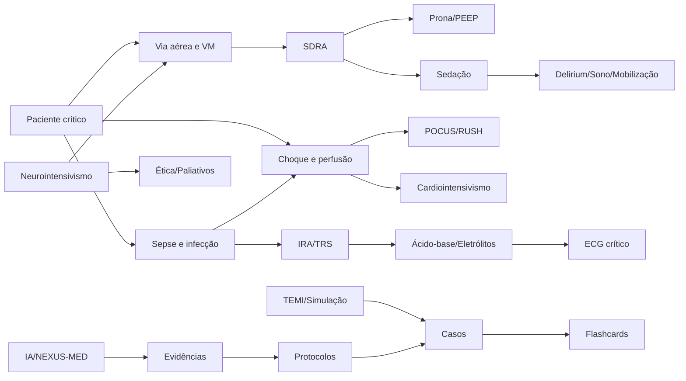
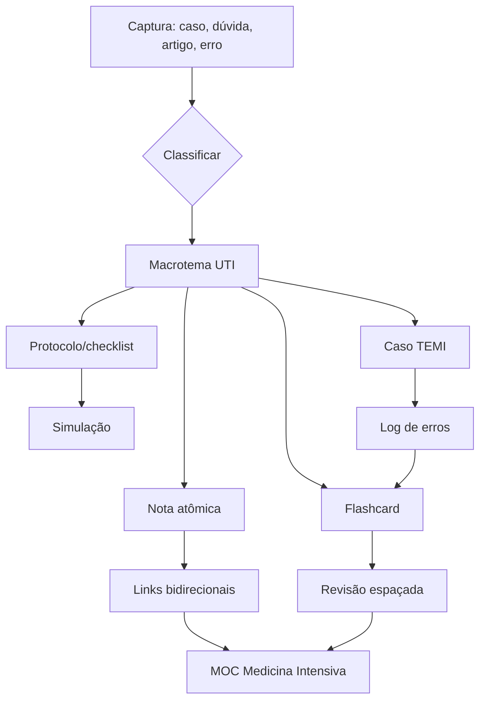

# 🧠 MOC — Medicina Intensiva NEXUS-MED

> Base temática organizada a partir das memórias recuperadas do projeto NEXUS-MED v6: TEMI, UTI, protocolos, banco de questões, flashcards, casos clínicos, POCUS, ECG, Clinical Engine, Patient System e IA Hub.

## Uso seguro
Esta base é para **organização de estudo, simulação, revisão e construção de protocolos**. Para assistência real, validar com diretrizes atualizadas, protocolo institucional e julgamento clínico.

## Dashboard Dataview — temas prioritários

```dataview
TABLE prioridade, categoria, status, revisao, fonte
FROM "01_Temas"
WHERE contains(tags, "UTI")
SORT prioridade ASC, file.name ASC
```

## Protocolos P0/P1

```dataview
TABLE tema, prioridade, gatilho, status
FROM "02_Protocolos"
WHERE prioridade = "P0" OR prioridade = "P1"
SORT prioridade ASC, file.name ASC
```

## Casos TEMI para treino

```dataview
TABLE prioridade, tema, tarefas
FROM "03_Casos_TEMI"
WHERE contains(tags, "TEMI/caso")
SORT prioridade ASC, file.name ASC
```

## Mapa visual de correlações



## Macrotemas

- [[../01_Temas/UTI-01_Via_aerea_e_ventilacao_mecanica.md|UTI-01 — Via aérea e ventilação mecânica]] — **P0** — Respiratório
- [[../01_Temas/UTI-02_SDRA_e_insuficiencia_respiratoria_hipoxemica.md|UTI-02 — SDRA e insuficiência respiratória hipoxêmica]] — **P0** — Respiratório
- [[../01_Temas/UTI-03_Sepse_infeccao_e_antimicrobianos.md|UTI-03 — Sepse, infecção e antimicrobianos]] — **P0** — Infectologia crítica
- [[../01_Temas/UTI-04_Choque_perfusao_e_hemodinamica.md|UTI-04 — Choque, perfusão e hemodinâmica]] — **P0** — Hemodinâmica
- [[../01_Temas/UTI-05_Sedacao_analgesia_delirium_sono_e_mobilizacao.md|UTI-05 — Sedação, analgesia, delirium, sono e mobilização]] — **P0** — Humanização e recuperação
- [[../01_Temas/UTI-06_Cardiologia_intensiva.md|UTI-06 — Cardiologia intensiva]] — **P1** — Cardiointensivismo
- [[../01_Temas/UTI-07_Neurointensivismo.md|UTI-07 — Neurointensivismo]] — **P1** — Neurológico
- [[../01_Temas/UTI-08_Nefrologia_intensiva_IRA_e_TRS.md|UTI-08 — Nefrologia intensiva, IRA e TRS]] — **P0** — Renal
- [[../01_Temas/UTI-09_Acido_base_eletrolitos_e_fluidos.md|UTI-09 — Ácido-base, eletrólitos e fluidos]] — **P0** — Metabólico
- [[../01_Temas/UTI-10_Endocrino_metabolico_e_nutricao.md|UTI-10 — Endócrino-metabólico e nutrição]] — **P1** — Metabólico/Nutrição
- [[../01_Temas/UTI-11_Hematologia_coagulacao_e_transfusao.md|UTI-11 — Hematologia, coagulação e transfusão]] — **P1** — Hematologia crítica
- [[../01_Temas/UTI-12_Gastro_hepatologia_e_abdome_critico.md|UTI-12 — Gastro/hepatologia e abdome crítico]] — **P2** — Gastro/hepato
- [[../01_Temas/UTI-13_Trauma_queimados_e_pos_operatorio_critico.md|UTI-13 — Trauma, queimados e pós-operatório crítico]] — **P1** — Cirúrgico/Trauma
- [[../01_Temas/UTI-14_Procedimentos_dispositivos_POCUS_e_ECG.md|UTI-14 — Procedimentos, dispositivos, POCUS e ECG]] — **P0** — Procedimentos/Diagnóstico
- [[../01_Temas/UTI-15_Seguranca_gestao_comunicacao_etica_e_paliativos.md|UTI-15 — Segurança, gestão, comunicação, ética e paliativos]] — **P1** — Sistemas e humanização
- [[../01_Temas/UTI-16_TEMI_simulacao_e_aprendizagem_deliberada.md|UTI-16 — TEMI, simulação e aprendizagem deliberada]] — **P0** — Educação médica
- [[../01_Temas/UTI-17_IA_clinica_automacao_e_NEXUS_MED.md|UTI-17 — IA clínica, automação e NEXUS-MED]] — **P2** — Produtividade clínica

## Fluxo permanente de atualização
1. **Capturar** caso, dúvida, erro ou artigo.
2. **Classificar** por macrotema e prioridade.
3. **Atomizar** em nota de conceito, protocolo, caso ou flashcard.
4. **Conectar** com temas correlatos no MOC.
5. **Revisar** por espaçamento e por simulação.
6. **Atualizar fonte** quando houver diretriz nova ou protocolo local.


# Banco de dados resumido por temas

| ID | Macrotema | Prioridade | Pergunta-mãe | Tags |
|---|---|---:|---|---|
| UTI-01 | Via aérea e ventilação mecânica | P0 | Como ventilar sem piorar lesão pulmonar e como libertar do ventilador? | #UTI/ventilacao #TEMI #protocolo |
| UTI-02 | SDRA e insuficiência respiratória hipoxêmica | P0 | Quando hipoxemia vira SDRA e qual é o próximo passo seguro? | #UTI/SDRA #UTI/ventilacao #TEMI |
| UTI-03 | Sepse, infecção e antimicrobianos | P0 | Como reduzir tempo até antibiótico sem perder diagnóstico diferencial? | #UTI/sepse #infectologia #choque |
| UTI-04 | Choque, perfusão e hemodinâmica | P0 | O que está impedindo entrega de oxigênio aos tecidos? | #UTI/choque #POCUS #hemodinamica |
| UTI-05 | Sedação, analgesia, delirium, sono e mobilização | P0 | Como manter conforto sem prolongar ventilação/delirium? | #UTI/sedacao #UTI/delirium #ICUliberation |
| UTI-06 | Cardiologia intensiva | P1 | O problema é bomba, ritmo, volume, válvula, pós-carga ou obstrução? | #UTI/cardio #ECG #choque |
| UTI-07 | Neurointensivismo | P1 | Como proteger cérebro quando pulmão, rim e hemodinâmica estão instáveis? | #UTI/neuro #coma #TCE |
| UTI-08 | Nefrologia intensiva, IRA e TRS | P0 | Quando IRA é marcador, causa ou consequência da falência múltipla? | #UTI/renal #IRA #TRS |
| UTI-09 | Ácido-base, eletrólitos e fluidos | P0 | A gasometria muda conduta agora ou só descreve gravidade? | #UTI/gasometria #eletrolitos #fluidos |
| UTI-10 | Endócrino-metabólico e nutrição | P1 | Como nutrir e controlar metabolismo sem hipoglicemia, hipofosfatemia ou aspiração? | #UTI/metabolico #nutricao #glicemia |
| UTI-11 | Hematologia, coagulação e transfusão | P1 | O sangramento/risco trombótico muda o limiar de intervenção? | #UTI/hematologia #transfusao #coagulacao |
| UTI-12 | Gastro/hepatologia e abdome crítico | P2 | O abdome é foco, consequência ou causa da instabilidade? | #UTI/gastro #hepatologia #abdome |
| UTI-13 | Trauma, queimados e pós-operatório crítico | P1 | Qual lesão mata primeiro: via aérea, respiração, circulação, cérebro ou sangramento? | #UTI/trauma #posoperatorio #queimados |
| UTI-14 | Procedimentos, dispositivos, POCUS e ECG | P0 | Qual imagem ou procedimento muda a decisão nos próximos 10 minutos? | #POCUS #ECG #UTI/procedimentos |
| UTI-15 | Segurança, gestão, comunicação, ética e paliativos | P1 | Como transformar conhecimento técnico em cuidado seguro e alinhado ao paciente? | #UTI/gestao #paliativos #seguranca |
| UTI-16 | TEMI, simulação e aprendizagem deliberada | P0 | Como converter cada caso/erro em aprovação e competência prática? | #TEMI #questoes #flashcards |
| UTI-17 | IA clínica, automação e NEXUS-MED | P2 | Como fazer a IA ampliar memória e segurança sem virar fonte acrítica? | #IAmedica #NEXUSMED #Obsidian |

## Protocolos principais

| ID | Protocolo | Prioridade | Gatilho |
|---|---|---:|---|
| PROTO-SEP-01 | Sepse/choque séptico adulto | P0 | Suspeita de infecção + disfunção orgânica, hipotensão, lactato elevado ou necessidade de vasopressor |
| PROTO-SEP-02 | Controle de foco infeccioso | P0 | Sepse com foco drenável, dispositivo infectado, abdome agudo, empiema, obstrução urinária |
| PROTO-INF-01 | Pneumonia hospitalar/HAP-VAP | P1 | Infiltrado novo/progressivo + critérios clínicos em paciente internado/intubado |
| PROTO-RESP-01 | Intubação orotraqueal segura na UTI | P0 | Falência de oxigenação/ventilação, proteção de via aérea, choque, rebaixamento |
| PROTO-RESP-02 | Ventilação protetora em SDRA | P0 | SDRA ou alto risco de lesão pulmonar induzida por ventilador |
| PROTO-RESP-03 | Pronação em SDRA grave | P0 | SDRA grave em VM invasiva sem contraindicação absoluta |
| PROTO-RESP-04 | Desmame e extubação | P0 | Melhora da causa, estabilidade hemodinâmica, drive respiratório e proteção de via aérea adequados |
| PROTO-RESP-05 | Hipoxemia refratária | P0 | SpO2/PaO2 inadequada apesar de suporte inicial |
| PROTO-HEM-01 | Choque indiferenciado | P0 | Hipotensão, lactato elevado, hipoperfusão, alteração mental, oligúria |
| PROTO-HEM-02 | Vasopressor e perfusão | P0 | PAM inadequada após avaliação de volume/causa ou choque distributivo |
| PROTO-CARD-01 | Choque cardiogênico | P1 | Hipoperfusão com suspeita de falência de bomba |
| PROTO-CARD-02 | Arritmia instável | P1 | Instabilidade por taqui/bradiarritmia |
| PROTO-CARD-03 | Pós-parada cardiorrespiratória | P1 | ROSC após PCR |
| PROTO-SED-01 | Analgosedação baseada em metas | P0 | Paciente crítico com dor/agitação/VM |
| PROTO-SED-02 | Delirium e bundle ABCDEF | P0 | Alteração aguda de atenção/cognição ou alto risco |
| PROTO-REN-01 | IRA na UTI | P0 | Aumento de creatinina, oligúria ou risco alto de AKI |
| PROTO-REN-02 | Terapia renal substitutiva | P0 | IRA com distúrbio refratário, sobrecarga, acidose, hipercalemia, uremia ou necessidade de controle metabólico |
| PROTO-ELE-01 | Hipercalemia crítica | P0 | K elevado com ECG alterado, fraqueza, IRA ou acidose |
| PROTO-ELE-02 | Hiponatremia sintomática | P1 | Convulsão, coma, sintomas neurológicos com Na baixo |
| PROTO-MET-01 | Hiperglicemia no paciente crítico | P1 | Glicemia persistentemente elevada no paciente crítico |
| PROTO-NUT-01 | Nutrição enteral/parenteral na UTI | P1 | Paciente crítico com risco nutricional ou impossibilidade de via oral |
| PROTO-HEMATO-01 | Transfusão de hemácias | P1 | Anemia em paciente crítico estável ou sangramento/instabilidade |
| PROTO-NEURO-01 | Coma e rebaixamento agudo | P1 | Queda de consciência, GCS baixo ou nova alteração neurológica |
| PROTO-NEURO-02 | Estado epiléptico | P1 | Crise prolongada ou recorrente sem recuperação |
| PROTO-NEURO-03 | Hemorragia intracraniana em anticoagulado | P1 | ICH/HSA/TCE com anticoagulante/antiagregante relevante |
| PROTO-GI-01 | Hemorragia digestiva alta crítica | P2 | Hematêmese/melena com instabilidade, queda Hb ou choque |
| PROTO-GI-02 | Pancreatite aguda grave | P2 | Pancreatite com falência orgânica, necrose ou SIRS persistente |
| PROTO-TRAUMA-01 | Politrauma na UTI | P1 | Admissão pós-ABCDE, instabilidade ou lesões múltiplas |
| PROTO-POCUS-01 | RUSH/POCUS no choque | P0 | Choque sem causa definida ou resposta inesperada |
| PROTO-POCUS-02 | POCUS pulmonar na insuficiência respiratória | P0 | Hipoxemia, dispneia, VM com piora ou suspeita de pneumotórax/edema |
| PROTO-PROC-01 | Acesso venoso central guiado por US | P0 | Necessidade de vasopressor, acesso difícil, TRS ou monitorização |
| PROTO-PROC-02 | Linha arterial | P1 | Choque, vasopressores ou necessidade de gasometrias frequentes |
| PROTO-SEG-01 | Round diário estruturado | P1 | Todo paciente de UTI |
| PROTO-PAL-01 | Comunicação e metas de cuidado | P1 | Doença crítica grave, incerteza prognóstica, conflito, limitação terapêutica |
| PROTO-TEMI-01 | Estação prática TEMI | P0 | Treino de caso oral/simulado |
| PROTO-AI-01 | Atualização segura de protocolo com IA | P2 | Nova diretriz, dúvida clínica ou revisão de tema |

## Script de fluxo por temas para Obsidian


