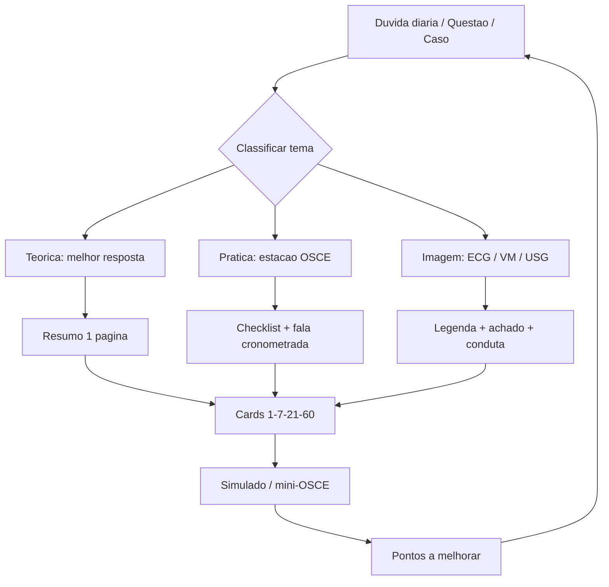

# Fluxo Temático de Interconexão - TEMI 2027

## Links-mãe
- [[TEMI_2027_MOC]]
- [[01_Temas/Sepse]]
- [[01_Temas/Ventilacao_Mecanica]]
- [[01_Temas/Choque_Hemodinamica]]
- [[01_Temas/USG_Beira_Leito]]
- [[01_Temas/Paliativos_Etica]]
- [[02_Fontes/AMIB_PROCOMI_CNRM]]
- [[02_Fontes/PubMed_NEJM_Update]]
- [[05_Revisoes/Revisao_1_7_21_60]]
