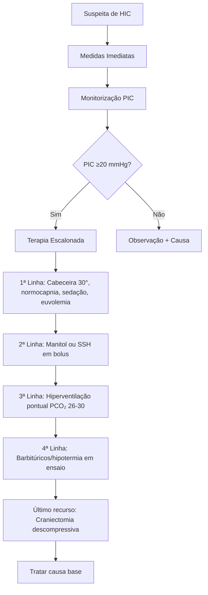

#QWEN 
# 🧠 Hipertensão Intracraniana em Adultos
## Resumo UpToDate – Foco: UTI, TEMI e Prática Clínica

---

## 1️⃣ Identificação do Tema e Relevância para UTI

| Item | Descrição |
|------|-----------|
| **Tema** | Avaliação e tratamento da hipertensão intracraniana (HIC) em adultos |
| **Relevância na UTI** | Emergência neurológica com alto risco de herniação, isquemia cerebral e morte; manejo adequado reduz mortalidade e sequelas |
| **População-alvo** | Pacientes com TCE, AVC, tumores, hidrocefalia, encefalopatia hepática, trombose venosa cerebral |
| **Objetivo do manejo** | Manter PIC <20 mmHg e PPC >60 mmHg, preservar oxigenação cerebral e tratar a causa base |

---

## 2️⃣ Resumo Estruturado

```
🔹 Fisiologia: Doutrina de Monro-Kellie → crânio rígido + 3 componentes (parênquima 80%, LCR 10%, sangue 10%)
🔹 Fisiopatologia: Perda de complacência → pequenos aumentos de volume = grandes elevações de PIC
🔹 Clínica: Cefaleia, vômitos, rebaixamento do nível de consciência, tríade de Cushing, papiledema
🔹 Diagnóstico: Clínico + neuroimagem + MONITORIZAÇÃO INVASIVA (padrão-ouro)
🔹 Tratamento: Medidas gerais + terapia osmótica + hiperventilação pontual + tratamento da causa
```

---

## 3️⃣ Definição, Fisiopatologia, Quadro Clínico, Diagnóstico e Tratamento

### 📌 Definição
- **PIC normal**: ≤15 mmHg em adultos
- **HIC patológica**: ≥20 mmHg sustentada por >5-10 minutos

### 🔬 Fisiopatologia (Doutrina de Monro-Kellie)
```
Volume intracraniano fixo (1400-1700 mL) = Parênquima (80%) + LCR (10%) + Sangue (10%)

↑ Volume de um componente → deslocamento de outros OU ↑ PIC

Mecanismos compensatórios iniciais:
• Deslocamento de LCR para saco dural
• Vasoconstrição venosa cerebral
• ↓ Produção de LCR

Quando esgotados → curva de complacência exponencial → HIC grave
```

### 🩺 Quadro Clínico

| Sintomas Gerais | Sinais de Alerta | Síndromes de Herniação |
|----------------|----------------|------------------------|
| Cefaleia intensa | Papiledema | Subfalcina |
| Vômitos em jato | Paralisia do VI NC | Uncal (pupila dilatada ipsilateral) |
| Rebaixamento do nível de consciência | Tríade de Cushing* | Transtentorial central |
| Visão turva/diplopia | Postura de descerebração/decorticação | Tonsilar (risco de morte) |

> *Tríade de Cushing: **Hipertensão + Bradicardia + Depressão respiratória** → sinal de compressão do tronco encefálico → **emergência absoluta**

### 🧪 Diagnóstico
```
✅ Clínico: História + exame neurológico seriado (ECG, pupilas, sinais focais)
✅ Imagem: TC de crânio (lesões expansivas, desvio de linha média, cisternas apagadas)
✅ Padrão-ouro: Monitorização invasiva da PIC
✅ Complementar: Doppler transcraniano, ultrassom de bainha do nervo óptico (pesquisa)
```

### 💊 Tratamento (Escalonado)



---

## 4️⃣ Pontos Mais Importantes para Prática Clínica

✅ **PIC alvo**: <20 mmHg; **PPC alvo**: 60-70 mmHg  
✅ **Monitorização invasiva indicada**: ECG ≤8 + suspeita de HIC + necessidade de terapia intensiva  
✅ **Manitol**: 1 g/kg em bolus; monitorar osmolalidade (<320 mOsm) e função renal  
✅ **SSH**: Alternativa ao manitol; bolus de 23,4% para emergência  
✅ **Hiperventilação**: Apenas para emergência aguda; evitar em TCE/AVC nas primeiras 24-48h  
✅ **Posicionamento**: Cabeceira 30°, pescoço neutro, evitar compressão jugular  
✅ **Sedação**: Propofol preferencial (meia-vida curta, permite avaliação neurológica)  
✅ **Glicocorticoides**: ❌ Não usar em TCE/AVC/hemorragia; ✅ Usar em tumores/abscessos  

---

## 5️⃣ Pontos Mais Cobrados em Prova TEMI

| Tema | Pergunta Típica | Resposta-Chave |
|------|----------------|----------------|
| **Valores de PIC/PPC** | Qual o limite de PIC para intervenção? | ≥20 mmHg por >5-10 min |
| **Tríade de Cushing** | O que caracteriza e qual sua importância? | HTA + bradicardia + depressão respiratória → herniação iminente |
| **Manitol vs SSH** | Qual a principal vantagem da SSH? | Menor risco de lesão renal; efeito mais previsível em hipotensão |
| **Hiperventilação** | Quando é indicada? | Apenas em emergência com sinais de herniação; evitar profilaxia |
| **Glicocorticoides** | Em qual situação são indicados? | Edema vasogênico por tumor ou abscesso; contraindicados em TCE/AVC |
| **Monitorização** | Qual o padrão-ouro para medir PIC? | Cateter intraventricular (permite drenagem terapêutica) |
| **Craniectomia** | Qual o benefício fisiológico? | Remove restrição de volume → ↓ PIC em ~70% se dura também aberta |

---

## 6️⃣ Pegadinhas e Erros Comuns

❌ **"PIC normal na TC = sem HIC"** → FALSO: Até 1/3 dos pacientes com TC inicial normal desenvolvem HIC depois  
❌ **"Hiperventilação profilática protege o cérebro"** → FALSO: Pode causar isquemia por vasoconstrição excessiva  
❌ **"Baixar a PA baixa a PIC"** → FALSO: Hipotensão → ↓ PPC → vasodilatação reativa → ↑ PIC  
❌ **"Manitol pode ser usado sem controle"** → FALSO: Risco de NTA, hipernatremia, efeito rebote  
❌ **"Glicocorticoide ajuda em todo edema cerebral"** → FALSO: Piora desfecho em TCE; só usar em edema vasogênico tumoral  
❌ **"Drenagem lombar em HIC"** → CONTRAINDICADO: Risco de herniação transtentorial  

---

## 7️⃣ Dúvidas Frequentes (Pergunta-Resposta)

**P: Quando indicar monitorização invasiva da PIC?**  
R: Pacientes em coma (ECG ≤8), com causa tratável em UTI e suspeita de HIC. Evitar em coagulopatia grave sem correção prévia.

**P: Manitol ou solução salina hipertônica?**  
R: Ambas são válidas. SSH tende a ter efeito mais previsível e menor risco renal. Escolha institucional. Monitorar sódio e osmolalidade com ambas.

**P: Posso usar hiperventilação crônica?**  
R: Não. Efeito dura 1-24h. Uso prolongado causa isquemia cerebral. Reservar para emergência com sinais de herniação.

**P: Qual a PPC mínima aceitável?**  
R: >60 mmHg. Em hipertensos crônicos, pode ser necessário manter PPC mais alta devido ao deslocamento da curva de autorregulação.

**P: Quando pensar em craniectomia descompressiva?**  
R: HIC refratária a terapia médica máxima, especialmente em infarto maligno, TCE grave ou HSA com edema progressivo.

---

## 8️⃣ Orientações Gerais para Abordagem Beira-Leito

```
🚨 CHEGADA DO PACIENTE COM SUSPEITA DE HIC:

1️⃣ ABCDE do trauma/neuro:
   • Via aérea com proteção cervical
   • Oxigenação (SpO₂ >94%)
   • Pressão arterial: evitar hipotensão (PAS >90 mmHg)
   • Exame neurológico rápido: ECG, pupilas, sinais focais

2️⃣ Medidas imediatas para ↓ PIC:
   • Cabeceira 30° + pescoço neutro
   • Sedação adequada (propofol/fentanil)
   • Normocapnia (PCO₂ 35-40 mmHg) – hiperventilar só se emergência
   • Manitol 1 g/kg ou SSH 23,4% 30 mL se sinais de herniação

3️⃣ Neuroimagem urgente:
   • TC de crânio sem contraste
   • Avaliar: lesão expansiva, desvio de linha média, cisternas, hidrocefalia

4️⃣ Decisão sobre monitorização:
   • ECG ≤8 + causa tratável → considerar ventriculostomia
   • Coagulopatia? Corrigir antes ou usar monitor epidural

5️⃣ Tratamento da causa:
   • Hematoma → neurocirurgia
   • Hidrocefalia → DVE
   • Tumor → corticoide + neurocirurgia/oncologia
   • Infecção → antibiótico/antifúngico + controle de PIC

6️⃣ Monitoramento contínuo:
   • PIC, PPC, PAM, diurese, eletrólitos, osmolalidade
   • Reavaliação neurológica a cada 1-2h
```

---

## 9️⃣ Atualizações em Destaque (2024-2026)

🔹 **SSH ganhando espaço**: Meta-análises sugerem superioridade sobre manitol no controle agudo da PIC, mas sem diferença clara em desfechos clínicos  
🔹 **BEST TRIP trial**: Em recursos limitados, manejo clínico+imagem sem monitorização de PIC teve desfechos similares ao guiado por PIC – **não generalizável para centros especializados**  
🔹 **Craniectomia descompressiva**: Evidência observacional favorável em seleção cuidadosa; abrir a dura é crucial para efeito (↓70% PIC vs 15% só osso)  
🔹 **Hipotermia terapêutica**: ❌ Não recomendada como padrão; restringir a ensaios clínicos ou HIC refratária  

---

## 🔎 Informação Extra (Fora do Artigo)

🔎 **Mnemônico para causas de HIC**: **"TUMORES + H"**  
- **T**rauma / **U**so de anticoagulantes / **M**alformações vasculares / **O**bstrução de LCR / **R**uptura de aneurisma / **E**ncefalite / **S**angramento tumoral + **H**idrocefalia / **H**ipertensão intracraniana idiopática  

🔎 **Cálculo rápido de PPC**:  
`PPC = PAM - PIC`  
*Exemplo: PAM 90 mmHg - PIC 25 mmHg = PPC 65 mmHg (adequado)*  

🔎 **Osmolalidade efetiva**:  
`2 × Na + Glicose/18 + Ureia/6`  
*Manitol contribui para osmolalidade medida, mas não para a efetiva → risco de "gap osmolar"*  

🔎 **Sinal de "pupila que não volta"**: Dilatação pupilar unilateral fixa = herniação uncal até prova em contrário → agir antes da TC se clínica compatível  

---

## 💡 Curiosidades para Memorização

| Conceito | Mnemônico/Dica |
|----------|---------------|
| **Tríade de Cushing** | **"CUSHING = Cérebro Under Severe Hypertension Is Going"** → HTA + Bradicardia + Respiração irregular |
| **Monro-Kellie** | **"Crânio é caixa fechada: se entra 100 mL de sangue, tem que sair 100 mL de LCR ou ↑ pressão"** |
| **Manitol** | **"MANITOL = MAnter NIvel de TOnicidade no Líquido"** → puxa água do cérebro para o sangue |
| **Hiperventilação** | **"HIPER = HIper Perigosa se Enrolar"** → só usar em emergência, nunca profilaticamente |
| **PIC normal** | **"PIC ≤15 é Legal; ≥20 é Problema"** |

---

## 📊 Tabelas Comparativas

### Manitol vs Solução Salina Hipertônica

| Característica | Manitol | SSH (23,4%) |
|---------------|---------|-------------|
| **Dose inicial** | 1 g/kg IV | 30 mL IV (bolus) |
| **Início de ação** | 5-15 min | 5-10 min |
| **Duração** | 4-6 h | 2-4 h |
| **Monitoramento** | Osmolalidade, Na⁺, creatinina | Na⁺, osmolalidade, volume |
| **Risco renal** | ⚠️ Alto (NTA) | ✅ Baixo |
| **Efeito rebote** | ⚠️ Possível (BHE lesada) | ✅ Menor |
| **Hipotensão** | ⚠️ Pode ocorrer | ✅ Raro |
| **Indicação preferencial** | Pacientes euvolêmicos, sem IRA | Hipotensos, IRA, necessidade de efeito rápido |

### Tipos de Monitores de PIC

| Tipo | Vantagens | Desvantagens | Infecção | Hemorragia |
|------|-----------|--------------|----------|------------|
| **Intraventricular** | Padrão-ouro, drena LCR, preciso | Infecção (até 20%), difícil em ventrículo pequeno | Alta | ~2% |
| **Intraparenquimatoso** | Fácil colocação, baixa infecção | Não drena LCR, deriva do sensor, custo | Baixa (<1%) | <1% |
| **Subaracnoide** | Baixo risco | Entope, impreciso, pouco usado | Baixa | Baixa |
| **Epidural** | Seguro em coagulopatia | Menos preciso, amortece pressão | Muito baixa | 4% |

---

## 🗂️ Fluxograma Prático: Abordagem da HIC na UTI

```
[Paciente com suspeita de HIC]
          │
          ▼
[ABCDE + Exame Neurológico Rápido]
          │
          ▼
[TC Crânio Urgente + Laboratório]
          │
          ▼
{Sinais de herniação ou ECG ≤8?}
   │              │
   SIM            NÃO
   │              │
   ▼              ▼
[Medidas Emergenciais]  [Observação + Causa]
• Cabeceira 30°        • Tratar causa base
• Sedação              • Monitorar ECG seriado
• Manitol/SSH bolus    • Considerar TC de controle
• Hiperventilação*     • Avaliar risco de HIC tardia
   │
   ▼
[Indicar Monitorização PIC?]
• ECG ≤8 + causa tratável + UTI → SIM
• Coagulopatia? Corrigir ou usar epidural
   │
   ▼
[Alvo: PIC <20 mmHg | PPC 60-70 mmHg]
   │
   ▼
[Terapia Escalonada se PIC ≥20 mmHg]
1. Otimizar sedação, posição, normocapnia
2. Manitol 1 g/kg OU SSH 23,4% 30 mL
3. Hiperventilação pontual (PCO₂ 26-30)
4. Barbitúricos/hipotermia* (último recurso)
5. Craniectomia descompressiva (se refratária)
   │
   ▼
[Reavaliar a cada 1-2h + Tratar causa base]
```
*Hiperventilação e hipotermia: evitar uso prolongado

---

## ✅ Checklist para Plantão/Round

### 🟢 Admissão / Primeira Avaliação
- [ ] ECG registrado e documentado
- [ ] Pupilas avaliadas (tamanho, simetria, reação à luz)
- [ ] Sinais vitais: PAM calculada, SpO₂, FR
- [ ] TC de crânio realizada e revisada
- [ ] Causa provável de HIC identificada?
- [ ] Indicação de monitorização de PIC avaliada?

### 🔵 Monitoramento Contínuo (a cada 1-2h)
- [ ] PIC registrada (média e ondas A?)
- [ ] PPC calculada e dentro da meta (60-70 mmHg)
- [ ] Sedação adequada (RASS -2 a 0?)
- [ ] Posicionamento: cabeceira 30°, pescoço neutro
- [ ] Normocapnia confirmada (gasometria se ventilado)
- [ ] Diurese e eletrólitos monitorados (especialmente Na⁺)

### 🟡 Intervenção se PIC ≥20 mmHg por >5-10 min
- [ ] Verificar assincronia ventilatória / dor / agitação
- [ ] Otimizar sedação/analgesia
- [ ] Confirmar posicionamento e drenagem venosa
- [ ] Considerar manitol 0,25-0,5 g/kg ou SSH bolus
- [ ] Reavaliar em 30-60 min

### 🔴 Emergência (sinais de herniação)
- [ ] Manitol 1 g/kg OU SSH 23,4% 30 mL IMEDIATO
- [ ] Hiperventilar para PCO₂ 26-30 mmHg (temporário)
- [ ] Acionar neurocirurgia
- [ ] Preparar para DVE ou craniectomia se indicado

---

## 🗂️ Cards de Memorização (Estilo Anki)

**Frente**: Qual o valor de PIC que define hipertensão intracraniana patológica em adultos?  
**Verso**: ≥20 mmHg sustentada por >5-10 minutos  

---

**Frente**: Cite os 3 componentes do volume intracraniano pela doutrina de Monro-Kellie e suas proporções.  
**Verso**: Parênquima cerebral (80%), LCR (10%), Sangue (10%)  

---

**Frente**: Qual a tríade de Cushing e qual seu significado clínico?  
**Verso**: Hipertensão + Bradicardia + Depressão respiratória → sinal de compressão do tronco encefálico → emergência neurológica  

---

**Frente**: Por que a hiperventilação profilática é contraindicada em TCE/AVC agudo?  
**Verso**: Causa vasoconstrição cerebral → pode reduzir fluxo sanguíneo em áreas já isquêmicas → piora lesão neurológica  

---

**Frente**: Qual a principal vantagem do cateter intraventricular sobre os outros monitores de PIC?  
**Verso**: Permite drenagem terapêutica de LCR para redução imediata da pressão  

---

**Frente**: Quando os glicocorticoides são indicados no manejo da HIC?  
**Verso**: Apenas em edema vasogênico por tumores cerebrais ou abscessos; contraindicados em TCE, AVC isquêmico e hemorragia intracraniana  

---

**Frente**: Qual a fórmula da pressão de perfusão cerebral (PPC)?  
**Verso**: PPC = Pressão Arterial Média (PAM) – Pressão Intracraniana (PIC)  

---

**Frente**: Qual o alvo terapêutico de PPC em pacientes com HIC?  
**Verso**: Manter PPC >60 mmHg (ideal 60-70 mmHg); em hipertensos crônicos, pode ser necessário valor mais alto  

---

## 📝 Questões Estilo TEMI com Gabarito Comentado

### Questão 1
**Enunciado**: Paciente de 45 anos, vítima de TCE grave, ECG 7, intubado, em UTI. TC mostra contusões múltiplas sem desvio de linha média. PIC monitorada: 24 mmHg sustentada. PPC: 58 mmHg. Qual a próxima medida MAIS adequada?  
A) Hiperventilação para PCO₂ 25 mmHg  
B) Manitol 1 g/kg em bolus  
C) Aumentar vasopressor para PPC >70 mmHg  
D) Craniectomia descompressiva imediata  

**Gabarito**: **B**  
**Comentário**: PIC ≥20 mmHg requer intervenção. Primeira linha: medidas de posicionamento/sedação já otimizadas → terapia osmótica (manitol ou SSH). Hiperventilação (A) é reserva para emergência com sinais de herniação. Aumentar PPC (C) sem controlar PIC pode piorar edema. Craniectomia (D) é último recurso após falha de terapia médica máxima.

---

### Questão 2
**Enunciado**: Sobre o uso de glicocorticoides na hipertensão intracraniana, é CORRETO afirmar:  
A) São indicados em todos os casos de edema cerebral citotóxico  
B) Reduzem mortalidade em TCE grave quando usados precocemente  
C) São úteis no edema vasogênico associado a tumores cerebrais  
D) Devem ser associados ao manitol para potencializar o efeito osmótico  

**Gabarito**: **C**  
**Comentário**: Glicocorticoides reduzem edema vasogênico (ruptura da BHE) em tumores e abscessos. Em TCE, o estudo CRASH mostrou ↑ mortalidade com seu uso. Não atuam em edema citotóxico (AVC isquêmico, hipóxia) e não potencializam manitol.

---

### Questão 3
**Enunciado**: Paciente com HIC monitorada apresenta ondas A no traçado de PIC. Isso significa:  
A) Variação fisiológica relacionada à respiração  
B) Perda de complacência intracraniana e risco iminente de descompensação  
C) Efeito rebote do manitol  
D) Calibração inadequada do transdutor  

**Gabarito**: **B**  
**Comentário**: Ondas A (platô) são elevações abruptas de 50-100 mmHg que duram minutos → indicam exaustão dos mecanismos compensatórios e risco de herniação → exigem intervenção urgente.

---

## 📚 Sugestões de Estudo Aprofundado

1. **Diretrizes Brain Trauma Foundation** (TCE grave) – foco em metas de PIC/PPC  
2. **Capítulo de Neurointensivismo do "Principles of Critical Care" (Hall & Schmidt)**  
3. **Artigo: "Hypertonic saline versus mannitol for traumatic brain injury" (Cochrane Review)**  
4. **UpToDate tópicos relacionados**:  
   - "Manejo do TCE moderado e grave em adultos"  
   - "Infarto cerebral maligno com edema"  
   - "Hemorragia subaracnoide: complicações precoces"  
5. **Simulados TEMI anteriores** – buscar questões de neurointensivismo  

---

## 💡 Sugestões de Produtos a Partir do Tema

🔹 **Protocolo Obsidian**: Template para HIC com campos para PIC/PPC, intervenções escalonadas, checklist de emergência  
🔹 **Flashcards Anki deck**: Pacote "NeuroUTI – HIC" com 30 cards de alta yield para TEMI  
🔹 **Fluxograma imprimível**: Abordagem de HIC em A4 plastificado para beira-leito  
🔹 **Calculadora PPC/PIC**: Planilha Excel/Google Sheets com alertas para metas  
🔹 **Mini-curso online**: "HIC na Prática: Do Plantão à Prova" (30 min, foco em decisão clínica)  
🔹 **Poster educativo**: "Tríade de Cushing e Sinais de Herniação" para sala de UTI  

---

## 🎯 Desfecho Objetivo do Artigo

> A hipertensão intracraniana é uma emergência neurológica que exige reconhecimento imediato, monitorização criteriosa e terapia escalonada. O manejo bem-sucedido depende de:  
> 1️⃣ Manter **PIC <20 mmHg** e **PPC >60 mmHg**;  
> 2️⃣ Usar **monitorização invasiva** em pacientes de alto risco (ECG ≤8);  
> 3️⃣ Aplicar terapia osmótica (manitol ou SSH) como primeira linha farmacológica;  
> 4️⃣ Reservar hiperventilação, barbitúricos e craniectomia para situações refratárias;  
> 5️⃣ **Sempre tratar a causa base** – o controle da PIC é paliativo sem isso.  
>  
> A individualização, reavaliação frequente e trabalho multidisciplinar (intensivista + neurocirurgião) são pilares para melhorar desfechos.

---

> 📌 **Dica Obsidian**: Crie um note "HIC – Protocolo UTI" com propriedades YAML: `tags: [neuro, emergencia, temi]`, `alvo-pic: "<20"`, `alvo-ppc: ">60"`. Use dataview para listar pacientes com PIC monitorada no seu dashboard de plantão.

*Resumo baseado no UpToDate "Evaluation and management of elevated intracranial pressure in adults" (atualizado nov/2024). Sempre confirme condutas com protocolos institucionais.* 🧠⚡