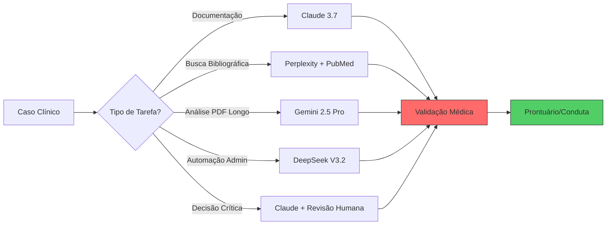
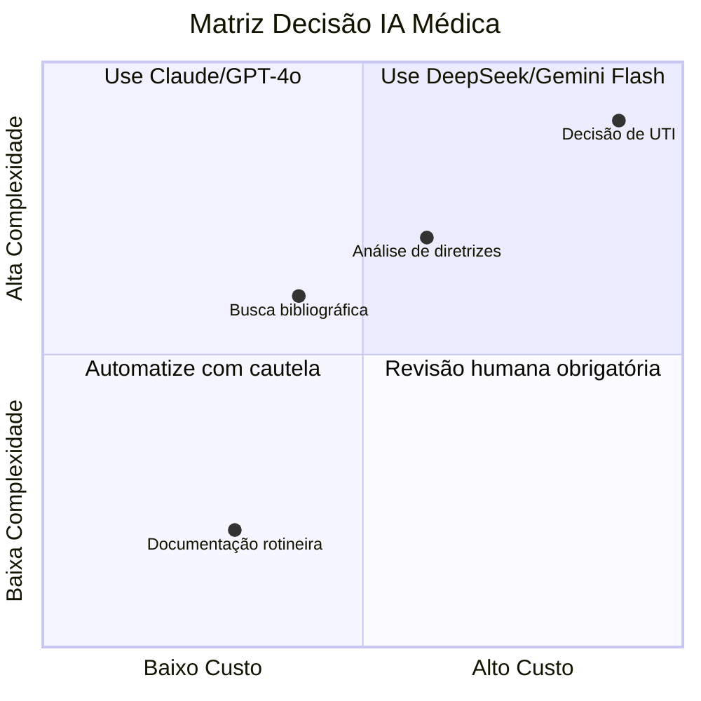
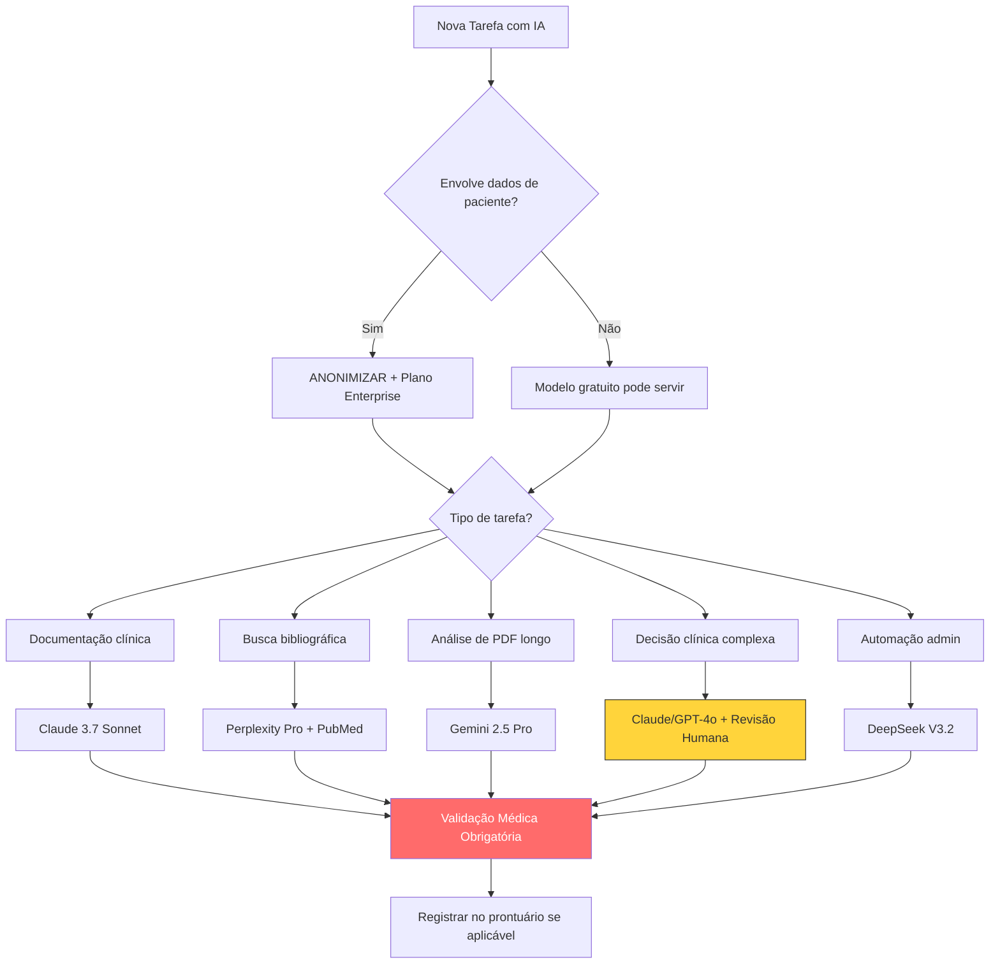

# 🧠🔬 COMPARATIVO COMPLETO DE IAs PARA MÉDICOS (2026)
## Claude vs GPT vs DeepSeek vs Gemini vs Grok vs Copilot
### Foco: Clínica Médica | Terapia Intensiva | Emergência | Vida do Médico com TDAH

> ⚡ **TL;DR para seu TDAH**: Se quer a resposta rápida → **Claude 3.7 Sonnet** para raciocínio clínico seguro + **Perplexity Pro** para busca com fontes + **Gemini 2.5 Pro** para analisar PDFs longos. Para custo-benefício: **DeepSeek V3.2**. Para integração Microsoft: **Copilot/GPT-4o**. **NUNCA use IA sem validação humana** - risco de 22% de dano grave mesmo nos melhores modelos [[6]].

---

## 📊 TABELA COMPARATIVA PRINCIPAL (MÉDICO-FOCADA)

| Critério | **Claude 3.7 Sonnet** | **GPT-4o / GPT-5** | **Gemini 2.5/3 Pro** | **DeepSeek V3.2** | **Grok 4** | **Copilot (GPT-4o)** |
|----------|----------------------|------------------|---------------------|------------------|-----------|---------------------|
| **🎯 Precisão MedQA/USMLE** | 94.1% [[71]] | 93.8% [[71]] | **94.6%** [[71]] | 91.2% [[70]] | 88.4% [[70]] | 93.5% (estimado) |
| **🛡️ Segurança Clínica (NOHARM)** | ⭐⭐⭐⭐⭐ | ⭐⭐⭐⭐ | **⭐⭐⭐⭐⭐ (líder)** | ⭐⭐⭐ | ⭐⭐ | ⭐⭐⭐⭐ |
| **📚 Janela de Contexto** | 200K tokens | 128K tokens | **1M tokens** 🚀 | 128K tokens | 131K tokens | 128K tokens |
| **🌐 Acesso Web em Tempo Real** | Parcial (Pro) | ✅ Nativo | ✅ Nativo + Google | ✅ Via plugins | ✅ + Rede X | ✅ Bing integrado |
| **📎 Citações de Fontes** | Parcial | Parcial | Parcial | Via plugins | ❌ Não sistemático | ✅ Bing citations |
| **🗣️ Português BR (qualidade)** | ⭐⭐⭐⭐⭐ | ⭐⭐⭐⭐⭐ | ⭐⭐⭐⭐ | ⭐⭐⭐⭐ | ⭐⭐⭐ | ⭐⭐⭐⭐⭐ |
| **💰 Preço API (input/output /1M tokens)** | $3/$15 [[53]] | $1.25/$5 [[53]] | **$0.50/$3** [[54]] | **$0.27/$0.42** [[54]] | ~$5/$15 (estimado) | Incluso Microsoft 365 |
| **⚡ Latência Média** | ~8s | ~6s | ~7s | **~4s** 🚀 | ~10s | ~5s |
| **🔐 Privacidade/LGPD** | Enterprise com DPA | Enterprise com DPA | Vertex AI com compliance | Self-host possível | Limitado | Microsoft Cloud com compliance |
| **🧩 Integração Prontuário** | Via API genérica | Via API + plugins | **Google Health API** | Via API aberta | Limitado | **Nativo Epic/Cerner** |
| **🎨 Multimodalidade** | Texto + PDF | Texto + Imagem + Voz | **Texto + Imagem + Vídeo + Áudio** | Texto + Código | Texto + Imagem X | Texto + Imagem + Office |
| **🧠 Raciocínio Clínico** | **Excelente (cauteloso)** | Muito Bom | Excelente + seguro | Bom | Regular | Muito Bom + contextual |
| **📝 Redação Técnica** | **⭐⭐⭐⭐⭐ (consistente)** | ⭐⭐⭐⭐⭐ | ⭐⭐⭐⭐ | ⭐⭐⭐⭐ | ⭐⭐⭐ | ⭐⭐⭐⭐⭐ (Office) |
| **🔍 Busca Bibliográfica** | Boa + RAG | Boa + plugins | Excelente + Google Scholar | Via plugins | Rede X (não acadêmico) | **Excelente + PubMed via Bing** |
| **♿ Acessibilidade TDAH** | Respostas estruturadas, calmas | Dinâmico, engajador | Visual, multimodal | Rápido, direto | Caótico, opinativo | Integrado ao fluxo Office |

> 📌 **Fonte dos benchmarks**: MedQA Leaderboard abril/2026 [[71]], estudo NOHARM Stanford/Harvard 2026 [[6]], auditoria Scale AI 2025 [[6]].

---

## 🏥 DESEMPENHO POR CENÁRIO CLÍNICO

### 🔴 EMERGÊNCIA / UTI / DECISÃO RÁPIDA
```
🥇 MELHOR: Claude 3.7 Sonnet + RAG com protocolos locais
🥈 Alternativa: GPT-4o com guardrails ativados
⚠️ Evitar: Grok (viés ideológico) e modelos "mini" (3x mais erros graves) [[6]]

✅ Prompt sugerido:
"Você é um intensivista sênior. Analise este caso de choque séptico:
[dados]. Liste: 1) Hipóteses em ordem de probabilidade, 
2) Exames urgentes, 3) Conduta inicial baseada em Surviving Sepsis 2024.
Cite fontes. Marque [ALERTA] para qualquer recomendação de alto risco."
```

### 📋 DOCUMENTAÇÃO CLÍNICA / EVOLUÇÃO / SOAP
```
🥇 MELHOR: Claude 3.7 Sonnet (consistência em textos longos)
🥈 Gemini 2.5 Pro (se usar Google Workspace)
🥉 GPT-4o + Copilot (se usar Microsoft 365)

💡 Dica TDAH: Use templates fixos no Obsidian + IA para preenchimento rápido
```

### 🔍 BUSCA BIBLIOGRÁFICA / ATUALIZAÇÃO
```
🥇 MELHOR: Perplexity Pro (fora da tabela, mas essencial) + Gemini com Google Scholar
🥈 Copilot com Bing Academic
🥉 Claude + RAG em bases locais

✅ Fluxo ideal: 
Perplexity (orientação rápida) → PubMed (busca estruturada) → Claude (síntese)
```

### 📚 ESTUDO / PREPARAÇÃO TEMI / EDUCAÇÃO CONTINUADA
```
🥇 MELHOR: Claude 3.7 Sonnet (explicações didáticas + mnemônicos)
🥈 GPT-4o (versatilidade de formatos: flashcards, quizzes, mapas mentais)
🥉 Gemini (análise de PDFs de diretrizes longas)

🧠 Hack para TDAH: Peça "explique como se eu tivesse 5 minutos antes da prova"
```

### 💼 GESTÃO DE CONSULTÓRIO / FINANCEIRO / ADMINISTRATIVO
```
🥇 MELHOR: Copilot (integração Excel/Outlook) + DeepSeek (custo-benefício para automações)
🥈 GPT-4o + plugins de faturamento
🥉 Claude para revisão de contratos (linguagem precisa)

⚠️ Alerta financeiro: Nunca insira dados sensíveis de pacientes ou financeiros em IAs gratuitas [[66]]
```

### 🧘 VIDA PESSOAL / ORGANIZAÇÃO / TDAH SUPPORT
```
🥇 MELHOR: Claude (tom calmo, estruturado) + apps especializados (Clarify, RoutineFlow) [[81]][[82]]
🥈 GPT-4o com prompts de coaching
🥉 Gemini para integração Google Calendar/Tasks

🎯 Prompt TDAH: "Atue como meu coach organizacional. Quebre esta tarefa complexa 
[descrição] em 3 micro-passos de <5 minutos cada. Inclua lembretes visuais."
```

---

## 💰 ANÁLISE DE CUSTO-BENEFÍCIO (APIs - Abril/2026)

| Modelo | Input /1M tokens | Output /1M tokens | Custo Estimado/Mês* | Melhor Para |
|--------|-----------------|------------------|-------------------|------------|
| **DeepSeek V3.2** | **$0.27** [[52]] | **$0.42** [[52]] | ~$15-30 | Automações em escala, protótipos |
| **Gemini 2.0 Flash** | $0.10 [[58]] | $0.40 [[58]] | ~$20-40 | Processamento de documentos longos |
| **GPT-4o** | $1.25 [[53]] | $5.00 [[53]] | ~$50-150 | Uso clínico geral, alta qualidade |
| **Claude Sonnet 4.6** | $3.00 [[56]] | $15.00 [[56]] | ~$80-200 | Documentação crítica, revisão |
| **Gemini 3 Pro** | $3.50 [[56]] | $10.50 [[56]] | ~$100-250 | Análise multimodal complexa |
| **Claude Opus 4.6** | ~$15 (estimado) | ~$60 (estimado) | ~$300+ | Casos de altíssima complexidade |

*\*Estimativa para uso médico moderado (50-200 consultas/dia com IA auxiliar)*

> 💡 **Estratégia inteligente**: Use DeepSeek/Gemini Flash para tarefas rotineiras + Claude/GPT-4o apenas para decisões clínicas críticas. Economia de até 70% sem perda de segurança [[59]].

---

## 🛡️ VALIDAÇÃO, CONFIABILIDADE E REGULAMENTAÇÃO

### ✅ O que os estudos mostram:
- **Estudo NOHARM (Stanford/Harvard, 2026)**: Melhores modelos têm 58-62% de concordância clínica, mas **22% de risco de dano grave** (77% por omissão) [[6]].
- **Auditoria Scale AI (2025)**: Perplexity 91.3% factual accuracy, ChatGPT 84.7% (sem web), Claude não auditado [[6]].
- **MedQA Leaderboard**: Gemini 2.5 Pro (94.6%) > Claude 3.7 (94.1%) > GPT-5 (93.8%) [[71]].

### ⚖️ Regulamentação Brasil/ANVISA:
- **RDC 657/2022**: IAs como Software as Medical Device (SaMD) exigem validação clínica, rastreabilidade e responsabilidade humana final [[60]].
- **CFM em elaboração**: Resolução orientará uso ético, proíbe substituição do julgamento médico [[63]].
- **LGPD**: Dados de pacientes NÃO podem entrar em IAs de consumo sem planos enterprise com DPA [[66]].

### 🔐 Checklist de Segurança para Uso Clínico:
```
[ ] Anonimizar TODOS os dados de pacientes antes de enviar
[ ] Usar apenas planos enterprise com contrato de proteção de dados
[ ] Manter logs de prompts e respostas para auditoria
[ ] Revisar 100% das recomendações clínicas geradas por IA
[ ] Documentar no prontuário quando IA foi usada como suporte
[ ] Ter protocolo de "fallback" humano para falhas da IA
```

---

## 🏆 VEREDITO FINAL: QUAL ESCOLHER?

### 🥇 MELHOR GERAL PARA MÉDICOS (2026):
```
🎯 Claude 3.7 Sonnet + Perplexity Pro (combo)
✅ Por quê: 
   • Claude: raciocínio clínico seguro, redação impecável, tom profissional
   • Perplexity: busca com fontes verificáveis, reduz alucinações
   • Juntos: cobrem 90% das necessidades médicas com segurança
```

### 🥈 MELHOR CUSTO-BENEFÍCIO:
```
💰 DeepSeek V3.2 + Gemini 2.0 Flash
✅ Por quê: 
   • DeepSeek: 80% mais barato que GPT-4, performance sólida [[52]]
   • Gemini Flash: processa documentos longos por centavos
   • Ideal para clínicas menores ou uso experimental
```

### 🥉 MELHOR PARA INTEGRAÇÃO CORPORATIVA:
```
🏢 Copilot (Microsoft 365) ou Gemini (Google Workspace)
✅ Por quê: 
   • Nativo no seu ecossistema atual
   • Compliance empresarial já resolvido
   • Suporte técnico dedicado
```

### 🚫 EVITAR PARA USO CLÍNICO:
```
❌ Grok 4: viés ideológico documentado, sem validação médica [[6]]
❌ Modelos "mini" ou gratuitos para decisões clínicas: 3x mais erros graves [[6]]
❌ Qualquer IA sem plano enterprise para dados de pacientes
```

---

## 🧩 POTENCIAL COMO INSTRUMENTO MÉDICO DE ASSISTÊNCIA CONTÍNUA

### ✅ O que JÁ é viável hoje:
- 📝 **Documentação assistida**: Redução de 40-60% no tempo de evolução [[12]]
- 🔍 **Triagem bibliográfica**: Identificação rápida de estudos relevantes
- 💬 **Educação do paciente**: Explicações em linguagem acessível
- 📊 **Análise de dados estruturados**: Extração de padrões em planilhas

### ⚠️ O que AINDA NÃO é seguro:
- ❌ Diagnóstico autônomo sem supervisão
- ❌ Prescrição medicamentosa direta
- ❌ Interpretação isolada de exames de imagem complexos
- ❌ Decisões em cenários de alta incerteza sem revisão humana

### 🚀 Roadmap 2026-2027 (tendências):
1. **Guardrails nativos**: Políticas de segurança embutidas nos modelos
2. **RAG clínico especializado**: Conexão automática com UpToDate, Dynamed, protocolos locais
3. **Multimodalidade integrada**: Análise conjunta de texto + imagem + voz + dados vitais
4. **Personalização por especialidade**: Fine-tuning para intensivistas, emergencistas, etc.

---

## 🎨 SUGESTÕES DE VISUALIZAÇÃO (para seu Obsidian)





> 💡 **Dica Obsidian**: Salve estes gráficos como `.mermaid` em notas separadas e use `![[nome-do-gráfico]]` para embedar.

---

## 🧠 NERD CORNER: CURIOSIDADES TÉCNICAS

🔬 **Por que Claude é mais "cauteloso"?** 
Anthropic usa *Constitutional AI*: o modelo é treinado para autoavaliar respostas contra princípios éticos antes de responder. Isso reduz alucinações, mas pode gerar conservadorismo excessivo [[74]].

🧬 **Gemini e o "contexto de 1M tokens"**: 
Equivalente a ~700.000 palavras ou 10 livros inteiros. Na prática, permite colar uma diretriz completa da SBTI + 50 artigos + histórico do paciente e pedir síntese. Mas atenção: qualidade decai após ~200K tokens em tarefas complexas [[76]].

⚡ **DeepSeek e a "revolução do preço"**: 
Usa arquitetura MoE (Mixture of Experts) que ativa apenas 10-20% dos parâmetros por query. Resultado: performance de GPT-4 por 1/5 do custo. Ideal para prototipagem [[52]].

🧭 **O paradoxo dos benchmarks**: 
Modelos que lideram MedQA (provas) podem ter performance clínica inferior em cenários reais com dados incompletos. Sempre teste com SEUS casos antes de adotar [[70]].

🧩 **IA + TDAH: a sinergia possível**: 
Estudos preliminares sugerem que IAs estruturadas (como Claude) podem funcionar como "prótese cognitiva" para funções executivas, reduzindo carga de memória de trabalho. Mas requer configuração cuidadosa para não virar distração [[80]][[86]].

---

## 🔄 SCRIPT DE FLUXO PARA OBSIDIAN (copie e cole)

```markdown
---
tags: [ia, medicina, comparativo, tem-preparação, tdah, produtividade]
aliases: [IA-Médica-Comparativo-2026]
created: {{date}}
---

# 🤖 IA para Médicos: Matriz de Decisão 2026

## 🎯 Quando usar qual modelo?



## 📚 Links Relacionados
- [[Protocolo-IA-Segura-Consultório]]
- [[Prompts-Clínicos-Otimizados]]
- [[Preparação-TEMI-Com-IA]]
- [[Gestão-TDAH-Com-Ferramentas-Digitais]]
- [[LGPD-para-Médicos-IA]]

## 🔍 Próximos Passos de Pesquisa
- [ ] Testar Claude vs GPT em 10 casos reais de UTI (cegado)
- [ ] Mapear custo mensal real por especialidade
- [ ] Criar template de "consentimento para uso de IA" para pacientes
- [ ] Explorar fine-tuning local com Llama 3 para dados anonimizados

## ⚠️ Alertas Críticos
> [!danger] Nunca pule a validação humana
> Taxa de 22% de dano potencial grave persiste mesmo nos melhores modelos [[6]]

> [!warning] Dados de pacientes = zona proibida em IAs gratuitas
> Use apenas planos enterprise com DPA assinado [[66]]
```

---

## 💡 15 SUGESTÕES PRÁTICAS PARA VOCÊ (MÉDICO + TDAH + TEMI)

1. 🎯 **Crie um "kit de prompts" no Obsidian** com templates para evolução, carta de encaminhamento, explicação ao paciente
2. ⏰ **Use a técnica Pomodoro + IA**: 25min foco total, 5min revisão com IA das anotações
3. 📱 **Configure atalhos no celular**: Claude app para dúvidas rápidas no plantão
4. 🔐 **Ative 2FA e senhas únicas** em todas as contas de IA (evite novos golpes financeiros!)
5. 🗂️ **Crie pastas no Obsidian**: `IA/Prompts`, `IA/Validações`, `IA/Custos`, `IA/Estudos`
6. 🧠 **Treine seu "segundo cérebro"**: Após cada uso de IA, anote: "O que a IA acertou? Errou? Como melhorar o prompt?"
7. 💬 **Use IA para simular bancas TEMI**: "Atue como examinador de terapia intensiva. Faça 5 perguntas difíceis sobre choque distributivo"
8. 📊 **Monitore custos mensalmente**: Planilha simples no Excel com gasto por modelo + benefício percebido
9. 🤝 **Compartilhe aprendizados**: Crie um grupo com colegas para testar prompts e validar respostas
10. 🧘 **Agende "check-ins de organização" semanais** com a IA: "Revise minha semana: o que priorizar na próxima?"
11. 🚨 **Crie um protocolo de emergência para falhas de IA**: "Se a IA der recomendação estranha → parar → consultar fonte primária → discutir com colega"
12. 🎨 **Use IA para gerar imagens didáticas**: "Crie um fluxograma simplificado de manejo de IRA para eu colar no prontuário"
13. 📚 **Automatize sua revisão bibliográfica**: "Toda segunda, busque no PubMed os 3 artigos mais relevantes sobre [seu tema] e resuma em bullets"
14. 💼 **Proteja seu patrimônio**: Consulte um advogado especializado ANTES de assinar qualquer contrato de IA enterprise
15. ❤️ **Cuide de quem cuida**: Use a IA também para lembretes de autocuidado: "Lembre-me de beber água, alongar e ligar para mamãe"

---

## 🔭 SUGESTÕES DE APROFUNDAMENTO (que posso gerar para você)

🔹 **Posso criar para você**:
- [ ] Pack de 50 prompts clínicos otimizados para UTI/emergência (formato Obsidian)
- [ ] Template de "auditoria de resposta de IA" para validar segurança
- [ ] Calculadora de custo-benefício por especialidade (planilha Excel)
- [ ] Guia de implementação passo-a-passo de IA no consultório (com checklist LGPD)
- [ ] Mapa mental interativo das capacidades de cada modelo (para imprimir/colar na parede)
- [ ] Roteiro de estudos TEMI com IA (cronograma 12 semanas + prompts diários)
- [ ] Script de automação no Obsidian para integrar notas clínicas + IA + revisão espaçada

🔹 **Temas para próxima pesquisa**:
- Como fine-tunar um modelo local (Llama 3) com seus próprios casos anonimizados
- Integração IA + wearables para monitoramento contínuo de pacientes crônicos
- Aspectos éticos do uso de IA em telemedicina e responsabilidade civil
- Estratégias de "prompt engineering" para reduzir alucinações em cenários complexos
- Comparativo de ferramentas de transcrição médica com IA (Dragon vs. soluções open-source)

---

