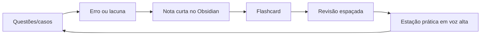

# 🚀 START AQUI — Vault TEMI 2026

> **Objetivo:** transformar o preparo para a prova TEMI em um sistema diário, visual e acionável dentro do Obsidian.

## 1) Como usar no Obsidian

1. Descompacte o arquivo `TEMI_Obsidian_Vault.zip`.
2. Abra o Obsidian → **Open folder as vault** → escolha a pasta `TEMI_Obsidian_Vault`.
3. Abra primeiro: [[00_Dashboard_TEMI_2026]].
4. Depois leia: [[02_Plano_29_Semanas_TDAH]] e [[01_Mapa_Complexos_Tematicos]].
5. Todo dia registre estudo usando [[Templates/Template_Nota_TEMI|Template de nota TEMI]] ou [[Templates/Template_Erro_de_Questao|Template de erro de questão]].

## 2) Regra de ouro 🧠

O preparo TEMI não é “ler muito”. É repetir este ciclo:

## 3) Arquivos principais

- [[00_Dashboard_TEMI_2026]] — painel central.
- [[01_Mapa_Complexos_Tematicos]] — mapa integrado por complexos.
- [[02_Plano_29_Semanas_TDAH]] — programa até a prova teórica.
- [[03_Plano_Retao_Final_8_Semanas]] — aceleração final.
- [[04_Rotina_Diaria_e_Revisao_Espacada]] — rotina anti-procrastinação.
- [[05_Checklist_Documental_Edital]] — inscrição, documentos, currículo.
- [[06_Bibliografia_Oficial_e_Foco]] — leitura oficial priorizada.
- [[Simulados/OSCE_50_Estacoes_Treino]] — treino prático.
- [[Simulados/Banco_100_Perguntas_Ativas]] — perguntas de recuperação ativa.
- [[Anki/TEMI_anki_seed_120_cards.csv]] — CSV inicial para importar no Anki.

## 4) Nota de segurança documental ⚠️

Este vault foi montado com base no edital TEMI 2026 disponível em consulta pública na data de criação e deve ser usado como **sistema de estudo**, não como substituto do edital. Antes de pagar inscrição, enviar documentos ou interpretar elegibilidade, confira sempre a versão oficial mais recente e eventuais retificações no site da AMIB/AMB.

## 5) Primeiro sprint de 7 dias

- [ ] Dia 1 — montar dashboard, confirmar datas/documentos e fazer diagnóstico com 30 questões.
- [ ] Dia 2 — [[Complexos/C02_Via_Aerea_Ventilacao_Mecanica_SRAG_ARDS|C02 VMI/SRAG]] + 20 questões.
- [ ] Dia 3 — [[Complexos/C03_Choque_Hemodinamica_Eco_POCUS|C03 Choque/POCUS]] + 1 estação em voz alta.
- [ ] Dia 4 — [[Complexos/C04_Sepse_Infeccoes_Antimicrobianos|C04 Sepse/ATB]] + flashcards.
- [ ] Dia 5 — revisar erros D1-D4 + 30 questões mistas.
- [ ] Dia 6 — simulado curto 45 questões + correção ativa.
- [ ] Dia 7 — descanso ativo: 20 flashcards + organização documental.

---

**Mantra TEMI:** *decidir rápido, justificar com fisiologia, comunicar com segurança e registrar com clareza.* ⚕️🔥
