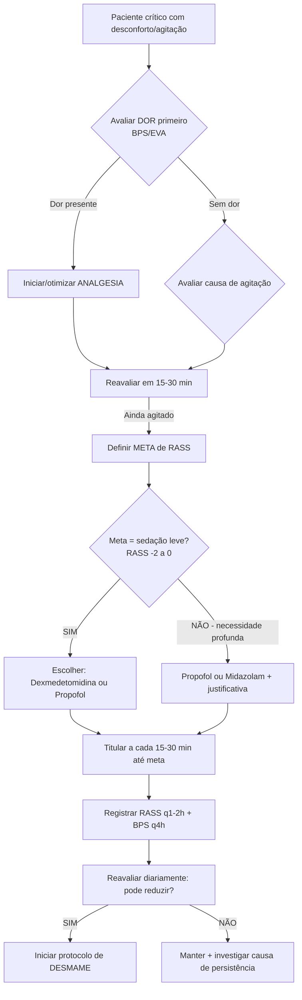

# 📋 PROTOCOLO COMPLETO: SEDAÇÃO / DESMAME / AGITAÇÃO / DELIRIUM

#QWEN
## UTI e Emergência | Baseado em PADIS 2025 e Diretrizes Brasileiras

> 💡 **Para seu Obsidian**: Este protocolo está formatado para fácil importação em notas com links internos. Use `[[ ]]` para criar conexões entre conceitos.

---

## 🗂️ ESTRUTURA SUGERIDA DE PASTAS (Obsidian/Vault)

```
📁 01-PROTOCOLOS-SEDACAO/
├── 📄 00-INDICE-MASTER.md
├── 📄 01-AVALIACAO-DOR-BPS-EVA.md
├── 📄 02-ESCALAS-RASS-SAS-CAMICU.md
├── 📄 03-ALGORITMO-SEDACAO-INICIAL.md
├── 📄 04-DESMAME-SEDACAO-PASSO-A-PASSO.md
├── 📄 05-MANEJO-AGITACAO-EMERGENCIA.md
├── 📄 06-DELIRIUM-PREVENCAO-TRATAMENTO.md
├── 📄 07-BUNDLE-ABCDEF-IMPLEMENTACAO.md
├── 📄 08-FARMACOS-DOSES-INTERACOES.md
└── 📄 99-CHECKLISTS-ROTINA.md

📁 02-ANEXOS/
├── 🖼️ IMAGENS/ (RASS visual, fluxogramas)
├── 📊 EXCEL/ (planilha de titulação, registro RASS)
├── 📑 PDF/ (diretrizes AMIB, PADIS original)
└── 🎴 CARDS/ (Anki export para revisão espaçada)
```

---

## 🔍 1. AVALIAÇÃO INICIAL: DOR PRIMEIRO! [[Analgesia-First]]

> ⚠️ **Regra de Ouro**: *"Trate a dor ANTES de sedar"* [[4]]

### Escalas Validadas para Dor em Pacientes Não Comunicativos

| Escala                            | Indicação                   | Pontos-Chave                                                                                                 |
| --------------------------------- | --------------------------- | ------------------------------------------------------------------------------------------------------------ |
| **BPS** (Behavioral Pain Scale)   | Pacientes intubados/sedados | Expressão facial + Movimentos MMSS + Adaptação ao VM. **3-5 = dor leve/moderada; 6-12 = dor intensa** [[25]] |
| **EVA** (Escala Visual Analógica) | Pacientes comunicativos     | 0-10, simples e rápida                                                                                       |
| **CPOT**                          | Alternativa à BPS           | Inclui tensão muscular e vocalização                                                                         |

```markdown
📝 CHECKLIST DOR (aplicar a cada 2-4h ou antes de procedimentos):
- [ ] BPS/EVA registrada?
- [ ] Causa identificada (procedimento, posição, sondas)?
- [ ] Analgesia titulada antes de aumentar sedativo?
- [ ] Reavaliação pós-intervenção (15-30 min)?
```

---

## 📊 2. ESCALAS DE SEDAÇÃO E AGITAÇÃO

### RASS - Richmond Agitation-Sedation Scale [[37]][[57]]

| Pontuação | Termo | Descrição Prática | Ação Sugerida |
|-----------|-------|------------------|---------------|
| **+4** | Combativo | Perigoso, puxa tubos | Contenção + Haloperidol/Dexmedetomidina |
| **+3** | Muito agitado | Agressivo verbal/físico | Avaliar causa + sedativo rápido |
| **+2** | Agitado | Movimentos descoordenados | Titular sedativo, buscar causa |
| **+1** | Inquieto | Ansioso, não agressivo | Reorientar, ajustar meta |
| **0** | Alerta e calmo | ✅ **META IDEAL** | Manter, estimular mobilização |
| **-1** | Sonolento | Desperta ao chamado, contato >10s | Bom para desmame |
| **-2** | Sedação leve | Desperta ao estímulo, contato <10s | ✅ **META para VM** |
| **-3** | Sedação moderada | Abre olhos ao verbal, sem contato | Evitar se possível |
| **-4** | Sedação intensa | Só abre olhos ao estímulo físico | Apenas indicações específicas |
| **-5** | Não desperta | Coma farmacológico | Risco ↑ delirium/mortalidade |

> 🎯 **Meta padrão para maioria dos pacientes**: **RASS -2 a 0** (sedação leve) [[86]][[91]]

### Quando Usar Sedação Profunda (RASS -4 a -5)?
- Hipertensão intracraniana
- Status epilepticus refratário
- Hipotermia terapêutica
- SDRA grave (P/F <100) com dessincronia grave
- Uso de bloqueador neuromuscular

---

## 💊 3. FARMACOS: DOSES E ESCOLHA RACIONAL

### Sedativos - Comparativo Prático

| Droga | Dose Inicial | Manutenção | Vantagens | Desvantagens | Observações |
|-------|-------------|------------|-----------|--------------|-------------|
| **Propofol** | 0,5-1 mg/kg/h | 1-4 mg/kg/h | Início/offset rápido, antiemético | Hipotensão, hipertrigliceridemia, síndrome de infusão | Evitar >48h em doses altas; monitorar TG |
| **Midazolam** | 0,02-0,05 mg/kg/h | 0,04-0,2 mg/kg/h | Ansiolítico potente, amnésia | Acúmulo em IR/IH, ↑ risco delirium [[4]] | Preferir bolus intermitente se possível |
| **Dexmedetomidina** | 0,2-0,7 mcg/kg/h (sem bolus) | 0,2-1,4 mcg/kg/h | Sedação "cooperativa", ↓ delirium, sem depressão respiratória [[14]][[67]] | Bradicardia, hipotensão, custo | **PADIS 2025**: preferir sobre propofol quando meta = sedação leve/↓delirium [[15]] |
| **Cetamina** | 0,1-0,3 mg/kg/h | 0,1-0,5 mg/kg/h | Broncodilatador, analgesia potente, preserva drive respiratório | Taquicardia, alucinações, ↑ secreções | Excelente em choque/asma; associar a benzodiazepínico para ↓ efeitos psicomiméticos |

### Opioides para Analgesia

| Droga | Bolus Resgate | Infusão Contínua | Observações |
|-------|--------------|-----------------|-------------|
| **Fentanil** | 25-50 mcg EV (pode repetir q10-15min) | 0,3-2 mcg/kg/h | Estável hemodinamicamente; ideal para instabilidade |
| **Morfina** | 2-4 mg EV (reduzir 50% se IR) | 1-5 mg/h | Evitar em IR (metabólitos ativos); histaminoliberação |
| **Remifentanil** | - | 0,05-0,2 mcg/kg/min | Offset ultrarrápido; ideal para SATs frequentes; custo elevado |

> ⚠️ **Evitar opioides em infusão contínua quando possível** - preferir doses intermitentes para ↓ risco de delirium e íleo [[4]]

---

## 🔄 4. ALGORITMO: INÍCIO E TITULAÇÃO DE SEDAÇÃO



---

## 📉 5. PROTOCOLO DE DESMAME DE SEDAÇÃO

### Pré-requisitos para Iniciar Desmame
- [ ] Estabilidade hemodinâmica (vasopressores estáveis ou em redução)
- [ ] Oxigenação adequada (SpO₂ >92% com FiO₂ ≤50%, PEEP ≤8)
- [ ] Ausência de agitação grave ou dor não controlada
- [ ] Meta de RASS definida para fase de desmame (geralmente 0 a -1)

### Passo a Passo do Desmame [[44]][[61]]

#### Opção A: Interrupção Diária da Sedação (SAT - Spontaneous Awakening Trial)
1. **Horário fixo** (ex: 6h da manhã) - suspender infusões de sedativos
2. Manter analgesia (opioides) se necessário
3. Monitorar RASS a cada 5-10 min
4. **Critérios de RETORNO imediato**:
   - RASS ≥ +3 por >5 min
   - Dessincronia grave com VM
   - Taquicardia/hipertensão significativa
   - Ansiedade extrema ou sofrimento
5. Se tolerar 4h acordado (RASS ≥ -1): **não reiniciar sedação**
6. Associar ao SBT (Spontaneous Breathing Trial) quando possível [[18]]

#### Opção B: Titulação Gradual (para pacientes não candidatos a SAT)
```excel
# Planilha sugerida (exportar para Excel):
| Hora | RASS | BPS | Dose Atual | Nova Dose | Observações |
|------|------|-----|------------|-----------|-------------|
| 08:00| -3   | 4   | Propofol 2mg/kg/h | 1,5 mg/kg/h | Reduzir 25% |
| 10:00| -2   | 3   | Propofol 1,5mg/kg/h | 1,0 mg/kg/h | Meta atingida |
```
- Reduzir 25-50% da dose a cada 2-4h conforme tolerância
- Manter analgesia basal
- Reavaliar meta de RASS diariamente

> 🎯 **Dica prática**: Em pacientes com histórico de abstinência ou uso prolongado (>7 dias), desmamar mais lentamente (10-20% a cada 6-12h) [[43]]

---

## 🚨 6. CONTROLE DE AGITAÇÃO: EMERGÊNCIA E UTI

### Abordagem em 4 Passos (Mnemonico: **C.A.U.S.A.**)

```
🧠 C - Causa: Buscar e tratar a causa reversível
   • Dor não controlada? → Otimizar analgesia
   • Retenção urinária? → Sondar
   • Hipóxia/hipercapnia? → Ajustar VM
   • Abstinência? → CIWA/COWS + benzodiazepínico
   • Delirium hiperativo? → Ver seção abaixo

🩺 A - Avaliar RASS e segurança
   • RASS +3/+4 com risco? → Intervenção farmacológica IMEDIATA
   • RASS +1/+2? → Tentar medidas não farmacológicas primeiro

💊 U - Usar fármaco adequado à situação
   • Emergência (risco iminente): Haloperidol EV ou Midazolam bolus
   • Agitação sustentada: Dexmedetomidina em infusão
   • Abstinência alcoólica/benzodiazepínica: Lorazepam/Midazolam

🔄 S - Supervisionar e reavaliar
   • Monitorar ECG se usar haloperidol EV (risco QT longo)
   • Reavaliar RASS a cada 10-15 min pós-intervenção

📝 A - Ajustar e documentar
   • Registrar causa provável, intervenção e resposta
   • Planejar prevenção de recorrência
```

### Protocolo Farmacológico para Agitação Aguda [[25]][[76]]

| Situação | 1ª Escolha | Dose | Alternativa | Observações |
|----------|-----------|------|-------------|-------------|
| **Emergência** (risco de lesão) | Haloperidol EV | 2,5-5 mg, repetir q20min até controle (máx 20mg/24h) | Midazolam 2-5 mg EV | ⚠️ Haloperidol EV: monitorar ECG, risco torsades |
| **Agitação sustentada** (RASS +2/+3) | Dexmedetomidina | 0,2-0,7 mcg/kg/h (sem bolus) | Propofol em infusão | Dexmedetomidina permite interação verbal |
| **Agitação + dor** | Otimizar opioide + sedativo leve | Fentanil bolus + Propofol baixa dose | Cetamina 0,1-0,2 mg/kg/h | Abordagem multimodal |
| **Suspeita de abstinência** | Benzodiazepínico | Lorazepam 1-2 mg EV/VO q1-2h titulado | Midazolam infusão | Usar protocolo CIWA/COWS |

> ⚠️ **Antipsicóticos atípicos (Quetiapina, Olanzapina)**: Úteis para delirium hiperativo **não emergencial**, mas **não recomendados para agitação aguda** por início de ação lento (1-2h) [[68]]

---

## 🧠 7. DELIRIUM: PREVENÇÃO E MANEJO

### CAM-ICU: Diagnóstico Rápido (60 segundos) [[30]][[36]]

**Passo 1**: Avaliar nível de consciência (RASS)
- Se RASS -4/-5: **CAM-ICU não aplicável** (coma) → Reavaliar quando despertar
- Se RASS -3 a +4: Prosseguir

**Passo 2**: Característica 1 - **Alteração aguda ou flutuação do estado mental**
- "O paciente está diferente do baseline hoje?" → SIM/NÃO

**Passo 3**: Característica 2 - **Desatenção**
- Teste: "Aperte minha mão quando eu disser a letra A" (ler: S,A,V,E,A,H,A,A,R,T)
- >2 erros = DESATENÇÃO

**Passo 4**: Característica 3 - **Pensamento desorganizado**
- Perguntas simples: "Uma pedra flutua na água?" "Existem peixes no mar?"
- Comando: "Levante 2 dedos, agora feche a mão"
- >1 erro = PENSAMENTO DESORGANIZADO

**Passo 5**: Característica 4 - **Nível de consciência alterado**
- RASS ≠ 0 = ALTERADO

✅ **Diagnóstico de Delirium**: Característica 1 + 2 + (3 OU 4)

### Bundle de Prevenção: **ABCDE/ABCDEF** [[77]][[81]]

```
🅰️ A - Assess & Manage Pain (Avaliar e tratar dor)
   • BPS/EVA q4h e pré-procedimentos
   • Analgesia multimodal

🅱️ B - Both SAT & SBT (Despertar + Teste respiratório)
   • Acoplar interrupção de sedação ao teste de VM
   • Meta: extubação precoce

🅲 C - Choice of Sedation (Escolha racional de sedativos)
   • Preferir sedação leve (RASS -2 a 0)
   • Evitar benzodiazepínicos quando possível
   • Considerar dexmedetomidina para ↓ delirium [[14]]

🅳 D - Delirium Monitoring (Rastrear delirium)
   • CAM-ICU q12h em pacientes de risco
   • Registrar e comunicar achados

🅴 E - Early Mobility (Mobilização precoce)
   • Iniciar fisioterapia mesmo em VM
   • Progressão: passiva → sentar → ortostatismo → deambular

🅵 F - Family Engagement (Envolvimento familiar)
   • Orientar família sobre delirium
   • Incentivar presença e reorientação
```

### Manejo Farmacológico do Delirium Hiperativo

> ⚠️ **Importante**: Antipsicóticos **não tratam a causa** do delirium, apenas controlam sintomas. Priorize sempre medidas não farmacológicas e tratamento da causa base.

| Droga | Dose Inicial | Via | Observações |
|-------|-------------|-----|-------------|
| **Haloperidol** | 0,5-1 mg | VO/IV/IM | EV apenas em emergência; monitorar QTc; evitar em Parkinson |
| **Quetiapina** | 12,5-25 mg | VO | Menos risco extrapiramidal; bom para idosos; início lento |
| **Olanzapina** | 2,5-5 mg | VO/IM | Útil se agitação + insônia; evitar em risco metabólico |
| **Dexmedetomidina** | 0,2-0,7 mcg/kg/h | IV contínuo | Excelente para delirium hiperativo em VM; permite interação [[67]][[74]] |

> 📌 **PADIS 2025**: *"Não há evidência suficiente para recomendar antipsicóticos rotineiramente para tratamento de delirium"* [[15]][[16]] → Foco em prevenção e causas reversíveis!

---

## 🔄 8. SISTEMA DE REVISÃO CONTÍNUA (Para seu Obsidian)

### Rotina Diária de 15 Minutos (Mesmo em Plantão Corrido)

```markdown
## 🌅 CHECKLIST MANHÃ (5 min)
- [ ] Revisar RASS/BPS das últimas 12h
- [ ] CAM-ICU se paciente em risco
- [ ] Meta de sedação ainda adequada?
- [ ] Oportunidade para SAT/SBT hoje?

## 🌆 CHECKLIST TARDE (5 min)
- [ ] Reavaliar necessidade de sedação contínua
- [ ] Atualizar plano de desmame se aplicável
- [ ] Registrar eventos de agitação/delirium

## 🌙 CHECKLIST NOITE (5 min)
- [ ] Preparar protocolo de despertar para amanhã
- [ ] Revisar interações medicamentosas
- [ ] Linkar nota do dia com tags: #sedação #delirium #desmame
```

### Tags Sugeridas para Obsidian
```
#sedação #desmame #delirium #agitação #RASS #CAM-ICU #BPS #analgesia-first 
#bundle-ABCDEF #dexmedetomidina #propofol #haloperidol #UTI #emergência
#revisão-diária #protocolo #algoritmo #farmacologia
```

### Template de Nota Diária (copiar/colar)
```markdown
## 📅 {{date}} - Sedação/Delirium

### Paciente: [[Nome/ID]]
- **Diagnóstico principal**: 
- **VM**: Sim/Não | Modo: 
- **RASS atual**: ____ | **Meta**: ____
- **BPS/EVA**: ____ | **CAM-ICU**: ____

### Intervenções Hoje:
- [ ] Analgesia otimizada? 
- [ ] Titulação de sedativo: 
- [ ] SAT realizado? Resultado:
- [ ] Medidas não farmacológicas para delirium:

### Plano para Amanhã:
1. 
2. 
3. 

### Links Relacionados:
- [[Algoritmo-Desmame-Sedação]]
- [[Manejo-Agitação-Emergência]]
- [[Fármacos-Doses-Interações]]
```

---

## 📚 FONTES E ATUALIZAÇÕES

### Diretrizes Principais
1. **PADIS Guidelines 2025 (SCCM)**: Atualização focada em ansiedade, sedação, delirium [[15]][[16]]
2. **Diretrizes AMIB/AMB**: Sedação, analgesia e bloqueio neuromuscular [[4]][[42]]
3. **Hospital Israelita Albert Einstein**: Protocolo institucional validado [[25]]

### Links Úteis para Atualização Contínua
- [SCCM PADIS Guidelines](https://www.sccm.org/clinical-resources/guidelines/guidelines/focused-update-padis-guideline) [[15]]
- [AMIB Diretrizes](https://amib.org.br/lista-de-diretrizes/) [[2]]
- [UpToDate: Sedation in the ICU](https://www.uptodate.com) (acesso institucional)
- [CAM-ICU Training Manual (Português)](https://uploads-ssl.webflow.com/5b0849daec50243a0a1e5e0c/5bb41ab2f487b4e0eb99b26b_CAM_ICU_training_Portugese.pdf) [[36]]

### Sistema de Alerta para Atualizações
```markdown
🔔 Configurar alertas para:
- PubMed: "sedation ICU guidelines" + "delirium management"
- Google Scholar: "PADIS guideline update"
- AMIB Newsletter: novas diretrizes brasileiras
- Revisar este protocolo a cada 6 meses ou após publicação de nova diretriz
```

---

> 💡 **Dica Final para Prova TEMI 2027**: Foque em **casos clínicos integrados** que exijam: (1) identificar dor como causa de agitação, (2) escolher escala adequada, (3) aplicar algoritmo de desmame, (4) reconhecer delirium e priorizar medidas não farmacológicas. Pratique com [[Questões-Comentadas-SEDACAO]].

*Última atualização: Dezembro/2025 | Baseado em evidências até PADIS 2025*  
*Próxima revisão programada: Junho/2026*

---

📎 **Anexos Sugeridos para Download**:
- [ ] `RASS_Printable.pdf` - Cartão de bolso com escala
- [ ] `CAM-ICU_Fluxograma.png` - Algoritmo visual diagnóstico
- [ ] `Sedacao_Doses.xlsx` - Planilha de titulação com cálculo automático
- [ ] `Bundle_ABCDEF_Checklist.docx` - Para rounds multidisciplinares

Precisa que eu elabore algum desses anexos ou adapte o protocolo para um formato específico (Anki, Notion, Excel)? Posso também gerar um plano de estudos semanal focado nesses tópicos para sua preparação TEMI 2027. 🎯