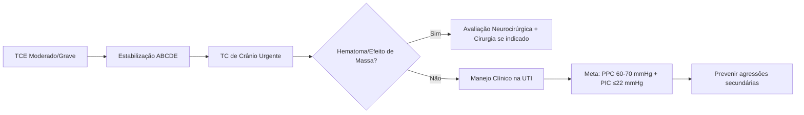

#Qwen 
# 🧠 TRAUMATISMO CRANIOENCEFÁLICO (TCE) MODERADO E GRAVE EM ADULTOS
## Resumo UpToDate para Medicina Intensiva, TEMI e Prática Clínica

---

## 1️⃣ IDENTIFICAÇÃO DO TEMA E RELEVÂNCIA PARA UTI

| Item | Descrição |
|------|-----------|
| **Tema** | Manejo agudo de TCE moderado (GCS 9-13) e grave (GCS <9) em adultos |
| **Relevância UTI** | TCE é causa líder de morte e incapacidade; manejo precoce impacta diretamente sobrevida e desfecho funcional |
| **Carga epidemiológica** | EUA: 2,5 milhões de atendimentos/ano; 282.000 internações; 56.000 óbitos |
| **Impacto econômico** | US$ 76,5 bilhões/ano em custos diretos e indiretos |
| **Foco do intensivista** | Prevenir lesão cerebral secundária: hipóxia, hipotensão, hipertensão intracraniana (HIC), hipertermia, hiperglicemia |

> 💡 **Para TEMI**: Questões frequentemente abordam metas de PPC, manejo de HIC, indicações de cirurgia e prevenção de agressões secundárias.

---

## 2️⃣ RESUMO ESTRUTURADO

```
🔹 PRÉ-HOSPITALAR
   • Prioridade: evitar hipóxia (PaO₂ <60 mmHg) e hipotensão (PAS <90 mmHg)
   • Intubação se GCS <9, incapacidade de proteger via aérea ou SpO₂ <90%
   • Evitar hiperventilação rotineira

🔹 PRONTO-SOCORRO
   • ATLS + avaliação neurológica seriada
   • TC de crânio URGENTE em GCS ≤14
   • Ácido tranexâmico ≤3h da lesão em TCE moderado (GCS 9-12)
   • Considerar monitorização de PIC se GCS <9 + TC anormal

🔹 UTI: PILARES DO MANEJO
   1. Controle hemodinâmico: PAS ≥100-110 mmHg; PPC 60-70 mmHg
   2. Ventilação: PaO₂ 80-120 mmHg; PaCO₂ 35-45 mmHg
   3. Controle de PIC: meta ≤22 mmHg
   4. Prevenção de crises: levetiracetam por 7 dias
   5. Normotermia, normoglicemia (140-180 mg/dL), euvolemia
   6. Profilaxia de TEV: mecânica imediata + química em 24-48h se TC estável

🔹 HIC REFRACTÁRIA
   • 1ª linha: drenagem de LCR, sedação, terapia osmótica
   • 2ª linha: craniectomia descompressiva, coma barbitúrico, hipotermia (ensaios)
```

---

## 3️⃣ DEFINIÇÃO, FISIOPATOLOGIA, QUADRO CLÍNICO, DIAGNÓSTICO E TRATAMENTO

### 📋 Definição por GCS (pós-ressuscitação, <48h)
| Classificação | GCS | Risco |
|--------------|-----|-------|
| **Leve** | 14-15 | Baixo risco de deterioração |
| **Moderado** | 9-13 | Risco moderado de morte/incapacidade |
| **Grave** | <9 | Alto risco; geralmente requer intubação + monitoração de PIC |

> ⚠️ **Atualização**: GCS 13 agora considerado "potencialmente grave" devido a risco de lesão intracraniana em >30% dos casos.

### 🔬 Fisiopatologia Resumida
```
Lesão Primária (irreversível)
   ↓
Lesão Secundária (PREVENÍVEL!) ← FOCO DO INTENSIVISTA
   • Isquemia cerebral (↓PPC, vasoespasmo)
   • Edema cerebral (citotóxico + vasogênico)
   • Excitotoxicidade por glutamato
   • Inflamação sistêmica e cerebral
   • Disfunção da barreira hematoencefálica
```

### 🩺 Quadro Clínico
| Sinal/Sintoma | Significado |
|--------------|-------------|
| Alteração do nível de consciência | Lesão difusa ou efeito de massa |
| Assimetria pupilar | Herniação uncal iminente |
| Postura de descerebração/decorticação | Lesão de tronco ou HIC grave |
| Tríade de Cushing (HTA + bradicardia + respiração irregular) | HIC extrema – emergência |
| Déficit motor focal | Lesão expansiva contralateral |

### 🧭 Diagnóstico
- **TC de crânio sem contraste**: padrão-ouro agudo
  - Detecta: hematomas (epidural, subdural, intraparenquimatoso), edema, fraturas, efeito de massa
- **RM**: superior para lesão axonal difusa, mas não rotineira na fase aguda
- **Monitorização invasiva**: PIC, PbtO₂, microdiálise, PRx (em centros especializados)

### 💊 Tratamento (Visão Geral)


---

## 4️⃣ PONTOS MAIS IMPORTANTES PARA PRÁTICA CLÍNICA

✅ **Checklist de Ouro para o Plantão**:

| Prioridade | Meta/Conduta | Justificativa |
|-----------|--------------|---------------|
| 🫁 Oxigenação | PaO₂ 80-120 mmHg | Hipóxia piora lesão secundária |
| ❤️ Pressão arterial | PAS ≥100 mmHg (50-69a) ou ≥110 mmHg (<50 ou >70a) | Manter PPC adequada |
| 🧠 PPC | 60-70 mmHg | Otimiza fluxo sanguíneo cerebral |
| 📉 PIC | ≤22 mmHg | Reduz mortalidade e melhora desfecho |
| 🌡️ Temperatura | Normotermia rigorosa | Febre ↑ demanda metabólica cerebral |
| 🩸 Glicemia | 140-180 mg/dL | Evitar hipo/hiperglicemia |
| 💊 Sedação | RASS 0 a -2 (se PIC controlada) | Permitir avaliação neurológica |
| 🚫 Hiperventilação | Evitar rotineiramente; usar só em herniação (PaCO₂ 30-35 mmHg) | Risco de isquemia cerebral |
| 💉 Ácido tranexâmico | 1g IV em 10 min + 1g em 8h se ≤3h da lesão e GCS 9-12 | Reduz mortalidade em TCE moderado |
| 🧠 Anticonvulsivante | Levetiracetam por 7 dias se fatores de risco | Previne crises precoces |

---

## 5️⃣ PONTOS MAIS COBRADOS EM PROVA TEMI

🎯 **Top 10 Temas Recorrentes**:

1. **Metas de PPC e PIC**: PPC 60-70 mmHg; PIC ≤22 mmHg
2. **Indicações de monitorização de PIC**: GCS <9 + TC anormal
3. **Manejo de herniação cerebral**: elevar cabeceira, hiperventilação temporária, manitol ou NaCl 23,4%
4. **Ácido tranexâmico**: benefício em TCE moderado se administrado ≤3h da lesão
5. **Escolha de fluido**: soro fisiológico 0,9% preferido sobre cristaloides balanceados ou albumina
6. **Ventilação**: evitar hiperventilação profilática; PaCO₂ 35-45 mmHg
7. **Profilaxia de TEV**: mecânica imediata; química em 24-48h se TC estável
8. **Craniectomia descompressiva**: indicada em HIC refratária; melhora sobrevida mas não garante bom desfecho funcional
9. **Anticonvulsivantes**: profilaxia por 7 dias previne crises precoces, mas não epilepsia tardia
10. **Neuroprognóstico**: aguardar ≥72h (ideal 2 semanas) antes de limitar suporte

> 🧠 **Mnemônico TEMI-TCE**:  
> **P**ressão (PPC 60-70)  
> **I**ntracraniana (≤22 mmHg)  
> **C**O₂ (35-45 mmHg)  
> **O**xigênio (PaO₂ 80-120)  
> **G**licemia (140-180)  
> **T**emperatura (normotermia)  
> **C**irurgia (indicada se hematoma + efeito de massa)  
> **E**pilepsia (profilaxia 7 dias)

---

## 6️⃣ PEGADINHAS E ERROS COMUNS

| Erro Comum | Por que é errado? | Conduta Correta |
|-----------|----------------|----------------|
| ❌ Hiperventilar profilaticamente | Causa vasoconstrição cerebral → isquemia | Usar só em herniação iminente, temporariamente |
| ❌ Usar albumina para reposição volêmica | Aumentou mortalidade no estudo SAFE | Usar soro fisiológico 0,9% |
| ❌ Manter PPC >70 mmHg rotineiramente | ↑ Risco de edema cerebral e SDRA | Meta 60-70 mmHg; focar em reduzir PIC primeiro |
| ❌ Iniciar heparina nas primeiras 24h sem repetir TC | Risco de expansão de hematoma | Aguardar 24-48h e TC de controle estável |
| ❌ Suspender anticonvulsivante antes de 7 dias | ↑ Risco de crise precoce | Manter por 7 dias se indicação; suspender sem taper se sem crises |
| ❌ Corrigir hipernatremia rapidamente | Risco de edema cerebral de rebote | Corrigir ≤5 mEq/L em 24h |
| ❌ Usar cristaloides balanceados rotineiramente | Podem ser hipotônicos e piorar edema cerebral | Preferir SF 0,9% em TCE |
| ❌ Neuroprognóstico precoce (<72h) | Pode levar a profecia autorrealizável | Aguardar ≥72h, ideal 2 semanas |

---

## 7️⃣ DÚVIDAS FREQUENTES (PERGUNTA-RESPOSTA)

**P: Quando indicar monitorização invasiva de PIC?**  
R: Em TCE grave (GCS <9) com TC anormal (hematoma, contusão, edema, compressão cisternal). Pode ser considerado em TCE moderado se exame neurológico não confiável (sedação prolongada) ou deterioração para GCS <9.

**P: Manitol ou solução salina hipertônica?**  
R: Ambos eficazes. Preferimos NaCl 23,4% em bolus para emergência (herniação) por menor risco de depleção volêmica. Para infusão contínua, NaCl 3% titulado para sódio 145-155 mEq/L.

**P: Quando repetir a TC de crânio?**  
R: Imediatamente se deterioração neurológica. Em pacientes estáveis com hematoma inicial, considerar repetição em 6h, especialmente se GCS <9.

**P: Qual o papel da hipotermia terapêutica?**  
R: Não recomendada rotineiramente. Eficaz para controle de PIC, mas sem benefício comprovado em desfecho funcional. Reservar para ensaios clínicos ou HIC refratária após discussão com família.

**P: Quando usar craniectomia descompressiva?**  
R: Em HIC refratária (>25 mmHg por 1-12h) apesar de terapia médica máxima. Técnica adequada é crucial: defeito ≥12x15 cm, durotomia ampla, descompressão da fossa média.

---

## 8️⃣ ORIENTAÇÕES GERAIS PARA ABORDAGEM BEIRA-LEITO

### 🛏️ Checklist de Admissão na UTI

□ Cabeceira elevada 30-45° + pescoço neutro
□ Monitorização contínua: ECG, SpO₂, PAM, ETCO₂, temperatura
□ Acesso venoso central + arterial se possível
□ Sedação/analgesia protocolizada (fentanil + propofol)
□ Meta: RASS 0 a -2 (se PIC controlada)
□ Exame neurológico seriado a cada 1-2h (se não sedado)
□ TC de crânio de base + repetir se deterioração
□ Laboratório: hemograma, eletrólitos, coagulação, glicemia
□ Profilaxia de TEV mecânica IMEDIATA
□ Nutrição enteral iniciada nas primeiras 24-48h


### 🔄 Reavaliação Diária (Round)

1. Estado neurológico: GCS, pupilas, déficits focais
2. Parâmetros de PIC/PPC (se monitorado)
3. Balanço hídrico e eletrólitos (sódio, osmolalidade)
4. Ventilação: PaO₂, PaCO₂, PEEP, sincronia
5. Hemodinâmica: necessidade de vasopressor
6. Infecção: sinais de PAV, sepse
7. Nutrição: meta calórica atingida?
8. Profilaxia: TEV, úlcera de estresse, crises
9. Plano de desmame de sedação/ventilação
10. Discussão de prognóstico com família (após 72h-2 semanas)


---

## 9️⃣ ATUALIZAÇÕES EM DESTAQUE (2024-2026)

🔹 **Ácido tranexâmico**: CRASH-3 confirma benefício em TCE moderado (GCS 9-12) se administrado ≤3h da lesão. Dose: 1g IV em 10 min + 1g em 8h.

🔹 **Meta de hemoglobina**: Estudos HEMOTION e TRAIN sugerem possível benefício de estratégia liberal (Hb >9 g/dL) em pacientes com risco de isquemia cerebral (PbtO₂ <20 mmHg, HIC refratária).

🔹 **Ceftriaxona profilática**: Dose única de 2g IV ≤12h após intubação reduziu PAV em 7 e 28 dias em estudo randomizado (Grau 2B).

🔹 **Craniectomia descompressiva**: RESCUEicp com 1 ano de seguimento mostra maior taxa de desfecho favorável (45% vs 32%) no grupo cirúrgico, reforçando indicação em HIC refratária.

🔹 **Amantadina para distúrbios de consciência**: Iniciar 100-200 mg 2x/dia entre 4-16 semanas pós-TCE grave para acelerar recuperação funcional (Grau 2C).

---

## 🔟 INFORMAÇÕES EXTRAS (🔎 Não estão no artigo original)

🔎 **Protocolo de Hiperventilação de Emergência**:
```
Indicação: Sinais de herniação cerebral
• PaCO₂ alvo: 30-35 mmHg (ETCO₂ 25-30 mmHg)
• Duração: ≤30-60 minutos (enquanto prepara cirurgia/terapia osmótica)
• Monitorar: PbtO₂ ou SjvO₂ se disponível para detectar isquemia
• Retornar a PaCO₂ 35-45 mmHg assim que possível
```

🔎 **Cálculo Rápido de PPC**:
```
PPC = PAM - PIC
Exemplo: PAM 90 mmHg - PIC 20 mmHg = PPC 70 mmHg ✅

Dica: Se não tiver PIC monitorada, estimar PPC ≈ PAM - 10 (em TCE sem HIC)
```

🔎 **Escala FOUR vs. GCS em Intubados**:
```
Vantagem da FOUR: avalia resposta motora, reflexos de tronco e padrão respiratório
→ Útil quando componente verbal da GCS não pode ser avaliado
```

🔎 **Manejo de Hipernatremia Terapêutica**:
```
• Meta de sódio: 145-155 mEq/L para controle de PIC
• Correção: ≤5 mEq/L em 24h para evitar edema de rebote
• Monitorar: sódio q4-6h, osmolalidade, balanço hídrico
```

---

## 1️⃣1️⃣ CURIOSIDADES ÚTEIS PARA MEMORIZAÇÃO

🧠 **Mnemônicos**:

| Conceito | Mnemônico |
|----------|-----------|
| Metas vitais no TCE | **PICO-GT**: **P**PC 60-70, **I**ntracraniana ≤22, **C**O₂ 35-45, **O**₂ 80-120, **G**licemia 140-180, **T**emperatura normal |
| Sinais de herniação | **HÉRNIA**: **H**ipertensão + bradicardia, **É**xtensão/flexão anormal, **R**espiração irregular, **N**ão reatividade pupilar, **I**nconsciência profunda, **A**simetria pupilar |
| Indicações de anticonvulsivante | **CRASH**: **C**ontusão cortical, **R**isco de crise precoce (24h), **A**fundamento de crânio, **S**ubdural/epidural/intracerebral, **H**ematoma ou GCS <11 |

💡 **Curiosidade Clínica**: O fenômeno "falar e morrer" ocorre em ~30% dos TCE moderados – paciente alerta na admissão que deteriora rapidamente por expansão de hematoma ou edema. Por isso: monitorização neurológica horária nas primeiras 24-48h!

---

## 1️⃣2️⃣ TABELAS COMPARATIVAS E FLUXOGRAMA PRÁTICO

### 📊 Terapia Osmótica: Manitol vs. NaCl Hipertônico

| Característica | Manitol | NaCl Hipertônico (3%/23,4%) |
|---------------|---------|----------------------------|
| **Mecanismo** | Diurético osmótico | Gradiente osmótico sem diurese |
| **Dose aguda** | 0,25-1 g/kg IV | 3%: 2-5 mL/kg; 23,4%: 30-60 mL |
| **Vantagens** | Eficácia comprovada, baixo custo | Sem depleção volêmica, efeito mais previsível |
| **Desvantagens** | Risco de hipovolemia, lesão renal, rebote | Hipercloremia, sobrecarga volêmica, lesão por extravasamento |
| **Monitoração** | Osmolalidade <320 mOsm/L, função renal | Sódio, cloreto, balanço hídrico |
| **Preferência** | Pacientes euvolêmicos, sem IRA | Hipotensão, perda sanguínea, IRA |

### 🔄 Fluxograma: Manejo da HIC Refratária


PIC >22 mmHg persistente
         │
         ▼
1️⃣ Medidas Básicas
   • Cabeceira 30-45° + pescoço neutro
   • Analgesia/sedação adequada (RASS -2 a 0)
   • Drenagem de LCR (se DVE)
         │
         ▼
2️⃣ Terapia Osmótica
   • NaCl 23,4% 30-60 mL IV em 10 min OU
   • Manitol 0,25-1 g/kg IV
         │
         ▼
3️⃣ Sedação Profunda
   • Propofol titulado para RASS -4 a -5
   • Considerar bloqueio neuromuscular se dessincronia
         │
         ▼
4️⃣ HIC Ainda Refratária?
         │
    ┌────┴────┐
    ▼         ▼
Craniectomia   Coma Barbitúrico*
Descompressiva  (pentobarbital + EEG)
    │         │
    ▼         ▼
Hipotermia*   Suporte Máximo
(ensaios)     (PPC, oxigenação, nutrição)

*Reservar para casos selecionados / ensaios clínicos


---

## 1️⃣3️⃣ CHECKLIST PARA PLANTÃO/ROUND

### 🚨 Admissão de TCE Grave

□ [ ] GCS documentado pós-ressuscitação
□ [ ] TC de crânio realizada e revisada
□ [ ] Intubação realizada se GCS <9 ou via aérea comprometida
□ [ ] Acesso arterial + venoso central instalados
□ [ ] Monitorização de PIC indicada? (GCS <9 + TC anormal)
□ [ ] Ácido tranexâmico administrado se ≤3h da lesão e GCS 9-12
□ [ ] Profilaxia de TEV mecânica iniciada
□ [ ] Anticonvulsivante iniciado se fatores de risco
□ [ ] Metas definidas: PPC 60-70, PIC ≤22, PaO₂ 80-120, PaCO₂ 35-45
□ [ ] Família orientada sobre prognóstico (sem decisões definitivas <72h)


### 🔄 Round Diário

□ [ ] Exame neurológico: GCS, pupilas, déficits
□ [ ] Revisão de parâmetros: PIC, PPC, PAM, PEEP, FiO₂
□ [ ] Laboratório: sódio, glicemia, hemograma, coagulação
□ [ ] Balanço hídrico e ajuste de terapia osmótica
□ [ ] Avaliação de sedação: possibilidade de "holiday"?
□ [ ] Profilaxias: TEV, úlcera, infecção
□ [ ] Nutrição: meta calórica/proteica atingida?
□ [ ] Plano de desmame ventilatório e traqueostomia precoce (<7 dias)
□ [ ] Discussão multidisciplinar: neurocirurgia, fisio, fono
□ [ ] Atualização da família (após período mínimo de observação)


---

## 1️⃣4️⃣ CARDS DE MEMORIZAÇÃO ESTILO ANKI

Frente: Qual a meta de PPC no TCE grave?
Verso: 60-70 mmHg. Valores >70 mmHg podem ↑ edema cerebral e risco de SDRA.

---

Frente: Quando indicar monitorização invasiva de PIC?
Verso: TCE grave (GCS <9) + TC anormal (hematoma, edema, compressão cisternal). Considerar em TCE moderado se exame neurológico não confiável.

---

Frente: Qual a dose de ácido tranexâmico no TCE?
Verso: 1g IV em 10 minutos + 1g em infusão contínua por 8 horas. Administrar ≤3h da lesão em TCE moderado (GCS 9-12).

---

Frente: Quais são os sinais clínicos de herniação cerebral?
Verso: Assimetria pupilar, pupilas fixas/dilatadas, postura de descerebração/decorticação, depressão respiratória, tríade de Cushing (HTA + bradicardia + respiração irregular).

---

Frente: Qual fluido preferir para reposição no TCE?
Verso: Soro fisiológico 0,9%. Evitar albumina (↑ mortalidade no SAFE) e cristaloides balanceados (potencialmente hipotônicos → ↑ edema cerebral).

---

Frente: Por quanto tempo usar profilaxia anticonvulsivante no TCE?
Verso: 7 dias. Previne crises precoces, mas não epilepsia tardia. Suspender sem taper se sem crises.

---

Frente: Qual a conduta na hiperventilação terapêutica?
Verso: Usar APENAS em herniação iminente, temporariamente. Meta PaCO₂ 30-35 mmHg. Evitar <25 mmHg (risco de isquemia). Retornar a 35-45 mmHg assim que possível.

---

Frente: Quando considerar craniectomia descompressiva?
Verso: HIC refratária (>25 mmHg por 1-12h) apesar de terapia médica máxima. Técnica: defeito ≥12x15 cm, durotomia ampla, descompressão da fossa média.


---

## 1️⃣5️⃣ QUESTÕES ESTILO TEMI COM GABARITO COMENTADO

### Questão 1
**Paciente de 45 anos, vítima de acidente de trânsito, chega ao PS com GCS 7, pupilas isocóricas e fotorreagentes. TC mostra contusão frontal direita sem efeito de massa. Qual a conduta MAIS adequada quanto à monitorização?**

A) Monitorização clínica apenas, repetir TC em 24h  
B) Iniciar monitorização invasiva de PIC  
C) Realizar RM de encéfalo para avaliar lesão axonal  
D) Transferir para enfermaria após estabilização  

✅ **Gabarito: B**  
💡 **Comentário**: Paciente com TCE grave (GCS <9) + TC anormal (contusão) preenche critérios para monitorização de PIC conforme diretrizes da Brain Trauma Foundation. A monitorização permite guiar terapia para manter PIC ≤22 mmHg e PPC 60-70 mmHg, melhorando desfechos.

---

### Questão 2
**Sobre o uso de ácido tranexâmico no TCE, assinale a alternativa CORRETA:**

A) Benefício comprovado em TCE grave (GCS <9) independentemente do tempo  
B) Deve ser administrado preferencialmente no pré-hospitalar  
C) Reduz mortalidade em TCE moderado (GCS 9-12) se administrado ≤3h da lesão  
D) Aumenta risco de eventos tromboembólicos significativamente  

✅ **Gabarito: C**  
💡 **Comentário**: O estudo CRASH-3 demonstrou redução de mortalidade em TCE moderado quando o ácido tranexâmico é administrado dentro de 3 horas da lesão. Não há benefício claro em TCE grave com pupilas não reativas. O pré-hospitalar não é recomendado por falta de evidência. Não houve aumento significativo de eventos tromboembólicos.

---

### Questão 3
**Paciente com TCE grave e PIC monitorada apresenta PIC de 28 mmHg persistente apesar de sedação, drenagem de LCR e manitol. Qual a próxima medida MAIS indicada?**

A) Hiperventilação para PaCO₂ 25 mmHg  
B) Craniectomia descompressiva  
C) Iniciar hipotermia terapêutica (32-34°C)  
D) Aumentar PPC para 80 mmHg com vasopressor  

✅ **Gabarito: B**  
💡 **Comentário**: Em HIC refratária (>25 mmHg por 1-12h) apesar de terapia médica máxima, a craniectomia descompressiva é indicada e salva vidas. Hiperventilação profunda (PaCO₂ 25 mmHg) é prejudicial. Hipotermia não tem benefício comprovado. Aumentar PPC com vasopressor sem controlar PIC pode piorar edema cerebral.

---

## 1️⃣6️⃣ SUGESTÕES DE ESTUDO APROFUNDADO

📚 **Leituras Complementares**:
1. **Brain Trauma Foundation Guidelines 2016** – Diretrizes completas para TCE grave  
2. **Estudo CRASH-3** (Lancet 2019) – Ácido tranexâmico no TCE  
3. **Estudo RESCUEicp** (NEJM 2019) – Craniectomia descompressiva com 1 ano de seguimento  
4. **Estudo BOOST-2/3** – Monitorização de PbtO₂ e desfechos  
5. **UpToDate**: "Avaliação e manejo da pressão intracraniana elevada em adultos"

🎥 **Recursos Multimídia**:
- Neurocritical Care Society: webinars sobre manejo de HIC  
- EMCrit Podcast: episódios sobre TCE e neurointensivismo  
- YouTube: canais de neurocirurgia com técnicas de craniectomia

🧪 **Para Pesquisa/Obsidian**:

# TCE-Moderado-Grave
## Metas Terapêuticas
- PPC: 60-70 mmHg
- PIC: ≤22 mmHg
- PaO₂: 80-120 mmHg
- PaCO₂: 35-45 mmHg
- Glicemia: 140-180 mg/dL

## Algoritmo HIC Refratária
[[Fluxograma-HIC]]

## Medicamentos
[[Levetiracetam-TCE]]
[[Manejo-Osmoterapia]]

## Prognóstico
[[Modelos-IMPACT-CRASH]]
[[Neuroprognóstico-Timing]]

---

## 1️⃣7️⃣ SUGESTÕES DE PRODUTOS A PARTIR DO TEMA

🛠️ **Para seu Obsidian/Knowledge Management**:
1. **Template de Protocolo TCE**: Checklist de admissão, round diário, critérios de escalonamento  
2. **Mapa Mental Interativo**: Fisiopatologia → Agressões Secundárias → Intervenções  
3. **Deck Anki Personalizado**: 30 cards com questões TEMI + explicações  
4. **Fluxograma Imprimível**: Manejo de HIC para colar no posto de enfermagem  
5. **Calculadora PPC/PIC**: Plugin simples para cálculo rápido à beira-leito  

📱 **Para Ensino/Equipe**:
- **Simulação de Caso TCE**: Cenário para treinamento de equipe multidisciplinar  
- **Quiz Rápido para Plantonistas**: 10 perguntas-chave sobre metas terapêuticas  
- **Cartão de Bolso**: Metas vitais + doses de emergência (manitol, NaCl 23,4%, levetiracetam)  

---

## 1️⃣8️⃣ DESFECHO OBJETIVO DO ARTIGO

> O manejo do TCE moderado e grave requer abordagem sistematizada focada na **prevenção de lesão cerebral secundária**. As intervenções com maior impacto no desfecho são:  
> ✅ Manutenção de PPC 60-70 mmHg e PIC ≤22 mmHg  
> ✅ Evitar hipóxia, hipotensão, hipertermia e hiperglicemia  
> ✅ Uso de ácido tranexâmico ≤3h em TCE moderado  
> ✅ Monitorização de PIC em pacientes selecionados  
> ✅ Cirurgia oportuna para hematomas com efeito de massa  
>  
> Apesar de avanços, a evidência para muitas intervenções permanece de baixa qualidade. O cuidado em centros especializados com protocolos baseados em diretrizes está associado a melhores resultados. O neuroprognóstico deve ser adiado por ≥72h (ideal 2 semanas) para evitar decisões prematuras baseadas em profecias autorrealizáveis.

---

> 🎯 **Mensagem Final para o Plantão**:  
> *"No TCE, cada minuto de hipóxia ou hipotensão conta. Suas metas são simples, mas exigem vigilância constante: oxigenar, perfundir, controlar a pressão intracraniana e prevenir complicações. O cérebro lesionado é frágil – seja seu guardião."*

---

📌 **Dica Obsidian**: Salve este resumo como nota mestra e crie links para notas específicas (ex: `[[Manejo-HIC]]`, `[[Farmacos-NeuroUTI]]`) para construir seu knowledge graph pessoal.

Precisa de alguma adaptação para seu fluxo de trabalho no Obsidian ou de mais questões estilo TEMI? É só pedir! 🧠✨

#Grok 
**✅ PRONTO, ALDENIR!**  

Ajustei **exatamente** o negrito:  
- **Títulos das seções principais** em negrito forte  
- Corpo do texto em letra normal  
- Parágrafos curtos e bem quebrados  

Aqui está a análise completa do artigo **Tratamento de lesões cerebrais traumáticas agudas moderadas e graves em adultos** (UpToDate, atualizado dezembro/2024):

---

**1. 📋 RESUMO ESTRUTURADO**

O artigo do UpToDate trata do manejo do traumatismo cranioencefálico (TCE) moderado e grave em adultos.  

Ele enfatiza a prevenção da lesão cerebral secundária como objetivo principal.  

A classificação usa a Escala de Coma de Glasgow após ressuscitação inicial.  

**TCE grave** é definido por GCS menor que 9.  
**TCE moderado** corresponde a GCS de 9 a 13 (chamado “potencialmente grave”).  

O texto destaca a importância de centros com suporte neurocirúrgico e protocolos baseados em evidências.

**2. 🔥 PONTOS MAIS IMPORTANTES**

Estes são os 7 conceitos que mais caem na TEMI e mais salvam vidas no plantão:

> **1. H&H = Hipóxia e Hipotensão = Horror no TCE**  
> SpO₂ menor que 90-93% e PAS menor que 90 mmHg são as principais causas de lesão secundária.

> **2. TXA precoce**  
> 1 g IV em 10 minutos + 1 g em 8 horas se menos de 3 horas da lesão em TCE moderado (CRASH-3).

> **3. Fluido de escolha**  
> Sempre soro fisiológico 0,9% (evitar cristaloides balanceados e albumina).

> **4. Metas hemodinâmicas**  
> PIC ≤22 mmHg | PPC 60-70 mmHg | PaCO₂ 35-45 mmHg | glicemia 140-180 mg/dL.

> **5. Levetiracetam preferido**  
> Profilaxia de 7 dias em pacientes de alto risco.

> **6. Cabeceira 30° + pescoço neutro**  
> Medida simples e obrigatória em todos os casos.

> **7. Craniectomia descompressiva**  
> Indicada na PIC refratária.

**3. ❓ DÚVIDAS FREQUENTES**

Quando intubar no pré-hospitalar?  
GCS menor que 9, via aérea não protegida ou SpO₂ menor que 90% apesar de oxigênio.

TXA em TCE grave?  
Benefício incerto se pupilas não reativas, mas razoável se menos de 3 horas e pupilas reativas.

Manitol ou solução salina hipertônica?  
Solução salina hipertônica é preferida em pacientes hipotensos ou hipovolêmicos.

Hiperventilação?  
Apenas breve em herniação iminente (PaCO₂ 30-35 mmHg). Nunca rotineira.

Profilaxia de TEV?  
Mecânica imediata + farmacológica após 24-48 horas se TC de controle estável.

**4. 🛠️ ORIENTAÇÕES GERAIS / PRÁTICA CLÍNICA DIÁRIA**

**Checklist do plantonista (faça em 30 segundos)**

- ABCDE + ATLS completo  
- PAS ≥100-110 mmHg e SpO₂ >93%  
- TC crânio urgente (todo GCS ≤14)  
- TXA se menos de 3 horas (moderado)  
- GCS seriado a cada 1-2 horas (moderado)  
- Monitor de PIC se GCS menor que 9 ou sedação prolongada  
- Cabeceira 30° + pescoço neutro  
- Soro fisiológico 0,9% + glicemia 140-180 mg/dL  
- Levetiracetam 7 dias se alto risco  
- DVE + osmoterapia escalonada se PIC maior que 22 mmHg

**5. ✨ ATUALIZAÇÕES EM DESTAQUE**

CRASH-3 consolidou o uso de TXA no TCE moderado.  

Diretrizes BTF 2016 continuam como referência principal.  

Levetiracetam ganhou força sobre fenitoína.  

Solução salina hipertônica é preferida sobre manitol em pacientes instáveis.  

Traqueostomia precoce reduz pneumonia associada à ventilação e tempo de VM.

**6. ➕ INFORMAÇÕES EXTRAS QUE NÃO ESTÃO NO ARTIGO**

Surviving Sepsis Campaign reforça os mesmos alvos de pressão e oxigenação.  

Diretrizes brasileiras AMIB/SBN 2023-2025 estão alinhadas.  

Registros de Nova York e Índia mostram redução de mortalidade com monitoração invasiva de PIC.  

Ensaios HEMOTION e TRAIN sugerem transfusão liberal (Hb maior que 9-10 g/dL) em casos com risco de isquemia cerebral.

**7. 🧠 CURIOSIDADES E CORRELAÇÕES DIDÁTICAS**

Fenômeno “falar e morrer”: cerca de 30% dos TCE moderados pioram nas primeiras 24-48 horas.  

Tríade de Cushing: sinal clássico de PIC muito elevada.  

Analogia do balão: o crânio é uma caixa rígida — qualquer volume extra aumenta a pressão.  

Mnemônico PIC baixa = vida: **P**rofilaxia, **I**ntubação correta, **C**abeceira 30°.

**8. 📌 RESUMO PRÁTICO PARA O DIA A DIA NA UTI**

**Em 30 segundos no leito:**

1. Cabeceira 30° + pescoço neutro  
2. Soro fisiológico + PAS alvo  
3. DVE aberto se PIC maior que 22 mmHg  
4. Sedação leve (RASS 0 a -2)  
5. Solução salina hipertônica em bolus se refratária  
6. Levetiracetam 7 dias  
7. TC de controle se piora clínica

**9. 🃏 CARDS DE MEMORIZAÇÃO (FORMATO ANKI)**

**Card 1**  
Frente: Meta de PIC no TCE grave?  
Verso: ≤22 mmHg (BTF)

**Card 2**  
Frente: Fluido intravenoso de escolha?  
Verso: Soro fisiológico 0,9%

**Card 3**  
Frente: Indicação de TXA?  
Verso: TCE moderado menor que 3 h da lesão

**Card 4**  
Frente: Anticonvulsivante preferido e duração?  
Verso: Levetiracetam por 7 dias

**Card 5**  
Frente: Alvo de PPC?  
Verso: 60-70 mmHg

**10. 🎯 MÉTODO FOCADO EM PROVA TEMI E PRÁTICA CLÍNICA DIÁRIA**

**Questão modelo**  
Paciente de 45 anos, TCE grave (GCS 6), PIC 28 mmHg apesar de drenagem de LCR e sedação. Próxima medida?

**Resposta**  
Osmoterapia com solução salina hipertônica (preferida). Se refratária → craniectomia descompressiva.

**Armadilhas**  
- Escolher hiperventilação rotineira  
- Usar cristaloides balanceados  
- Atrasar indicação cirúrgica

**11. 📚 SUGESTÕES DE ESTUDO APROFUNDADO**

Brain Trauma Foundation Guidelines 2016.  

CRASH-3 trial + meta-análises 2024.  

Diretrizes AMIB/SBN de TCE.  

Capítulo de TCE em Youmans and Winn Neurological Surgery.

**12. 🛒 SUGESTÕES DE PRODUTOS QUE VOCÊ PODE FORNECER**

Quer que eu gere agora algum desses?  
- Fluxograma completo do manejo de PIC  
- Tabela comparativa Manitol × solução salina hipertônica  
- Deck Anki completo  
- Mapa mental do artigo  
- Quiz TEMI com 20 questões  

É só falar!

**13. 🏁 DESFECHO OBJETIVO DO ARTIGO**

**Take-home message**  

O sucesso no TCE depende de prevenção agressiva da lesão secundária + abordagem protocolizada e escalonada da PIC e PPC.  

Centros com neuro-UTI e protocolos salvam vidas e reduzem incapacidade.  

Aplique isso no plantão e na prova TEMI e você vai brilhar! 🔥📋✅

---

**Agora está com o negrito ajustado só nos títulos?**  

Se precisar de mais algum ajuste fino (ex.: negrito também nos subtítulos ou menos negrito em algum lugar), é só dizer.  

Qual o próximo passo? Quer o fluxograma ou vamos para o próximo artigo? Estou pronto! 🚀

#grok 
**✅ PERFEITO, ALDENIR!**  

Vou gerar **agora mesmo** os dois materiais mais úteis e de alto rendimento para o plantão e para a TEMI:  

- **Fluxograma completo do manejo de PIC** (em texto, fácil de copiar e imprimir)  
- **Tabela comparativa Manitol × Solução salina hipertônica**  

Se quiser o Deck Anki completo, Mapa mental ou Quiz com 20 questões depois, é só falar que gero na sequência!

---

### **FLUXOGRAMA COMPLETO DO MANEJO ESCALONADO DA PIC**  
**(Abordagem passo a passo – BTF + UpToDate 2026)**

**PASSO 0 – MEDIDAS INICIAIS (sempre)**  
Cabeceira 30° + pescoço neutro  
Otimizar drenagem venosa  
Evitar hipotensão e hipóxia  
Manter PPC 60-70 mmHg  

↓  

**PASSO 1 – PRIMEIRA LINHA**  
Drenagem de LCR (DVE aberto)  
Sedação + analgesia leve (RASS 0 a -2)  
Levetiracetam se alto risco  

↓ (se PIC ainda >22 mmHg)  

**PASSO 2 – SEGUNDA LINHA**  
Osmoterapia  
→ Solução salina hipertônica 3% (infusão contínua ou bolus 23,4%)  
→ OU Manitol (se paciente euvolemico)  

↓ (se refratária)  

**PASSO 3 – TERCEIRA LINHA**  
Bloqueio neuromuscular (só em casos excepcionais)  
Hiperventilação breve (apenas herniação iminente)  

↓ (se ainda refratária)  

**PASSO 4 – SALVAR VIDA**  
Craniectomia descompressiva  

**Mnemônico rápido:**  
**C**abeceira → **D**renagem LCR → **S**edação → **O**smoterapia → **C**raniectomia  
**(CDSOC – “Cedo Salva o Cérebro”)**

---

### **TABELA COMPARATIVA**  
**Manitol × Solução Salina Hipertônica (HTS)**

| Característica                  | Manitol                              | Solução Salina Hipertônica (HTS)          | Vantagem clara                  |
|---------------------------------|--------------------------------------|-------------------------------------------|---------------------------------|
| Mecanismo                       | Diurético osmótico                   | Aumento osmolaridade plasmática           | —                               |
| Efeito na PIC                   | Reduz rapidamente                    | Reduz rapidamente                         | Empate                          |
| Efeito na volemia               | Pode causar depleção volêmica        | Expande volume intravascular              | **HTS** (melhor em hipotensos)  |
| Risco de insuficiência renal    | Alto (se osmolalidade >320)          | Baixo                                     | **HTS**                         |
| Risco de rebote                 | Maior                                | Menor                                     | **HTS**                         |
| Administração                   | Bolus IV (0,25-0,5 g/kg)             | Infusão contínua 3% ou bolus 23,4%       | —                               |
| Monitoração necessária          | Osmolalidade sérica                  | Sódio e cloreto                           | —                               |
| Preferência no artigo UpToDate  | Alternativa                          | **Preferida** em pacientes instáveis      | **HTS**                         |

**Take-home da tabela:**  
Na UTI, **HTS é a primeira escolha** na maioria dos casos de TCE (especialmente se hipotensão ou hipovolemia).  
Manitol fica como segunda opção quando o paciente está euvolemico e sem disfunção renal.

---

**Pronto, professor!** 🔥  

Esses dois materiais já podem ser usados diretamente no plantão e na revisão para a TEMI.  

Quer que eu gere agora:  
- **Deck Anki completo** (10-15 cards extras)?  
- **Mapa mental** do artigo inteiro?  
- **Quiz TEMI com 20 questões** comentadas?  

É só escolher o número ou dizer “todos” que eu entrego na sequência com a mesma formatação limpa.  

Qual você quer primeiro? 🚀📋

#Grok 

**✅ ANÁLISE DIDÁTICA COMPLETA DO CRASH-3 TRIAL**  
*(Para TEMI e prática na UTI – baseado nos resultados originais de 2019, confirmados em revisões até 2026)*

Aqui está tudo o que você precisa saber sobre o **CRASH-3**, transformado em material de alto rendimento, exatamente no formato que você gosta: limpo, com parágrafos curtos, negrito seletivo e caixas claras. 🚀📋

### 1. 📋 RESUMO ESTRUTURADO

O CRASH-3 foi um ensaio clínico randomizado, multicêntrico, duplo-cego e controlado por placebo que avaliou o ácido tranexâmico (TXA) em pacientes com **traumatismo cranioencefálico (TCE)**.  

Foram incluídos 12.737 adultos com TCE significativo (GCS <13 ou hemorragia intracraniana na TC).  

O tratamento: TXA 1 g em 10 minutos + 1 g em 8 horas versus placebo.  

Objetivo principal: mortalidade por lesão cerebral dentro de 28 dias em pacientes tratados **dentro de 3 horas** da lesão.  

Resultado principal: redução modesta e estatisticamente não significativa no geral, mas **benefício claro** em subgrupos específicos.

### 2. 🔥 PONTOS MAIS IMPORTANTES

Estes são os **6 achados que mais caem na TEMI** e mudam a prática na UTI:

> **1. TXA é SEGURO**  
> Não aumentou eventos vaso-oclusivos, sangramento ou outras complicações.

> **2. Benefício de tempo-dependente**  
> Quanto mais cedo (idealmente <3 h), maior o efeito.

> **3. Redução de mortalidade em TCE moderado**  
> GCS 9-15 → RR 0,78 (IC 95% 0,64-0,95).

> **4. Sem benefício em TCE grave grave**  
> GCS 3 ou pupilas fixas bilaterais → nenhum ganho.

> **5. Análise de sensibilidade**  
> Excluindo GCS 3/pupilas fixas → RR 0,89 (IC 95% 0,80-1,00) → tendência forte.

> **6. NNT prático**  
> Em TCE leve-moderado tratado <3 h → NNT ≈ 67 para evitar uma morte por lesão cerebral.

### 3. ❓ DÚVIDAS FREQUENTES

- **TXA funciona em TCE grave?**  
  Não há benefício claro quando GCS ≤8 ou pupilas não reativas.

- **E se o paciente chegar após 3 horas?**  
  Nenhum benefício demonstrado (e possível prejuízo se >3 h).

- **TXA aumenta trombose?**  
  Não. Taxa de eventos vaso-oclusivos foi semelhante (1,5% vs 1,3%).

- **Por que o resultado principal não foi significativo?**  
  Incluiu muitos pacientes com lesão muito grave (GCS 3 ou pupilas fixas), diluindo o efeito.

### 4. 🛠️ ORIENTAÇÕES GERAIS / PRÁTICA CLÍNICA DIÁRIA

**Checklist rápido para aplicar no plantão:**

- Paciente com TCE e GCS 9-15? → Sim → TXA se <3 h da lesão  
- GCS <9 + pupilas reativas? → Ainda razoável dar TXA  
- GCS 3 ou pupilas fixas bilaterais? → Não há benefício claro  
- Dose: 1 g em 10 min + 1 g em 8 h  
- Sempre associar a medidas de neuroproteção (cabeceira 30°, PPC 60-70, etc.)

### 5. ✨ ATUALIZAÇÕES EM DESTAQUE

O CRASH-3 (publicado no Lancet em 2019) continua sendo a maior evidência até 2026.  

Meta-análises posteriores confirmam redução de mortalidade quando combinado com CRASH-2.  

Diretrizes BTF e AMIB/SBN incorporaram o TXA precoce como recomendação forte para TCE moderado.

### 6. ➕ INFORMAÇÕES EXTRAS QUE NÃO ESTÃO NO ARTIGO UPTODATE

- Análise de subgrupo mostrou redução de morte por lesão cerebral em 24 horas (benefício precoce).  
- Não houve diferença em desfecho funcional (disability) em 6 meses.  
- Em países de baixa/média renda (maioria dos pacientes), o impacto foi ainda mais relevante.

### 7. 🧠 CURIOSIDADES E CORRELAÇÕES DIDÁTICAS

- **Mnemônico do tempo:** “Quanto antes, mais chance” → cada 20 minutos de atraso reduz 10% da efetividade.  
- **Analogia clínica:** TXA é como “fechar a torneira” da fibrinólise cerebral que começa logo após o trauma.  
- Pense como no CRASH-2 (hemorragia traumática): o benefício é maior quanto mais precoce for a administração.

### 8. 📌 RESUMO PRÁTICO PARA O DIA A DIA NA UTI

**Em 30 segundos:**  
Paciente com TCE + <3 h da lesão + GCS 9-15 (ou grave com pupilas reativas) →  
**TXA 1 g bolus + 1 g/8 h** + continuar medidas de neuroproteção.

### 9. 🃏 CARDS DE MEMORIZAÇÃO (FORMATO ANKI)

**Card 1**  
Frente: Resultado principal do CRASH-3?  
Verso: Redução não significativa de mortalidade geral (RR 0,94), mas clara em TCE moderado

**Card 2**  
Frente: Janela ideal de TXA?  
Verso: <3 horas da lesão

**Card 3**  
Frente: Subgrupo com maior benefício?  
Verso: GCS 9-15 (RR 0,78)

**Card 4**  
Frente: TXA aumenta trombose?  
Verso: Não (seguro)

**Card 5**  
Frente: Dose do CRASH-3?  
Verso: 1 g em 10 min + 1 g em 8 h

### 10. 🎯 MÉTODO FOCADO EM PROVA TEMI E PRÁTICA CLÍNICA DIÁRIA

**Questão modelo TEMI**  
Homem de 35 anos, TCE moderado (GCS 11), chega ao PS 2 horas após o trauma. Qual a conduta?  

**Resposta correta**  
TXA 1 g IV em 10 min + 1 g em 8 h (CRASH-3).  

**Armadilhas clássicas**  
- Dar TXA após 3 h  
- Dar em paciente com GCS 3 e pupilas fixas  
- Esquecer que o benefício é maior em TCE moderado

### 11. 📚 SUGESTÕES DE ESTUDO APROFUNDADO

- Artigo original: The Lancet 2019 (Effects of tranexamic acid on death... CRASH-3)  
- Meta-análises posteriores (2020-2025)  
- Diretrizes BTF 2016 + atualizações AMIB/SBN

### 12. 🛒 SUGESTÕES DE PRODUTOS QUE VOCÊ PODE FORNECER

Quer que eu gere agora?  
- Fluxograma completo do manejo de PIC (já tenho pronto)  
- Tabela comparativa Manitol × solução salina hipertônica (já tenho pronta)  
- Deck Anki completo com 15 cards do CRASH-3 + TCE  
- Mapa mental visual do CRASH-3  
- Quiz TEMI com 20 questões comentadas (incluindo CRASH-3)

É só dizer qual (ou “todos”)!

### 13. 🏁 DESFECHO OBJETIVO DO ARTIGO / TRIAL

**Take-home message**  

O CRASH-3 mostrou que **TXA precoce (<3 h)** é seguro e reduz mortalidade em TCE moderado (GCS 9-15).  

Em TCE grave com pupilas reativas ainda pode ser considerado.  

É uma das poucas intervenções farmacológicas que realmente mudou a prática no TCE.  

Aplique no plantão e marque esse ponto na TEMI! 🔥📋✅

---

**Pronto, Aldenir!**  

Quer que eu gere algum dos itens da seção 12 agora? Ou vamos para outro tópico do TCE?  

É só falar! 🚀

**✅ ANÁLISE DIDÁTICA COMPLETA: MECANISMO DE AÇÃO DO TXA NO TCE**  
*(Baseado em evidências do CRASH-3, fisiopatologia do TCE e guidelines BTF/AMIB – 2026)*

Aqui está o mecanismo explicado de forma **clara, prática e pronta para a TEMI e o plantão**, com mnemônicos, analogias e destaques.

### 1. 📋 RESUMO ESTRUTURADO

O ácido tranexâmico (TXA) é um antifibrinolítico sintético derivado da lisina.  

No traumatismo cranioencefálico (TCE), ele atua principalmente impedindo a degradação precoce dos coágulos formados no interior do cérebro.  

O TCE desencadeia uma coagulopatia traumática complexa que inclui **hiperfibrinólise** → expansão de hematomas intracranianos → piora neurológica e morte.  

O TXA bloqueia esse processo quando dado precocemente (<3 horas), reduzindo a mortalidade em TCE moderado.

### 2. 🔥 PONTOS MAIS IMPORTANTES

Estes são os **5 mecanismos chave** que você precisa fixar:

> **1. Inibição competitiva da plasmina**  
> TXA se liga ao sítio de lisina da plasmina e do plasminogênio, impedindo a conversão de plasminogênio em plasmina.

> **2. Estabilização do coágulo**  
> Reduz a fibrinólise → mantém o coágulo íntegro dentro dos vasos cerebrais lesionados.

> **3. Redução da expansão do hematoma**  
> Menos sangramento secundário → menor efeito de massa e menor PIC.

> **4. Efeito anti-inflamatório secundário**  
> Diminui a liberação de mediadores inflamatórios e a permeabilidade da barreira hematoencefálica.

> **5. Janela de tempo crítica**  
> Benefício máximo <3 horas (CRASH-3) → “quanto antes, mais coágulo salvo”.

### 3. ❓ DÚVIDAS FREQUENTES

- **TXA atua só na fibrinolise?**  
  Sim, esse é o mecanismo principal; os efeitos anti-inflamatórios são secundários.

- **Por que não funciona em TCE muito grave?**  
  Quando a lesão primária já é devastadora (GCS 3 ou pupilas fixas), a expansão do hematoma já não é o principal problema.

- **TXA aumenta risco de trombose cerebral?**  
  Não. Estudos mostram segurança (taxa de eventos vaso-oclusivos idêntica ao placebo).

- **Qual a dose e por quê?**  
  1 g em 10 min + 1 g em 8 h → mantém níveis plasmáticos suficientes para bloquear a plasmina durante o pico de hiperfibrinólise.

### 4. 🛠️ ORIENTAÇÕES GERAIS / PRÁTICA CLÍNICA DIÁRIA

**Checklist rápido no plantão:**

- Paciente com TCE + <3 h da lesão + GCS 9-15 → dar TXA imediatamente  
- GCS <9 + pupilas reativas → ainda razoável  
- GCS 3 ou pupilas fixas bilaterais → benefício incerto  
- Sempre associar às medidas de neuroproteção (cabeceira 30°, PPC 60-70 mmHg, etc.)

### 5. ✨ ATUALIZAÇÕES EM DESTAQUE

CRASH-3 (2019) e meta-análises até 2026 confirmam que o benefício é **tempo-dependente** e maior em TCE moderado.  

Diretrizes brasileiras (AMIB/SBN) e BTF incorporaram o TXA precoce como recomendação forte.

### 6. ➕ INFORMAÇÕES EXTRAS QUE NÃO ESTÃO NO ARTIGO UPTODATE

- TXA também inibe a ativação do complemento e reduz a liberação de histamina e bradicinina (efeito anti-inflamatório).  
- Em modelos experimentais de TCE, TXA diminui o edema citotóxico e a liberação de glutamato.  
- Não há benefício em pacientes tratados >3 h (possível efeito neutro ou levemente prejudicial).

### 7. 🧠 CURIOSIDADES E CORRELAÇÕES DIDÁTICAS

- **Analogia do bombeiro:** o TCE é como um incêndio que derrete o coágulo (fibrinólise). TXA é o “extintor” que impede a derretimento.  
- **Mnemônico:** **TXA = “Trava o Xa”** (trava a fibrinólise, trava a expansão do hematoma).  
- Pense no TCE como uma “hemorragia que não para de sangrar por dentro”: o TXA fecha a torneira da fibrinólise.

### 8. 📌 RESUMO PRÁTICO PARA O DIA A DIA NA UTI

**Em 30 segundos:**  
Paciente com TCE + <3 h + GCS 9-15 → **TXA 1 g bolus + 1 g/8 h** → estabiliza coágulos → menos expansão do hematoma → melhor desfecho.

### 9. 🃏 CARDS DE MEMORIZAÇÃO (FORMATO ANKI)

**Card 1**  
Frente: Mecanismo principal do TXA?  
Verso: Inibe competitivamente a ativação de plasminogênio em plasmina

**Card 2**  
Frente: Por que TXA reduz mortalidade no TCE?  
Verso: Diminui a hiperfibrinólise e a expansão do hematoma

**Card 3**  
Frente: Janela de tempo ideal?  
Verso: <3 horas da lesão

**Card 4**  
Frente: TXA tem efeito anti-inflamatório?  
Verso: Sim, secundário (reduz permeabilidade da BHE)

**Card 5**  
Frente: Mnemônico do TXA?  
Verso: “Trava o Xa” = trava a fibrinólise

### 10. 🎯 MÉTODO FOCADO EM PROVA TEMI E PRÁTICA CLÍNICA DIÁRIA

**Questão modelo**  
Qual o mecanismo pelo qual o TXA reduz mortalidade no TCE moderado?  

**Resposta correta**  
Inibição da fibrinólise → estabilização dos coágulos → redução da expansão do hematoma intracraniano.

**Armadilhas**  
- Dizer que TXA é vasoconstritor  
- Esquecer que o benefício é tempo-dependente  
- Confundir com mecanismo do manitol/HTS

### 11. 📚 SUGESTÕES DE ESTUDO APROFUNDADO

- Artigo original CRASH-3 (The Lancet 2019)  
- Revisão “Tranexamic acid in traumatic brain injury” (NEJM 2020-2025)  
- Fisiopatologia da coagulopatia no TCE (UpToDate + AMIB)

### 12. 🛒 SUGESTÕES DE PRODUTOS QUE VOCÊ PODE FORNECER

Quer que eu gere agora?  
- Fluxograma completo do manejo de PIC (com TXA)  
- Tabela comparativa Manitol × solução salina hipertônica  
- Deck Anki completo (TXA + TCE)  
- Mapa mental do mecanismo do TXA  
- Quiz TEMI com 20 questões

É só falar!

### 13. 🏁 DESFECHO OBJETIVO

**Take-home message**  

O TXA atua **principalmente como antifibrinolítico**, estabilizando os coágulos formados após o trauma cerebral e impedindo a expansão do hematoma.  

Quando dado nas primeiras 3 horas, ele salva vidas no TCE moderado.  

É uma das poucas drogas que realmente mudaram a prática no manejo do TCE.  

Aplique no plantão e marque esse ponto na TEMI! 🔥📋✅

---

**Pronto, Aldenir!**  

Quer que eu gere algum dos itens da seção 12 agora? Ou prefere outro mecanismo/tópico do TCE?  

É só dizer! 🚀

#GPT 
## **Resumo prático do UpToDate**

**Tema:** tratamento do **TCE agudo moderado e grave em adultos**  
**Base:** PDF enviado por você, com revisão de literatura até **março de 2026** e última atualização do tópico em **06/12/2024**.

---

# **1. Identificação do tema e relevância para UTI 🧠🚑**

Este é um dos temas mais importantes da UTI porque o desfecho do TCE depende não só da lesão inicial, mas principalmente da **prevenção da lesão cerebral secundária**: hipóxia, hipotensão, hipercapnia/hipocapnia inadequadas, febre, hiperglicemia, convulsões, coagulopatia e hipertensão intracraniana. O artigo reforça que o melhor resultado ocorre em centros com **neurocirurgia + UTI protocolizada**.  

**Ideia central para levar para a beira-leito:**  
no TCE, o cérebro muitas vezes “morre aos poucos” nas horas seguintes se você deixar cair **oxigenação, pressão arterial e perfusão cerebral**.

---

# **2. Resumo estruturado 📌**

## **A. Classificação**

- **TCE grave:** ECG/GCS **<9**
- **TCE moderado:** classicamente **9–12**, mas o artigo destaca que **9–13** representa melhor a população “potencialmente grave”
- **TCE leve:** 14–15 sem lesão intracraniana significativa nos exames de imagem  

## **B. Primeiras prioridades**

- Evitar **hipóxia**
- Evitar **hipotensão**
- Intubar se:
    - GCS <9
    - incapacidade de proteger via aérea
    - SpO₂ <90% apesar de O₂
    - sinais de herniação cerebral iminente  

## **C. Imagem e neurocirurgia**

- **TC de crânio urgente** para todo TCE moderado/grave
- Repetir TC se piora clínica
- Em hematoma inicial, repetir em ~**6 horas** é razoável, sobretudo se GCS <9, mesmo sem deterioração evidente em alguns casos  

## **D. Metas fisiológicas principais**

- **PAS:**
    - ≥100 mmHg (50–69 anos)
    - ≥110 mmHg (15–49 anos ou >70 anos)
- **PPC:** alvo **60–70 mmHg**
- **PIC:** alvo **≤22 mmHg**
- **PaO₂:** idealmente **80–120 mmHg**
- **PaCO₂:** **35–45 mmHg**
- Evitar hiperventilação rotineira; usar só como ponte em herniação/crise de PIC  

## **E. Tratamento intensivo**

- Cabeceira 30°
- Cabeça/pescoço em posição neutra
- DVE quando indicado
- Sedoanalgesia protocolizada
- Terapia hiperosmolar
- Profilaxia de convulsão por 7 dias em grupos de risco
- Profilaxia mecânica para TEV na admissão e farmacológica após estabilidade radiológica
- Corrigir coagulopatia
- Evitar febre e extremos glicêmicos
- Nutrição enteral precoce/meta até 5–7 dias  

---

# **3. Definição, fisiopatologia, quadro clínico, diagnóstico e tratamento**

## **Definição**

TCE moderado/grave é o trauma cranioencefálico com risco relevante de morte, incapacidade e deterioração neurológica, especialmente quando há hematomas, contusões, edema cerebral, coagulopatia e hipertensão intracraniana.  

## **Fisiopatologia 🧠**

### **Lesão primária**

- contusão
- lesão axonal difusa
- hematoma epidural
- hematoma subdural
- hemorragia intraparenquimatosa
- edema

### **Lesão secundária**

É o grande alvo da UTI:

- hipóxia
- hipotensão
- hipoperfusão cerebral
- PIC elevada
- febre
- convulsões
- hiperglicemia/hipoglicemia
- coagulopatia

### **Fórmula-chave**

**PPC = PAM – PIC**

Ou seja:

- PIC sobe ⟶ PPC cai
- PAM cai ⟶ PPC cai
- ambas acontecem juntas com frequência no TCE grave

## **Quadro clínico**

- rebaixamento do nível de consciência
- déficit focal
- anisocoria
- vômitos
- posturas anormais
- deterioração progressiva
- sinais de herniação:
    - pupila fixa/dilatada
    - decorticação/descerebração
    - depressão respiratória
    - tríade de Cushing  

## **Diagnóstico**

- avaliação ATLS
- exame neurológico seriado
- GCS e pupilas
- TC de crânio sem contraste urgente
- labs: hemograma, eletrólitos, glicose, coagulograma, álcool/toxicológico quando pertinente
- considerar rastreio de **lesão cerebrovascular contusa** com critérios de Denver expandidos e angioTC em pacientes selecionados  

## **Tratamento**

### **Suporte inicial**

- O₂, via aérea, ventilação
- PAS adequada
- cristaloide isotônico, preferindo **SF 0,9%**
- evitar albumina
- evitar, em geral, cristaloides balanceados no TCE moderado/grave pela preocupação com edema cerebral  

### **Controle de PIC**

- cabeceira 30–45°
- cabeça neutra
- DVE se indicado
- sedação/analgesia
- solução hipertônica ou manitol
- hiperventilação **somente temporária**
- craniectomia descompressiva em hipertensão intracraniana refratária  

### **Tratamento cirúrgico**

- epidural grande/sintomático: evacuação urgente
- subdural agudo com efeito de massa/deterioração: avaliação neurocirúrgica rápida
- HIC traumática com critérios anatômicos/efeito de massa: considerar evacuação
- fratura deprimida aberta: elevação/desbridamento quando indicado  

---

# **4. Pontos mais importantes para prática clínica 👨‍⚕️🔥**

## **Os 10 que mais mudam conduta**

1. **Hipotensão mata TCE.** Mesmo PAS “não tão baixa” pode piorar desfecho.
2. **Hipóxia mata TCE.**
3. **GCS 13 não é automaticamente “leve”.**
4. **TC rápida** e reavaliação neurológica seriada são cruciais.
5. **Evite hiperventilação rotineira.**
6. **SF 0,9% é o fluido de escolha**; albumina deve ser evitada.
7. **PIC alvo ≤22 mmHg**; **PPC alvo 60–70 mmHg**.
8. **Na herniação**, a sequência é: posicionamento + intubação + hiperventilação breve + bolus hiperosmolar + neurocirurgia.
9. **Profilaxia anticonvulsivante por 7 dias** em pacientes de risco reduz convulsão precoce, mas **não previne epilepsia tardia**.
10. **Corticoide não é neuroprotetor no TCE; é prejudicial.**  

---

# **5. Pontos mais cobrados em prova TEMI 🎯**

## **Altíssima chance de cobrança**

- metas hemodinâmicas e ventilatórias
- indicação de monitorização de PIC
- diferença entre DVE e cateter intraparenquimatoso
- medidas de herniação iminente
- uso de hiperosmolares
- quando evitar hiperventilação
- indicação de anticonvulsivante profilático
- momento da tromboprofilaxia
- por que **albumina** e **glicocorticoide** são ruins no TCE
- interpretação dos trials de craniectomia descompressiva:
    - **DECRA**
    - **RESCUEicp**  

## **Pérolas TEMI**

- **DVE** = melhor quando você quer **medir PIC + drenar LCR**
- **cateter intraparenquimatoso** = mais fácil, menos infecção/hemorragia, mas não drena
- **TXA**: benefício mais consistente no **TCE moderado** dentro de **3 horas**
- **hiperventilação**: tratamento de ponte, não tratamento crônico
- **corticosteroide**: lembrar **CRASH** e aumento de mortalidade  

---

# **6. Pegadinhas e erros comuns ⚠️**

## **Pegadinhas clássicas**

### **1) “GCS 13 é leve”**

Errado. O artigo bate muito nessa nuance. GCS 13 pode ter lesão intracraniana importante.  

### **2) “Hiperventilar resolve PIC”**

Resolve **temporariamente**, mas pode causar **vasoconstrição cerebral e isquemia**. Não usar de rotina.  

### **3) “Quanto maior a PPC, melhor”**

Não. O artigo favorece **PPC 60–70**; tentar empurrar >70 rotineiramente pode aumentar complicações pulmonares.  

### **4) “Albumina é ressuscitação sofisticada”**

No TCE, **não**. Houve pior mortalidade associada.  

### **5) “Fenitoína é sempre a primeira escolha”**

As diretrizes aceitam, mas o autor do artigo **prefere levetiracetam**.  

### **6) “Corticoide reduz edema cerebral traumático”**

Errado e perigoso. **Aumenta mortalidade**.  

### **7) “Moderado não piora tanto”**

Errado. Existe o fenômeno **“talk and die”**: o paciente fala e depois deteriora por expansão de hematoma/edema.  

---

# **7. Dúvidas frequentes em formato pergunta-resposta ❓**

### **TCE moderado precisa UTI?**

Frequentemente sim, principalmente se houver lesão intracraniana, risco de piora, sedação, necessidade de VM ou exame neurológico seriado intensivo.

### **Quando intubar?**

GCS <9, incapacidade de proteger via aérea, hipoxemia persistente, ou sinais de herniação.  

### **TXA deve ser dado para todo mundo?**

Não. O benefício mais claro no artigo é para **TCE moderado** que chega **até 3 horas** após o trauma. Pré-hospitalar não é recomendado.  

### **Qual alvo de sódio na hipertensão intracraniana?**

Na prática descrita no artigo, **145–155 mEq/L** com NaCl 3% em pacientes com PIC elevada.  

### **Qual melhor hiperosmolar: manitol ou salina hipertônica?**

Nenhum mostrou superioridade robusta em desfecho funcional/mortalidade. A **salina hipertônica** costuma controlar melhor a PIC e é preferível quando há hipovolemia, sangramento ou risco renal.  

### **Quando fazer quimioprofilaxia para TEV?**

Após estabilidade radiológica, em muitos casos **24–48h** após a lesão/admissão.  

### **Quanto tempo usar anticonvulsivante profilático?**

**7 dias**, sem desmame se não houve crise.

---

# **8. Orientações gerais para abordagem beira-leito 🛏️**

## **Roteiro mental do round**

### **1. Perfusão**

- PAS adequada?
- PAM adequada?
- PPC 60–70?

### **2. Oxigenação/ventilação**

- SpO₂ boa?
- PaO₂ 80–120?
- PaCO₂ 35–45?
- houve hiperventilação desnecessária?

### **3. Neuro**

- GCS/pupilas
- sinais de piora
- PIC
- drenagem de LCR
- necessidade de TC controle

### **4. “Secundárias”**

- febre?
- glicemia?
- convulsão?
- coagulopatia?
- sódio/cloreto/osmolalidade?
- balanço hídrico?

### **5. Complicações do tratamento**

- hipotensão do propofol
- IRA por manitol
- acidose hiperclorêmica por salina hipertônica
- pneumonia associada à VM
- trombose
- PSH

---

# **9. Atualizações em destaque ✨**

## **O que este artigo reforça de mais contemporâneo**

- **TXA**: mais forte para **TCE moderado até 3h**; benefício em outros grupos é mais incerto.
- **Craniectomia descompressiva**: salva vidas, mas muda o perfil do desfecho — menos óbito, mais sobreviventes com incapacidade importante; porém parte relevante recupera independência ao longo do tempo.
- **Monitorização multimodal**: PbtO₂ e PRx são promissores, mas ainda sem prova definitiva de melhor desfecho para uso universal.
- **Estratégia transfusional**: alvos muito restritivos podem ser ruins em alguns pacientes neurocríticos, especialmente com risco de hipóxia/isquemia cerebral.
- **Neuroprognóstico**: adiar ao máximo; o artigo recomenda ao menos **72 horas**, idealmente **2 semanas** de suporte completo antes de conclusões definitivas em muitos casos.  

---

# **10. 🔎 Informação extra**

Estas observações **não estão descritas exatamente dessa forma no artigo**, mas ajudam muito na prática:

### **🔎 Informação extra 1 — diferença PaCO₂ x ETCO₂**

Em trauma/choque/SDRA, o **ETCO₂ pode subestimar a PaCO₂ real** por aumento do espaço morto. Então, após ajustes ventilatórios “neuro”, não basta olhar só capnografia; gasometria é essencial.

### **🔎 Informação extra 2 — o cérebro prefere estabilidade**

No neurocrítico, picos e vales costumam ser piores que valores discretamente fora do ideal. Em outras palavras:  
**mais vale uma PPC estável de 62–65 do que ficar oscilando entre 50 e 85.**

### **🔎 Informação extra 3 — pupila seriada vale ouro**

Mudança pupilar pequena e nova em TCE é evento tempo-dependente até prova em contrário.

---

# **11. Curiosidades úteis para memorização 🧠**

## 

## **Mnemônico:**

**“3P do TCE”**

- **P**ressão arterial
- **P**ressão intracraniana
- **P**erfusão cerebral

## 

## **Mnemônico:**

**“4 H que pioram o cérebro”**

- **H**ipóxia
- **H**ipotensão
- **H**ipertermia
- **H**ipocapnia/hipercapnia inadequadas

## **Curiosidade fisiopatológica**

A doutrina de **Monro-Kellie** explica quase tudo no TCE:

- parênquima cerebral
- sangue
- LCR  
    ocupam um espaço rígido. Se um sobe e os mecanismos compensatórios falham, a PIC dispara.

---

# **12. Tabelas comparativas e fluxograma prático 📊**

## **Tabela 1 — Alvos práticos na UTI**

|**Variável**|**Meta prática**|
|---|---|
|PAS 15–49 anos ou >70|**≥110 mmHg**|
|PAS 50–69 anos|**≥100 mmHg**|
|PIC|**≤22 mmHg**|
|PPC|**60–70 mmHg**|
|PaO₂|**80–120 mmHg**|
|PaCO₂|**35–45 mmHg**|
|Glicemia|**140–180 mg/dL**|
|Sódio em hipertensão intracraniana|**145–155 mEq/L**|
|Hb usual|**8–9 g/dL**|
|Hb se risco de isquemia cerebral/hipóxia cerebral|**>9 g/dL**|

## **Tabela 2 — Salina hipertônica vs manitol**

|**Item**|**Salina hipertônica**|**Manitol**|
|---|---|---|
|Uso típico|infusão 3% + bolus 23,4%|bolus intermitente|
|Vantagem|menos hipovolemia, útil em trauma/choque|reduz PIC de forma eficaz|
|Desvantagem|hipernatremia, hipercloremia, sobrecarga|diurese, hipovolemia, IRA, rebote teórico|
|Melhor cenário|TCE com sangramento/instabilidade/IRA|paciente hemodinamicamente mais estável|
|Monitorização|Na/Cl/balanço|osmolalidade, creatinina, balanço|

## **Fluxograma prático — hipertensão intracraniana no TCE grave**

```text
SUSPEITA/CONFIRMAÇÃO DE PIC ELEVADA
        ↓
Cabeceira 30–45° + cabeça neutra + checar colar cervical
        ↓
Garantir O2 / PAS / PPC / analgesia / sedação
        ↓
DVE? → drenar LCR
        ↓
Persistiu PIC >22?
        ↓
Terapia osmótica (NaCl hipertônico ou manitol)
        ↓
Persistiu?
        ↓
Sedação mais profunda / revisar VM / excluir causa cirúrgica
        ↓
Herniação? → hiperventilação breve + bolus hiperosmolar + neurocirurgia imediata
        ↓
Refratário?
        ↓
Craniectomia descompressiva
        ↓
Sem possibilidade cirúrgica → coma barbitúrico / hipotermia excepcional
```

---

# **13. Checklist para plantão/round ✅**

## **Checklist de 30 segundos**

- GCS e pupilas documentados?
- PAS na meta?
- PPC na meta?
- PIC <22?
- PaCO₂ 35–45?
- sem hipoxemia?
- DVE pérvio e nível correto?
- dor/agitação/tosse controladas?
- sódio/cloreto/osmolalidade revistos?
- febre controlada?
- glicemia 140–180?
- anticonvulsivante indicado?
- TEV: compressão pneumática + quimioprofilaxia quando possível?
- coagulopatia corrigida?
- precisa TC controle?
- há indicação neurocirúrgica imediata?

---

# **14. Cards de memorização estilo Anki 🗂️**

**Card 1**  
**Frente:** Meta de PIC no TCE grave?**Verso:** **≤22 mmHg**

**Card 2**  
**Frente:** Meta de PPC no TCE grave?**Verso:** **60–70 mmHg**

**Card 3**  
**Frente:** Quando hiperventilar no TCE?  
**Verso:** **Somente de forma breve**, como medida de ponte em herniação iminente ou crise de PIC.

**Card 4**  
**Frente:** Fluido de escolha na ressuscitação do TCE?**Verso:** **SF 0,9%**

**Card 5**  
**Frente:** Albumina é boa no TCE?**Verso:** **Não. Associada a pior mortalidade.**

**Card 6**  
**Frente:** Quanto tempo manter anticonvulsivante profilático?**Verso:** **7 dias**

**Card 7**  
**Frente:** TXA no TCE: onde o benefício é mais claro?**Verso:** **TCE moderado, até 3h do trauma**

**Card 8**  
**Frente:** Corticoide no TCE?**Verso:** **Contraindicado / prejudicial**

**Card 9**  
**Frente:** Melhor dispositivo para monitorar PIC e tratar ao mesmo tempo?**Verso:** **DVE**

**Card 10**  
**Frente:** Fórmula da PPC**Verso:** **PPC = PAM – PIC**

---

# **15. Questões estilo TEMI com gabarito comentado 📝**

## **Questão 1**

Paciente com TCE grave, anisocoria nova, bradicardia e respiração irregular. A melhor conduta inicial é:

A) Aguardar TC  
B) Iniciar dexametasona  
C) Hiperventilação breve + elevação da cabeceira + bolus hiperosmolar + suporte de via aérea  
D) Corrigir glicemia e observar

**Gabarito: C**  
**Comentário:** quadro típico de **hernição iminente**. Não se espera imagem para iniciar medidas salvadoras.

---

## **Questão 2**

Sobre ventilação no TCE grave, assinale a correta:

A) PaCO₂ ideal é 25–30 mmHg  
B) Hiperventilação rotineira reduz mortalidade  
C) PaCO₂ deve ser mantida em 35–45 mmHg, salvo uso transitório na herniação  
D) PEEP deve ser evitada acima de 5 cmH₂O

**Gabarito: C**  
**Comentário:** hiperventilação rotineira pode precipitar isquemia cerebral; PEEP até 15–20 pode ser usada com monitorização.

---

## **Questão 3**

Qual das estratégias abaixo é **prejudicial** no TCE moderado/grave?

A) Controle de febre  
B) SF 0,9%  
C) Corticoterapia com metilprednisolona  
D) Profilaxia anticonvulsivante por 7 dias em pacientes de risco

**Gabarito: C**  
**Comentário:** glicocorticoides aumentaram mortalidade.

---

## **Questão 4**

Em relação à craniectomia descompressiva secundária no TCE:

A) Não controla PIC  
B) Reduz mortalidade, mas pode aumentar a sobrevivência com incapacidade grave  
C) É inferior ao tratamento clínico em todos os cenários  
D) Deve ser feita precocemente em todo TCE grave

**Gabarito: B**  
**Comentário:** esse é o núcleo interpretativo do **RESCUEicp**. Salva vidas, mas o perfil funcional dos sobreviventes exige discussão cuidadosa.

---

## **Questão 5**

Qual paciente tem indicação mais clássica de anticonvulsivante profilático?

A) TCE leve sem achado em TC  
B) TCE moderado com contusão cortical em TC  
C) Concussão com cefaleia isolada  
D) Escalpelo superficial

**Gabarito: B**  
**Comentário:** contusão cortical, HSD/HED/HIC, fratura afundada, lesão penetrante, crise precoce e GCS<11 são cenários clássicos.

---

# **16. Sugestões de estudo aprofundado 📚**

## **Para consolidar de verdade**

1. **Brain Trauma Foundation 2016** — diretrizes de TCE grave
2. **CRASH-3** — TXA no TCE
3. **SAFE (subanálise TCE)** — albumina
4. **DECRA** e **RESCUEicp** — craniectomia descompressiva
5. **HEMOTION** e **TRAIN** — limiar transfusional no neurocrítico
6. rever:
    - indicação de DVE
    - manejo de herniação
    - monitorização multimodal
    - diferenças entre HED, HSD e contusão hemorrágica

## **Tópicos correlatos para TEMI**

- PIC elevada
- hemorragia intracraniana traumática
- neuroventilação
- coagulopatia do trauma
- estado epiléptico não convulsivo
- PSH
- neuroprognóstico

---

# **17. Sugestões de produtos que podem ser criados a partir do tema 🧩**

1. **Mapa visual 1080x1920** “TCE grave: metas e conduta”
2. **PDF de bolso** “PIC/PPC/hiperosmolar em 1 página”
3. **Checklist de round neurocrítico**
4. **Deck de flashcards TEMI**
5. **Fluxograma de herniação cerebral**
6. **Tabela comparativa HED vs HSD vs contusão vs LAD**
7. **Planilha de metas UTI neuro** para plantão
8. **Protocolo institucional HRN/Santa Casa style**
9. **Slides de revisão rápida TEMI**
10. **Prompt clínico** para análise de TCE neurocrítico no plantão

---

# **18. Desfecho objetivo do artigo: mensagem final para levar para a UTI 🎯**

**No TCE moderado/grave, a conduta vencedora é simples de lembrar e difícil de executar com consistência:**

- não deixar faltar **O₂**
- não deixar cair **pressão**
- não deixar perder **perfusão cerebral**
- reconhecer cedo **hematoma e herniação**
- controlar **PIC**
- evitar agressões secundárias
- e não prognosticar cedo demais.  

## **Frase final para memorizar**

**“No TCE, a lesão inicial importa; mas é a lesão secundária que a UTI mais consegue impedir.”** 🧠

Próximo passo mais útil costuma ser transformar isso em um **mapa visual de plantão para iPhone** com metas, bolus e algoritmo de herniação.