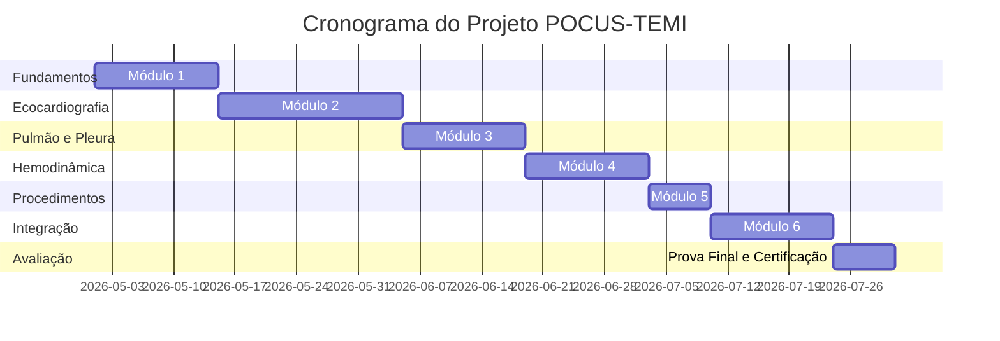

# 📚 ROTEIRO COMPLETO E METICULOSO PARA A PROVA DE TÍTULO EM TERAPIA INTENSIVA (TEMI/AMIB)

> *"A preparação para o TEMI não é sobre decorar, é sobre integrar evidência, diretriz e prática clínica."*

---

## 🗂️ ESTRUTURA DA PROVA (Edital TEMI 2026) [[5]][[6]]

| Etapa | Formato | Características |
|-------|---------|----------------|
| **1ª Fase** | Prova teórica objetiva | 80-100 questões de múltipla escolha, caráter eliminatório |
| **2ª Fase** | Prova teórico-prática | Estações clínicas simuladas (OSCE), avaliação de raciocínio e conduta |
| **Complementar** | Análise curricular | Pontuação por produção científica, cursos, experiência em UTI |

📅 **Datas-chave 2026**: Inscrições até 15/07 • Prova teórica: 10/11 • Prova prática: 15/11 [[5]][[6]]

---

# 🎯 EIXOS TEMÁTICOS PRIORITÁRIOS (POR PESO E FREQUÊNCIA)

---

## 🔴 EIXO 1: SEPSE E CHOQUE SÉPTICO (⭐⭐⭐⭐⭐)

### 📋 Conceitos Fundamentais
- Definições Sepsis-3: sepse, choque séptico, SOFA/qSOFA
- Fisiopatologia: resposta imune, disfunção endotelial, coagulopatia
- Biomarcadores: lactato, procalcitonina, PCR – indicações e limitações

### 📚 Diretrizes Essenciais
- **Surviving Sepsis Campaign 2021 + atualizações 2024** [[19]][[23]]
  - Bundle 1h: lactato + hemoculturas + antibiótico + cristaloide
  - Alvo de PAM ≥65 mmHg (individualizar em hipertensos)
  - Corticoide: hidrocortisona 200 mg/d se choque refratário >4-6h

### 🧪 Trials Imprescindíveis
| Trial | Pergunta | Resultado | Aplicação Prática |
|-------|----------|-----------|------------------|
| ProCESS/ARISE/ProMISe | EGDT vs usual | Sem benefício do protocolo rígido | Ressuscitação individualizada, sem obrigatoriedade de SvO₂ |
| ANDROMEDA-SHOCK | TEC vs lactato | TEC-guiado com tendência a melhor desfecho | Usar TEC + lactato como complemento |
| ADRENAL/APROCCHSS | Corticoide em choque | Reversão mais rápida do choque | Indicar após 4-6h de vasopressor |
| CENSER | Noradrenalina precoce | Menor tempo para atingir PAM alvo | Iniciar vasopressor cedo, até por acesso periférico |

### ⚠️ Armadilhas da Prova
- ❌ Não usar Protein C ativada (PROWESS-SHOCK)
- ❌ Não usar HES (CHEST/6S)
- ❌ Não usar EGDT rígido com CVC obrigatório

---

## 🫁 EIXO 2: INSUFICIÊNCIA RESPIRATÓRIA E VENTILAÇÃO MECÂNICA (⭐⭐⭐⭐⭐)

### 📋 Conceitos Fundamentais
- Fisiologia respiratória: complacência, resistência, V/Q
- Interpretação de gasometria arterial e distúrbios ácido-base
- Modos ventilatórios: VCV, PCV, PSV, APRV, NAVA

### 📚 Diretrizes Essenciais
- **Diretrizes Brasileiras de Ventilação Mecânica (AMIB, 2013 + atualizações)** [[13]]
- **ESICM/ATS Guidelines on ARDS (2023-2024)**

### 🧪 Trials Imprescindíveis
| Trial | Pergunta | Resultado | Aplicação Prática |
|-------|----------|-----------|------------------|
| ARDSNet (2000) | Vt 6 vs 12 mL/kg | ↓ mortalidade com Vt baixo | VM protetora: Vt 6-8 mL/kg PBW, Platô ≤30 |
| PROSEVA (2013) | Decúbito ventral em SDRA grave | ↓ mortalidade 28d e 90d | Indicar precoce em PaO₂/FiO₂ <150 |
| ROSE (2019) | BNM precoce vs sedação leve | Sem benefício na mortalidade | BNM apenas para dessincronia grave |
| FACTT (2006) | Estratégia conservadora de fluidos | ↑ dias livres de VM | Restrição hídrica após estabilização |
| EPVENT2 (2019) | PEEP guiada por pressão esofágica | Sem benefício primário | Técnica avançada, não rotina |

### 🛠️ Habilidades Práticas Cobradas
- Calcular PBW e ajustar Vt
- Interpretar curvas de fluxo/pressão/volume
- Manejar auto-PEEP e dessincronias
- Indicar e monitorar ventilação não invasiva (VNI)
- Realizar teste de respiração espontânea (SBT) e extubação

### ⚠️ Armadilhas da Prova
- ❌ Não usar HFOV rotineiramente (OSCILLATE/OSCAR)
- ❌ Não usar BNM como rotina em SDRA (ROSE)
- ❌ Não usar PEEP muito alta sem indicação específica

---

## 💧 EIXO 3: HEMODINÂMICA, CHOQUE E FLUIDOS (⭐⭐⭐⭐⭐)

### 📋 Conceitos Fundamentais
- Tipos de choque: distributivo, cardiogênico, hipovolêmico, obstrutivo
- Monitorização: PAM, PVC, lactato, ecocardiografia, PICCO, Swan-Ganz
- Resposta a fluidos: conceitos de preload, Frank-Starling, testes dinâmicos

### 📚 Diretrizes Essenciais
- **ESICM Guidelines on Fluid Therapy (2025)** [[37]][[41]]
  - Volume inicial: 30 mL/kg em sepse (individualizar)
  - Limite de 5L nas primeiras 24h em choque séptico
  - Preferir cristaloide balanceado sobre SF 0,9%

### 🧪 Trials Imprescindíveis
| Trial | Pergunta | Resultado | Aplicação Prática |
|-------|----------|-----------|------------------|
| SAFE (2004) | Albumina vs SF | Sem diferença na mortalidade | Albumina segura, usar em hipoalbuminemia grave |
| SMART/SALT-ED (2018) | Balanceado vs SF | ↓ IRA e MAE com balanceados | Preferir Ringer Lactato/Plasmalyte |
| CLOVERS/PLUS (2022-23) | Balanceado vs SF em sepse | Sem diferença na mortalidade | Confirma segurança, mas prática mantém balanceados |
| VASST (2010) | Vasopressina + NE vs NE | Sem diferença na mortalidade | Vasopressina como adjuvante em choque refratário |
| CLASSIC (2022) | Hipotensão permissiva vs padrão | Sem benefício | Manter PAM ≥65 mmHg, exceto em casos muito selecionados |

### 🛠️ Habilidades Práticas Cobradas
- Interpretar ecocardiograma à beira-leito (TTE/TEE básico)
- Realizar teste de elevação passiva de pernas (PLR)
- Calcular dose de vasopressores e ajustar infusão
- Reconhecer e manejar choque misto

### ⚠️ Armadilhas da Prova
- ❌ Não usar HES em pacientes críticos (CHEST/6S)
- ❌ Não usar SF 0,9% como primeira linha em grandes volumes
- ❌ Não iniciar vasopressor apenas por PVC baixa

---

## 🫘 EIXO 4: INSUFICIÊNCIA RENAL AGUDA E TRS (⭐⭐⭐⭐)

### 📋 Conceitos Fundamentais
- Definição e estadiamento KDIGO de IRA
- Fisiopatologia: pré-renal, intrínseca, pós-renal
- Biomarcadores: creatinina, diurese, NGAL, TIMP-2•IGFBP7

### 📚 Diretrizes Essenciais
- **KDIGO AKI Guidelines (2012 + atualizações 2024)** [[28]][[30]]
  - Evitar nefrotóxicos, otimizar hemodinâmica
  - Iniciar TRS por indicação clínica, não por biomarcador isolado

### 🧪 Trials Imprescindíveis
| Trial | Pergunta | Resultado | Aplicação Prática |
|-------|----------|-----------|------------------|
| ATN/RENAL (2008-09) | Dose intensiva vs padrão de TRS | Sem diferença na mortalidade | Dose efetiva: 20-25 mL/kg/h |
| AKIKI/IDEAL-ICU (2016-18) | TRS precoce vs atrasada | Sem benefício com início precoce | Iniciar por indicação clássica (refratariedade, hipercalemia, acidose) |
| STARRT-AKI (2020) | Aceleração por biomarcadores vs padrão | Sem benefício, ↑ complicações | Não iniciar TRS "preventivo" por NGAL/KIM-1 |
| BICAR-ICU (2018) | Bicarbonato em IRA + acidose grave | ↓ necessidade de TRS no subgrupo IRA estágio 3 | Usar seletivamente em pH ≤7,20 refratário |

### 🛠️ Habilidades Práticas Cobradas
- Estadiar IRA pelo KDIGO
- Escolher modalidade de TRS (IHD, SLED, CVVH)
- Ajustar dose e anticoagulação da TRS
- Reconhecer complicações da TRS (hipotensão, desequilíbrio eletrolítico)

### ⚠️ Armadilhas da Prova
- ❌ Não iniciar TRS apenas por oligúria ou creatinina elevada
- ❌ Não usar dose >25-30 mL/kg/h rotineiramente
- ❌ Não usar bicarbonato de rotina em acidose metabólica

---

## 🧠 EIXO 5: NEUROCRÍTICO, SEDÇÃO, ANALGESIA E DELIRIUM (⭐⭐⭐⭐)

### 📋 Conceitos Fundamentais
- Escalas: RASS, SAS, CAM-ICU, ICDSC, GCS, NIHSS
- Fisiopatologia do delirium: fatores de risco, prevenção
- Farmacologia: propofol, midazolam, dexmedetomidina, opioides

### 📚 Diretrizes Essenciais
- **SCCM PADIS Guidelines (2018 + atualizações)** 
- **ESICM Guidelines on Sedation/Analgesia (2023-2024)**

### 🧪 Trials Imprescindíveis
| Trial | Pergunta | Resultado | Aplicação Prática |
|-------|----------|-----------|------------------|
| Kress (2000) | Interrupção diária de sedação | ↓ dias de VM, ↓ tempo na UTI | Implementar "sedation holiday" diário |
| Girard/CCS (2008) | Despertar + SBT vs usual | ↓ mortalidade, ↑ alta hospitalar | Protocolo ABCDEF: dor, sedação, delirium, mobilização |
| MIND-USA/SPICE III (2018-19) | Dexmedetomidina vs propofol/midazolam | Sem superioridade clara no desfecho primário | Escolher sedativo conforme cenário clínico |
| DECRA/RESCUE-ICP (2011-16) | Craniectomia em PIC refratária | ↓ mortalidade, mas pior desfecho funcional | Decisão compartilhada com família |
| INTERACT2/ATACH-2 (2013-16) | Controle intensivo de PA na HIC | Alvo 140 mmHg seguro, pode melhorar função | Controlar gradualmente, evitar hipotensão |

### 🛠️ Habilidades Práticas Cobradas
- Aplicar e interpretar escalas de sedação e delirium
- Titular sedativos e analgésicos com segurança
- Manejar agitação e dessincronia na VM
- Indicar e monitorar pressão intracraniana (PIC)

### ⚠️ Armadilhas da Prova
- ❌ Não usar BNM rotineiramente para facilitar VM (ROSE)
- ❌ Não usar dexmedetomidina como "superior" em todos os casos
- ❌ Não realizar craniectomia sem discutir prognóstico funcional

---

## 🫀 EIXO 6: PÓS-PARADA CARDÍACA E OXIGENAÇÃO (⭐⭐⭐⭐)

### 📋 Conceitos Fundamentais
- Cadeia de sobrevivência intra e extra-hospitalar
- Síndrome pós-parada: disfunção miocárdica, lesão cerebral, resposta inflamatória
- Alvos terapêuticos: temperatura, oxigenação, ventilação, hemodinâmica

### 📚 Diretrizes Essenciais
- **ERC-ESICM Guidelines on Post-Resuscitation Care (2021 + atualizações 2025)** [[44]]
  - Evitar febre (>37,7°C), não obrigatoriedade de 33°C
  - SpO₂ alvo 90-96%, evitar hiperóxia

### 🧪 Trials Imprescindíveis
| Trial | Pergunta | Resultado | Aplicação Prática |
|-------|----------|-----------|------------------|
| TTM (2013) | 33°C vs 36°C pós-PCR | Sem diferença na mortalidade/neurologia | Desmistificou 33°C como obrigatório |
| TTM2 (2021) | 33°C vs normotermia ativa | Sem diferença; foco em evitar febre | Controle estrito de temperatura, não hipotermia profunda |
| COACT (2019) | Cateterismo imediato vs tardio em PCR não-SCA | Sem diferença na sobrevida | Angiografia guiada por suspeita clínica/ECG |
| ICU-ROX/HOT-ICU/PRECISE (2019-23) | Oxigênio conservador vs liberal | Sem diferença na mortalidade | Evitar hiperóxia: PaO₂ 60-100 mmHg |

### 🛠️ Habilidades Práticas Cobradas
- Interpretar ECG pós-PCR e indicar cateterismo
- Manejar temperatura com dispositivos de controle
- Ajustar FiO₂ e PEEP para evitar hiperóxia/hipóxia
- Reconhecer e tratar disfunção miocárdica pós-PCR

### ⚠️ Armadilhas da Prova
- ❌ Não usar hipotermia a 33°C como rotina obrigatória
- ❌ Não manter SpO₂ >98% rotineiramente
- ❌ Não indicar cateterismo em PCR não-choqueável sem suspeita de SCA

---

## 🩸 EIXO 7: INFECÇÕES, ANTIMICROBIANOS E PREVENÇÃO (⭐⭐⭐⭐)

### 📋 Conceitos Fundamentais
- Diagnóstico de infecção em paciente crítico: desafios e biomarcadores
- Farmacocinética/farmacodinâmica de antibióticos na UTI
- Prevenção de IRAS: PAV, ITU, corrente sanguínea, S. aureus

### 📚 Diretrizes Essenciais
- **Surviving Sepsis Campaign (antimicrobianos)** 
- **Diretrizes Brasileiras de Prevenção de IRAS (ANVISA/AMIB)**

### 🧪 Trials e Conceitos-Chave
- **Desescalonamento**: iniciar amplo, ajustar conforme cultura
- **Duração curta**: 7 dias para PAV/HAP na maioria dos casos
- **Procalcitonina**: pode guiar suspensão de antibióticos, mas não substitui julgamento clínico

### 🛠️ Habilidades Práticas Cobradas
- Escolher esquema empírico conforme foco e epidemiologia local
- Ajustar dose em IRA, obesidade, ECMO
- Interpretar culturas e decidir sobre desescalonamento
- Implementar bundle de prevenção de PAV e ITU

### ⚠️ Armadilhas da Prova
- ❌ Não manter antibiótico "por segurança" sem indicação
- ❌ Não usar procalcitonina isoladamente para decidir início/suspensão
- ❌ Não ignorar epidemiologia local na escolha empírica

---

## 🍽️ EIXO 8: NUTRIÇÃO E METABOLISMO (⭐⭐⭐)

### 📋 Conceitos Fundamentais
- Avaliação nutricional no crítico: NRS-2002, NUTRIC score
- Metabolismo do estresse: catabolismo, resistência à insulina
- Vias de administração: enteral vs parenteral, indicações

### 📚 Diretrizes Essenciais
- **ESPEN Guidelines on Clinical Nutrition in the ICU (2019 + atualizações)**
- **ESICM Guidelines on Early Enteral Nutrition (2024)** [[41]]

### 🧪 Trials e Conceitos-Chave
- **Início precoce de nutrição enteral** (24-48h) se trato GI funcional
- **Alvo calórico**: 20-25 kcal/kg/dia na fase aguda, evitar superalimentação
- **Proteína**: 1,2-2,0 g/kg/dia, priorizar em pacientes com perda muscular

### 🛠️ Habilidades Práticas Cobradas
- Calcular necessidade calórica e proteica
- Escolher fórmula enteral conforme comorbidades
- Manejar intolerância gástrica e diarreia
- Indicar nutrição parenteral quando enteral contraindicada

### ⚠️ Armadilhas da Prova
- ❌ Não iniciar nutrição parenteral precoce se enteral possível
- ❌ Não superalimentar na fase aguda (risco de hiperglicemia, esteatose)
- ❌ Não ignorar refeeding syndrome em pacientes desnutridos

---

## ⚖️ EIXO 9: ÉTICA, CUIDADOS PALIATIVOS E TOMADA DE DECISÃO (⭐⭐⭐⭐)

### 📋 Conceitos Fundamentais
- Princípios da bioética: autonomia, beneficência, não-maleficência, justiça
- Limitação de suporte de vida (LSV): suspensão vs não-início
- Comunicação de más notícias e decisão compartilhada

### 📚 Diretrizes Essenciais
- **Diretrizes AMIB/CFM sobre LSV e Cuidados Paliativos em UTI**
- **Consenso Brasileiro de Cuidados Paliativos em Terapia Intensiva**

### 🧪 Temas Frequentes
- **Ortotanásia vs distanásia vs eutanásia**: diferenças legais e éticas
- **Testamento vital e procurador de cuidados**: validade e aplicação
- **Sedação paliativa**: indicações, fármacos, monitorização

### 🛠️ Habilidades Práticas Cobradas
- Conduzir reunião familiar para decisão de LSV
- Redatar documento de limitação de suporte de vida
- Manejar sintomas no fim da vida (dispneia, dor, agitação)
- Reconhecer conflito ético e acionar comitê de bioética

### ⚠️ Armadilhas da Prova
- ❌ Não confundir sedação paliativa com eutanásia
- ❌ Não iniciar LSV sem discussão multiprofissional e familiar
- ❌ Não ignorar sofrimento do paciente sob pretexto de "não abandonar"

---

## 🏥 EIXO 10: ORGANIZAÇÃO DA UTI, SEGURANÇA E GESTÃO (⭐⭐⭐)

### 📋 Conceitos Fundamentais
- Indicadores de qualidade: mortalidade padronizada, tempo de VM, reinternação
- Segurança do paciente: checklist, bundle, notificação de eventos
- Humanização e família: visita aberta, participação nos cuidados

### 📚 Diretrizes Essenciais
- **Diretrizes AMIB de Estrutura e Funcionamento de UTI**
- **Programa Nacional de Segurança do Paciente (ANVISA)**

### 🧪 Temas Frequentes
- **Checklist de admissão e alta da UTI**
- **Bundle de prevenção de PAV, ITU, TVP, úlcera por pressão**
- **Gestão de leitos e triagem: critérios de priorização**

### 🛠️ Habilidades Práticas Cobradas
- Interpretar indicadores de qualidade da UTI
- Implementar protocolo de segurança (ex: checklist de VM)
- Conduzir reunião de alta com plano de cuidado pós-UTI

---

# 📅 CRONOGRAMA DE ESTUDOS SUGERIDO (12 SEMANAS)

| Semana | Foco Principal | Atividades Sugeridas |
|--------|---------------|---------------------|
| 1-2 | Sepse e Choque | Ler SSC 2021 + atualizações; resolver 50 questões; revisar trials ProCESS, ANDROMEDA, ADRENAL |
| 3-4 | VM e SDRA | Revisar Diretrizes AMIB VM; praticar cálculo de PBW/PEEP; estudar PROSEVA, ROSE, FACTT |
| 5-6 | Hemodinâmica e Fluidos | Estudar ESICM Fluids 2025; revisar SMART, SAFE, VASST; praticar ecocardiograma básico |
| 7 | IRA e TRS | Ler KDIGO AKI; estudar AKIKI, STARRT-AKI; praticar estadiamento e indicação de TRS |
| 8 | Neurocrítico e Sedação | Revisar PADIS Guidelines; estudar Kress, Girard, MIND-USA; praticar escalas RASS/CAM-ICU |
| 9 | Pós-PCR e Oxigenação | Estudar TTM, TTM2, COACT; revisar ERC-ESICM 2025; praticar ajuste de FiO₂ e temperatura |
| 10 | Infecções e Nutrição | Revisar diretrizes de antimicrobianos e ESPEN; estudar farmacocinética na UTI |
| 11 | Ética e Gestão | Ler diretrizes AMIB/CFM de LSV; estudar indicadores de qualidade e segurança |
| 12 | Revisão Geral e Simulados | Fazer 2-3 simulados completos; revisar erros; focar em "armadilhas" e trials negativos |

---

# 📚 FONTES OFICIAIS E MATERIAIS RECOMENDADOS

### 🌐 Diretrizes e Guidelines
- [AMIB – Lista de Diretrizes Brasileiras](https://amib.org.br/lista-de-diretrizes/) [[13]]
- Surviving Sepsis Campaign 2021 + atualizações 2024 [[19]][[23]]
- KDIGO AKI Guidelines (2012 + 2024 updates) [[28]][[30]]
- ESICM Clinical Practice Guidelines (2023-2025) [[37]][[41]][[44]]
- SCCM PADIS Guidelines (2018)

### 📖 Livros e Compêndios
- **"Terapia Intensiva" – AMIB/Atheneu** (capítulos com boxes de evidência)
- **"Principles of Critical Care" – Hall, Schmidt, Wood** (referência internacional)
- **"The ICU Book" – Paul Marino** (didático, ótimo para fundamentos)

### 💻 Plataformas de Estudo
- **AMIB Online / CETI**: cursos preparatórios com questões comentadas
- **UpToDate / DynaMed**: resumos rápidos de trials e diretrizes
- **Pulse / Medscape**: atualizações diárias em medicina intensiva

### ✍️ Questões e Simulados
- Provas anteriores do TEMI (disponíveis para associados AMIB)
- Bancas de concursos de terapia intensiva (EBSERH, SUS, universidades)
- Plataformas: Estratégia Med, Sanar, Medcel, CEPEMED

---

# 🎯 DICAS ESTRATÉGICAS PARA A PROVA

### ✅ Na Prova Teórica
1. **Leia o enunciado inteiro** antes de olhar as alternativas
2. **Identifique a pergunta central**: diagnóstico? conduta? prognóstico?
3. **Elimine distratores óbvios**: condutas abandonadas (HES, EGDT rígido, HFOV)
4. **Cuidado com "sempre/nunca"**: medicina intensiva é cheia de exceções
5. **Gerencie o tempo**: ~1,5 min por questão; marque as difíceis e volte depois

### ✅ Na Prova Prática (OSCE)
1. **Siga um roteiro mental**: ABCDE, diagnóstico diferencial, conduta imediata
2. **Comunique-se claramente**: explique seu raciocínio para o examinador
3. **Priorize segurança**: checar alergias, interações, monitorização antes de prescrever
4. **Mostre integração**: conecte fisiopatologia, evidência e contexto do paciente
5. **Mantenha a calma**: respirar fundo e pensar passo a passo evita erros por ansiedade

### ✅ Revisão Final (Última Semana)
- Revise **apenas seus resumos e flashcards** – não tente aprender conteúdo novo
- Foque nos **trials "negativos"** (o que NÃO fazer) – a banca adora cobrar isso
- Pratique **cálculos rápidos**: PBW, dose de vasopressor, clearance de creatinina
- Durma bem na véspera – consolidação da memória depende de sono de qualidade

---

# 🔄 RECURSOS ADICIONAIS SOB DEMANDA

Posso gerar para você:
- 🗂️ **Flashcards em formato Anki** dos principais trials e diretrizes
- ❓ **Banco de 100 questões comentadas** por eixo temático
- 📊 **Tabelas comparativas** de trials (pergunta, resultado, aplicação)
- 🗓️ **Cronograma personalizado** conforme seu tempo disponível
- 🎧 **Resumos em áudio** para revisão no trânsito/academia

É só me dizer qual formato você prefere e eu preparo!

> **Lembre-se**: O TEMI não testa apenas o que você sabe, mas **como você pensa**. Integração, raciocínio clínico e segurança do paciente são tão importantes quanto a evidência isolada. Boa preparação! 🩺✨

# 🎯 PROJETO PREPARATÓRIO: ULTRASSONOGRAFIA À BEIRA LEITO (POCUS) PARA O TEMI 2026

> *"O intensivista que domina o POCUS não apenas diagnostica mais rápido — ele decide com mais segurança."*

---

## 📋 VISÃO GERAL DO PROJETO

| Item | Descrição |
|------|-----------|
| **Público-alvo** | Médicos intensivistas candidatos ao TEMI 2026 |
| **Duração** | 12 semanas (3 meses) |
| **Carga horária** | 120 horas (40h teóricas + 80h práticas) |
| **Formato** | Híbrido: online (teoria) + presencial (prática) |
| **Objetivo final** | Domínio das competências em POCUS exigidas pela AMIB para aprovação no TEMI |

> A ultrassonografia à beira do leito é um recurso básico da formação do intensivista, recomendado pela AMIB/SOMITI para racionalização de recursos e tomada de decisão rápida [[1]].

---

## 🎯 COMPETÊNCIAS ALVO (BASEADAS NO CONSENSO AMIB/ABEM/SBMH)

O documento de consenso brasileiro define **três níveis de competência** em ecocardiografia à beira do leito [[66]][[72]]:

### 🔹 NÍVEL 1: COMPETÊNCIA BÁSICA (OBRIGATÓRIA PARA O TEMI)
| Domínio | Habilidades Esperadas |
|---------|----------------------|
| **Aquisição de imagens** | Obter cortes padronizados: paraesternal longitudinal/transverso, apical 4 câmaras, subcostal, veia cava inferior |
| **Reconhecimento de padrões** | Identificar: derrame pericárdico, disfunção ventricular grossa, VCI colabada/dilatada, linhas B pulmonares, líquido livre abdominal |
| **Integração clínica** | Correlacionar achados ultrassonográficos com quadro clínico e direcionar conduta imediata |
| **Limites de atuação** | Saber quando solicitar ecocardiograma formal ou consulta ao especialista |

### 🔹 NÍVEL 2: COMPETÊNCIA INTERMEDIÁRIA (DESEJÁVEL)
| Domínio | Habilidades Esperadas |
|---------|----------------------|
| **Medições quantitativas** | Calcular fração de encurtamento, estimar pressão arterial pulmonar, medir VTI para débito cardíaco |
| **Avaliação dinâmica** | Realizar e interpretar testes de responsividade volêmica (PLR, variação de VCI/VCS) |
| **Protocolos estruturados** | Aplicar protocolos RUSH, FATE, FEEL, BLUE de forma sistemática |

### 🔹 NÍVEL 3: COMPETÊNCIA AVANÇADA (DIFERENCIAL)
| Domínio | Habilidades Esperadas |
|---------|----------------------|
| **Ecocardiografia quantitativa avançada** | Strain, Doppler tecidual, avaliação detalhada de valvas |
| **Ultrassom de múltiplos órgãos** | Avaliação renal, esplênica, cerebral (TCD básico), muscular |
| **Ensino e supervisão** | Capacidade de treinar outros profissionais em POCUS |

> Para o TEMI, o foco deve estar no **Nível 1 consolidado + elementos do Nível 2**, conforme exigido nas estações práticas da prova [[59]][[87]].

---

## 🗂️ ESTRUTURA CURRICULAR DETALHADA

### 📚 MÓDULO 1: FUNDAMENTOS DO POCUS (Semana 1-2)
| Tema | Conteúdo | Atividade Prática |
|------|----------|------------------|
| **Física do ultrassom** | Princípios de imagem, artefatos, ajustes de ganho, profundidade, foco | Simulador virtual de ajustes de máquina |
| **Ergonomia e segurança** | Posicionamento do operador, prevenção de LER, biossegurança, limpeza do transdutor | Treino de postura e manuseio em phantom |
| **Anatomia ultrassonográfica** | Correlação anatômica dos cortes padrão em modelos 3D | Identificação de estruturas em banco de imagens |
| **Documentação e laudo** | Padronização de registro, nomenclatura, integração ao prontuário | Exercício de preenchimento de checklist de exame |

✅ **Meta de aprendizagem**: Realizar 5 cortes básicos com qualidade técnica adequada em <3 minutos.

---

### 🫀 MÓDULO 2: ECOCARDIOGRAFIA À BEIRA LEITO (Semana 3-5)
| Tema | Conteúdo | Trial/Diretriz Relacionada | Atividade Prática |
|------|----------|---------------------------|------------------|
| **Avaliação qualitativa da função ventricular** | "Eyeball method", reconhecimento de hipocinesia global/focal, "kissing walls" | Diretriz AMIB Ecocardiografia 2023 [[72]] | Análise de vídeos de casos com diferentes frações de ejeção |
| **Avaliação do ventrículo direito** | Dilatação VD, sinal de McConnell, relação VD/VE | ESC Guidelines on Acute Pulmonary Embolism | Casos de TEP e SDRA com sobrecarga de VD |
| **Veia cava inferior e responsividade volêmica** | Medição de diâmetro e colapsabilidade, limites em VM espontânea vs controlada | ESICM Fluid Therapy Guidelines 2025 [[41]] | Simulação de PLR com medida de variação de VCI |
| **Derrame pericárdico e tamponamento** | Reconhecimento de derrame, colapso diastólico de AD/VD, sinais de tamponamento | Consenso AMIB/ABEM 2023 [[66]] | Casos clínicos de tamponamento com decisão de pericardiocentese |
| **Débito cardíaco por VTI** | Medição do VTI no trato de saída do VE, cálculo de DC, limitações | SCCM Guidelines on Critical Care Ultrasound 2024 [[2]] | Exercício de cálculo de DC em diferentes cenários hemodinâmicos |

✅ **Meta de aprendizagem**: Identificar corretamente 4 padrões ecocardiográficos críticos em casos simulados.

---

### 🫁 MÓDULO 3: ULTRASSOM PULMONAR E PLEURAL (Semana 6-7)
| Tema | Conteúdo | Trial/Diretriz Relacionada | Atividade Prática |
|------|----------|---------------------------|------------------|
| **Artefatos pulmonares básicos** | Linhas A, B, C, consolidação, derrame pleural, sinal do pulmão deslizante | Diretriz AMIB para COVID-19/UTI [[1]][[91]] | Banco de imagens: classificação de padrões A/B/consolidação |
| **Protocolo BLUE e derivativos** | Algoritmo para diagnóstico diferencial de insuficiência respiratória aguda | Lichtenstein POCUS Guidelines | Casos de SDRA, edema cardiogênico, pneumotórax, pneumonia |
| **Avaliação de desmame ventilatório** | Escore de aeração pulmonar, espessamento e excursão diafragmática | Recomendações AMIB Desmame Ventilatório [[91]] | Medição de espessamento diafragmático em vídeos de SBT |
| **Derrame pleural e procedimentos** | Identificação de líquido, estimativa de volume, guia para toracocentese | Diretriz de Procedimentos Guiados por US | Simulação de marcação de ponto seguro para punção |

✅ **Meta de aprendizagem**: Classificar corretamente o perfil pulmonar em 5 casos de insuficiência respiratória aguda.

---

### 💧 MÓDULO 4: HEMODINÂMICA INTEGRADA E PROTOCOLOS (Semana 8-9)
| Tema | Conteúdo | Trial/Diretriz Relacionada | Atividade Prática |
|------|----------|---------------------------|------------------|
| **Protocolo RUSH (Rapid Ultrasound in Shock)** | Avaliação sistematizada: Pump (coração), Tank (VCI/pulmão), Pipes (aorta/artérias) | Protocolo RUSH validado em choque [[77]][[84]] | Simulação de 3 cenários de choque com aplicação do RUSH |
| **Protocolo FATE/FEEL (PCR)** | Avaliação rápida em parada: função cardíaca, tamponamento, TEP, hipovolemia | ERC-ESICM Guidelines on Post-Resuscitation [[44]] | Casos de PCR com decisão de continuidade de RCP |
| **Integração ECO + LUS + VExUS** | Os três pilares para decisão sobre fluidos: hipovolemia, congestão, responsividade | Hunsicker et al. Intensive Care Med 2025 [[2]] | Casos complexos com decisão de administrar ou restringir fluidos |
| **Avaliação de perfusão tecidual** | Doppler de artérias renais/esplênicas, índice de resistividade, correlação com lactato | Recomendações AMIB Monitorização Hemodinâmica [[91]] | Interpretação de Doppler renal em casos de IRA e sepse |

✅ **Meta de aprendizagem**: Aplicar o protocolo RUSH em <5 minutos e propor conduta adequada em cenário simulado.

---

### 🛠️ MÓDULO 5: PROCEDIMENTOS GUIADOS POR ULTRASSOM (Semana 10)
| Tema | Conteúdo | Diretriz Relacionada | Atividade Prática |
|------|----------|---------------------|------------------|
| **Acesso vascular central** | Técnica in-plane/out-of-plane, identificação de veia jugular/subclávia/femoral | SCCM Guidelines on Vascular Access 2024 | Treino em phantom de punção jugular guiada por US |
| **Acesso arterial** | Punção de artéria radial/femoral com guia ultrassonográfica | Diretriz AMIB de Procedimentos | Simulação de cateterização arterial com US |
| **Drenagem de coleções** | Identificação de abscesso, derrame, hematomas; planejamento de trajeto seguro | Consenso de Procedimentos Intervencionistas | Casos de drenagem pleural/abdominal com planejamento por US |
| **Confirmação de posicionamento** | Tubo endotraqueal, sonda nasogástrica, cateteres | Recomendações AMIB COVID-19 [[91]] | Exercício de confirmação de posição de TOT e SNE por US |

✅ **Meta de aprendizagem**: Realizar punção jugular guiada por US em phantom com sucesso em 3 tentativas consecutivas.

---

### 🧠 MÓDULO 6: INTEGRAÇÃO CLÍNICA E PROVA PRÁTICA (Semana 11-12)
| Tema | Conteúdo | Formato de Treino |
|------|----------|------------------|
| **Estações OSCE focadas em POCUS** | 5 estações: (1) Choque séptico, (2) SDRA, (3) PCR, (4) Desmame, (5) Procedimento | Simulação com ator-paciente + manequim + máquina de US |
| **Raciocínio clínico integrado** | Conectar achados do POCUS com fisiopatologia, trials e diretrizes | Discussão de casos com feedback estruturado |
| **Comunicação e documentação** | Explicar achados para a "banca", registrar de forma clara e objetiva | Gravação de mini-laudo oral + escrito com correção |
| **Gestão de erros e limitações** | Reconhecer quando o exame é inconclusivo e solicitar ajuda | Casos deliberadamente desafiadores com debriefing |

✅ **Meta final**: Aprovação em simulado OSCE com nota ≥8,0 em todas as estações de POCUS.

---

## 📊 AVALIAÇÃO E CERTIFICAÇÃO

### 🔹 Avaliação Formativa (Contínua)
| Instrumento | Frequência | Critério de Aprovação |
|-------------|-----------|---------------------|
| Quiz teórico online | Semanal | ≥70% de acertos |
| Checklist de habilidades práticas | Por módulo | Execução correta de ≥80% dos itens |
| Análise de casos clínicos | Quinzenal | Raciocínio adequado + conduta baseada em evidência |
| Simulação de OSCE parcial | Semanas 6 e 10 | Nota ≥7,0 em cada estação |

### 🔹 Avaliação Somativa (Final)
| Componente | Peso | Descrição |
|-----------|------|-----------|
| Prova teórica objetiva | 30% | 40 questões sobre fundamentos, trials, diretrizes |
| Estação OSCE completa | 50% | 5 estações de 10 minutos cada, avaliadas por checklist validado |
| Portfólio de casos | 20% | Registro de 20 exames realizados com supervisão + reflexão crítica |

✅ **Aprovação no projeto**: Média final ≥7,5 + aprovação em todas as estações OSCE.

---

## 🛠️ RECURSOS NECESSÁRIOS

### 🔹 Infraestrutura Física
- Sala de simulação com 4 estações de treino (eco, pulmão, vascular, abdominal)
- 4-6 aparelhos de ultrassom portáteis (com transdutores convexo, linear e faseado)
- Phantoms para treino de punção vascular e procedimentos
- Manequins de alta fidelidade para cenários clínicos integrados
- Sistema de gravação para feedback de desempenho

### 🔹 Recursos Digitais
- Plataforma EAD com vídeos demonstrativos, banco de imagens e quizzes
- Aplicativo de simulação de ajustes de máquina de ultrassom
- Banco de casos clínicos anonimizados com vídeos de POCUS
- Checklist digital de habilidades para autoavaliação

### 🔹 Corpo Docente
- 2 intensivistas com certificação em POCUS (nível avançado)
- 1 ecocardiografista para supervisão de casos complexos
- 1 enfermeiro especialista em simulação para coordenação de OSCE
- 1 tutor de comunicação clínica para treino de laudo oral

---

## 📅 CRONOGRAMA DETALHADO (12 SEMANAS)

### 🗓️ Rotina Semanal Sugerida
| Dia | Atividade | Duração |
|-----|----------|---------|
| **Segunda** | Aula teórica online + quiz | 2h |
| **Terça** | Estudo individual: leitura de diretrizes/trials | 2h |
| **Quarta** | Prática supervisionada em laboratório | 3h |
| **Quinta** | Discussão de casos clínicos em grupo | 2h |
| **Sexta** | Revisão de erros + planejamento da semana seguinte | 1h |
| **Sábado** | Simulação OSCE ou treino autônomo (opcional) | 2-4h |

---

## 📚 FONTES BIBLIOGRÁFICAS ESSENCIAIS

### 🔹 Diretrizes e Consensos Brasileiros
1. **AMIB/SOMITI**. Recomendações sobre Ultrassonografia no Manejo do Paciente com COVID-19 na UTI. 2024. [[1]][[91]]
2. **AMIB/ABEM/SBMH**. Uso da Ecocardiografia à Beira do Leito no Cuidado do Paciente Grave – Documento de Consenso. *Critical Care Science*. 2023. [[66]][[72]]
3. **AMIB**. Diretrizes Brasileiras de Ventilação Mecânica. 2013 + atualizações. [[13]]
4. **AMIB**. Programa de Formação por Competência em Medicina Intensiva (PROCOMI). [[87]][[89]]

### 🔹 Diretrizes Internacionais
5. **SCCM**. Guidelines on Adult Critical Care Ultrasonography: Focused Update 2024. *Crit Care Med*. 2025. [[2]]
6. **ESICM**. Clinical Practice Guidelines on Fluid Therapy in Critically Ill Adults. 2025. [[37]][[41]]
7. **ERC-ESICM**. Guidelines on Post-Resuscitation Care. 2021 + updates 2025. [[44]]
8. **WINFOCUS**. Core Curriculum for Critical Care Ultrasound. 2023.

### 🔹 Trials e Evidências-Chave
| Trial | Aplicação no POCUS | Relevância TEMI |
|-------|-------------------|----------------|
| **ANDROMEDA-SHOCK** (2019) | Uso do TEC + USG para guiar ressuscitação | Alta: integra perfusão periférica e imagem |
| **CLOVERS/PLUS** (2022-23) | Decisão sobre tipo de cristalóide + USG para congestão | Média: contextualiza escolha de fluido |
| **FACTT** (2006) | Estratégia conservadora de fluidos + USG pulmonar | Alta: USG para detectar congestão precoce |
| **ROSE** (2019) | Avaliação de dessincronia e esforço diafragmático por USG | Média: integra USG à decisão sobre BNM |

### 🔹 Livros e Atlas
9. **Marino PL**. *The ICU Book*. 5ª ed. Capítulo: Ultrasonography at the Bedside.
10. **Mayo PH et al.** *Critical Care Ultrasound*. 3ª ed. Elsevier, 2023.
11. **AMIB**. *Terapia Intensiva*. Atheneu, 2024. Capítulos: Monitorização Hemodinâmica, Ventilação Mecânica.

---

## 🎯 ESTRATÉGIAS DE ESTUDO PARA A PROVA TEMI

### ✅ Na Prova Teórica (Questões sobre POCUS)
1. **Foque em indicações e limitações**: A banca cobra mais "quando usar" e "quando NÃO usar" do que detalhes técnicos.
2. **Conecte com trials**: Questões sobre responsividade volêmica frequentemente citam ANDROMEDA-SHOCK ou FACTT.
3. **Cuidado com distratores**: Condutas como "iniciar TRS por NGAL elevado" ou "usar HFOV em SDRA" são erradas — o mesmo vale para "fazer eco formal antes de decidir em choque".
4. **Domine os valores de corte**: %ΔVCI >12-18%, espessamento diafragmático >30%, escore de aeração <17 para extubação [[45]].

### ✅ Na Prova Prática (Estações OSCE)
1. **Siga um roteiro mental**: ABCDE → hipóteses → POCUS para confirmar/excluir → conduta.
2. **Comunique seu raciocínio**: Fale em voz alta o que está vendo e como isso muda sua conduta.
3. **Mostre segurança técnica**: Posicione o transdutor corretamente, ajuste ganho/profundidade, identifique artefatos.
4. **Reconheça limitações**: Se a imagem não for adequada, diga "solicito eco formal" — isso demonstra maturidade.

### ✅ Armadilhas Frequentes
| Erro Comum | Como Evitar |
|-----------|------------|
| Medir VCI sem considerar modo ventilatório | Sempre anotar se paciente está em VM controlada ou espontânea |
| Interpretar linhas B isoladamente | Integrar com contexto clínico: edema cardiogênico vs SDRA vs fibrose |
| Superestimar fração de ejeção visual | Usar "eyeball" apenas para triagem; confirmar com medidas se decisão crítica |
| Ignorar artefatos de reverberação | Treinar reconhecimento de linhas A vs B vs artefatos de equipamento |

---

## 🔄 RECURSOS ADICIONAIS SOB DEMANDA

Posso gerar para você:
- 🗂️ **Checklist de habilidades POCUS** para autoavaliação semanal
- ❓ **Banco de 50 questões comentadas** sobre POCUS no estilo TEMI
- 🎥 **Roteiro de vídeos demonstrativos** dos cortes essenciais
- 📊 **Tabela de valores de corte** para decisões clínicas baseadas em USG
- 🗓️ **Cronograma personalizado** ajustado ao seu tempo disponível

> **Lembrete final**: O TEMI avalia **competência**, não apenas conhecimento. Treine POCUS como você treina intubação: com repetição deliberada, feedback imediato e integração ao raciocínio clínico.

**Boa preparação! 🩺✨**