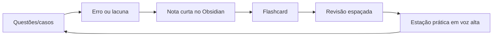

# TEMI 2026 — MASTER OBSIDIAN

Arquivo único consolidado para importação rápida. Para melhor experiência, use também o vault compactado.


---

<!-- Arquivo: README_START_AQUI.md -->

# 🚀 START AQUI — Vault TEMI 2026

> **Objetivo:** transformar o preparo para a prova TEMI em um sistema diário, visual e acionável dentro do Obsidian.

## 1) Como usar no Obsidian

1. Descompacte o arquivo `TEMI_Obsidian_Vault.zip`.
2. Abra o Obsidian → **Open folder as vault** → escolha a pasta `TEMI_Obsidian_Vault`.
3. Abra primeiro: [[00_Dashboard_TEMI_2026]].
4. Depois leia: [[02_Plano_29_Semanas_TDAH]] e [[01_Mapa_Complexos_Tematicos]].
5. Todo dia registre estudo usando [[Templates/Template_Nota_TEMI|Template de nota TEMI]] ou [[Templates/Template_Erro_de_Questao|Template de erro de questão]].

## 2) Regra de ouro 🧠

O preparo TEMI não é “ler muito”. É repetir este ciclo:



## 3) Arquivos principais

- [[00_Dashboard_TEMI_2026]] — painel central.
- [[01_Mapa_Complexos_Tematicos]] — mapa integrado por complexos.
- [[02_Plano_29_Semanas_TDAH]] — programa até a prova teórica.
- [[03_Plano_Retao_Final_8_Semanas]] — aceleração final.
- [[04_Rotina_Diaria_e_Revisao_Espacada]] — rotina anti-procrastinação.
- [[05_Checklist_Documental_Edital]] — inscrição, documentos, currículo.
- [[06_Bibliografia_Oficial_e_Foco]] — leitura oficial priorizada.
- [[Simulados/OSCE_50_Estacoes_Treino]] — treino prático.
- [[Simulados/Banco_100_Perguntas_Ativas]] — perguntas de recuperação ativa.
- [[Anki/TEMI_anki_seed_120_cards.csv]] — CSV inicial para importar no Anki.

## 4) Nota de segurança documental ⚠️

Este vault foi montado com base no edital TEMI 2026 disponível em consulta pública na data de criação e deve ser usado como **sistema de estudo**, não como substituto do edital. Antes de pagar inscrição, enviar documentos ou interpretar elegibilidade, confira sempre a versão oficial mais recente e eventuais retificações no site da AMIB/AMB.

## 5) Primeiro sprint de 7 dias

- [ ] Dia 1 — montar dashboard, confirmar datas/documentos e fazer diagnóstico com 30 questões.
- [ ] Dia 2 — [[Complexos/C02_Via_Aerea_Ventilacao_Mecanica_SRAG_ARDS|C02 VMI/SRAG]] + 20 questões.
- [ ] Dia 3 — [[Complexos/C03_Choque_Hemodinamica_Eco_POCUS|C03 Choque/POCUS]] + 1 estação em voz alta.
- [ ] Dia 4 — [[Complexos/C04_Sepse_Infeccoes_Antimicrobianos|C04 Sepse/ATB]] + flashcards.
- [ ] Dia 5 — revisar erros D1-D4 + 30 questões mistas.
- [ ] Dia 6 — simulado curto 45 questões + correção ativa.
- [ ] Dia 7 — descanso ativo: 20 flashcards + organização documental.

---

**Mantra TEMI:** *decidir rápido, justificar com fisiologia, comunicar com segurança e registrar com clareza.* ⚕️🔥


---

<!-- Arquivo: 00_Dashboard_TEMI_2026.md -->

---
type: dashboard
tags: [temi, uti, planejamento, obsidian]
created: 2026-04-20
status: ativo
---

# 🎯 Dashboard TEMI 2026

## Linha do tempo crítica

| Marco | Data/horário | Ação |
|---|---:|---|
| Inscrições/documentos/pagamento | até 15/07/2026 | janela crítica documental |
| Lista de aptos | 15/08/2026 | conferir deferimento e recurso |
| Envio curricular | até 05/10/2026 18h | não deixar para o fim |
| Resultado curricular | 30/10/2026 | impacta nota mínima da teórica |
| Prova teórica | 10/11/2026 10h | 90 questões, 4 alternativas, 4h |
| Prova prática | 15/11/2026 07h | 50 desafios/estações |

> **Confirmação obrigatória:** antes de cada marco, checar edital vigente e área do candidato.

## Alvo do preparo

- **Teórica:** responder questões por reconhecimento de padrão + fisiologia + guideline, sem depender de memória solta.
- **Prática:** falar condutas em voz alta com estrutura, segurança e priorização.
- **Currículo/documentos:** não perder prova por burocracia.

## Pontuação semanal

| Indicador | Mínimo | Ideal | Elite |
|---|---:|---:|---:|
| Questões comentadas | 120/semana | 180/semana | 250+/semana |
| Estações OSCE faladas | 3/semana | 5/semana | 8/semana |
| Flashcards revisados | 150/semana | 300/semana | 500/semana |
| Notas de erro criadas | 10/semana | 20/semana | 30/semana |
| Mini-simulados | 1 quinzenal | 1 semanal | 2 semanais |

## Progresso por complexo temático

- [ ] [[Complexos/C01_Fisiologia_Fisiopatologia_Epidemiologia_Metodo|C01 — Fisiologia, Fisiopatologia, Epidemiologia e Método Científico]]
- [ ] [[Complexos/C02_Via_Aerea_Ventilacao_Mecanica_SRAG_ARDS|C02 — Via Aérea, Ventilação Mecânica, SRAG/ARDS e Desmame]]
- [ ] [[Complexos/C03_Choque_Hemodinamica_Eco_POCUS|C03 — Choque, Hemodinâmica, Ecocardiografia e POCUS]]
- [ ] [[Complexos/C04_Sepse_Infeccoes_Antimicrobianos|C04 — Sepse, Infecções Graves, Antimicrobianos e Controle de Foco]]
- [ ] [[Complexos/C05_Renal_AcidoBase_Hidroeletroliticos_TRS|C05 — Rim, Ácido-Base, Hidroeletrolíticos e Terapia Renal Substitutiva]]
- [ ] [[Complexos/C06_Cardiologia_Critica_SCA_Arritmias_TEP|C06 — Cardiologia Crítica: SCA, Arritmias, IC, TEP e Choque Cardiogênico]]
- [ ] [[Complexos/C07_Neuro_Sedacao_Analgesia_Delirium_Coma|C07 — Neurointensivismo, Sedação, Analgesia, Delirium e Coma]]
- [ ] [[Complexos/C08_Gastro_Hepato_Nutricao_Metabolismo|C08 — Gastro-Hepatologia, Nutrição, Metabolismo e Suporte Clínico]]
- [ ] [[Complexos/C09_Hematologia_Coagulacao_Transfusao_Tromboembolismo|C09 — Hematologia, Coagulação, Transfusão e Tromboembolismo]]
- [ ] [[Complexos/C10_Endocrino_Obstetrica_Temperatura|C10 — Endocrinologia, Obstetrícia Crítica e Temperatura]]
- [ ] [[Complexos/C11_Trauma_Perioperatorio_Queimados_Intoxicacoes|C11 — Trauma, Perioperatório, Queimados e Intoxicações]]
- [ ] [[Complexos/C12_Paliativos_Etica_Comunicacao_Fim_de_Vida|C12 — Paliativos, Ética, Comunicação, Fim de Vida e Humanização]]
- [ ] [[Complexos/C13_Gestao_Seguranca_Qualidade_Transporte|C13 — Gestão da UTI, Segurança, Qualidade, IRAS, Transporte e Time Multiprofissional]]
- [ ] [[Complexos/C14_Procedimentos_Farmacologia_Prescricao_Segura|C14 — Procedimentos, Farmacologia Crítica, Sedativos, Vasoativos e Prescrição Segura]]

## Painel diário — copie para sua nota do dia

```markdown
# Diário TEMI — {date}

## Energia hoje
- Sono: /10
- Pós-plantão? sim/não
- Foco: /10

## Bloco mínimo viável
- [ ] 10 questões ou 15 flashcards
- [ ] 1 erro transformado em flashcard
- [ ] 1 conduta falada em voz alta por 2 minutos

## Bloco ideal
- [ ] 25–40 questões
- [ ] 1 nota de erro
- [ ] 1 estação OSCE
- [ ] revisão D1/D3/D7

## Erro que não posso repetir
- 

## Próxima ação objetiva
- 
```

## Comando central semanal 🧭

1. Escolha **2 complexos principais** e **1 complexo de manutenção**.
2. Faça questões antes de revisar teoria.
3. Corrija criando notas curtas, não resumos longos.
4. Termine com fala de 2–5 minutos como se estivesse na prova prática.

## Links rápidos

- [[01_Mapa_Complexos_Tematicos]]
- [[02_Plano_29_Semanas_TDAH]]
- [[03_Plano_Retao_Final_8_Semanas]]
- [[04_Rotina_Diaria_e_Revisao_Espacada]]
- [[MOCs/MOC_Prova_Teorica]]
- [[MOCs/MOC_Prova_Pratica_OSCE]]
- [[Simulados/OSCE_50_Estacoes_Treino]]
- [[Templates/Template_Erro_de_Questao]]


---

<!-- Arquivo: 01_Mapa_Complexos_Tematicos.md -->

---
type: moc
tags: [temi, moc, complexos, uti]
---

# 🧩 Mapa Integrado dos Complexos Temáticos TEMI

A prova TEMI tende a cobrar **raciocínio integrado**. A pergunta raramente é “qual é o conceito isolado?”; normalmente é: **qual decisão salva o paciente agora, com segurança, justificativa e comunicação?**

## Matriz de integração

| Complexo | Por que importa na prova | Conecta com |
|---|---|---|
| [[Complexos/C01_Fisiologia_Fisiopatologia_Epidemiologia_Metodo|C01 — Fisiologia, Fisiopatologia, Epidemiologia e Método Científico]] | Base de interpretação para quase todas as questões: curva pressão-volume, VO₂/DO₂, acidose, choque, ventilação, estatística clínica. | [[Complexos/C02_Via_Aerea_Ventilacao_Mecanica_SRAG_ARDS|C02 — Via Aérea, Ventilação Mecânica, SRAG/ARDS e Desmame]], [[Complexos/C03_Choque_Hemodinamica_Eco_POCUS|C03 — Choque, Hemodinâmica, Ecocardiografia e POCUS]], [[Complexos/C04_Sepse_Infeccoes_Antimicrobianos|C04 — Sepse, Infecções Graves, Antimicrobianos e Controle de Foco]], [[Complexos/C05_Renal_AcidoBase_Hidroeletroliticos_TRS|C05 — Rim, Ácido-Base, Hidroeletrolíticos e Terapia Renal Substitutiva]], [[Complexos/C08_Gastro_Hepato_Nutricao_Metabolismo|C08 — Gastro-Hepatologia, Nutrição, Metabolismo e Suporte Clínico]] |
| [[Complexos/C02_Via_Aerea_Ventilacao_Mecanica_SRAG_ARDS|C02 — Via Aérea, Ventilação Mecânica, SRAG/ARDS e Desmame]] | Um dos núcleos mais prováveis da teórica e da prática: VMI protetora, hipoxemia, assincronias, VMNI, CNAF, desmame e intubação segura. | [[Complexos/C01_Fisiologia_Fisiopatologia_Epidemiologia_Metodo|C01 — Fisiologia, Fisiopatologia, Epidemiologia e Método Científico]], [[Complexos/C03_Choque_Hemodinamica_Eco_POCUS|C03 — Choque, Hemodinâmica, Ecocardiografia e POCUS]], [[Complexos/C04_Sepse_Infeccoes_Antimicrobianos|C04 — Sepse, Infecções Graves, Antimicrobianos e Controle de Foco]], [[Complexos/C07_Neuro_Sedacao_Analgesia_Delirium_Coma|C07 — Neurointensivismo, Sedação, Analgesia, Delirium e Coma]], [[Complexos/C14_Procedimentos_Farmacologia_Prescricao_Segura|C14 — Procedimentos, Farmacologia Crítica, Sedativos, Vasoativos e Prescrição Segura]] |
| [[Complexos/C03_Choque_Hemodinamica_Eco_POCUS|C03 — Choque, Hemodinâmica, Ecocardiografia e POCUS]] | Coração da UTI: diferenciar choque distributivo, cardiogênico, obstrutivo e hipovolêmico; escolher fluido, vasoativo, inotrópico e monitorização. | [[Complexos/C01_Fisiologia_Fisiopatologia_Epidemiologia_Metodo|C01 — Fisiologia, Fisiopatologia, Epidemiologia e Método Científico]], [[Complexos/C02_Via_Aerea_Ventilacao_Mecanica_SRAG_ARDS|C02 — Via Aérea, Ventilação Mecânica, SRAG/ARDS e Desmame]], [[Complexos/C04_Sepse_Infeccoes_Antimicrobianos|C04 — Sepse, Infecções Graves, Antimicrobianos e Controle de Foco]], [[Complexos/C06_Cardiologia_Critica_SCA_Arritmias_TEP|C06 — Cardiologia Crítica: SCA, Arritmias, IC, TEP e Choque Cardiogênico]], [[Complexos/C05_Renal_AcidoBase_Hidroeletroliticos_TRS|C05 — Rim, Ácido-Base, Hidroeletrolíticos e Terapia Renal Substitutiva]], [[Complexos/C14_Procedimentos_Farmacologia_Prescricao_Segura|C14 — Procedimentos, Farmacologia Crítica, Sedativos, Vasoativos e Prescrição Segura]] |
| [[Complexos/C04_Sepse_Infeccoes_Antimicrobianos|C04 — Sepse, Infecções Graves, Antimicrobianos e Controle de Foco]] | Tema transversal e frequente: sepse/choque séptico, pneumonia associada à ventilação, bacteremia, infecção abdominal, antifúngicos, MDR e stewardship. | [[Complexos/C03_Choque_Hemodinamica_Eco_POCUS|C03 — Choque, Hemodinâmica, Ecocardiografia e POCUS]], [[Complexos/C02_Via_Aerea_Ventilacao_Mecanica_SRAG_ARDS|C02 — Via Aérea, Ventilação Mecânica, SRAG/ARDS e Desmame]], [[Complexos/C05_Renal_AcidoBase_Hidroeletroliticos_TRS|C05 — Rim, Ácido-Base, Hidroeletrolíticos e Terapia Renal Substitutiva]], [[Complexos/C08_Gastro_Hepato_Nutricao_Metabolismo|C08 — Gastro-Hepatologia, Nutrição, Metabolismo e Suporte Clínico]], [[Complexos/C13_Gestao_Seguranca_Qualidade_Transporte|C13 — Gestão da UTI, Segurança, Qualidade, IRAS, Transporte e Time Multiprofissional]], [[Complexos/C14_Procedimentos_Farmacologia_Prescricao_Segura|C14 — Procedimentos, Farmacologia Crítica, Sedativos, Vasoativos e Prescrição Segura]] |
| [[Complexos/C05_Renal_AcidoBase_Hidroeletroliticos_TRS|C05 — Rim, Ácido-Base, Hidroeletrolíticos e Terapia Renal Substitutiva]] | Muita questão de decisão: IRA, hipercalemia, hiponatremia, acidose, ajuste de droga e indicação/modalidade de TRS. | [[Complexos/C01_Fisiologia_Fisiopatologia_Epidemiologia_Metodo|C01 — Fisiologia, Fisiopatologia, Epidemiologia e Método Científico]], [[Complexos/C03_Choque_Hemodinamica_Eco_POCUS|C03 — Choque, Hemodinâmica, Ecocardiografia e POCUS]], [[Complexos/C04_Sepse_Infeccoes_Antimicrobianos|C04 — Sepse, Infecções Graves, Antimicrobianos e Controle de Foco]], [[Complexos/C08_Gastro_Hepato_Nutricao_Metabolismo|C08 — Gastro-Hepatologia, Nutrição, Metabolismo e Suporte Clínico]], [[Complexos/C14_Procedimentos_Farmacologia_Prescricao_Segura|C14 — Procedimentos, Farmacologia Crítica, Sedativos, Vasoativos e Prescrição Segura]] |
| [[Complexos/C06_Cardiologia_Critica_SCA_Arritmias_TEP|C06 — Cardiologia Crítica: SCA, Arritmias, IC, TEP e Choque Cardiogênico]] | Foco em condutas tempo-dependentes: SCA, arritmias instáveis, IC aguda, TEP de alto risco e choque cardiogênico. | [[Complexos/C03_Choque_Hemodinamica_Eco_POCUS|C03 — Choque, Hemodinâmica, Ecocardiografia e POCUS]], [[Complexos/C02_Via_Aerea_Ventilacao_Mecanica_SRAG_ARDS|C02 — Via Aérea, Ventilação Mecânica, SRAG/ARDS e Desmame]], [[Complexos/C09_Hematologia_Coagulacao_Transfusao_Tromboembolismo|C09 — Hematologia, Coagulação, Transfusão e Tromboembolismo]], [[Complexos/C14_Procedimentos_Farmacologia_Prescricao_Segura|C14 — Procedimentos, Farmacologia Crítica, Sedativos, Vasoativos e Prescrição Segura]], [[Complexos/C11_Trauma_Perioperatorio_Queimados_Intoxicacoes|C11 — Trauma, Perioperatório, Queimados e Intoxicações]] |
| [[Complexos/C07_Neuro_Sedacao_Analgesia_Delirium_Coma|C07 — Neurointensivismo, Sedação, Analgesia, Delirium e Coma]] | Combina exame neurológico, sedação, delirium, HIC, AVC, convulsão, morte encefálica e prognóstico pós-PCR. | [[Complexos/C02_Via_Aerea_Ventilacao_Mecanica_SRAG_ARDS|C02 — Via Aérea, Ventilação Mecânica, SRAG/ARDS e Desmame]], [[Complexos/C03_Choque_Hemodinamica_Eco_POCUS|C03 — Choque, Hemodinâmica, Ecocardiografia e POCUS]], [[Complexos/C12_Paliativos_Etica_Comunicacao_Fim_de_Vida|C12 — Paliativos, Ética, Comunicação, Fim de Vida e Humanização]], [[Complexos/C14_Procedimentos_Farmacologia_Prescricao_Segura|C14 — Procedimentos, Farmacologia Crítica, Sedativos, Vasoativos e Prescrição Segura]], [[Complexos/C13_Gestao_Seguranca_Qualidade_Transporte|C13 — Gestão da UTI, Segurança, Qualidade, IRAS, Transporte e Time Multiprofissional]] |
| [[Complexos/C08_Gastro_Hepato_Nutricao_Metabolismo|C08 — Gastro-Hepatologia, Nutrição, Metabolismo e Suporte Clínico]] | Questões de suporte: pancreatite, hemorragia digestiva, insuficiência hepática, nutrição enteral/parenteral, glicemia e profilaxias. | [[Complexos/C04_Sepse_Infeccoes_Antimicrobianos|C04 — Sepse, Infecções Graves, Antimicrobianos e Controle de Foco]], [[Complexos/C05_Renal_AcidoBase_Hidroeletroliticos_TRS|C05 — Rim, Ácido-Base, Hidroeletrolíticos e Terapia Renal Substitutiva]], [[Complexos/C09_Hematologia_Coagulacao_Transfusao_Tromboembolismo|C09 — Hematologia, Coagulação, Transfusão e Tromboembolismo]], [[Complexos/C10_Endocrino_Obstetrica_Temperatura|C10 — Endocrinologia, Obstetrícia Crítica e Temperatura]], [[Complexos/C14_Procedimentos_Farmacologia_Prescricao_Segura|C14 — Procedimentos, Farmacologia Crítica, Sedativos, Vasoativos e Prescrição Segura]] |
| [[Complexos/C09_Hematologia_Coagulacao_Transfusao_Tromboembolismo|C09 — Hematologia, Coagulação, Transfusão e Tromboembolismo]] | Integra sangramento, anticoagulação, reversão, plaquetas, CIVD, TTP/HUS, transfusão maciça e profilaxia de TEV. | [[Complexos/C06_Cardiologia_Critica_SCA_Arritmias_TEP|C06 — Cardiologia Crítica: SCA, Arritmias, IC, TEP e Choque Cardiogênico]], [[Complexos/C08_Gastro_Hepato_Nutricao_Metabolismo|C08 — Gastro-Hepatologia, Nutrição, Metabolismo e Suporte Clínico]], [[Complexos/C11_Trauma_Perioperatorio_Queimados_Intoxicacoes|C11 — Trauma, Perioperatório, Queimados e Intoxicações]], [[Complexos/C14_Procedimentos_Farmacologia_Prescricao_Segura|C14 — Procedimentos, Farmacologia Crítica, Sedativos, Vasoativos e Prescrição Segura]] |
| [[Complexos/C10_Endocrino_Obstetrica_Temperatura|C10 — Endocrinologia, Obstetrícia Crítica e Temperatura]] | Menos volumoso, mas muito decisivo: cetoacidose, estado hiperosmolar, crise adrenal, tireoide, eclâmpsia/HELLP e sepse obstétrica. | [[Complexos/C05_Renal_AcidoBase_Hidroeletroliticos_TRS|C05 — Rim, Ácido-Base, Hidroeletrolíticos e Terapia Renal Substitutiva]], [[Complexos/C08_Gastro_Hepato_Nutricao_Metabolismo|C08 — Gastro-Hepatologia, Nutrição, Metabolismo e Suporte Clínico]], [[Complexos/C03_Choque_Hemodinamica_Eco_POCUS|C03 — Choque, Hemodinâmica, Ecocardiografia e POCUS]], [[Complexos/C04_Sepse_Infeccoes_Antimicrobianos|C04 — Sepse, Infecções Graves, Antimicrobianos e Controle de Foco]], [[Complexos/C14_Procedimentos_Farmacologia_Prescricao_Segura|C14 — Procedimentos, Farmacologia Crítica, Sedativos, Vasoativos e Prescrição Segura]] |
| [[Complexos/C11_Trauma_Perioperatorio_Queimados_Intoxicacoes|C11 — Trauma, Perioperatório, Queimados e Intoxicações]] | Foco prático: prioridade ABCDE, sangramento, pós-operatório de alto risco, choque hemorrágico, queimado, intoxicações e rabdomiólise. | [[Complexos/C02_Via_Aerea_Ventilacao_Mecanica_SRAG_ARDS|C02 — Via Aérea, Ventilação Mecânica, SRAG/ARDS e Desmame]], [[Complexos/C03_Choque_Hemodinamica_Eco_POCUS|C03 — Choque, Hemodinâmica, Ecocardiografia e POCUS]], [[Complexos/C09_Hematologia_Coagulacao_Transfusao_Tromboembolismo|C09 — Hematologia, Coagulação, Transfusão e Tromboembolismo]], [[Complexos/C05_Renal_AcidoBase_Hidroeletroliticos_TRS|C05 — Rim, Ácido-Base, Hidroeletrolíticos e Terapia Renal Substitutiva]], [[Complexos/C14_Procedimentos_Farmacologia_Prescricao_Segura|C14 — Procedimentos, Farmacologia Crítica, Sedativos, Vasoativos e Prescrição Segura]] |
| [[Complexos/C12_Paliativos_Etica_Comunicacao_Fim_de_Vida|C12 — Paliativos, Ética, Comunicação, Fim de Vida e Humanização]] | Muito importante na prática: comunicação difícil, limitação de suporte, proporcionalidade, sintomas, família e tomada de decisão compartilhada. | [[Complexos/C07_Neuro_Sedacao_Analgesia_Delirium_Coma|C07 — Neurointensivismo, Sedação, Analgesia, Delirium e Coma]], [[Complexos/C13_Gestao_Seguranca_Qualidade_Transporte|C13 — Gestão da UTI, Segurança, Qualidade, IRAS, Transporte e Time Multiprofissional]], [[Complexos/C01_Fisiologia_Fisiopatologia_Epidemiologia_Metodo|C01 — Fisiologia, Fisiopatologia, Epidemiologia e Método Científico]] |
| [[Complexos/C13_Gestao_Seguranca_Qualidade_Transporte|C13 — Gestão da UTI, Segurança, Qualidade, IRAS, Transporte e Time Multiprofissional]] | Cai em conduta e atitude: bundles, indicadores, eventos adversos, transporte, admissão/alta, alocação de recursos e comunicação de equipe. | [[Complexos/C04_Sepse_Infeccoes_Antimicrobianos|C04 — Sepse, Infecções Graves, Antimicrobianos e Controle de Foco]], [[Complexos/C12_Paliativos_Etica_Comunicacao_Fim_de_Vida|C12 — Paliativos, Ética, Comunicação, Fim de Vida e Humanização]], [[Complexos/C02_Via_Aerea_Ventilacao_Mecanica_SRAG_ARDS|C02 — Via Aérea, Ventilação Mecânica, SRAG/ARDS e Desmame]], [[Complexos/C03_Choque_Hemodinamica_Eco_POCUS|C03 — Choque, Hemodinâmica, Ecocardiografia e POCUS]], [[Complexos/C14_Procedimentos_Farmacologia_Prescricao_Segura|C14 — Procedimentos, Farmacologia Crítica, Sedativos, Vasoativos e Prescrição Segura]] |
| [[Complexos/C14_Procedimentos_Farmacologia_Prescricao_Segura|C14 — Procedimentos, Farmacologia Crítica, Sedativos, Vasoativos e Prescrição Segura]] | A prova prática adora segurança de procedimento e dose: CVC, PAI, drenagem, IOT, sedação, antibiótico, anticoagulante e bombas. | [[Complexos/C02_Via_Aerea_Ventilacao_Mecanica_SRAG_ARDS|C02 — Via Aérea, Ventilação Mecânica, SRAG/ARDS e Desmame]], [[Complexos/C03_Choque_Hemodinamica_Eco_POCUS|C03 — Choque, Hemodinâmica, Ecocardiografia e POCUS]], [[Complexos/C04_Sepse_Infeccoes_Antimicrobianos|C04 — Sepse, Infecções Graves, Antimicrobianos e Controle de Foco]], [[Complexos/C05_Renal_AcidoBase_Hidroeletroliticos_TRS|C05 — Rim, Ácido-Base, Hidroeletrolíticos e Terapia Renal Substitutiva]], [[Complexos/C06_Cardiologia_Critica_SCA_Arritmias_TEP|C06 — Cardiologia Crítica: SCA, Arritmias, IC, TEP e Choque Cardiogênico]], [[Complexos/C07_Neuro_Sedacao_Analgesia_Delirium_Coma|C07 — Neurointensivismo, Sedação, Analgesia, Delirium e Coma]], [[Complexos/C09_Hematologia_Coagulacao_Transfusao_Tromboembolismo|C09 — Hematologia, Coagulação, Transfusão e Tromboembolismo]] |

## Núcleo 4D de qualquer caso crítico

Use este roteiro em questões e estações:

1. **Diagnóstico sindrômico:** qual síndrome mata primeiro?
2. **Dano atual:** hipóxia, choque, sangramento, hipertensão intracraniana, hipercalemia, acidose, rebaixamento?
3. **Decisão dos próximos 10 minutos:** via aérea, oxigênio, fluido, vasopressor, antibiótico, controle de foco, sangue, cardioversão, antídoto?
4. **Defesa da decisão:** fisiologia + evidência + segurança + reavaliação.

## Os 10 “nós” mais integradores

- Sepse com ARDS → [[Complexos/C04_Sepse_Infeccoes_Antimicrobianos|C04]] + [[Complexos/C02_Via_Aerea_Ventilacao_Mecanica_SRAG_ARDS|C02]] + [[Complexos/C03_Choque_Hemodinamica_Eco_POCUS|C03]].
- Choque séptico com IRA → [[Complexos/C04_Sepse_Infeccoes_Antimicrobianos|C04]] + [[Complexos/C05_Renal_AcidoBase_Hidroeletroliticos_TRS|C05]].
- TEP maciço com VD falhando → [[Complexos/C06_Cardiologia_Critica_SCA_Arritmias_TEP|C06]] + [[Complexos/C03_Choque_Hemodinamica_Eco_POCUS|C03]] + [[Complexos/C09_Hematologia_Coagulacao_Transfusao_Tromboembolismo|C09]].
- DPOC intubado hipotenso → [[Complexos/C02_Via_Aerea_Ventilacao_Mecanica_SRAG_ARDS|C02]] + [[Complexos/C03_Choque_Hemodinamica_Eco_POCUS|C03]].
- Cirrótico com HDA e choque → [[Complexos/C08_Gastro_Hepato_Nutricao_Metabolismo|C08]] + [[Complexos/C09_Hematologia_Coagulacao_Transfusao_Tromboembolismo|C09]] + [[Complexos/C03_Choque_Hemodinamica_Eco_POCUS|C03]].
- Rebaixamento + hiponatremia grave → [[Complexos/C05_Renal_AcidoBase_Hidroeletroliticos_TRS|C05]] + [[Complexos/C07_Neuro_Sedacao_Analgesia_Delirium_Coma|C07]].
- Politrauma sangrando → [[Complexos/C11_Trauma_Perioperatorio_Queimados_Intoxicacoes|C11]] + [[Complexos/C09_Hematologia_Coagulacao_Transfusao_Tromboembolismo|C09]].
- Pós-PCR → [[Complexos/C06_Cardiologia_Critica_SCA_Arritmias_TEP|C06]] + [[Complexos/C07_Neuro_Sedacao_Analgesia_Delirium_Coma|C07]] + [[Complexos/C02_Via_Aerea_Ventilacao_Mecanica_SRAG_ARDS|C02]].
- UTI superlotada + paciente terminal → [[Complexos/C13_Gestao_Seguranca_Qualidade_Transporte|C13]] + [[Complexos/C12_Paliativos_Etica_Comunicacao_Fim_de_Vida|C12]].
- Procedimento em paciente anticoagulado → [[Complexos/C14_Procedimentos_Farmacologia_Prescricao_Segura|C14]] + [[Complexos/C09_Hematologia_Coagulacao_Transfusao_Tromboembolismo|C09]].

## Como estudar cada complexo

- **1ª passada:** questões + erro + flashcard.
- **2ª passada:** nota curta com algoritmo.
- **3ª passada:** caso falado em voz alta.
- **4ª passada:** revisão intercalada com outro complexo conectado.

---

[[00_Dashboard_TEMI_2026|⬅ Voltar ao dashboard]]


---

<!-- Arquivo: 02_Plano_29_Semanas_TDAH.md -->

---
type: plano
tags: [temi, planejamento, tdah, revisao]
created: 2026-04-20
---

# 🧠 Programa TEMI — 29 semanas até a prova teórica

**Período sugerido:** 20/04/2026 a 09/11/2026.  
**Premissa:** prova teórica em 10/11/2026 e prática em 15/11/2026, conforme cronograma consultado. Conferir retificações.

## Filosofia do plano

- **Questões primeiro.** A teoria entra para corrigir erro real.
- **Notas curtas.** Uma nota boa responde “o que faço no plantão/prova?”.
- **Fala em voz alta.** A prática exige raciocínio explícito, não só conhecimento.
- **Revisão espaçada.** Errar uma vez é aceitável; errar igual pela terceira vez vira prioridade.

## Tabela semanal

| Semana | Datas | Foco | Complexos | Produto teórico | Produto prático |
|---:|---|---|---|---|---|
| 01 | 20/04–26/04 | Arranque, diagnóstico e fisiologia | [[Complexos/C01_Fisiologia_Fisiopatologia_Epidemiologia_Metodo|C01 — Fisiologia, Fisiopatologia, Epidemiologia e Método Científico]], [[Complexos/C02_Via_Aerea_Ventilacao_Mecanica_SRAG_ARDS|C02 — Via Aérea, Ventilação Mecânica, SRAG/ARDS e Desmame]] | 30–60 questões diagnósticas + montar rotina | 1 estação: insuficiência respiratória |
| 02 | 27/04–03/05 | VMI protetora e gasometria | [[Complexos/C02_Via_Aerea_Ventilacao_Mecanica_SRAG_ARDS|C02 — Via Aérea, Ventilação Mecânica, SRAG/ARDS e Desmame]], [[Complexos/C01_Fisiologia_Fisiopatologia_Epidemiologia_Metodo|C01 — Fisiologia, Fisiopatologia, Epidemiologia e Método Científico]] | 120 questões respiratórias | ARDS inicial |
| 03 | 04/05–10/05 | ARDS, prona, assincronias | [[Complexos/C02_Via_Aerea_Ventilacao_Mecanica_SRAG_ARDS|C02 — Via Aérea, Ventilação Mecânica, SRAG/ARDS e Desmame]], [[Complexos/C03_Choque_Hemodinamica_Eco_POCUS|C03 — Choque, Hemodinâmica, Ecocardiografia e POCUS]] | 150 questões + 1 mini simulado | DPOC auto-PEEP |
| 04 | 11/05–17/05 | Choque indiferenciado e fluidos | [[Complexos/C03_Choque_Hemodinamica_Eco_POCUS|C03 — Choque, Hemodinâmica, Ecocardiografia e POCUS]], [[Complexos/C01_Fisiologia_Fisiopatologia_Epidemiologia_Metodo|C01 — Fisiologia, Fisiopatologia, Epidemiologia e Método Científico]] | 150 questões hemodinâmica | choque indiferenciado |
| 05 | 18/05–24/05 | Vasoativos, POCUS e VD | [[Complexos/C03_Choque_Hemodinamica_Eco_POCUS|C03 — Choque, Hemodinâmica, Ecocardiografia e POCUS]], [[Complexos/C06_Cardiologia_Critica_SCA_Arritmias_TEP|C06 — Cardiologia Crítica: SCA, Arritmias, IC, TEP e Choque Cardiogênico]] | 150 questões + 5 casos POCUS | TEP/VD |
| 06 | 25/05–31/05 | Sepse e choque séptico | [[Complexos/C04_Sepse_Infeccoes_Antimicrobianos|C04 — Sepse, Infecções Graves, Antimicrobianos e Controle de Foco]], [[Complexos/C03_Choque_Hemodinamica_Eco_POCUS|C03 — Choque, Hemodinâmica, Ecocardiografia e POCUS]] | 180 questões sepse | bundle inicial |
| 07 | 01/06–07/06 | Antimicrobianos e MDR | [[Complexos/C04_Sepse_Infeccoes_Antimicrobianos|C04 — Sepse, Infecções Graves, Antimicrobianos e Controle de Foco]], [[Complexos/C05_Renal_AcidoBase_Hidroeletroliticos_TRS|C05 — Rim, Ácido-Base, Hidroeletrolíticos e Terapia Renal Substitutiva]] | 150 questões infecto/ATB | febre tardia na UTI |
| 08 | 08/06–14/06 | IRA, potássio e TRS | [[Complexos/C05_Renal_AcidoBase_Hidroeletroliticos_TRS|C05 — Rim, Ácido-Base, Hidroeletrolíticos e Terapia Renal Substitutiva]], [[Complexos/C04_Sepse_Infeccoes_Antimicrobianos|C04 — Sepse, Infecções Graves, Antimicrobianos e Controle de Foco]] | 150 questões renal | hipercalemia grave |
| 09 | 15/06–21/06 | Ácido-base e sódio | [[Complexos/C05_Renal_AcidoBase_Hidroeletroliticos_TRS|C05 — Rim, Ácido-Base, Hidroeletrolíticos e Terapia Renal Substitutiva]], [[Complexos/C01_Fisiologia_Fisiopatologia_Epidemiologia_Metodo|C01 — Fisiologia, Fisiopatologia, Epidemiologia e Método Científico]] | 150 questões acidobase | hiponatremia sintomática |
| 10 | 22/06–28/06 | SCA, arritmias e PCR | [[Complexos/C06_Cardiologia_Critica_SCA_Arritmias_TEP|C06 — Cardiologia Crítica: SCA, Arritmias, IC, TEP e Choque Cardiogênico]], [[Complexos/C14_Procedimentos_Farmacologia_Prescricao_Segura|C14 — Procedimentos, Farmacologia Crítica, Sedativos, Vasoativos e Prescrição Segura]] | 180 questões cardio/ACLS | taquiarritmia instável |
| 11 | 29/06–05/07 | IC aguda, TEP e choque cardiogênico | [[Complexos/C06_Cardiologia_Critica_SCA_Arritmias_TEP|C06 — Cardiologia Crítica: SCA, Arritmias, IC, TEP e Choque Cardiogênico]], [[Complexos/C03_Choque_Hemodinamica_Eco_POCUS|C03 — Choque, Hemodinâmica, Ecocardiografia e POCUS]] | 150 questões + ECG diário | TEP maciço |
| 12 | 06/07–12/07 | Sedação, analgesia e delirium | [[Complexos/C07_Neuro_Sedacao_Analgesia_Delirium_Coma|C07 — Neurointensivismo, Sedação, Analgesia, Delirium e Coma]], [[Complexos/C02_Via_Aerea_Ventilacao_Mecanica_SRAG_ARDS|C02 — Via Aérea, Ventilação Mecânica, SRAG/ARDS e Desmame]] | 120 questões neuro/sedação | agitação em VMI |
| 13 | 13/07–19/07 | HIC, AVC, convulsão e ME | [[Complexos/C07_Neuro_Sedacao_Analgesia_Delirium_Coma|C07 — Neurointensivismo, Sedação, Analgesia, Delirium e Coma]], [[Complexos/C12_Paliativos_Etica_Comunicacao_Fim_de_Vida|C12 — Paliativos, Ética, Comunicação, Fim de Vida e Humanização]] | 150 questões neuro | morte encefálica |
| 14 | 20/07–26/07 | Nutrição, glicemia e suporte | [[Complexos/C08_Gastro_Hepato_Nutricao_Metabolismo|C08 — Gastro-Hepatologia, Nutrição, Metabolismo e Suporte Clínico]], [[Complexos/C10_Endocrino_Obstetrica_Temperatura|C10 — Endocrinologia, Obstetrícia Crítica e Temperatura]] | 120 questões gastro/nutrição | nutrição no ventilado |
| 15 | 27/07–02/08 | Hepato, HDA e pancreatite | [[Complexos/C08_Gastro_Hepato_Nutricao_Metabolismo|C08 — Gastro-Hepatologia, Nutrição, Metabolismo e Suporte Clínico]], [[Complexos/C09_Hematologia_Coagulacao_Transfusao_Tromboembolismo|C09 — Hematologia, Coagulação, Transfusão e Tromboembolismo]] | 150 questões gastro/hepato | HDA no cirrótico |
| 16 | 03/08–09/08 | Coagulação, transfusão e TEV | [[Complexos/C09_Hematologia_Coagulacao_Transfusao_Tromboembolismo|C09 — Hematologia, Coagulação, Transfusão e Tromboembolismo]], [[Complexos/C06_Cardiologia_Critica_SCA_Arritmias_TEP|C06 — Cardiologia Crítica: SCA, Arritmias, IC, TEP e Choque Cardiogênico]] | 150 questões hemato | sangramento anticoagulado |
| 17 | 10/08–16/08 | Trauma bleeding e transfusão maciça | [[Complexos/C11_Trauma_Perioperatorio_Queimados_Intoxicacoes|C11 — Trauma, Perioperatório, Queimados e Intoxicações]], [[Complexos/C09_Hematologia_Coagulacao_Transfusao_Tromboembolismo|C09 — Hematologia, Coagulação, Transfusão e Tromboembolismo]] | 150 questões trauma | politrauma hipotenso |
| 18 | 17/08–23/08 | Endócrino e obstetrícia crítica | [[Complexos/C10_Endocrino_Obstetrica_Temperatura|C10 — Endocrinologia, Obstetrícia Crítica e Temperatura]], [[Complexos/C05_Renal_AcidoBase_Hidroeletroliticos_TRS|C05 — Rim, Ácido-Base, Hidroeletrolíticos e Terapia Renal Substitutiva]] | 120 questões endócrino/obst | CAD com K baixo |
| 19 | 24/08–30/08 | Perioperatório, queimados e intoxicações | [[Complexos/C11_Trauma_Perioperatorio_Queimados_Intoxicacoes|C11 — Trauma, Perioperatório, Queimados e Intoxicações]], [[Complexos/C14_Procedimentos_Farmacologia_Prescricao_Segura|C14 — Procedimentos, Farmacologia Crítica, Sedativos, Vasoativos e Prescrição Segura]] | 150 questões periop/toxico | tricíclico ou queimado |
| 20 | 31/08–06/09 | Procedimentos e prescrição segura | [[Complexos/C14_Procedimentos_Farmacologia_Prescricao_Segura|C14 — Procedimentos, Farmacologia Crítica, Sedativos, Vasoativos e Prescrição Segura]], [[Complexos/C13_Gestao_Seguranca_Qualidade_Transporte|C13 — Gestão da UTI, Segurança, Qualidade, IRAS, Transporte e Time Multiprofissional]] | 120 questões + checklists | CVC guiado por USG |
| 21 | 07/09–13/09 | Paliativos, ética e comunicação | [[Complexos/C12_Paliativos_Etica_Comunicacao_Fim_de_Vida|C12 — Paliativos, Ética, Comunicação, Fim de Vida e Humanização]], [[Complexos/C13_Gestao_Seguranca_Qualidade_Transporte|C13 — Gestão da UTI, Segurança, Qualidade, IRAS, Transporte e Time Multiprofissional]] | 80 questões + 5 reuniões simuladas | limitação de suporte |
| 22 | 14/09–20/09 | Gestão, segurança e IRAS | [[Complexos/C13_Gestao_Seguranca_Qualidade_Transporte|C13 — Gestão da UTI, Segurança, Qualidade, IRAS, Transporte e Time Multiprofissional]], [[Complexos/C04_Sepse_Infeccoes_Antimicrobianos|C04 — Sepse, Infecções Graves, Antimicrobianos e Controle de Foco]] | 100 questões + bundles | transporte crítico |
| 23 | 21/09–27/09 | Revisão integrada 1: resp+hemo+sepse | [[Complexos/C02_Via_Aerea_Ventilacao_Mecanica_SRAG_ARDS|C02 — Via Aérea, Ventilação Mecânica, SRAG/ARDS e Desmame]], [[Complexos/C03_Choque_Hemodinamica_Eco_POCUS|C03 — Choque, Hemodinâmica, Ecocardiografia e POCUS]], [[Complexos/C04_Sepse_Infeccoes_Antimicrobianos|C04 — Sepse, Infecções Graves, Antimicrobianos e Controle de Foco]] | Simulado 90q + correção | 3 estações integradas |
| 24 | 28/09–04/10 | Revisão integrada 2: renal+cardio+neuro | [[Complexos/C05_Renal_AcidoBase_Hidroeletroliticos_TRS|C05 — Rim, Ácido-Base, Hidroeletrolíticos e Terapia Renal Substitutiva]], [[Complexos/C06_Cardiologia_Critica_SCA_Arritmias_TEP|C06 — Cardiologia Crítica: SCA, Arritmias, IC, TEP e Choque Cardiogênico]], [[Complexos/C07_Neuro_Sedacao_Analgesia_Delirium_Coma|C07 — Neurointensivismo, Sedação, Analgesia, Delirium e Coma]] | Simulado 90q + correção | 3 estações integradas |
| 25 | 05/10–11/10 | Revisão integrada 3: gastro+hemato+trauma | [[Complexos/C08_Gastro_Hepato_Nutricao_Metabolismo|C08 — Gastro-Hepatologia, Nutrição, Metabolismo e Suporte Clínico]], [[Complexos/C09_Hematologia_Coagulacao_Transfusao_Tromboembolismo|C09 — Hematologia, Coagulação, Transfusão e Tromboembolismo]], [[Complexos/C11_Trauma_Perioperatorio_Queimados_Intoxicacoes|C11 — Trauma, Perioperatório, Queimados e Intoxicações]] | Simulado 90q + correção | 3 estações integradas |
| 26 | 12/10–18/10 | Revisão integrada 4: endócrino+gestão+paliativos+procedimentos | [[Complexos/C10_Endocrino_Obstetrica_Temperatura|C10 — Endocrinologia, Obstetrícia Crítica e Temperatura]], [[Complexos/C12_Paliativos_Etica_Comunicacao_Fim_de_Vida|C12 — Paliativos, Ética, Comunicação, Fim de Vida e Humanização]], [[Complexos/C13_Gestao_Seguranca_Qualidade_Transporte|C13 — Gestão da UTI, Segurança, Qualidade, IRAS, Transporte e Time Multiprofissional]], [[Complexos/C14_Procedimentos_Farmacologia_Prescricao_Segura|C14 — Procedimentos, Farmacologia Crítica, Sedativos, Vasoativos e Prescrição Segura]] | Simulado 90q + correção | 5 estações rápidas |
| 27 | 19/10–25/10 | Sprint de fraquezas | Erros | Revisar 100% do caderno de erros | OSCE dos piores temas |
| 28 | 26/10–01/11 | Simulados e prova prática em voz alta | Todos | 2 simulados 90q + 25 estações | rodízio OSCE |
| 29 | 02/11–08/11 | Semana da teórica | Todos | revisão leve, sono, logística | somente estações curtas |

## Alvos acumulados

| Fase | Semanas | Questões | OSCE/estações | Produto obrigatório |
|---|---:|---:|---:|---|
| Fundamentos pesados | 1–9 | 1.170–1.350 | 9–15 | mapa fisiológico + caderno de erros |
| Sistemas críticos | 10–22 | 1.500–2.000 | 20–35 | algoritmos e checklists de conduta |
| Integração e simulados | 23–26 | 720–1.000 | 14–20 | simulados 90q corrigidos |
| Reta final | 27–29 | 500–800 | 25–40 | revisão de erro + fala automática |

## Versão pós-plantão 🌙

Quando estiver destruído:

- [ ] 10 flashcards.
- [ ] 5 questões comentadas.
- [ ] 1 erro registrado.
- [ ] parar sem culpa.

**Regra:** pós-plantão não é dia de conteúdo novo pesado; é dia de manter a corrente viva.

## Revisão semanal de domingo

```markdown
# Revisão Semanal TEMI — Semana __

## Números
- Questões feitas:
- % acertos bruto:
- Estações treinadas:
- Flashcards revisados:

## Top 5 erros
1.
2.
3.
4.
5.

## Tema que vai para prioridade máxima
-

## Conduta que preciso saber falar sem olhar
-
```

---

[[00_Dashboard_TEMI_2026|⬅ Dashboard]] · [[03_Plano_Retao_Final_8_Semanas|Reta final 8 semanas ➜]]


---

<!-- Arquivo: 03_Plano_Retao_Final_8_Semanas.md -->

---
type: plano
tags: [temi, reta-final, simulado, osce]
---

# 🔥 Reta Final TEMI — 8 semanas

## Objetivo

Transformar conhecimento em **desempenho sob pressão**: velocidade na teórica e fala estruturada na prática.

## Ciclo semanal padrão

| Dia | Manhã/antes do plantão | Noite/depois | Produto |
|---|---|---|---|
| D1 | 45 questões mistas | corrigir erros | 10 flashcards |
| D2 | tema fraco 1 | 1 estação OSCE | algoritmo curto |
| D3 | 45 questões mistas | corrigir erros | nota de erro |
| D4 | tema fraco 2 | 2 estações OSCE | fala gravada |
| D5 | mini-simulado 30q | flashcards | revisão D7/D14 |
| D6 | simulado/OSCE | correção profunda | lista de armadilhas |
| D7 | descanso ativo | logística | checklist documental |

## Semanas -8 a -5

- [ ] 1 simulado 90q por semana.
- [ ] 10 estações OSCE por semana.
- [ ] revisar todos os erros de [[Complexos/C02_Via_Aerea_Ventilacao_Mecanica_SRAG_ARDS|respiratório]], [[Complexos/C03_Choque_Hemodinamica_Eco_POCUS|choque]] e [[Complexos/C04_Sepse_Infeccoes_Antimicrobianos|sepse]].
- [ ] criar “folha de guerra” com 20 algoritmos.

## Semanas -4 a -2

- [ ] 2 simulados 90q por semana, com tempo controlado.
- [ ] 15–20 estações OSCE por semana.
- [ ] só estudar teoria que nasceu de erro.
- [ ] revisar documentação/viagem/logística.

## Semana da prova teórica

- [ ] Sono e horário fixo.
- [ ] Revisar apenas flashcards de erro recorrente.
- [ ] Zero maratona de conteúdo novo.
- [ ] Separar documentos e logística 48h antes.
- [ ] Fazer 1 treino leve de 30 questões para aquecer, não para se julgar.

## Ponte teórica → prática

Após a prova teórica, migrar imediatamente para:

- ABCDE falado.
- Sepse/choque/ARDS.
- Procedimentos e comunicação.
- 50 estações do arquivo [[Simulados/OSCE_50_Estacoes_Treino]].

## Folha de guerra — 20 algoritmos obrigatórios

- [ ] Intubação de sequência rápida no crítico.
- [ ] Hipoxemia refratária/ARDS.
- [ ] DPOC com auto-PEEP.
- [ ] Choque indiferenciado.
- [ ] Choque séptico.
- [ ] Choque cardiogênico.
- [ ] TEP maciço.
- [ ] Taquiarritmia instável.
- [ ] Hipercalemia grave.
- [ ] Hiponatremia sintomática.
- [ ] Estado de mal epiléptico.
- [ ] HIC.
- [ ] HDA no cirrótico.
- [ ] Politrauma hemorrágico.
- [ ] CAD/EHH.
- [ ] Intoxicação por tricíclico.
- [ ] Delirium/agitação em VM.
- [ ] Morte encefálica.
- [ ] Reunião familiar/limitação de suporte.
- [ ] Transporte intra-hospitalar crítico.

---

[[02_Plano_29_Semanas_TDAH|⬅ Plano 29 semanas]] · [[Simulados/OSCE_50_Estacoes_Treino|OSCE 50 estações ➜]]


---

<!-- Arquivo: 04_Rotina_Diaria_e_Revisao_Espacada.md -->

---
type: rotina
tags: [temi, tdah, rotina, revisao-espacada]
---

# ⚙️ Rotina diária e revisão espaçada — modo TDAH-friendly

## Três modos de dia

### 🟢 Dia bom — 2h30 a 3h

1. **Aquecimento:** 10 flashcards.
2. **Bloco 1:** 30–45 questões cronometradas.
3. **Correção ativa:** para cada erro, responder: “qual regra eu não enxerguei?”.
4. **Bloco 2:** leitura direcionada de 30–45 min.
5. **OSCE:** 1 caso em voz alta por 5 min.

### 🟡 Dia normal — 60 a 90 min

1. 20 questões.
2. Corrigir 5 erros relevantes.
3. 20 flashcards.
4. 1 micro-estação de 2 minutos.

### 🔴 Dia pós-plantão/caótico — 12 a 20 min

1. 5 questões ou 10 flashcards.
2. Registrar 1 erro.
3. Fechar o computador.

> O objetivo do dia ruim é **não quebrar a identidade de candidato**.

## Revisão espaçada

| Momento | Ação |
|---|---|
| D0 | criar nota/flashcard no dia do erro |
| D1 | revisar sem olhar resposta |
| D3 | responder em voz alta |
| D7 | resolver questão parecida |
| D14 | misturar com outro tema |
| D30 | simulado ou OSCE |

## Técnica “erro → card → fala”

```markdown
Erro: dei fluido em paciente congesto com choque séptico.
Regra: responsividade a fluido ≠ tolerância a fluido.
Card: Quais sinais sugerem má tolerância a fluido no choque?
Fala OSCE: “Eu reavaliaria congestão pulmonar/venosa, função VD/VE e resposta dinâmica antes de novos bolus...”
```

## Antídotos contra procrastinação

- **Início ridiculamente pequeno:** abrir Obsidian e fazer 1 card.
- **Ambiente pronto:** deixar dashboard fixado e banco de questões aberto.
- **Sem resumo ornamental:** nota bonita não pontua; conduta correta pontua.
- **Checklist visível:** usar caixas de seleção, não depender de memória.
- **Recompensa curta:** após bloco real, pausa sem culpa.

## Revisão intercalada inteligente

Nunca revise só um tema por muitos dias. Intercale:

- VMI + choque + sepse.
- Renal + antibiótico + acidobase.
- Cardio + coagulação + POCUS.
- Neuro + sedação + paliativos.
- Gestão + comunicação + segurança.

## Métrica semanal simples

```markdown
- Questões: __
- Acertos: __%
- OSCE: __
- Flashcards: __
- Erros repetidos: __
- Próxima prioridade: __
```


---

<!-- Arquivo: 05_Checklist_Documental_Edital.md -->

---
type: checklist
tags: [temi, edital, documentos, curriculo]
created: 2026-04-20
---

# 📄 Checklist documental e edital — TEMI 2026

> Use esta nota como painel de segurança. Ela não substitui o edital nem eventuais retificações.

## Datas críticas

| Marco | Data/horário | Checklist |
|---|---:|---|
| Inscrição, pagamento e documentos iniciais | até 15/07/2026 | [ ] criar conta [ ] pagar [ ] anexar [ ] salvar comprovantes |
| Deferimento/lista de aptos | 15/08/2026 | [ ] conferir nome [ ] recurso se necessário |
| Envio curricular | até 05/10/2026 18h | [ ] anexar provas [ ] revisar legibilidade [ ] salvar protocolo |
| Resultado curricular | 30/10/2026 | [ ] conferir pontuação [ ] recurso se necessário |
| Prova teórica | 10/11/2026 10h | [ ] logística [ ] documento [ ] sono |
| Prova prática | 15/11/2026 07h | [ ] logística [ ] roupa [ ] documentos [ ] treino de fala |

## Elegibilidade — trilhas a conferir

- [ ] Conferir qual trilha de elegibilidade você usará no edital vigente.
- [ ] Se usar experiência em UTI, checar exigência de carga horária, tempo total e tempo recente.
- [ ] Conferir se as declarações precisam de assinatura digital/certificação/cartório.
- [ ] Confirmar que diretor e coordenador da UTI são pessoas elegíveis e distintas, quando aplicável.
- [ ] Validar CRM/RQE/certidões conforme exigência do edital.

## Documentos base

- [ ] Documento oficial com foto.
- [ ] CRM ativo e certidão de regularidade.
- [ ] Certificado de residência/título/RQE, se aplicável.
- [ ] Declarações de atuação em UTI, se aplicável.
- [ ] Comprovantes de participação em cursos, congressos, publicações, preceptoria, docência e pesquisa.
- [ ] Comprovante de pagamento da inscrição.
- [ ] Protocolos de envio e prints da Área do Candidato.

## Organização do currículo

Crie uma pasta local chamada `TEMI_Documentos_2026` com subpastas:

```text
01_identificacao_CRM
02_formacao_residencia_titulos
03_declaracoes_UTI
04_cursos_e_certificados
05_producao_cientifica
06_docencia_preceptoria
07_comprovantes_envio
08_recursos
```

## Regra anti-desastre 🧯

- [ ] Todo PDF deve abrir.
- [ ] Nome do arquivo deve descrever o conteúdo.
- [ ] Documento assinado precisa estar legível.
- [ ] Salvar comprovante de envio no mesmo dia.
- [ ] Fazer backup em nuvem e pendrive.

## Template de conferência de declaração de UTI

```markdown
# Declaração UTI — instituição __

- Período declarado:
- Carga horária semanal:
- Função:
- Setor claramente identificado como UTI? sim/não
- Assinante 1:
- Assinante 2:
- Assinatura digital/cartório: sim/não
- Problema encontrado:
- Ação corretiva:
```

---

[[00_Dashboard_TEMI_2026|⬅ Dashboard]]


---

<!-- Arquivo: 06_Bibliografia_Oficial_e_Foco.md -->

---
type: bibliografia
tags: [temi, bibliografia, diretrizes, fontes]
---

# 📚 Bibliografia oficial e foco de leitura

## Prioridade 1 — usar para decisão e revisão recorrente

- **PROCOMI / Matriz de Competências em Medicina Intensiva** — estrutura competências e domínios.
- **Tratado de Medicina Intensiva AMIB** — base brasileira ampla.
- **Surviving Sepsis Campaign 2021** — sepse/choque séptico.
- **PADIS 2018** — dor, agitação, delirium, imobilidade e sono.
- **ACLS** — ritmos, PCR, peri-PCR e drogas.
- **SCAI Shock Classification** — choque cardiogênico.
- **BRASPEN** — nutrição no crítico.
- **ANVISA/MS/CFM** — segurança, IRAS, morte encefálica, doação, normas brasileiras.

## Prioridade 2 — consulta por tema

- **Guyton & Hall** — fisiologia essencial.
- **Magder** — hemodinâmica e monitorização.
- **Ronco** — rim/TRS.
- **Irwin & Rippe** — suporte crítico e revisão ampla.
- **Ecografia à beira leito** — POCUS/procedimentos.
- **Diretrizes IDSA/SCCM** — febre na UTI, MDR Gram-negativos e infecções complexas.

## Como ler sem afundar em livro

1. Comece por uma questão ou caso.
2. Leia apenas o trecho que resolve a dúvida.
3. Transforme em algoritmo de 5–10 linhas.
4. Faça 3 flashcards.
5. Fale a conduta em voz alta.

## Matriz “fonte → uso”

| Fonte | Usar para | Não usar para |
|---|---|---|
| Tratado AMIB | visão geral e linguagem de prova | decorar capítulo inteiro |
| Guidelines | conduta atual e thresholds | ignorar contexto do paciente |
| PROCOMI | competências e atitudes | conteúdo isolado sem casos |
| Livros fisiologia | entender mecanismo | perder semana em detalhes pouco cobrados |
| Protocolos locais | prática real e microbiologia | substituir diretriz quando desatualizado |

## Lista de algoritmos para extrair das leituras

- Sepse/choque séptico.
- ARDS e hipoxemia refratária.
- Choque cardiogênico.
- TEP alto risco.
- Hipercalemia.
- Hiponatremia sintomática.
- Estado de mal epiléptico.
- HDA no cirrótico.
- Trauma hemorrágico.
- Limitação de suporte.


---

<!-- Arquivo: MOCs/MOC_Prova_Teorica.md -->

---
type: moc
tags: [temi, prova-teorica, questoes]
---

# 📝 MOC — Prova teórica

## Estratégia para 90 questões

A prova teórica exige resistência, leitura crítica e decisão. Treine em blocos:

- 15 questões para aquecimento.
- 30 questões por bloco cronometrado.
- Correção ativa imediatamente após.
- Caderno de erros por mecanismo, não por assunto genérico.

## Método de resolução em 6 passos

1. Qual paciente é esse? idade, gravidade, comorbidade, tempo.
2. Qual síndrome crítica domina?
3. Qual alternativa mata ou salva nas próximas horas?
4. Há contraindicação escondida?
5. A resposta é “melhor” ou apenas “verdadeira”?
6. O que a banca quer testar: fisiologia, guideline, segurança ou ética?

## Caderno de erros — categorias

- Erro de conhecimento.
- Erro de fisiologia.
- Erro de leitura.
- Erro de prioridade.
- Erro de excesso terapêutico.
- Erro de guideline/desatualização.
- Erro de dose/prescrição.

## Distribuição sugerida de treino

| Núcleo | % do tempo |
|---|---:|
| Resp/VMI/ARDS | 15% |
| Choque/hemodinâmica/POCUS | 15% |
| Sepse/infecção/ATB | 15% |
| Renal/acidobase/eletrolitos | 10% |
| Cardio/TEP/PCR | 10% |
| Neuro/sedação/delirium | 8% |
| Gastro/nutrição/hepato | 7% |
| Hemato/coagulação/trauma | 7% |
| Ética/paliativos/gestão/segurança | 8% |
| Endócrino/obstétrica/outros | 5% |


---

<!-- Arquivo: MOCs/MOC_Prova_Pratica_OSCE.md -->

---
type: moc
tags: [temi, prova-pratica, osce]
---

# 🎤 MOC — Prova prática / OSCE

## Estrutura universal de fala

> “Eu vou avaliar segurança, chamar ajuda, fazer ABCDE, tratar ameaça imediata, investigar causa provável, reavaliar e comunicar plano.”

## Modelo de resposta de 90 segundos

1. **Segurança/equipe:** monitor, acesso, material, ajuda.
2. **ABCDE:** ameaça imediata.
3. **Hipótese principal + diferenciais fatais.**
4. **Conduta nos próximos 10 minutos.**
5. **Exames que mudam conduta.**
6. **Reavaliação e destino.**
7. **Comunicação/documentação.**

## Erros que derrubam estação

- Demorar a tratar instabilidade esperando exame.
- Não pedir ajuda.
- Ignorar via aérea em paciente rebaixado/hipoxêmico.
- Dar fluido sem reavaliar congestão/tolerância.
- Antibiótico sem foco ou foco sem antibiótico em sepse.
- Não reconhecer arritmia instável.
- Não comunicar limitação de suporte com empatia.
- Esquecer segurança em procedimento.

## Treino semanal

- Grave áudio de 3 estações por semana.
- Compare com a rubrica.
- Refaça no dia seguinte sem olhar.
- Priorize clareza sobre floreio.

## Rubrica rápida

| Item | 0 | 1 |
|---|---:|---:|
| Priorizou ameaça imediata | ☐ | ☐ |
| Chamou ajuda/equipe | ☐ | ☐ |
| Tratou antes de exames quando necessário | ☐ | ☐ |
| Escolheu drogas/doses seguras | ☐ | ☐ |
| Reavaliou | ☐ | ☐ |
| Comunicou plano | ☐ | ☐ |


---

<!-- Arquivo: MOCs/MOC_ProCoMI_Dominios.md -->

---
type: moc
tags: [temi, procomi, competencias]
---

# 🧬 MOC — ProCoMI e competências

## Como usar

O ProCoMI deve ser lido como mapa de desempenho: não basta saber a resposta; é preciso demonstrar conduta segura, comunicação, técnica, ética e reavaliação.

## Domínios práticos para treino

1. Ressuscitação e estabilização inicial.
2. Diagnóstico e investigação.
3. Manejo de doenças críticas.
4. Intervenções terapêuticas.
5. Procedimentos práticos.
6. Cuidados paliativos e fim de vida.
7. Segurança e qualidade.
8. Transporte do paciente crítico.
9. Farmacologia aplicada.
10. Profissionalismo, ética e comunicação.
11. Gestão, liderança e trabalho em equipe.

## Conversão para treino semanal

| Domínio | Treino no vault |
|---|---|
| Ressuscitação | [[Simulados/OSCE_50_Estacoes_Treino]] + ABCDE |
| Diagnóstico | questões comentadas + [[Templates/Template_Erro_de_Questao]] |
| Manejo | algoritmos por complexo |
| Procedimentos | [[Complexos/C14_Procedimentos_Farmacologia_Prescricao_Segura]] |
| Paliativos | [[Complexos/C12_Paliativos_Etica_Comunicacao_Fim_de_Vida]] |
| Segurança | [[Complexos/C13_Gestao_Seguranca_Qualidade_Transporte]] |

## Rubrica pessoal de estação prática

Pontue de 0 a 5:

- Priorizou ameaça imediata?
- Pediu ajuda/equipe/equipamento cedo?
- Fez conduta segura e proporcional?
- Reavaliou resposta?
- Comunicou com clareza?
- Evitou iatrogenia?


---

<!-- Arquivo: Complexos/C01_Fisiologia_Fisiopatologia_Epidemiologia_Metodo.md -->

---
type: complexo-tematico
id: C01
tags: [temi/c01, uti/fisiologia, evidencias]
status: revisar
---

# C01 — Fisiologia, Fisiopatologia, Epidemiologia e Método Científico

## Por que este complexo importa

Base de interpretação para quase todas as questões: curva pressão-volume, VO₂/DO₂, acidose, choque, ventilação, estatística clínica.

## Competências avaliáveis

- raciocínio fisiológico
- interpretação de ensaios e diretrizes
- tomada de decisão sob incerteza
- priorização de hipóteses

## Conexões críticas

- [[Complexos/C02_Via_Aerea_Ventilacao_Mecanica_SRAG_ARDS|C02 — Via Aérea, Ventilação Mecânica, SRAG/ARDS e Desmame]]
- [[Complexos/C03_Choque_Hemodinamica_Eco_POCUS|C03 — Choque, Hemodinâmica, Ecocardiografia e POCUS]]
- [[Complexos/C04_Sepse_Infeccoes_Antimicrobianos|C04 — Sepse, Infecções Graves, Antimicrobianos e Controle de Foco]]
- [[Complexos/C05_Renal_AcidoBase_Hidroeletroliticos_TRS|C05 — Rim, Ácido-Base, Hidroeletrolíticos e Terapia Renal Substitutiva]]
- [[Complexos/C08_Gastro_Hepato_Nutricao_Metabolismo|C08 — Gastro-Hepatologia, Nutrição, Metabolismo e Suporte Clínico]]

## Checklist de domínio

- [ ] Equação alveolar, shunt, espaço morto e mecânica respiratória
- [ ] Determinantes de débito cardíaco, pré-carga, pós-carga, contratilidade e acoplamento VD-VE
- [ ] DO₂, VO₂, ScvO₂/SvO₂, lactato e microcirculação
- [ ] Pressão osmótica, tonicidade, sódio, água livre e potássio
- [ ] NNT/NNH, RR/OR/HR, intervalo de confiança, viés, validade externa
- [ ] Como transformar guideline em conduta de plantão

## Algoritmo de estudo em 4 passos

1. Resolver 20–40 questões/casos do tema.
2. Marcar erros em [[Templates/Template_Erro_de_Questao]].
3. Criar 3–10 flashcards úteis.
4. Falar uma estação OSCE de 2–5 minutos.

## Estações práticas prováveis

- Explique por que lactato alto não é sinônimo automático de hipovolemia
- Interprete gasometria + ventilador + hemodinâmica em 3 minutos
- Justifique uma decisão divergente de protocolo por contraindicação clínica

## Perguntas de recuperação ativa

- Qual variável muda primeiro no choque séptico: PAM, lactato, diurese ou perfusão periférica?
- Quando um IC 95% estatisticamente significativo ainda pode ser clinicamente irrelevante?
- Como calcular déficit de água livre de forma segura?

## Leituras prioritárias

- Guyton & Hall — fisiologia aplicada
- Magder — hemodinâmica e fisiologia cardiovascular
- PROCOMI / matriz de competências AMIB-AMB
- Diretrizes do edital: metodologia, epidemiologia e decisão baseada em evidências

## Minha folha de guerra

```markdown
### Definições que preciso saber
-

### Conduta inicial
-

### Conduta se refratário
-

### Contraindicações/pegadinhas
-

### Doses ou números críticos
-

### Como eu falaria na prova prática
-
```

## Registro de erros recorrentes

| Data | Erro | Regra correta | Próxima revisão |
|---|---|---|---|
| | | | |

## Flashcards a criar

- [ ] Conceito-chave 1
- [ ] Conduta inicial
- [ ] Contraindicação
- [ ] Dose/número
- [ ] Armadilha de prova

---

[[01_Mapa_Complexos_Tematicos|⬅ Mapa dos complexos]] · [[00_Dashboard_TEMI_2026|Dashboard]]


---

<!-- Arquivo: Complexos/C02_Via_Aerea_Ventilacao_Mecanica_SRAG_ARDS.md -->

---
type: complexo-tematico
id: C02
tags: [temi/c02, uti/respiratorio, uti/vmi]
status: revisar
---

# C02 — Via Aérea, Ventilação Mecânica, SRAG/ARDS e Desmame

## Por que este complexo importa

Um dos núcleos mais prováveis da teórica e da prática: VMI protetora, hipoxemia, assincronias, VMNI, CNAF, desmame e intubação segura.

## Competências avaliáveis

- manejo de insuficiência respiratória
- procedimentos de via aérea
- ajuste ventilatório
- interpretação gasométrica
- segurança do paciente

## Conexões críticas

- [[Complexos/C01_Fisiologia_Fisiopatologia_Epidemiologia_Metodo|C01 — Fisiologia, Fisiopatologia, Epidemiologia e Método Científico]]
- [[Complexos/C03_Choque_Hemodinamica_Eco_POCUS|C03 — Choque, Hemodinâmica, Ecocardiografia e POCUS]]
- [[Complexos/C04_Sepse_Infeccoes_Antimicrobianos|C04 — Sepse, Infecções Graves, Antimicrobianos e Controle de Foco]]
- [[Complexos/C07_Neuro_Sedacao_Analgesia_Delirium_Coma|C07 — Neurointensivismo, Sedação, Analgesia, Delirium e Coma]]
- [[Complexos/C14_Procedimentos_Farmacologia_Prescricao_Segura|C14 — Procedimentos, Farmacologia Crítica, Sedativos, Vasoativos e Prescrição Segura]]

## Checklist de domínio

- [ ] Indicações de IOT, VMNI, CNAF e contraindicações
- [ ] Pré-oxigenação, plano A/B/C/D e drogas de indução
- [ ] VMI protetora: Vt, driving pressure, plateau, PEEP e metas de oxigenação
- [ ] ARDS: gravidade, prona, bloqueio neuromuscular, hipercapnia permissiva e ECMO como discussão
- [ ] Assincronias: trigger, fluxo, ciclagem, auto-PEEP, duplo disparo
- [ ] Desmame: critérios, TRE, VNI pós-extubação e prevenção de falha

## Algoritmo de estudo em 4 passos

1. Resolver 20–40 questões/casos do tema.
2. Marcar erros em [[Templates/Template_Erro_de_Questao]].
3. Criar 3–10 flashcards úteis.
4. Falar uma estação OSCE de 2–5 minutos.

## Estações práticas prováveis

- Paciente séptico com PaO₂/FiO₂ 90: ajuste ventilatório inicial
- Paciente DPOC intubado com auto-PEEP e hipotensão
- Extubação de alto risco: estruture plano em 2 minutos

## Perguntas de recuperação ativa

- Quando aumentar PEEP piora o paciente?
- Como reconhecer breath stacking no ventilador?
- Qual estratégia usar na hipoxemia refratária com driving pressure alta?

## Leituras prioritárias

- Tratado de Medicina Intensiva AMIB
- Irwin & Rippe — respiratory failure/ARDS
- Diretrizes de ventilação mecânica e SRAG
- ACLS para vias aéreas em parada/periparada

## Minha folha de guerra

```markdown
### Definições que preciso saber
-

### Conduta inicial
-

### Conduta se refratário
-

### Contraindicações/pegadinhas
-

### Doses ou números críticos
-

### Como eu falaria na prova prática
-
```

## Registro de erros recorrentes

| Data | Erro | Regra correta | Próxima revisão |
|---|---|---|---|
| | | | |

## Flashcards a criar

- [ ] Conceito-chave 1
- [ ] Conduta inicial
- [ ] Contraindicação
- [ ] Dose/número
- [ ] Armadilha de prova

---

[[01_Mapa_Complexos_Tematicos|⬅ Mapa dos complexos]] · [[00_Dashboard_TEMI_2026|Dashboard]]


---

<!-- Arquivo: Complexos/C03_Choque_Hemodinamica_Eco_POCUS.md -->

---
type: complexo-tematico
id: C03
tags: [temi/c03, uti/choque, pocus]
status: revisar
---

# C03 — Choque, Hemodinâmica, Ecocardiografia e POCUS

## Por que este complexo importa

Coração da UTI: diferenciar choque distributivo, cardiogênico, obstrutivo e hipovolêmico; escolher fluido, vasoativo, inotrópico e monitorização.

## Competências avaliáveis

- ressuscitação
- interpretação hemodinâmica
- POCUS e ecocardiografia
- uso racional de fluidos e vasoativos

## Conexões críticas

- [[Complexos/C01_Fisiologia_Fisiopatologia_Epidemiologia_Metodo|C01 — Fisiologia, Fisiopatologia, Epidemiologia e Método Científico]]
- [[Complexos/C02_Via_Aerea_Ventilacao_Mecanica_SRAG_ARDS|C02 — Via Aérea, Ventilação Mecânica, SRAG/ARDS e Desmame]]
- [[Complexos/C04_Sepse_Infeccoes_Antimicrobianos|C04 — Sepse, Infecções Graves, Antimicrobianos e Controle de Foco]]
- [[Complexos/C06_Cardiologia_Critica_SCA_Arritmias_TEP|C06 — Cardiologia Crítica: SCA, Arritmias, IC, TEP e Choque Cardiogênico]]
- [[Complexos/C05_Renal_AcidoBase_Hidroeletroliticos_TRS|C05 — Rim, Ácido-Base, Hidroeletrolíticos e Terapia Renal Substitutiva]]
- [[Complexos/C14_Procedimentos_Farmacologia_Prescricao_Segura|C14 — Procedimentos, Farmacologia Crítica, Sedativos, Vasoativos e Prescrição Segura]]

## Checklist de domínio

- [ ] Perfusão: pele, TEC, moteado, lactato, diurese, consciência
- [ ] Fluidos: responsividade versus tolerância; PLR, VTI, PPV/SVV com limitações
- [ ] Noradrenalina, vasopressina, adrenalina, dobutamina, milrinona: quando e por quê
- [ ] Choque cardiogênico: fenótipo frio/quente, úmido/seco, SCAI e suporte circulatório
- [ ] POCUS: VE, VD, IVC, pulmão, tamponamento, pneumotórax, congestão venosa
- [ ] Metas dinâmicas em vez de números mágicos

## Algoritmo de estudo em 4 passos

1. Resolver 20–40 questões/casos do tema.
2. Marcar erros em [[Templates/Template_Erro_de_Questao]].
3. Criar 3–10 flashcards úteis.
4. Falar uma estação OSCE de 2–5 minutos.

## Estações práticas prováveis

- Choque indiferenciado em 5 minutos: algoritmo RUSH adaptado
- Sepse com lactato persistente após 30 mL/kg: reavalie e decida
- IAM com choque cardiogênico e edema pulmonar: conduta inicial

## Perguntas de recuperação ativa

- Quando a PVC ajuda e quando atrapalha?
- Como diferenciar VD agudo de hipovolemia no POCUS?
- Qual sequência vasoativo/inotrópico no choque misto séptico-cardiogênico?

## Leituras prioritárias

- Magder — monitorização hemodinâmica
- SCAI Shock Classification
- Surviving Sepsis Campaign
- Ecografia à beira leito em Medicina Intensiva

## Minha folha de guerra

```markdown
### Definições que preciso saber
-

### Conduta inicial
-

### Conduta se refratário
-

### Contraindicações/pegadinhas
-

### Doses ou números críticos
-

### Como eu falaria na prova prática
-
```

## Registro de erros recorrentes

| Data | Erro | Regra correta | Próxima revisão |
|---|---|---|---|
| | | | |

## Flashcards a criar

- [ ] Conceito-chave 1
- [ ] Conduta inicial
- [ ] Contraindicação
- [ ] Dose/número
- [ ] Armadilha de prova

---

[[01_Mapa_Complexos_Tematicos|⬅ Mapa dos complexos]] · [[00_Dashboard_TEMI_2026|Dashboard]]


---

<!-- Arquivo: Complexos/C04_Sepse_Infeccoes_Antimicrobianos.md -->

---
type: complexo-tematico
id: C04
tags: [temi/c04, uti/sepse, infectologia]
status: revisar
---

# C04 — Sepse, Infecções Graves, Antimicrobianos e Controle de Foco

## Por que este complexo importa

Tema transversal e frequente: sepse/choque séptico, pneumonia associada à ventilação, bacteremia, infecção abdominal, antifúngicos, MDR e stewardship.

## Competências avaliáveis

- diagnóstico e tratamento de sepse
- antimicrobianos
- controle de foco
- prevenção de IRAS
- trabalho em equipe

## Conexões críticas

- [[Complexos/C03_Choque_Hemodinamica_Eco_POCUS|C03 — Choque, Hemodinâmica, Ecocardiografia e POCUS]]
- [[Complexos/C02_Via_Aerea_Ventilacao_Mecanica_SRAG_ARDS|C02 — Via Aérea, Ventilação Mecânica, SRAG/ARDS e Desmame]]
- [[Complexos/C05_Renal_AcidoBase_Hidroeletroliticos_TRS|C05 — Rim, Ácido-Base, Hidroeletrolíticos e Terapia Renal Substitutiva]]
- [[Complexos/C08_Gastro_Hepato_Nutricao_Metabolismo|C08 — Gastro-Hepatologia, Nutrição, Metabolismo e Suporte Clínico]]
- [[Complexos/C13_Gestao_Seguranca_Qualidade_Transporte|C13 — Gestão da UTI, Segurança, Qualidade, IRAS, Transporte e Time Multiprofissional]]
- [[Complexos/C14_Procedimentos_Farmacologia_Prescricao_Segura|C14 — Procedimentos, Farmacologia Crítica, Sedativos, Vasoativos e Prescrição Segura]]

## Checklist de domínio

- [ ] Bundle inicial: reconhecer, colher culturas quando não atrasar, antibiótico, lactato, fluidos/vasopressor, foco
- [ ] Antibiótico empírico por sítio, gravidade, epidemiologia local e risco de MDR
- [ ] PK/PD: tempo acima da MIC, AUC/MIC, Cmax/MIC; ajuste renal/hepático
- [ ] Descalonamento, duração curta segura e biomarcadores como apoio, não piloto automático
- [ ] Candidemia, aspergilose, infecção por cateter, pneumonia VAP/HAP
- [ ] Controle de foco: drenagem, cirurgia, retirada de dispositivo

## Algoritmo de estudo em 4 passos

1. Resolver 20–40 questões/casos do tema.
2. Marcar erros em [[Templates/Template_Erro_de_Questao]].
3. Criar 3–10 flashcards úteis.
4. Falar uma estação OSCE de 2–5 minutos.

## Estações práticas prováveis

- Choque séptico de foco abdominal com DRC: prescrição inicial
- Febre em UTI no 10º dia: investigue sem atirar para todos os lados
- Klebsiella KPC em hemocultura: conduta com base em sítio e susceptibilidade

## Perguntas de recuperação ativa

- Quando cobrir anaeróbio? Quando cobrir Pseudomonas?
- Como ajustar beta-lactâmico em sepse com clearance aumentado?
- Qual erro mais mata: antibiótico tardio ou ressuscitação cega sem reavaliação?

## Leituras prioritárias

- Surviving Sepsis Campaign 2021
- IDSA MDR Gram-negative guidance 2025
- SCCM/IDSA Fever in ICU
- Protocolos locais de microbiologia e CCIH

## Minha folha de guerra

```markdown
### Definições que preciso saber
-

### Conduta inicial
-

### Conduta se refratário
-

### Contraindicações/pegadinhas
-

### Doses ou números críticos
-

### Como eu falaria na prova prática
-
```

## Registro de erros recorrentes

| Data | Erro | Regra correta | Próxima revisão |
|---|---|---|---|
| | | | |

## Flashcards a criar

- [ ] Conceito-chave 1
- [ ] Conduta inicial
- [ ] Contraindicação
- [ ] Dose/número
- [ ] Armadilha de prova

---

[[01_Mapa_Complexos_Tematicos|⬅ Mapa dos complexos]] · [[00_Dashboard_TEMI_2026|Dashboard]]


---

<!-- Arquivo: Complexos/C05_Renal_AcidoBase_Hidroeletroliticos_TRS.md -->

---
type: complexo-tematico
id: C05
tags: [temi/c05, uti/renal, acidobase]
status: revisar
---

# C05 — Rim, Ácido-Base, Hidroeletrolíticos e Terapia Renal Substitutiva

## Por que este complexo importa

Muita questão de decisão: IRA, hipercalemia, hiponatremia, acidose, ajuste de droga e indicação/modalidade de TRS.

## Competências avaliáveis

- diagnóstico de IRA
- interpretação ácido-base
- prescrição segura
- TRS e ajuste de medicações

## Conexões críticas

- [[Complexos/C01_Fisiologia_Fisiopatologia_Epidemiologia_Metodo|C01 — Fisiologia, Fisiopatologia, Epidemiologia e Método Científico]]
- [[Complexos/C03_Choque_Hemodinamica_Eco_POCUS|C03 — Choque, Hemodinâmica, Ecocardiografia e POCUS]]
- [[Complexos/C04_Sepse_Infeccoes_Antimicrobianos|C04 — Sepse, Infecções Graves, Antimicrobianos e Controle de Foco]]
- [[Complexos/C08_Gastro_Hepato_Nutricao_Metabolismo|C08 — Gastro-Hepatologia, Nutrição, Metabolismo e Suporte Clínico]]
- [[Complexos/C14_Procedimentos_Farmacologia_Prescricao_Segura|C14 — Procedimentos, Farmacologia Crítica, Sedativos, Vasoativos e Prescrição Segura]]

## Checklist de domínio

- [ ] KDIGO e fenótipo de IRA: pré-renal, tubular, obstrutiva, congestiva
- [ ] Hipercalemia: membrana, shift, remoção e causa
- [ ] Hiponatremia: tonicidade, sintoma, tempo, correção e risco de mielinólise
- [ ] Distúrbios mistos: AG, delta-delta, compensações esperadas
- [ ] TRS: AEIOU, dose, anticoagulação, intermitente x contínua
- [ ] Ajuste de antibióticos e sedativos em IRA/TRS

## Algoritmo de estudo em 4 passos

1. Resolver 20–40 questões/casos do tema.
2. Marcar erros em [[Templates/Template_Erro_de_Questao]].
3. Criar 3–10 flashcards úteis.
4. Falar uma estação OSCE de 2–5 minutos.

## Estações práticas prováveis

- Hipercalemia com QRS largo: conduta em 90 segundos
- Choque séptico + acidose + oligúria: indicar ou não TRS
- Hiponatremia sintomática: prescrição segura de NaCl 3%

## Perguntas de recuperação ativa

- Quando bicarbonato ajuda na acidose metabólica?
- Como diferenciar hiponatremia por SIADH, hipovolemia e insuficiência adrenal?
- Qual a armadilha do potássio normal em acidose?

## Leituras prioritárias

- Ronco — terapia renal no crítico
- Guyton — água/eletrolitos
- Tratado de MI AMIB — renal e acidobase

## Minha folha de guerra

```markdown
### Definições que preciso saber
-

### Conduta inicial
-

### Conduta se refratário
-

### Contraindicações/pegadinhas
-

### Doses ou números críticos
-

### Como eu falaria na prova prática
-
```

## Registro de erros recorrentes

| Data | Erro | Regra correta | Próxima revisão |
|---|---|---|---|
| | | | |

## Flashcards a criar

- [ ] Conceito-chave 1
- [ ] Conduta inicial
- [ ] Contraindicação
- [ ] Dose/número
- [ ] Armadilha de prova

---

[[01_Mapa_Complexos_Tematicos|⬅ Mapa dos complexos]] · [[00_Dashboard_TEMI_2026|Dashboard]]


---

<!-- Arquivo: Complexos/C06_Cardiologia_Critica_SCA_Arritmias_TEP.md -->

---
type: complexo-tematico
id: C06
tags: [temi/c06, uti/cardio, tepsca]
status: revisar
---

# C06 — Cardiologia Crítica: SCA, Arritmias, IC, TEP e Choque Cardiogênico

## Por que este complexo importa

Foco em condutas tempo-dependentes: SCA, arritmias instáveis, IC aguda, TEP de alto risco e choque cardiogênico.

## Competências avaliáveis

- manejo cardiovascular agudo
- ECG crítico
- suporte hemodinâmico
- anticoagulação/trombólise

## Conexões críticas

- [[Complexos/C03_Choque_Hemodinamica_Eco_POCUS|C03 — Choque, Hemodinâmica, Ecocardiografia e POCUS]]
- [[Complexos/C02_Via_Aerea_Ventilacao_Mecanica_SRAG_ARDS|C02 — Via Aérea, Ventilação Mecânica, SRAG/ARDS e Desmame]]
- [[Complexos/C09_Hematologia_Coagulacao_Transfusao_Tromboembolismo|C09 — Hematologia, Coagulação, Transfusão e Tromboembolismo]]
- [[Complexos/C14_Procedimentos_Farmacologia_Prescricao_Segura|C14 — Procedimentos, Farmacologia Crítica, Sedativos, Vasoativos e Prescrição Segura]]
- [[Complexos/C11_Trauma_Perioperatorio_Queimados_Intoxicacoes|C11 — Trauma, Perioperatório, Queimados e Intoxicações]]

## Checklist de domínio

- [ ] SCA: supra, sem supra, choque, antiagregação, anticoagulação e reperfusão
- [ ] Arritmias: instabilidade, cardioversão, drogas, eletrólitos e causas reversíveis
- [ ] IC aguda: congestão, perfusão, nitrato, diurético, inotrópico e VMNI
- [ ] TEP: risco, VD, trombólise, anticoagulação, filtro, embolectomia
- [ ] Tamponamento, dissecção, crise hipertensiva, valvopatias agudas
- [ ] Pós-PCR: causa coronária, temperatura, neuroprognóstico

## Algoritmo de estudo em 4 passos

1. Resolver 20–40 questões/casos do tema.
2. Marcar erros em [[Templates/Template_Erro_de_Questao]].
3. Criar 3–10 flashcards úteis.
4. Falar uma estação OSCE de 2–5 minutos.

## Estações práticas prováveis

- Taquicardia de QRS largo em choque: algoritmo seguro
- TEP maciço com hipotensão e contraindicação relativa à trombólise
- Edema agudo de pulmão hipertensivo em 10 minutos

## Perguntas de recuperação ativa

- Quando amiodarona atrasa uma cardioversão necessária?
- Como classificar TEP intermediário-alto?
- Como a ventilação mecânica pode piorar VD?

## Leituras prioritárias

- ACLS atualizado
- SCAI Shock
- Diretrizes de TEP 2026 listadas no edital
- Tratado AMIB — cardiologia crítica

## Minha folha de guerra

```markdown
### Definições que preciso saber
-

### Conduta inicial
-

### Conduta se refratário
-

### Contraindicações/pegadinhas
-

### Doses ou números críticos
-

### Como eu falaria na prova prática
-
```

## Registro de erros recorrentes

| Data | Erro | Regra correta | Próxima revisão |
|---|---|---|---|
| | | | |

## Flashcards a criar

- [ ] Conceito-chave 1
- [ ] Conduta inicial
- [ ] Contraindicação
- [ ] Dose/número
- [ ] Armadilha de prova

---

[[01_Mapa_Complexos_Tematicos|⬅ Mapa dos complexos]] · [[00_Dashboard_TEMI_2026|Dashboard]]


---

<!-- Arquivo: Complexos/C07_Neuro_Sedacao_Analgesia_Delirium_Coma.md -->

---
type: complexo-tematico
id: C07
tags: [temi/c07, uti/neuro, sedacao]
status: revisar
---

# C07 — Neurointensivismo, Sedação, Analgesia, Delirium e Coma

## Por que este complexo importa

Combina exame neurológico, sedação, delirium, HIC, AVC, convulsão, morte encefálica e prognóstico pós-PCR.

## Competências avaliáveis

- avaliação neurológica
- sedoanalgesia
- prevenção de delirium
- comunicação e prognóstico

## Conexões críticas

- [[Complexos/C02_Via_Aerea_Ventilacao_Mecanica_SRAG_ARDS|C02 — Via Aérea, Ventilação Mecânica, SRAG/ARDS e Desmame]]
- [[Complexos/C03_Choque_Hemodinamica_Eco_POCUS|C03 — Choque, Hemodinâmica, Ecocardiografia e POCUS]]
- [[Complexos/C12_Paliativos_Etica_Comunicacao_Fim_de_Vida|C12 — Paliativos, Ética, Comunicação, Fim de Vida e Humanização]]
- [[Complexos/C14_Procedimentos_Farmacologia_Prescricao_Segura|C14 — Procedimentos, Farmacologia Crítica, Sedativos, Vasoativos e Prescrição Segura]]
- [[Complexos/C13_Gestao_Seguranca_Qualidade_Transporte|C13 — Gestão da UTI, Segurança, Qualidade, IRAS, Transporte e Time Multiprofissional]]

## Checklist de domínio

- [ ] RASS, CPOT/BPS, CAM-ICU e meta diária de sedação
- [ ] PADIS: dor primeiro, sedação leve quando possível, delirium e mobilização
- [ ] HIC: cabeceira, osmoterapia, ventilação, pressão de perfusão cerebral
- [ ] Estado de mal epiléptico: benzodiazepínico, segunda linha, anestesia
- [ ] AVC isquêmico/hemorrágico no crítico; anticoagulação e reversão
- [ ] Morte encefálica e doação: fluxo documental e comunicação

## Algoritmo de estudo em 4 passos

1. Resolver 20–40 questões/casos do tema.
2. Marcar erros em [[Templates/Template_Erro_de_Questao]].
3. Criar 3–10 flashcards úteis.
4. Falar uma estação OSCE de 2–5 minutos.

## Estações práticas prováveis

- Paciente intubado agitado: analgesia, delirium ou assincronia?
- Estado de mal epiléptico refratário: sequência de conduta
- Suspeita de morte encefálica: próximos passos sem erro ético/legal

## Perguntas de recuperação ativa

- Por que benzodiazepínico pode ser péssimo sedativo de rotina?
- Qual diferença entre coma, delirium hipoativo e sedação excessiva?
- Quando hiperventilar paciente com HIC?

## Leituras prioritárias

- PADIS 2018
- Normas CFM/MS sobre morte encefálica e doação
- Tratado AMIB — neurologia crítica

## Minha folha de guerra

```markdown
### Definições que preciso saber
-

### Conduta inicial
-

### Conduta se refratário
-

### Contraindicações/pegadinhas
-

### Doses ou números críticos
-

### Como eu falaria na prova prática
-
```

## Registro de erros recorrentes

| Data | Erro | Regra correta | Próxima revisão |
|---|---|---|---|
| | | | |

## Flashcards a criar

- [ ] Conceito-chave 1
- [ ] Conduta inicial
- [ ] Contraindicação
- [ ] Dose/número
- [ ] Armadilha de prova

---

[[01_Mapa_Complexos_Tematicos|⬅ Mapa dos complexos]] · [[00_Dashboard_TEMI_2026|Dashboard]]


---

<!-- Arquivo: Complexos/C08_Gastro_Hepato_Nutricao_Metabolismo.md -->

---
type: complexo-tematico
id: C08
tags: [temi/c08, uti/nutricao, uti/hepato]
status: revisar
---

# C08 — Gastro-Hepatologia, Nutrição, Metabolismo e Suporte Clínico

## Por que este complexo importa

Questões de suporte: pancreatite, hemorragia digestiva, insuficiência hepática, nutrição enteral/parenteral, glicemia e profilaxias.

## Competências avaliáveis

- suporte nutricional
- manejo de abdome agudo e hepatopatia
- metabolismo no crítico
- prevenção de complicações

## Conexões críticas

- [[Complexos/C04_Sepse_Infeccoes_Antimicrobianos|C04 — Sepse, Infecções Graves, Antimicrobianos e Controle de Foco]]
- [[Complexos/C05_Renal_AcidoBase_Hidroeletroliticos_TRS|C05 — Rim, Ácido-Base, Hidroeletrolíticos e Terapia Renal Substitutiva]]
- [[Complexos/C09_Hematologia_Coagulacao_Transfusao_Tromboembolismo|C09 — Hematologia, Coagulação, Transfusão e Tromboembolismo]]
- [[Complexos/C10_Endocrino_Obstetrica_Temperatura|C10 — Endocrinologia, Obstetrícia Crítica e Temperatura]]
- [[Complexos/C14_Procedimentos_Farmacologia_Prescricao_Segura|C14 — Procedimentos, Farmacologia Crítica, Sedativos, Vasoativos e Prescrição Segura]]

## Checklist de domínio

- [ ] Nutrição precoce: indicação, meta proteica/calórica, risco de realimentação
- [ ] Diarreia, resíduo gástrico, intolerância enteral e nutrição parenteral
- [ ] Pancreatite grave: fluido, analgesia, antibiótico, necrose, intervenção
- [ ] HDA varicosa/não-varicosa: ressuscitação, transfusão, PPI/terlipressina/ATB/endoscopia
- [ ] Insuficiência hepática aguda, encefalopatia, coagulopatia e transplante
- [ ] Glicemia no crítico: meta segura e evitar hipoglicemia

## Algoritmo de estudo em 4 passos

1. Resolver 20–40 questões/casos do tema.
2. Marcar erros em [[Templates/Template_Erro_de_Questao]].
3. Criar 3–10 flashcards úteis.
4. Falar uma estação OSCE de 2–5 minutos.

## Estações práticas prováveis

- HDA em cirrótico chocado: sequência de 10 minutos
- Paciente em ventilação prolongada sem nutrição há 5 dias: prescrição
- Pancreatite necrotizante infectada: discutir antibiótico e intervenção

## Perguntas de recuperação ativa

- Quando NÃO usar profilaxia de úlcera de estresse?
- Quando iniciar parenteral?
- Qual meta glicêmica evita dano sem buscar normalidade?

## Leituras prioritárias

- BRASPEN terapia nutricional no paciente crítico
- Tratado AMIB — gastro/nutrição
- Diretrizes de hemorragia digestiva e hepatologia crítica

## Minha folha de guerra

```markdown
### Definições que preciso saber
-

### Conduta inicial
-

### Conduta se refratário
-

### Contraindicações/pegadinhas
-

### Doses ou números críticos
-

### Como eu falaria na prova prática
-
```

## Registro de erros recorrentes

| Data | Erro | Regra correta | Próxima revisão |
|---|---|---|---|
| | | | |

## Flashcards a criar

- [ ] Conceito-chave 1
- [ ] Conduta inicial
- [ ] Contraindicação
- [ ] Dose/número
- [ ] Armadilha de prova

---

[[01_Mapa_Complexos_Tematicos|⬅ Mapa dos complexos]] · [[00_Dashboard_TEMI_2026|Dashboard]]


---

<!-- Arquivo: Complexos/C09_Hematologia_Coagulacao_Transfusao_Tromboembolismo.md -->

---
type: complexo-tematico
id: C09
tags: [temi/c09, uti/hemostasia, transfusao]
status: revisar
---

# C09 — Hematologia, Coagulação, Transfusão e Tromboembolismo

## Por que este complexo importa

Integra sangramento, anticoagulação, reversão, plaquetas, CIVD, TTP/HUS, transfusão maciça e profilaxia de TEV.

## Competências avaliáveis

- manejo de sangramento e trombose
- uso racional de hemoderivados
- reversão de anticoagulantes
- segurança transfusional

## Conexões críticas

- [[Complexos/C06_Cardiologia_Critica_SCA_Arritmias_TEP|C06 — Cardiologia Crítica: SCA, Arritmias, IC, TEP e Choque Cardiogênico]]
- [[Complexos/C08_Gastro_Hepato_Nutricao_Metabolismo|C08 — Gastro-Hepatologia, Nutrição, Metabolismo e Suporte Clínico]]
- [[Complexos/C11_Trauma_Perioperatorio_Queimados_Intoxicacoes|C11 — Trauma, Perioperatório, Queimados e Intoxicações]]
- [[Complexos/C14_Procedimentos_Farmacologia_Prescricao_Segura|C14 — Procedimentos, Farmacologia Crítica, Sedativos, Vasoativos e Prescrição Segura]]

## Checklist de domínio

- [ ] Anemia no crítico e limiares transfusionais por contexto
- [ ] Plaquetas/plasma/crio: indicação, risco e alvo
- [ ] CIVD, sepse, hepatopatia e trombocitopenia induzida por heparina
- [ ] Anticoagulação plena/profilática e ajuste renal
- [ ] Reversão: varfarina, DOAC, heparina, trombolítico
- [ ] Trauma bleeding: TXA, protocolo maciço, cálcio, fibrinogênio, hipotermia

## Algoritmo de estudo em 4 passos

1. Resolver 20–40 questões/casos do tema.
2. Marcar erros em [[Templates/Template_Erro_de_Questao]].
3. Criar 3–10 flashcards úteis.
4. Falar uma estação OSCE de 2–5 minutos.

## Estações práticas prováveis

- Sangramento em paciente com rivaroxabana: reversão prática
- Politrauma com choque hemorrágico: protocolo em voz alta
- Plaquetopenia na UTI: HIT ou sepse?

## Perguntas de recuperação ativa

- Quando transfundir Hb 7 não vale?
- Qual hemoderivado corrige fibrinogênio baixo?
- Como equilibrar risco de sangramento e trombose pós-operatório?

## Leituras prioritárias

- Diretrizes de sangramento no trauma
- BRASPEN quando relação com nutrição/coagulação
- Tratado AMIB — hemato/transfusão

## Minha folha de guerra

```markdown
### Definições que preciso saber
-

### Conduta inicial
-

### Conduta se refratário
-

### Contraindicações/pegadinhas
-

### Doses ou números críticos
-

### Como eu falaria na prova prática
-
```

## Registro de erros recorrentes

| Data | Erro | Regra correta | Próxima revisão |
|---|---|---|---|
| | | | |

## Flashcards a criar

- [ ] Conceito-chave 1
- [ ] Conduta inicial
- [ ] Contraindicação
- [ ] Dose/número
- [ ] Armadilha de prova

---

[[01_Mapa_Complexos_Tematicos|⬅ Mapa dos complexos]] · [[00_Dashboard_TEMI_2026|Dashboard]]


---

<!-- Arquivo: Complexos/C10_Endocrino_Obstetrica_Temperatura.md -->

---
type: complexo-tematico
id: C10
tags: [temi/c10, uti/endocrino, uti/obstetricia]
status: revisar
---

# C10 — Endocrinologia, Obstetrícia Crítica e Temperatura

## Por que este complexo importa

Menos volumoso, mas muito decisivo: cetoacidose, estado hiperosmolar, crise adrenal, tireoide, eclâmpsia/HELLP e sepse obstétrica.

## Competências avaliáveis

- emergências endócrinas
- manejo obstétrico crítico
- segurança medicamentosa
- coordenação multiprofissional

## Conexões críticas

- [[Complexos/C05_Renal_AcidoBase_Hidroeletroliticos_TRS|C05 — Rim, Ácido-Base, Hidroeletrolíticos e Terapia Renal Substitutiva]]
- [[Complexos/C08_Gastro_Hepato_Nutricao_Metabolismo|C08 — Gastro-Hepatologia, Nutrição, Metabolismo e Suporte Clínico]]
- [[Complexos/C03_Choque_Hemodinamica_Eco_POCUS|C03 — Choque, Hemodinâmica, Ecocardiografia e POCUS]]
- [[Complexos/C04_Sepse_Infeccoes_Antimicrobianos|C04 — Sepse, Infecções Graves, Antimicrobianos e Controle de Foco]]
- [[Complexos/C14_Procedimentos_Farmacologia_Prescricao_Segura|C14 — Procedimentos, Farmacologia Crítica, Sedativos, Vasoativos e Prescrição Segura]]

## Checklist de domínio

- [ ] CAD/EHH: fluido, potássio, insulina, gatilho e transição
- [ ] Crise adrenal: quando suspeitar e hidrocortisona sem atraso
- [ ] Tempestade tireotóxica e mixedema: suporte e drogas
- [ ] Eclâmpsia/HELLP: sulfato de magnésio, PA, parto, plaquetas
- [ ] Sepse e hemorragia obstétrica: prioridades e equipe
- [ ] Hipertermia maligna, síndrome neuroléptica maligna e febre no crítico

## Algoritmo de estudo em 4 passos

1. Resolver 20–40 questões/casos do tema.
2. Marcar erros em [[Templates/Template_Erro_de_Questao]].
3. Criar 3–10 flashcards úteis.
4. Falar uma estação OSCE de 2–5 minutos.

## Estações práticas prováveis

- CAD com K 2,9: prescrição segura
- Eclâmpsia com edema pulmonar: estabilização e chamada da obstetrícia
- Choque em puérpera: sepse, TEP ou hemorragia?

## Perguntas de recuperação ativa

- Por que insulina antes de corrigir K pode matar na CAD?
- Quando betabloqueador na tireotoxicose é perigoso?
- Qual dose/monitorização do sulfato de magnésio?

## Leituras prioritárias

- Tratado AMIB — endocrino/obstetrícia crítica
- Diretrizes locais obstétricas
- ACLS em gestante

## Minha folha de guerra

```markdown
### Definições que preciso saber
-

### Conduta inicial
-

### Conduta se refratário
-

### Contraindicações/pegadinhas
-

### Doses ou números críticos
-

### Como eu falaria na prova prática
-
```

## Registro de erros recorrentes

| Data | Erro | Regra correta | Próxima revisão |
|---|---|---|---|
| | | | |

## Flashcards a criar

- [ ] Conceito-chave 1
- [ ] Conduta inicial
- [ ] Contraindicação
- [ ] Dose/número
- [ ] Armadilha de prova

---

[[01_Mapa_Complexos_Tematicos|⬅ Mapa dos complexos]] · [[00_Dashboard_TEMI_2026|Dashboard]]


---

<!-- Arquivo: Complexos/C11_Trauma_Perioperatorio_Queimados_Intoxicacoes.md -->

---
type: complexo-tematico
id: C11
tags: [temi/c11, uti/trauma, perioperatorio]
status: revisar
---

# C11 — Trauma, Perioperatório, Queimados e Intoxicações

## Por que este complexo importa

Foco prático: prioridade ABCDE, sangramento, pós-operatório de alto risco, choque hemorrágico, queimado, intoxicações e rabdomiólise.

## Competências avaliáveis

- triagem e ressuscitação
- manejo perioperatório
- toxicologia crítica
- trabalho em equipe

## Conexões críticas

- [[Complexos/C02_Via_Aerea_Ventilacao_Mecanica_SRAG_ARDS|C02 — Via Aérea, Ventilação Mecânica, SRAG/ARDS e Desmame]]
- [[Complexos/C03_Choque_Hemodinamica_Eco_POCUS|C03 — Choque, Hemodinâmica, Ecocardiografia e POCUS]]
- [[Complexos/C09_Hematologia_Coagulacao_Transfusao_Tromboembolismo|C09 — Hematologia, Coagulação, Transfusão e Tromboembolismo]]
- [[Complexos/C05_Renal_AcidoBase_Hidroeletroliticos_TRS|C05 — Rim, Ácido-Base, Hidroeletrolíticos e Terapia Renal Substitutiva]]
- [[Complexos/C14_Procedimentos_Farmacologia_Prescricao_Segura|C14 — Procedimentos, Farmacologia Crítica, Sedativos, Vasoativos e Prescrição Segura]]

## Checklist de domínio

- [ ] ABCDE, FAST/eFAST, controle de hemorragia, via aérea difícil
- [ ] Transfusão maciça, TXA, cálcio, temperatura e coagulopatia
- [ ] Pós-operatório: sepse, sangramento, TEP, delirium, dor, IRA
- [ ] Queimado: via aérea, Parkland com reavaliação, escarotomia, infecção
- [ ] Intoxicações: toxíndromes, antídotos, descontaminação e suporte
- [ ] Rabdomiólise, síndrome compartimental e hipertermias

## Algoritmo de estudo em 4 passos

1. Resolver 20–40 questões/casos do tema.
2. Marcar erros em [[Templates/Template_Erro_de_Questao]].
3. Criar 3–10 flashcards úteis.
4. Falar uma estação OSCE de 2–5 minutos.

## Estações práticas prováveis

- Politrauma hipotenso: fale sua primeira hora
- Pós-operatório com choque no D1: sangramento ou sepse?
- Intoxicação por antidepressivo tricíclico: ECG e bicarbonato

## Perguntas de recuperação ativa

- Por que cristalóide demais piora trauma?
- Quando intubar queimado cedo?
- Qual antídoto não pode esperar nível sérico?

## Leituras prioritárias

- Diretrizes de sangramento no trauma
- Tratado AMIB — trauma/perioperatório
- Protocolos de toxicologia e antídotos

## Minha folha de guerra

```markdown
### Definições que preciso saber
-

### Conduta inicial
-

### Conduta se refratário
-

### Contraindicações/pegadinhas
-

### Doses ou números críticos
-

### Como eu falaria na prova prática
-
```

## Registro de erros recorrentes

| Data | Erro | Regra correta | Próxima revisão |
|---|---|---|---|
| | | | |

## Flashcards a criar

- [ ] Conceito-chave 1
- [ ] Conduta inicial
- [ ] Contraindicação
- [ ] Dose/número
- [ ] Armadilha de prova

---

[[01_Mapa_Complexos_Tematicos|⬅ Mapa dos complexos]] · [[00_Dashboard_TEMI_2026|Dashboard]]


---

<!-- Arquivo: Complexos/C12_Paliativos_Etica_Comunicacao_Fim_de_Vida.md -->

---
type: complexo-tematico
id: C12
tags: [temi/c12, uti/paliativos, comunicacao]
status: revisar
---

# C12 — Paliativos, Ética, Comunicação, Fim de Vida e Humanização

## Por que este complexo importa

Muito importante na prática: comunicação difícil, limitação de suporte, proporcionalidade, sintomas, família e tomada de decisão compartilhada.

## Competências avaliáveis

- comunicação
- ética profissional
- cuidados paliativos
- condução de reunião familiar
- profissionalismo

## Conexões críticas

- [[Complexos/C07_Neuro_Sedacao_Analgesia_Delirium_Coma|C07 — Neurointensivismo, Sedação, Analgesia, Delirium e Coma]]
- [[Complexos/C13_Gestao_Seguranca_Qualidade_Transporte|C13 — Gestão da UTI, Segurança, Qualidade, IRAS, Transporte e Time Multiprofissional]]
- [[Complexos/C01_Fisiologia_Fisiopatologia_Epidemiologia_Metodo|C01 — Fisiologia, Fisiopatologia, Epidemiologia e Método Científico]]

## Checklist de domínio

- [ ] Definir objetivos de cuidado: curativo, proporcional, conforto
- [ ] SPIKES/NURSE: estrutura para más notícias e emoção
- [ ] Ortotanásia, distanásia, futilidade e proporcionalidade terapêutica
- [ ] Controle de dispneia, dor, agitação, secreções e terminalidade
- [ ] Documentação clara de reunião e plano terapêutico
- [ ] Luto, espiritualidade, cultura e conflitos com família/equipe

## Algoritmo de estudo em 4 passos

1. Resolver 20–40 questões/casos do tema.
2. Marcar erros em [[Templates/Template_Erro_de_Questao]].
3. Criar 3–10 flashcards úteis.
4. Falar uma estação OSCE de 2–5 minutos.

## Estações práticas prováveis

- Família pede “fazer tudo” em paciente terminal: conduza conversa
- Retirada de vasopressor/ventilação: plano de conforto
- Conflito entre equipe cirúrgica e UTI sobre futilidade

## Perguntas de recuperação ativa

- Como comunicar incerteza sem parecer abandono?
- Qual a diferença entre limitar suporte e eutanásia?
- Como registrar decisão compartilhada de forma defensável?

## Leituras prioritárias

- Cuidados paliativos no paciente crítico
- CFM/ética médica e resoluções aplicáveis
- Tratado AMIB — humanização e fim de vida

## Minha folha de guerra

```markdown
### Definições que preciso saber
-

### Conduta inicial
-

### Conduta se refratário
-

### Contraindicações/pegadinhas
-

### Doses ou números críticos
-

### Como eu falaria na prova prática
-
```

## Registro de erros recorrentes

| Data | Erro | Regra correta | Próxima revisão |
|---|---|---|---|
| | | | |

## Flashcards a criar

- [ ] Conceito-chave 1
- [ ] Conduta inicial
- [ ] Contraindicação
- [ ] Dose/número
- [ ] Armadilha de prova

---

[[01_Mapa_Complexos_Tematicos|⬅ Mapa dos complexos]] · [[00_Dashboard_TEMI_2026|Dashboard]]


---

<!-- Arquivo: Complexos/C13_Gestao_Seguranca_Qualidade_Transporte.md -->

---
type: complexo-tematico
id: C13
tags: [temi/c13, uti/gestao, seguranca]
status: revisar
---

# C13 — Gestão da UTI, Segurança, Qualidade, IRAS, Transporte e Time Multiprofissional

## Por que este complexo importa

Cai em conduta e atitude: bundles, indicadores, eventos adversos, transporte, admissão/alta, alocação de recursos e comunicação de equipe.

## Competências avaliáveis

- gestão e liderança
- segurança do paciente
- prevenção de IRAS
- transporte crítico
- qualidade assistencial

## Conexões críticas

- [[Complexos/C04_Sepse_Infeccoes_Antimicrobianos|C04 — Sepse, Infecções Graves, Antimicrobianos e Controle de Foco]]
- [[Complexos/C12_Paliativos_Etica_Comunicacao_Fim_de_Vida|C12 — Paliativos, Ética, Comunicação, Fim de Vida e Humanização]]
- [[Complexos/C02_Via_Aerea_Ventilacao_Mecanica_SRAG_ARDS|C02 — Via Aérea, Ventilação Mecânica, SRAG/ARDS e Desmame]]
- [[Complexos/C03_Choque_Hemodinamica_Eco_POCUS|C03 — Choque, Hemodinâmica, Ecocardiografia e POCUS]]
- [[Complexos/C14_Procedimentos_Farmacologia_Prescricao_Segura|C14 — Procedimentos, Farmacologia Crítica, Sedativos, Vasoativos e Prescrição Segura]]

## Checklist de domínio

- [ ] Bundles: VAP, CLABSI, CAUTI, sepse, delirium/mobilização
- [ ] Indicadores: mortalidade padronizada, tempo de VM, densidade de incidência
- [ ] Checklist de transporte intra/inter-hospitalar: equipe, via aérea, drogas, monitor, plano B
- [ ] Passagem de plantão: problema, gravidade, pendência, meta e gatilho de chamada
- [ ] Admissão/alta da UTI e triagem de leitos
- [ ] RCA, FMEA, cultura justa, notificação e aprendizado com erro

## Algoritmo de estudo em 4 passos

1. Resolver 20–40 questões/casos do tema.
2. Marcar erros em [[Templates/Template_Erro_de_Questao]].
3. Criar 3–10 flashcards úteis.
4. Falar uma estação OSCE de 2–5 minutos.

## Estações práticas prováveis

- Transporte de paciente em noradrenalina e PEEP alta para tomografia
- Evento adverso medicamentoso: conduza com equipe e família
- Superlotação: priorização de leitos com critérios éticos

## Perguntas de recuperação ativa

- Qual bundle reduz risco e qual vira checklist vazio?
- Como evitar perda de informação na troca de plantão?
- Quando cancelar transporte por instabilidade?

## Leituras prioritárias

- ANVISA/MS — segurança do paciente e IRAS
- Tratado AMIB — gestão e qualidade
- Protocolos locais da UTI

## Minha folha de guerra

```markdown
### Definições que preciso saber
-

### Conduta inicial
-

### Conduta se refratário
-

### Contraindicações/pegadinhas
-

### Doses ou números críticos
-

### Como eu falaria na prova prática
-
```

## Registro de erros recorrentes

| Data | Erro | Regra correta | Próxima revisão |
|---|---|---|---|
| | | | |

## Flashcards a criar

- [ ] Conceito-chave 1
- [ ] Conduta inicial
- [ ] Contraindicação
- [ ] Dose/número
- [ ] Armadilha de prova

---

[[01_Mapa_Complexos_Tematicos|⬅ Mapa dos complexos]] · [[00_Dashboard_TEMI_2026|Dashboard]]


---

<!-- Arquivo: Complexos/C14_Procedimentos_Farmacologia_Prescricao_Segura.md -->

---
type: complexo-tematico
id: C14
tags: [temi/c14, uti/procedimentos, farmacologia]
status: revisar
---

# C14 — Procedimentos, Farmacologia Crítica, Sedativos, Vasoativos e Prescrição Segura

## Por que este complexo importa

A prova prática adora segurança de procedimento e dose: CVC, PAI, drenagem, IOT, sedação, antibiótico, anticoagulante e bombas.

## Competências avaliáveis

- procedimentos críticos
- farmacologia aplicada
- prescrição segura
- prevenção de complicações

## Conexões críticas

- [[Complexos/C02_Via_Aerea_Ventilacao_Mecanica_SRAG_ARDS|C02 — Via Aérea, Ventilação Mecânica, SRAG/ARDS e Desmame]]
- [[Complexos/C03_Choque_Hemodinamica_Eco_POCUS|C03 — Choque, Hemodinâmica, Ecocardiografia e POCUS]]
- [[Complexos/C04_Sepse_Infeccoes_Antimicrobianos|C04 — Sepse, Infecções Graves, Antimicrobianos e Controle de Foco]]
- [[Complexos/C05_Renal_AcidoBase_Hidroeletroliticos_TRS|C05 — Rim, Ácido-Base, Hidroeletrolíticos e Terapia Renal Substitutiva]]
- [[Complexos/C06_Cardiologia_Critica_SCA_Arritmias_TEP|C06 — Cardiologia Crítica: SCA, Arritmias, IC, TEP e Choque Cardiogênico]]
- [[Complexos/C07_Neuro_Sedacao_Analgesia_Delirium_Coma|C07 — Neurointensivismo, Sedação, Analgesia, Delirium e Coma]]
- [[Complexos/C09_Hematologia_Coagulacao_Transfusao_Tromboembolismo|C09 — Hematologia, Coagulação, Transfusão e Tromboembolismo]]

## Checklist de domínio

- [ ] CVC/PAI: indicação, consentimento quando possível, barreira máxima, USG, confirmação e complicações
- [ ] Toracocentese/dreno: indicação, anatomia, anticoagulação e segurança
- [ ] Sedativos/analgésicos: propofol, dexmedetomidina, midazolam, cetamina, opioides
- [ ] Vasoativos: concentração, acesso, extravasamento, titulação e metas
- [ ] Antibióticos: dose de ataque, infusão estendida, ajuste renal, TRS
- [ ] Prescrição de alto risco: KCl, insulina, heparina, MgSO₄, NaCl 3%

## Algoritmo de estudo em 4 passos

1. Resolver 20–40 questões/casos do tema.
2. Marcar erros em [[Templates/Template_Erro_de_Questao]].
3. Criar 3–10 flashcards úteis.
4. Falar uma estação OSCE de 2–5 minutos.

## Estações práticas prováveis

- Punção venosa central guiada por USG: fale todos os passos
- Noradrenalina periférica em emergência: quando e como monitorar
- Prescrição completa de sedoanalgesia leve em VMI

## Perguntas de recuperação ativa

- Qual erro de dose mata silenciosamente na UTI?
- Quando não esperar acesso central para vasopressor?
- Como prevenir CLABSI durante CVC?

## Leituras prioritárias

- Ecografia para procedimentos
- ACLS e farmacologia de emergência
- Protocolos de diluição e bombas da sua UTI

## Minha folha de guerra

```markdown
### Definições que preciso saber
-

### Conduta inicial
-

### Conduta se refratário
-

### Contraindicações/pegadinhas
-

### Doses ou números críticos
-

### Como eu falaria na prova prática
-
```

## Registro de erros recorrentes

| Data | Erro | Regra correta | Próxima revisão |
|---|---|---|---|
| | | | |

## Flashcards a criar

- [ ] Conceito-chave 1
- [ ] Conduta inicial
- [ ] Contraindicação
- [ ] Dose/número
- [ ] Armadilha de prova

---

[[01_Mapa_Complexos_Tematicos|⬅ Mapa dos complexos]] · [[00_Dashboard_TEMI_2026|Dashboard]]


---

<!-- Arquivo: Simulados/Banco_100_Perguntas_Ativas.md -->

---
type: banco-perguntas
tags: [temi, recuperacao-ativa, questoes]
---

# 🧠 Banco de 100 perguntas de recuperação ativa

Use assim: responda sem olhar, depois confira em fonte confiável/diretriz/livro, crie flashcards só do que errou.

001. **[[Complexos/C01_Fisiologia_Fisiopatologia_Epidemiologia_Metodo|C01 — Fisiologia, Fisiopatologia, Epidemiologia e Método Científico]]** — Qual variável muda primeiro no choque séptico: PAM, lactato, diurese ou perfusão periférica?
002. **[[Complexos/C01_Fisiologia_Fisiopatologia_Epidemiologia_Metodo|C01 — Fisiologia, Fisiopatologia, Epidemiologia e Método Científico]]** — Quando um IC 95% estatisticamente significativo ainda pode ser clinicamente irrelevante?
003. **[[Complexos/C01_Fisiologia_Fisiopatologia_Epidemiologia_Metodo|C01 — Fisiologia, Fisiopatologia, Epidemiologia e Método Científico]]** — Como calcular déficit de água livre de forma segura?
004. **[[Complexos/C02_Via_Aerea_Ventilacao_Mecanica_SRAG_ARDS|C02 — Via Aérea, Ventilação Mecânica, SRAG/ARDS e Desmame]]** — Quando aumentar PEEP piora o paciente?
005. **[[Complexos/C02_Via_Aerea_Ventilacao_Mecanica_SRAG_ARDS|C02 — Via Aérea, Ventilação Mecânica, SRAG/ARDS e Desmame]]** — Como reconhecer breath stacking no ventilador?
006. **[[Complexos/C02_Via_Aerea_Ventilacao_Mecanica_SRAG_ARDS|C02 — Via Aérea, Ventilação Mecânica, SRAG/ARDS e Desmame]]** — Qual estratégia usar na hipoxemia refratária com driving pressure alta?
007. **[[Complexos/C03_Choque_Hemodinamica_Eco_POCUS|C03 — Choque, Hemodinâmica, Ecocardiografia e POCUS]]** — Quando a PVC ajuda e quando atrapalha?
008. **[[Complexos/C03_Choque_Hemodinamica_Eco_POCUS|C03 — Choque, Hemodinâmica, Ecocardiografia e POCUS]]** — Como diferenciar VD agudo de hipovolemia no POCUS?
009. **[[Complexos/C03_Choque_Hemodinamica_Eco_POCUS|C03 — Choque, Hemodinâmica, Ecocardiografia e POCUS]]** — Qual sequência vasoativo/inotrópico no choque misto séptico-cardiogênico?
010. **[[Complexos/C04_Sepse_Infeccoes_Antimicrobianos|C04 — Sepse, Infecções Graves, Antimicrobianos e Controle de Foco]]** — Quando cobrir anaeróbio? Quando cobrir Pseudomonas?
011. **[[Complexos/C04_Sepse_Infeccoes_Antimicrobianos|C04 — Sepse, Infecções Graves, Antimicrobianos e Controle de Foco]]** — Como ajustar beta-lactâmico em sepse com clearance aumentado?
012. **[[Complexos/C04_Sepse_Infeccoes_Antimicrobianos|C04 — Sepse, Infecções Graves, Antimicrobianos e Controle de Foco]]** — Qual erro mais mata: antibiótico tardio ou ressuscitação cega sem reavaliação?
013. **[[Complexos/C05_Renal_AcidoBase_Hidroeletroliticos_TRS|C05 — Rim, Ácido-Base, Hidroeletrolíticos e Terapia Renal Substitutiva]]** — Quando bicarbonato ajuda na acidose metabólica?
014. **[[Complexos/C05_Renal_AcidoBase_Hidroeletroliticos_TRS|C05 — Rim, Ácido-Base, Hidroeletrolíticos e Terapia Renal Substitutiva]]** — Como diferenciar hiponatremia por SIADH, hipovolemia e insuficiência adrenal?
015. **[[Complexos/C05_Renal_AcidoBase_Hidroeletroliticos_TRS|C05 — Rim, Ácido-Base, Hidroeletrolíticos e Terapia Renal Substitutiva]]** — Qual a armadilha do potássio normal em acidose?
016. **[[Complexos/C06_Cardiologia_Critica_SCA_Arritmias_TEP|C06 — Cardiologia Crítica: SCA, Arritmias, IC, TEP e Choque Cardiogênico]]** — Quando amiodarona atrasa uma cardioversão necessária?
017. **[[Complexos/C06_Cardiologia_Critica_SCA_Arritmias_TEP|C06 — Cardiologia Crítica: SCA, Arritmias, IC, TEP e Choque Cardiogênico]]** — Como classificar TEP intermediário-alto?
018. **[[Complexos/C06_Cardiologia_Critica_SCA_Arritmias_TEP|C06 — Cardiologia Crítica: SCA, Arritmias, IC, TEP e Choque Cardiogênico]]** — Como a ventilação mecânica pode piorar VD?
019. **[[Complexos/C07_Neuro_Sedacao_Analgesia_Delirium_Coma|C07 — Neurointensivismo, Sedação, Analgesia, Delirium e Coma]]** — Por que benzodiazepínico pode ser péssimo sedativo de rotina?
020. **[[Complexos/C07_Neuro_Sedacao_Analgesia_Delirium_Coma|C07 — Neurointensivismo, Sedação, Analgesia, Delirium e Coma]]** — Qual diferença entre coma, delirium hipoativo e sedação excessiva?
021. **[[Complexos/C07_Neuro_Sedacao_Analgesia_Delirium_Coma|C07 — Neurointensivismo, Sedação, Analgesia, Delirium e Coma]]** — Quando hiperventilar paciente com HIC?
022. **[[Complexos/C08_Gastro_Hepato_Nutricao_Metabolismo|C08 — Gastro-Hepatologia, Nutrição, Metabolismo e Suporte Clínico]]** — Quando NÃO usar profilaxia de úlcera de estresse?
023. **[[Complexos/C08_Gastro_Hepato_Nutricao_Metabolismo|C08 — Gastro-Hepatologia, Nutrição, Metabolismo e Suporte Clínico]]** — Quando iniciar parenteral?
024. **[[Complexos/C08_Gastro_Hepato_Nutricao_Metabolismo|C08 — Gastro-Hepatologia, Nutrição, Metabolismo e Suporte Clínico]]** — Qual meta glicêmica evita dano sem buscar normalidade?
025. **[[Complexos/C09_Hematologia_Coagulacao_Transfusao_Tromboembolismo|C09 — Hematologia, Coagulação, Transfusão e Tromboembolismo]]** — Quando transfundir Hb 7 não vale?
026. **[[Complexos/C09_Hematologia_Coagulacao_Transfusao_Tromboembolismo|C09 — Hematologia, Coagulação, Transfusão e Tromboembolismo]]** — Qual hemoderivado corrige fibrinogênio baixo?
027. **[[Complexos/C09_Hematologia_Coagulacao_Transfusao_Tromboembolismo|C09 — Hematologia, Coagulação, Transfusão e Tromboembolismo]]** — Como equilibrar risco de sangramento e trombose pós-operatório?
028. **[[Complexos/C10_Endocrino_Obstetrica_Temperatura|C10 — Endocrinologia, Obstetrícia Crítica e Temperatura]]** — Por que insulina antes de corrigir K pode matar na CAD?
029. **[[Complexos/C10_Endocrino_Obstetrica_Temperatura|C10 — Endocrinologia, Obstetrícia Crítica e Temperatura]]** — Quando betabloqueador na tireotoxicose é perigoso?
030. **[[Complexos/C10_Endocrino_Obstetrica_Temperatura|C10 — Endocrinologia, Obstetrícia Crítica e Temperatura]]** — Qual dose/monitorização do sulfato de magnésio?
031. **[[Complexos/C11_Trauma_Perioperatorio_Queimados_Intoxicacoes|C11 — Trauma, Perioperatório, Queimados e Intoxicações]]** — Por que cristalóide demais piora trauma?
032. **[[Complexos/C11_Trauma_Perioperatorio_Queimados_Intoxicacoes|C11 — Trauma, Perioperatório, Queimados e Intoxicações]]** — Quando intubar queimado cedo?
033. **[[Complexos/C11_Trauma_Perioperatorio_Queimados_Intoxicacoes|C11 — Trauma, Perioperatório, Queimados e Intoxicações]]** — Qual antídoto não pode esperar nível sérico?
034. **[[Complexos/C12_Paliativos_Etica_Comunicacao_Fim_de_Vida|C12 — Paliativos, Ética, Comunicação, Fim de Vida e Humanização]]** — Como comunicar incerteza sem parecer abandono?
035. **[[Complexos/C12_Paliativos_Etica_Comunicacao_Fim_de_Vida|C12 — Paliativos, Ética, Comunicação, Fim de Vida e Humanização]]** — Qual a diferença entre limitar suporte e eutanásia?
036. **[[Complexos/C12_Paliativos_Etica_Comunicacao_Fim_de_Vida|C12 — Paliativos, Ética, Comunicação, Fim de Vida e Humanização]]** — Como registrar decisão compartilhada de forma defensável?
037. **[[Complexos/C13_Gestao_Seguranca_Qualidade_Transporte|C13 — Gestão da UTI, Segurança, Qualidade, IRAS, Transporte e Time Multiprofissional]]** — Qual bundle reduz risco e qual vira checklist vazio?
038. **[[Complexos/C13_Gestao_Seguranca_Qualidade_Transporte|C13 — Gestão da UTI, Segurança, Qualidade, IRAS, Transporte e Time Multiprofissional]]** — Como evitar perda de informação na troca de plantão?
039. **[[Complexos/C13_Gestao_Seguranca_Qualidade_Transporte|C13 — Gestão da UTI, Segurança, Qualidade, IRAS, Transporte e Time Multiprofissional]]** — Quando cancelar transporte por instabilidade?
040. **[[Complexos/C14_Procedimentos_Farmacologia_Prescricao_Segura|C14 — Procedimentos, Farmacologia Crítica, Sedativos, Vasoativos e Prescrição Segura]]** — Qual erro de dose mata silenciosamente na UTI?
041. **[[Complexos/C14_Procedimentos_Farmacologia_Prescricao_Segura|C14 — Procedimentos, Farmacologia Crítica, Sedativos, Vasoativos e Prescrição Segura]]** — Quando não esperar acesso central para vasopressor?
042. **[[Complexos/C14_Procedimentos_Farmacologia_Prescricao_Segura|C14 — Procedimentos, Farmacologia Crítica, Sedativos, Vasoativos e Prescrição Segura]]** — Como prevenir CLABSI durante CVC?
043. **[[Complexos/C02_Via_Aerea_Ventilacao_Mecanica_SRAG_ARDS|C02 — Via Aérea, Ventilação Mecânica, SRAG/ARDS e Desmame]]** — Como ajustar ventilador em ARDS com pH 7,18 e PaCO₂ alta sem destruir o pulmão?
044. **[[Complexos/C02_Via_Aerea_Ventilacao_Mecanica_SRAG_ARDS|C02 — Via Aérea, Ventilação Mecânica, SRAG/ARDS e Desmame]]** — Quais critérios tornam VMNI perigosa em pneumonia/ARDS?
045. **[[Complexos/C02_Via_Aerea_Ventilacao_Mecanica_SRAG_ARDS|C02 — Via Aérea, Ventilação Mecânica, SRAG/ARDS e Desmame]]** — Como diferenciar assincronia por fluxo insuficiente de duplo disparo?
046. **[[Complexos/C03_Choque_Hemodinamica_Eco_POCUS|C03 — Choque, Hemodinâmica, Ecocardiografia e POCUS]]** — O que significa lactato caindo com extremidades frias persistentes?
047. **[[Complexos/C03_Choque_Hemodinamica_Eco_POCUS|C03 — Choque, Hemodinâmica, Ecocardiografia e POCUS]]** — Quando usar vasopressina no choque séptico?
048. **[[Complexos/C03_Choque_Hemodinamica_Eco_POCUS|C03 — Choque, Hemodinâmica, Ecocardiografia e POCUS]]** — Como avaliar congestão venosa sistêmica com POCUS?
049. **[[Complexos/C04_Sepse_Infeccoes_Antimicrobianos|C04 — Sepse, Infecções Graves, Antimicrobianos e Controle de Foco]]** — Quando suspeitar de candidemia no paciente crítico?
050. **[[Complexos/C04_Sepse_Infeccoes_Antimicrobianos|C04 — Sepse, Infecções Graves, Antimicrobianos e Controle de Foco]]** — Como decidir duração de antibiótico em pneumonia associada à ventilação?
051. **[[Complexos/C04_Sepse_Infeccoes_Antimicrobianos|C04 — Sepse, Infecções Graves, Antimicrobianos e Controle de Foco]]** — Quais culturas coletar antes do antibiótico sem atrasar tratamento?
052. **[[Complexos/C05_Renal_AcidoBase_Hidroeletroliticos_TRS|C05 — Rim, Ácido-Base, Hidroeletrolíticos e Terapia Renal Substitutiva]]** — Qual abordagem para acidose metabólica com ânion gap normal?
053. **[[Complexos/C05_Renal_AcidoBase_Hidroeletroliticos_TRS|C05 — Rim, Ácido-Base, Hidroeletrolíticos e Terapia Renal Substitutiva]]** — Quando TRS contínua é preferível à intermitente?
054. **[[Complexos/C05_Renal_AcidoBase_Hidroeletroliticos_TRS|C05 — Rim, Ácido-Base, Hidroeletrolíticos e Terapia Renal Substitutiva]]** — Como prescrever correção de hipernatremia com segurança?
055. **[[Complexos/C06_Cardiologia_Critica_SCA_Arritmias_TEP|C06 — Cardiologia Crítica: SCA, Arritmias, IC, TEP e Choque Cardiogênico]]** — Qual conduta em SCA com choque e edema pulmonar?
056. **[[Complexos/C06_Cardiologia_Critica_SCA_Arritmias_TEP|C06 — Cardiologia Crítica: SCA, Arritmias, IC, TEP e Choque Cardiogênico]]** — Quando trombolisar TEP?
057. **[[Complexos/C06_Cardiologia_Critica_SCA_Arritmias_TEP|C06 — Cardiologia Crítica: SCA, Arritmias, IC, TEP e Choque Cardiogênico]]** — Como manejar bradiarritmia instável?
058. **[[Complexos/C07_Neuro_Sedacao_Analgesia_Delirium_Coma|C07 — Neurointensivismo, Sedação, Analgesia, Delirium e Coma]]** — Como tratar delirium hiperativo sem mascarar causa orgânica?
059. **[[Complexos/C07_Neuro_Sedacao_Analgesia_Delirium_Coma|C07 — Neurointensivismo, Sedação, Analgesia, Delirium e Coma]]** — Qual sequência do estado de mal epiléptico?
060. **[[Complexos/C07_Neuro_Sedacao_Analgesia_Delirium_Coma|C07 — Neurointensivismo, Sedação, Analgesia, Delirium e Coma]]** — Como fazer analgesia-first sedation?
061. **[[Complexos/C08_Gastro_Hepato_Nutricao_Metabolismo|C08 — Gastro-Hepatologia, Nutrição, Metabolismo e Suporte Clínico]]** — Quando a nutrição enteral deve ser pausada?
062. **[[Complexos/C08_Gastro_Hepato_Nutricao_Metabolismo|C08 — Gastro-Hepatologia, Nutrição, Metabolismo e Suporte Clínico]]** — Qual pacote inicial na pancreatite aguda grave?
063. **[[Complexos/C08_Gastro_Hepato_Nutricao_Metabolismo|C08 — Gastro-Hepatologia, Nutrição, Metabolismo e Suporte Clínico]]** — Como abordar encefalopatia hepática em UTI?
064. **[[Complexos/C09_Hematologia_Coagulacao_Transfusao_Tromboembolismo|C09 — Hematologia, Coagulação, Transfusão e Tromboembolismo]]** — Como investigar HIT em paciente séptico plaquetopênico?
065. **[[Complexos/C09_Hematologia_Coagulacao_Transfusao_Tromboembolismo|C09 — Hematologia, Coagulação, Transfusão e Tromboembolismo]]** — Quando usar plasma fresco no sangramento?
066. **[[Complexos/C09_Hematologia_Coagulacao_Transfusao_Tromboembolismo|C09 — Hematologia, Coagulação, Transfusão e Tromboembolismo]]** — Qual profilaxia de TEV em plaquetopenia?
067. **[[Complexos/C10_Endocrino_Obstetrica_Temperatura|C10 — Endocrinologia, Obstetrícia Crítica e Temperatura]]** — Como tratar mixedema coma?
068. **[[Complexos/C10_Endocrino_Obstetrica_Temperatura|C10 — Endocrinologia, Obstetrícia Crítica e Temperatura]]** — Como conduzir crise adrenal em choque refratário?
069. **[[Complexos/C10_Endocrino_Obstetrica_Temperatura|C10 — Endocrinologia, Obstetrícia Crítica e Temperatura]]** — Como manejar febre no crítico sem antibiótico automático?
070. **[[Complexos/C11_Trauma_Perioperatorio_Queimados_Intoxicacoes|C11 — Trauma, Perioperatório, Queimados e Intoxicações]]** — Qual prioridade em queimado com lesão inalatória?
071. **[[Complexos/C11_Trauma_Perioperatorio_Queimados_Intoxicacoes|C11 — Trauma, Perioperatório, Queimados e Intoxicações]]** — Como tratar intoxicação por betabloqueador?
072. **[[Complexos/C11_Trauma_Perioperatorio_Queimados_Intoxicacoes|C11 — Trauma, Perioperatório, Queimados e Intoxicações]]** — Como reconhecer síndrome compartimental?
073. **[[Complexos/C12_Paliativos_Etica_Comunicacao_Fim_de_Vida|C12 — Paliativos, Ética, Comunicação, Fim de Vida e Humanização]]** — Como conduzir reunião familiar com discordância entre parentes?
074. **[[Complexos/C12_Paliativos_Etica_Comunicacao_Fim_de_Vida|C12 — Paliativos, Ética, Comunicação, Fim de Vida e Humanização]]** — Como prescrever conforto em retirada de suporte?
075. **[[Complexos/C12_Paliativos_Etica_Comunicacao_Fim_de_Vida|C12 — Paliativos, Ética, Comunicação, Fim de Vida e Humanização]]** — O que deve constar no registro de limitação terapêutica?
076. **[[Complexos/C13_Gestao_Seguranca_Qualidade_Transporte|C13 — Gestão da UTI, Segurança, Qualidade, IRAS, Transporte e Time Multiprofissional]]** — Quais elementos mínimos para transporte seguro à tomografia?
077. **[[Complexos/C13_Gestao_Seguranca_Qualidade_Transporte|C13 — Gestão da UTI, Segurança, Qualidade, IRAS, Transporte e Time Multiprofissional]]** — Como conduzir evento adverso com cultura justa?
078. **[[Complexos/C13_Gestao_Seguranca_Qualidade_Transporte|C13 — Gestão da UTI, Segurança, Qualidade, IRAS, Transporte e Time Multiprofissional]]** — Quais critérios de alta da UTI evitam readmissão?
079. **[[Complexos/C14_Procedimentos_Farmacologia_Prescricao_Segura|C14 — Procedimentos, Farmacologia Crítica, Sedativos, Vasoativos e Prescrição Segura]]** — Como prevenir pneumotórax em CVC?
080. **[[Complexos/C14_Procedimentos_Farmacologia_Prescricao_Segura|C14 — Procedimentos, Farmacologia Crítica, Sedativos, Vasoativos e Prescrição Segura]]** — Como diluir/titular noradrenalina com segurança no seu serviço?
081. **[[Complexos/C14_Procedimentos_Farmacologia_Prescricao_Segura|C14 — Procedimentos, Farmacologia Crítica, Sedativos, Vasoativos e Prescrição Segura]]** — Quais drogas exigem dose de ataque na sepse?
082. **[[Complexos/C01_Fisiologia_Fisiopatologia_Epidemiologia_Metodo|C01 — Fisiologia, Fisiopatologia, Epidemiologia e Método Científico]]** — Como usar NNT para decidir aplicabilidade clínica?
083. **[[Complexos/C01_Fisiologia_Fisiopatologia_Epidemiologia_Metodo|C01 — Fisiologia, Fisiopatologia, Epidemiologia e Método Científico]]** — Quando odds ratio superestima risco?
084. **[[Complexos/C01_Fisiologia_Fisiopatologia_Epidemiologia_Metodo|C01 — Fisiologia, Fisiopatologia, Epidemiologia e Método Científico]]** — Como avaliar validade externa de estudo de UTI?
085. **[[Complexos/C02_Via_Aerea_Ventilacao_Mecanica_SRAG_ARDS|C02 — Via Aérea, Ventilação Mecânica, SRAG/ARDS e Desmame]]** — Quais metas de oxigenação são razoáveis na ARDS?
086. **[[Complexos/C03_Choque_Hemodinamica_Eco_POCUS|C03 — Choque, Hemodinâmica, Ecocardiografia e POCUS]]** — Como decidir parar fluidos?
087. **[[Complexos/C04_Sepse_Infeccoes_Antimicrobianos|C04 — Sepse, Infecções Graves, Antimicrobianos e Controle de Foco]]** — Como avaliar falha de controle de foco?
088. **[[Complexos/C05_Renal_AcidoBase_Hidroeletroliticos_TRS|C05 — Rim, Ácido-Base, Hidroeletrolíticos e Terapia Renal Substitutiva]]** — Como interpretar delta-delta?
089. **[[Complexos/C06_Cardiologia_Critica_SCA_Arritmias_TEP|C06 — Cardiologia Crítica: SCA, Arritmias, IC, TEP e Choque Cardiogênico]]** — Quando cardioversão sincronizada é primeira conduta?
090. **[[Complexos/C07_Neuro_Sedacao_Analgesia_Delirium_Coma|C07 — Neurointensivismo, Sedação, Analgesia, Delirium e Coma]]** — Quando neuroprognóstico pós-PCR é prematuro?
091. **[[Complexos/C08_Gastro_Hepato_Nutricao_Metabolismo|C08 — Gastro-Hepatologia, Nutrição, Metabolismo e Suporte Clínico]]** — Como prevenir síndrome de realimentação?
092. **[[Complexos/C09_Hematologia_Coagulacao_Transfusao_Tromboembolismo|C09 — Hematologia, Coagulação, Transfusão e Tromboembolismo]]** — Como repor fibrinogênio no trauma?
093. **[[Complexos/C10_Endocrino_Obstetrica_Temperatura|C10 — Endocrinologia, Obstetrícia Crítica e Temperatura]]** — Como diferenciar CAD de EHH?
094. **[[Complexos/C11_Trauma_Perioperatorio_Queimados_Intoxicacoes|C11 — Trauma, Perioperatório, Queimados e Intoxicações]]** — Quais antídotos de emergência devo saber de memória?
095. **[[Complexos/C12_Paliativos_Etica_Comunicacao_Fim_de_Vida|C12 — Paliativos, Ética, Comunicação, Fim de Vida e Humanização]]** — Como responder “doutor, ele está sofrendo?”
096. **[[Complexos/C13_Gestao_Seguranca_Qualidade_Transporte|C13 — Gestão da UTI, Segurança, Qualidade, IRAS, Transporte e Time Multiprofissional]]** — Como estruturar passagem de plantão de paciente instável?
097. **[[Complexos/C14_Procedimentos_Farmacologia_Prescricao_Segura|C14 — Procedimentos, Farmacologia Crítica, Sedativos, Vasoativos e Prescrição Segura]]** — Como prescrever NaCl 3% sem erro?


---

<!-- Arquivo: Simulados/OSCE_50_Estacoes_Treino.md -->

---
type: osce-bank
tags: [temi, osce, pratica]
---

# 🎤 OSCE — 50 estações de treino TEMI

## Como treinar

1. Leia só o título.
2. Fale sua conduta sem olhar os pontos-chave.
3. Cronometre 90–180 segundos.
4. Dê nota 0–5 usando [[MOCs/MOC_Prova_Pratica_OSCE]].
5. Repita no dia seguinte se nota <4.

### Estação 01 — Hipoxemia grave em pneumonia bilateral

- **Complexo:** [[Complexos/C02_Via_Aerea_Ventilacao_Mecanica_SRAG_ARDS|C02 — Via Aérea, Ventilação Mecânica, SRAG/ARDS e Desmame]]
- **Tarefa:** conduza o caso em voz alta em 90–180 segundos.
- **Pontos-chave:** ABCDE, oxigenação, indicação de IOT, VMI protetora, coleta e antibiótico, reavaliação.
- **Auto-nota:** __/5

### Estação 02 — ARDS com PaO₂/FiO₂ 80 apesar de PEEP

- **Complexo:** [[Complexos/C02_Via_Aerea_Ventilacao_Mecanica_SRAG_ARDS|C02 — Via Aérea, Ventilação Mecânica, SRAG/ARDS e Desmame]]
- **Tarefa:** conduza o caso em voz alta em 90–180 segundos.
- **Pontos-chave:** VMI protetora, prona, bloqueio se necessário, descartar pneumotórax/congestão, discutir resgate.
- **Auto-nota:** __/5

### Estação 03 — DPOC intubado com hipotensão pós-IOT

- **Complexo:** [[Complexos/C02_Via_Aerea_Ventilacao_Mecanica_SRAG_ARDS|C02 — Via Aérea, Ventilação Mecânica, SRAG/ARDS e Desmame]]
- **Tarefa:** conduza o caso em voz alta em 90–180 segundos.
- **Pontos-chave:** Auto-PEEP, desconectar brevemente se colapso, reduzir FR, aumentar tempo expiratório, fluido/vasopressor se indicado.
- **Auto-nota:** __/5

### Estação 04 — Falha de extubação em paciente de alto risco

- **Complexo:** [[Complexos/C02_Via_Aerea_Ventilacao_Mecanica_SRAG_ARDS|C02 — Via Aérea, Ventilação Mecânica, SRAG/ARDS e Desmame]]
- **Tarefa:** conduza o caso em voz alta em 90–180 segundos.
- **Pontos-chave:** Identificar causa, VNI/CNAF conforme cenário, reintubação precoce se instável, plano preventivo.
- **Auto-nota:** __/5

### Estação 05 — Choque indiferenciado no pronto atendimento

- **Complexo:** [[Complexos/C03_Choque_Hemodinamica_Eco_POCUS|C03 — Choque, Hemodinâmica, Ecocardiografia e POCUS]]
- **Tarefa:** conduza o caso em voz alta em 90–180 segundos.
- **Pontos-chave:** Monitor, acessos, noradrenalina se hipotenso, POCUS, lactato, culturas se sepse, fluidos guiados.
- **Auto-nota:** __/5

### Estação 06 — Choque séptico com lactato persistente

- **Complexo:** [[Complexos/C03_Choque_Hemodinamica_Eco_POCUS|C03 — Choque, Hemodinâmica, Ecocardiografia e POCUS]]
- **Tarefa:** conduza o caso em voz alta em 90–180 segundos.
- **Pontos-chave:** Reavaliar perfusão, foco, antibiótico, fluido responsivo/tolerante, vasopressor, inotrópico se baixo débito.
- **Auto-nota:** __/5

### Estação 07 — Tamponamento cardíaco

- **Complexo:** [[Complexos/C03_Choque_Hemodinamica_Eco_POCUS|C03 — Choque, Hemodinâmica, Ecocardiografia e POCUS]]
- **Tarefa:** conduza o caso em voz alta em 90–180 segundos.
- **Pontos-chave:** Reconhecer pulso paradoxal/POCUS, instabilidade, pericardiocentese urgente, suporte.
- **Auto-nota:** __/5

### Estação 08 — Hipotensão em paciente com PEEP alta

- **Complexo:** [[Complexos/C03_Choque_Hemodinamica_Eco_POCUS|C03 — Choque, Hemodinâmica, Ecocardiografia e POCUS]]
- **Tarefa:** conduza o caso em voz alta em 90–180 segundos.
- **Pontos-chave:** Avaliar auto-PEEP, VD, hipovolemia, pneumotórax, ajustar ventilação e hemodinâmica.
- **Auto-nota:** __/5

### Estação 09 — Sepse abdominal com instabilidade

- **Complexo:** [[Complexos/C04_Sepse_Infeccoes_Antimicrobianos|C04 — Sepse, Infecções Graves, Antimicrobianos e Controle de Foco]]
- **Tarefa:** conduza o caso em voz alta em 90–180 segundos.
- **Pontos-chave:** Bundle, antibiótico amplo, cirurgia/drenagem, fonte, noradrenalina, controle glicêmico e suporte.
- **Auto-nota:** __/5

### Estação 10 — Febre tardia em UTI ventilada

- **Complexo:** [[Complexos/C04_Sepse_Infeccoes_Antimicrobianos|C04 — Sepse, Infecções Graves, Antimicrobianos e Controle de Foco]]
- **Tarefa:** conduza o caso em voz alta em 90–180 segundos.
- **Pontos-chave:** Não antibiótico automático; examinar dispositivos, VAP, cateter, urina, abdome, cultura direcionada, epidemiologia.
- **Auto-nota:** __/5

### Estação 11 — Bacteremia por Gram-negativo MDR

- **Complexo:** [[Complexos/C04_Sepse_Infeccoes_Antimicrobianos|C04 — Sepse, Infecções Graves, Antimicrobianos e Controle de Foco]]
- **Tarefa:** conduza o caso em voz alta em 90–180 segundos.
- **Pontos-chave:** Checar susceptibilidade, dose otimizada, foco/dispositivo, descalonar se possível, ajustar rim/TRS.
- **Auto-nota:** __/5

### Estação 12 — Candidemia em UTI

- **Complexo:** [[Complexos/C04_Sepse_Infeccoes_Antimicrobianos|C04 — Sepse, Infecções Graves, Antimicrobianos e Controle de Foco]]
- **Tarefa:** conduza o caso em voz alta em 90–180 segundos.
- **Pontos-chave:** Equinocandina inicial, retirar cateter se possível, culturas de controle, fundo de olho conforme protocolo, duração.
- **Auto-nota:** __/5

### Estação 13 — Hipercalemia com alteração no ECG

- **Complexo:** [[Complexos/C05_Renal_AcidoBase_Hidroeletroliticos_TRS|C05 — Rim, Ácido-Base, Hidroeletrolíticos e Terapia Renal Substitutiva]]
- **Tarefa:** conduza o caso em voz alta em 90–180 segundos.
- **Pontos-chave:** Cálcio imediato, insulina/glicose, beta-agonista, bicarbonato se acidose selecionada, remoção e causa.
- **Auto-nota:** __/5

### Estação 14 — Hiponatremia sintomática com convulsão

- **Complexo:** [[Complexos/C05_Renal_AcidoBase_Hidroeletroliticos_TRS|C05 — Rim, Ácido-Base, Hidroeletrolíticos e Terapia Renal Substitutiva]]
- **Tarefa:** conduza o caso em voz alta em 90–180 segundos.
- **Pontos-chave:** NaCl 3% em bolus, meta de elevação segura, investigar causa, evitar correção excessiva.
- **Auto-nota:** __/5

### Estação 15 — IRA oligúrica em choque séptico

- **Complexo:** [[Complexos/C05_Renal_AcidoBase_Hidroeletroliticos_TRS|C05 — Rim, Ácido-Base, Hidroeletrolíticos e Terapia Renal Substitutiva]]
- **Tarefa:** conduza o caso em voz alta em 90–180 segundos.
- **Pontos-chave:** Reavaliar perfusão/congestão, nefrotóxicos, K/pH/volume/uremia, indicar TRS se AEIOU.
- **Auto-nota:** __/5

### Estação 16 — Acidose metabólica grave

- **Complexo:** [[Complexos/C05_Renal_AcidoBase_Hidroeletroliticos_TRS|C05 — Rim, Ácido-Base, Hidroeletrolíticos e Terapia Renal Substitutiva]]
- **Tarefa:** conduza o caso em voz alta em 90–180 segundos.
- **Pontos-chave:** Ânion gap, lactato/cetona/uremia/toxinas, tratar causa, discutir bicarbonato/TRS conforme contexto.
- **Auto-nota:** __/5

### Estação 17 — Taquicardia de QRS largo instável

- **Complexo:** [[Complexos/C06_Cardiologia_Critica_SCA_Arritmias_TEP|C06 — Cardiologia Crítica: SCA, Arritmias, IC, TEP e Choque Cardiogênico]]
- **Tarefa:** conduza o caso em voz alta em 90–180 segundos.
- **Pontos-chave:** Cardioversão sincronizada, sedação se possível sem atrasar, corrigir K/Mg, investigar causa.
- **Auto-nota:** __/5

### Estação 18 — TEP maciço com choque

- **Complexo:** [[Complexos/C06_Cardiologia_Critica_SCA_Arritmias_TEP|C06 — Cardiologia Crítica: SCA, Arritmias, IC, TEP e Choque Cardiogênico]]
- **Tarefa:** conduza o caso em voz alta em 90–180 segundos.
- **Pontos-chave:** Suporte, anticoagulação se possível, trombólise/embolectomia conforme contraindicação, eco/VD, equipe.
- **Auto-nota:** __/5

### Estação 19 — IAM com supra e choque

- **Complexo:** [[Complexos/C06_Cardiologia_Critica_SCA_Arritmias_TEP|C06 — Cardiologia Crítica: SCA, Arritmias, IC, TEP e Choque Cardiogênico]]
- **Tarefa:** conduza o caso em voz alta em 90–180 segundos.
- **Pontos-chave:** Reperfusão urgente, antiagregação/anticoagulação, vasopressor/inotrópico, VMNI/IOT se EAP, hemodinâmica.
- **Auto-nota:** __/5

### Estação 20 — Bradicardia instável

- **Complexo:** [[Complexos/C06_Cardiologia_Critica_SCA_Arritmias_TEP|C06 — Cardiologia Crítica: SCA, Arritmias, IC, TEP e Choque Cardiogênico]]
- **Tarefa:** conduza o caso em voz alta em 90–180 segundos.
- **Pontos-chave:** Atropina se apropriado, marca-passo transcutâneo, adrenalina/dopamina, causas reversíveis.
- **Auto-nota:** __/5

### Estação 21 — Agitação em paciente ventilado

- **Complexo:** [[Complexos/C07_Neuro_Sedacao_Analgesia_Delirium_Coma|C07 — Neurointensivismo, Sedação, Analgesia, Delirium e Coma]]
- **Tarefa:** conduza o caso em voz alta em 90–180 segundos.
- **Pontos-chave:** Dor, hipóxia, delirium, abstinência, assincronia; analgesia, alvo RASS, evitar benzo rotineiro.
- **Auto-nota:** __/5

### Estação 22 — Estado de mal epiléptico

- **Complexo:** [[Complexos/C07_Neuro_Sedacao_Analgesia_Delirium_Coma|C07 — Neurointensivismo, Sedação, Analgesia, Delirium e Coma]]
- **Tarefa:** conduza o caso em voz alta em 90–180 segundos.
- **Pontos-chave:** BZD, segunda linha, via aérea, glicose/tiamina se indicado, investigação, anestesia se refratário.
- **Auto-nota:** __/5

### Estação 23 — Suspeita de hipertensão intracraniana

- **Complexo:** [[Complexos/C07_Neuro_Sedacao_Analgesia_Delirium_Coma|C07 — Neurointensivismo, Sedação, Analgesia, Delirium e Coma]]
- **Tarefa:** conduza o caso em voz alta em 90–180 segundos.
- **Pontos-chave:** Cabeceira, analgesia/sedação, osmoterapia, evitar hipóxia/hipotensão, TC/neurocirurgia.
- **Auto-nota:** __/5

### Estação 24 — Protocolo de morte encefálica

- **Complexo:** [[Complexos/C07_Neuro_Sedacao_Analgesia_Delirium_Coma|C07 — Neurointensivismo, Sedação, Analgesia, Delirium e Coma]]
- **Tarefa:** conduza o caso em voz alta em 90–180 segundos.
- **Pontos-chave:** Pré-requisitos, exames clínicos, teste de apneia, exame complementar conforme norma, comunicação e doação.
- **Auto-nota:** __/5

### Estação 25 — HDA varicosa em choque

- **Complexo:** [[Complexos/C08_Gastro_Hepato_Nutricao_Metabolismo|C08 — Gastro-Hepatologia, Nutrição, Metabolismo e Suporte Clínico]]
- **Tarefa:** conduza o caso em voz alta em 90–180 segundos.
- **Pontos-chave:** ABCDE, sangue, ceftriaxona, vasoativo esplâncnico, endoscopia, balão/TIPS se falha, UTI.
- **Auto-nota:** __/5

### Estação 26 — Pancreatite aguda grave

- **Complexo:** [[Complexos/C08_Gastro_Hepato_Nutricao_Metabolismo|C08 — Gastro-Hepatologia, Nutrição, Metabolismo e Suporte Clínico]]
- **Tarefa:** conduza o caso em voz alta em 90–180 segundos.
- **Pontos-chave:** Fluido guiado, analgesia, nutrição enteral, sem ATB profilático, investigar necrose infectada.
- **Auto-nota:** __/5

### Estação 27 — Nutrição no paciente crítico ventilado

- **Complexo:** [[Complexos/C08_Gastro_Hepato_Nutricao_Metabolismo|C08 — Gastro-Hepatologia, Nutrição, Metabolismo e Suporte Clínico]]
- **Tarefa:** conduza o caso em voz alta em 90–180 segundos.
- **Pontos-chave:** Avaliar risco, iniciar enteral quando seguro, proteína, monitorar intolerância e realimentação.
- **Auto-nota:** __/5

### Estação 28 — Insuficiência hepática aguda

- **Complexo:** [[Complexos/C08_Gastro_Hepato_Nutricao_Metabolismo|C08 — Gastro-Hepatologia, Nutrição, Metabolismo e Suporte Clínico]]
- **Tarefa:** conduza o caso em voz alta em 90–180 segundos.
- **Pontos-chave:** Encefalopatia, glicemia, coagulopatia, HIC, infecção, antídotos quando aplicáveis, transplante.
- **Auto-nota:** __/5

### Estação 29 — Sangramento em uso de DOAC

- **Complexo:** [[Complexos/C09_Hematologia_Coagulacao_Transfusao_Tromboembolismo|C09 — Hematologia, Coagulação, Transfusão e Tromboembolismo]]
- **Tarefa:** conduza o caso em voz alta em 90–180 segundos.
- **Pontos-chave:** Tempo da última dose, rim, gravidade, reversor/PCC conforme droga e disponibilidade, controle de foco.
- **Auto-nota:** __/5

### Estação 30 — Transfusão maciça no trauma

- **Complexo:** [[Complexos/C09_Hematologia_Coagulacao_Transfusao_Tromboembolismo|C09 — Hematologia, Coagulação, Transfusão e Tromboembolismo]]
- **Tarefa:** conduza o caso em voz alta em 90–180 segundos.
- **Pontos-chave:** Protocolo, aquecimento, cálcio, fibrinogênio, plaquetas/plasma/CH, controle cirúrgico.
- **Auto-nota:** __/5

### Estação 31 — Plaquetopenia e suspeita de HIT

- **Complexo:** [[Complexos/C09_Hematologia_Coagulacao_Transfusao_Tromboembolismo|C09 — Hematologia, Coagulação, Transfusão e Tromboembolismo]]
- **Tarefa:** conduza o caso em voz alta em 90–180 segundos.
- **Pontos-chave:** 4T, suspender heparina se probabilidade, anticoagulante alternativo, testes, evitar transfusão sem sangramento.
- **Auto-nota:** __/5

### Estação 32 — Profilaxia TEV em paciente sangrando

- **Complexo:** [[Complexos/C09_Hematologia_Coagulacao_Transfusao_Tromboembolismo|C09 — Hematologia, Coagulação, Transfusão e Tromboembolismo]]
- **Tarefa:** conduza o caso em voz alta em 90–180 segundos.
- **Pontos-chave:** Risco trombótico/hemorrágico, mecânica, farmacológica quando seguro, reavaliar diariamente.
- **Auto-nota:** __/5

### Estação 33 — Cetoacidose diabética com K baixo

- **Complexo:** [[Complexos/C10_Endocrino_Obstetrica_Temperatura|C10 — Endocrinologia, Obstetrícia Crítica e Temperatura]]
- **Tarefa:** conduza o caso em voz alta em 90–180 segundos.
- **Pontos-chave:** Fluido, repor K antes de insulina se <3,3, insulinoterapia, gatilho, transição.
- **Auto-nota:** __/5

### Estação 34 — Crise adrenal em choque refratário

- **Complexo:** [[Complexos/C10_Endocrino_Obstetrica_Temperatura|C10 — Endocrinologia, Obstetrícia Crítica e Temperatura]]
- **Tarefa:** conduza o caso em voz alta em 90–180 segundos.
- **Pontos-chave:** Hidrocortisona sem atraso se suspeita forte, glicose/Na/K, tratar gatilho.
- **Auto-nota:** __/5

### Estação 35 — Eclâmpsia na UTI

- **Complexo:** [[Complexos/C10_Endocrino_Obstetrica_Temperatura|C10 — Endocrinologia, Obstetrícia Crítica e Temperatura]]
- **Tarefa:** conduza o caso em voz alta em 90–180 segundos.
- **Pontos-chave:** MgSO₄, controle PA, via aérea se convulsão/rebaixamento, obstetrícia, planejamento do parto.
- **Auto-nota:** __/5

### Estação 36 — Tempestade tireotóxica

- **Complexo:** [[Complexos/C10_Endocrino_Obstetrica_Temperatura|C10 — Endocrinologia, Obstetrícia Crítica e Temperatura]]
- **Tarefa:** conduza o caso em voz alta em 90–180 segundos.
- **Pontos-chave:** Beta-bloqueio com cautela, tionamida, iodo após tionamida, corticoide, suporte, gatilho.
- **Auto-nota:** __/5

### Estação 37 — Politrauma hipotenso

- **Complexo:** [[Complexos/C11_Trauma_Perioperatorio_Queimados_Intoxicacoes|C11 — Trauma, Perioperatório, Queimados e Intoxicações]]
- **Tarefa:** conduza o caso em voz alta em 90–180 segundos.
- **Pontos-chave:** ABCDE, controlar hemorragia, protocolo maciço, FAST/eFAST, TXA precoce se indicado, centro cirúrgico.
- **Auto-nota:** __/5

### Estação 38 — Queimado com suspeita de lesão inalatória

- **Complexo:** [[Complexos/C11_Trauma_Perioperatorio_Queimados_Intoxicacoes|C11 — Trauma, Perioperatório, Queimados e Intoxicações]]
- **Tarefa:** conduza o caso em voz alta em 90–180 segundos.
- **Pontos-chave:** Via aérea precoce, oxigênio, CO/cianeto, fluidos guiados, escarotomia se necessário.
- **Auto-nota:** __/5

### Estação 39 — Intoxicação por tricíclico

- **Complexo:** [[Complexos/C11_Trauma_Perioperatorio_Queimados_Intoxicacoes|C11 — Trauma, Perioperatório, Queimados e Intoxicações]]
- **Tarefa:** conduza o caso em voz alta em 90–180 segundos.
- **Pontos-chave:** ECG QRS largo, bicarbonato, benzodiazepínico se convulsão, evitar antiarrítmicos ruins, suporte.
- **Auto-nota:** __/5

### Estação 40 — Rabdomiólise grave

- **Complexo:** [[Complexos/C11_Trauma_Perioperatorio_Queimados_Intoxicacoes|C11 — Trauma, Perioperatório, Queimados e Intoxicações]]
- **Tarefa:** conduza o caso em voz alta em 90–180 segundos.
- **Pontos-chave:** Volume guiado, K/Ca/P, IRA, síndrome compartimental, tratar causa.
- **Auto-nota:** __/5

### Estação 41 — Reunião familiar para mau prognóstico

- **Complexo:** [[Complexos/C12_Paliativos_Etica_Comunicacao_Fim_de_Vida|C12 — Paliativos, Ética, Comunicação, Fim de Vida e Humanização]]
- **Tarefa:** conduza o caso em voz alta em 90–180 segundos.
- **Pontos-chave:** Preparar, entender percepção, comunicar, acolher emoção, alinhar objetivos, registrar.
- **Auto-nota:** __/5

### Estação 42 — Limitação de suporte em doença terminal

- **Complexo:** [[Complexos/C12_Paliativos_Etica_Comunicacao_Fim_de_Vida|C12 — Paliativos, Ética, Comunicação, Fim de Vida e Humanização]]
- **Tarefa:** conduza o caso em voz alta em 90–180 segundos.
- **Pontos-chave:** Propor proporcionalidade, conforto, suspender medidas fúteis, manter cuidado ativo, documentar.
- **Auto-nota:** __/5

### Estação 43 — Dispneia em fim de vida

- **Complexo:** [[Complexos/C12_Paliativos_Etica_Comunicacao_Fim_de_Vida|C12 — Paliativos, Ética, Comunicação, Fim de Vida e Humanização]]
- **Tarefa:** conduza o caso em voz alta em 90–180 segundos.
- **Pontos-chave:** Opioide, ansiólise se necessário, secreções, família, retirar monitorização fútil.
- **Auto-nota:** __/5

### Estação 44 — Transporte para tomografia em paciente instável

- **Complexo:** [[Complexos/C13_Gestao_Seguranca_Qualidade_Transporte|C13 — Gestão da UTI, Segurança, Qualidade, IRAS, Transporte e Time Multiprofissional]]
- **Tarefa:** conduza o caso em voz alta em 90–180 segundos.
- **Pontos-chave:** Checklist equipe/equipamento/drogas/via aérea, risco-benefício, plano de contingência.
- **Auto-nota:** __/5

### Estação 45 — Surto de infecção relacionada a cateter

- **Complexo:** [[Complexos/C13_Gestao_Seguranca_Qualidade_Transporte|C13 — Gestão da UTI, Segurança, Qualidade, IRAS, Transporte e Time Multiprofissional]]
- **Tarefa:** conduza o caso em voz alta em 90–180 segundos.
- **Pontos-chave:** Notificação, bundle, revisão técnica, culturas, auditoria, feedback, CCIH.
- **Auto-nota:** __/5

### Estação 46 — Passagem de plantão de paciente crítico

- **Complexo:** [[Complexos/C13_Gestao_Seguranca_Qualidade_Transporte|C13 — Gestão da UTI, Segurança, Qualidade, IRAS, Transporte e Time Multiprofissional]]
- **Tarefa:** conduza o caso em voz alta em 90–180 segundos.
- **Pontos-chave:** Identificação, problema ativo, suporte, pendências, gatilhos de chamada, plano de escalada.
- **Auto-nota:** __/5

### Estação 47 — Evento adverso medicamentoso

- **Complexo:** [[Complexos/C13_Gestao_Seguranca_Qualidade_Transporte|C13 — Gestão da UTI, Segurança, Qualidade, IRAS, Transporte e Time Multiprofissional]]
- **Tarefa:** conduza o caso em voz alta em 90–180 segundos.
- **Pontos-chave:** Cuidar do paciente, comunicar equipe/família, registrar, notificar, análise sem caça às bruxas.
- **Auto-nota:** __/5

### Estação 48 — CVC guiado por ultrassom

- **Complexo:** [[Complexos/C14_Procedimentos_Farmacologia_Prescricao_Segura|C14 — Procedimentos, Farmacologia Crítica, Sedativos, Vasoativos e Prescrição Segura]]
- **Tarefa:** conduza o caso em voz alta em 90–180 segundos.
- **Pontos-chave:** Indicação, barreira máxima, USG, técnica, confirmação, complicações e prevenção CLABSI.
- **Auto-nota:** __/5

### Estação 49 — Noradrenalina periférica emergencial

- **Complexo:** [[Complexos/C14_Procedimentos_Farmacologia_Prescricao_Segura|C14 — Procedimentos, Farmacologia Crítica, Sedativos, Vasoativos e Prescrição Segura]]
- **Tarefa:** conduza o caso em voz alta em 90–180 segundos.
- **Pontos-chave:** Acesso adequado, concentração segura, monitorar extravasamento, transição para central quando possível.
- **Auto-nota:** __/5

### Estação 50 — Toracocentese em paciente anticoagulado

- **Complexo:** [[Complexos/C14_Procedimentos_Farmacologia_Prescricao_Segura|C14 — Procedimentos, Farmacologia Crítica, Sedativos, Vasoativos e Prescrição Segura]]
- **Tarefa:** conduza o caso em voz alta em 90–180 segundos.
- **Pontos-chave:** Indicação, USG, risco-benefício, reversão/adiamento se necessário, técnica e pós-procedimento.
- **Auto-nota:** __/5
