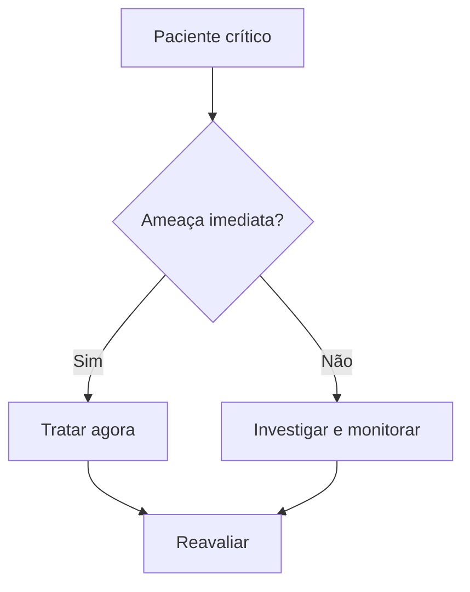

# {{Título}}

## Pergunta clínica/prova

> Qual decisão preciso acertar?

## Resposta em 5 linhas

-
-
-
-
-

## Algoritmo

## Pegadinhas

- 

## Doses/números

- 

## Fala OSCE

> “Eu faria...”

## Flashcards

- Q:: 
  A::
